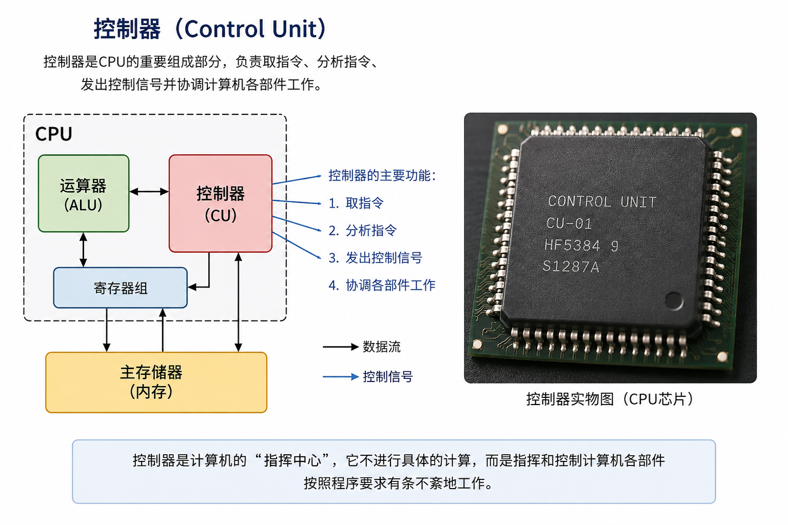
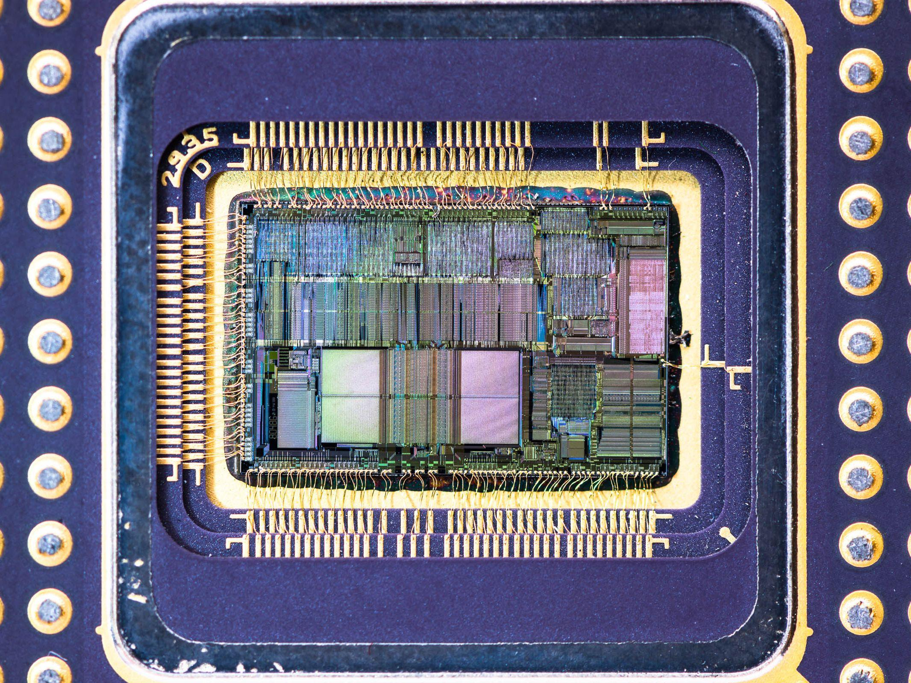
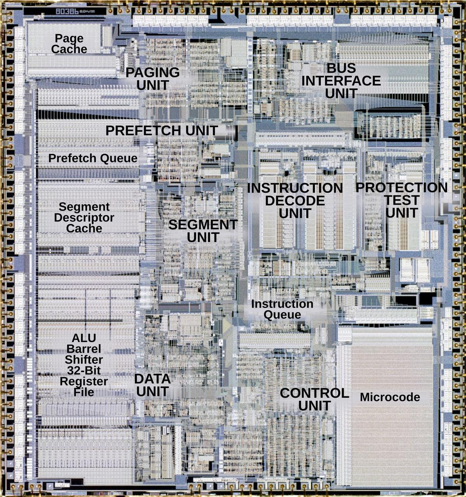
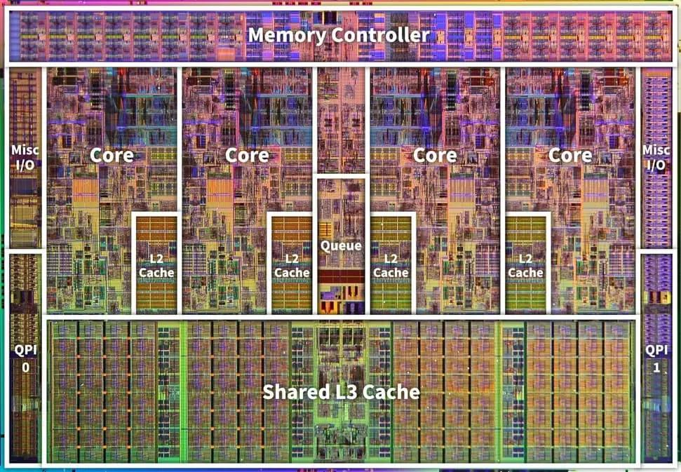

---
# 这部分是关键！侧边栏显示名由这里决定
title: 任务一 计算机的硬件系统  # 文档标题，若无 sidebar_label 则作为侧边栏名
sidebar_label: 任务一 计算机的硬件系统 # 显式指定侧边栏显示名（优先级最高）
sidebar_position: 1  # 侧边栏中排在第1位
---

## 知识点
### 一、任务描述
- 一个完整的计算机系统是由**硬件系统**和**软件系统**组成的。
- 人们能看得见、摸得着的计算机物理器件就是计算机的**硬件**，它是计算机的**物质基础**。

### 二、预备知识
- 完整的计算机系统组成结构如图2-1-1所示。
- **硬件系统**：是指那些能看得见、摸得着的计算机器件的总称，如主板、电源、存储器、键盘、显示器、打印机等物理实体。各个器件按一定方式组织起来就形成一个完整的计算机硬件系统。
- **软件系统**：是指挥计算机硬件工作的各种**程序的集合**。
- **硬件与软件的关系**：硬件是计算机的**物质基础**，软件是发挥计算机功能的**关键**，两者是**相互依存**的。
- 根据**"冯·诺依曼"体系结构**思想，计算机硬件系统由**运算器、控制器、存储器、输入设备和输出设备**五大部分构成。

---

### 三、计算机系统组成结构图

```
计算机系统
├── 硬件系统：控制器、运算器、存储器、输入设备、输出设备
└── 软件系统：
    ├── 系统软件：操作系统、程序设计语言、语言处理程序、数据库管理系统、服务程序
    └── 应用软件
```

---

### 四、控制器（CU）是什么
控制器是计算机的**指挥中心**。在控制器的控制下，计算机能够自动按照程序设定的步骤进行一系列指定的操作，以完成特定的任务。

- 控制器是真实存在的，但它隐藏在 CPU 内部
- 控制器是 CPU 内部的一组电路
- 控制器 是 CPU 的两大核心组成部件之一（另一是运算器）。
- 控制器是 CPU 内部的指挥官
- 是一块数字逻辑电路(由亿级计的晶体管连接而成的)
- 控制器主要控制：
   - 主要职能是控制整个计算机自动执行程序，指挥和协调计算机各部件的工作。
   - 通知内存读取数据
   - 指令的分析：是计算大小还是比较大小
   - 通知运算器执行加法
   - 通知内存写入数据(保存结果)

> 控制器负责指挥，运算器负责计算。






### 五、运算器（ALU）
1. 运算器是计算机对各种数据进行**算术运算**（加、减、乘、除等）和**逻辑运算**（与、或、异或、移位等）的主要部件，其核心是**算术逻辑运算单元**。
2. 运算器在控制器的控制下，从内存储或内部寄存器中取出数据并进行算术或逻辑运算。
3. **CPU**：通常把运算器和控制器合称为**中央处理器**，简称CPU，是计算机的**核心部件**。
4. **微处理器**：在微型计算机中，将中央处理器的功能集成在一块**大规模或超大规模集成电路芯片**上，称为微处理器（mpu），它是**微型计算机的核心部件**。

### 六、存储器（Memory）
1. 存储器是计算机中**存储程序和数据**的地方。
2. 存储器可以在控制器控制下对数据进行**存/取操作**。
3. **读/写定义**：把数据从存储器中取出的过程称为"**读**"；把数据存入存储器的过程称为"**写**"。
4. **存储容量**：存储器由若干**存储单元**组成，每个基本存储单元保存的信息量以**字节（B）**为单位，存储器的存储单元总数称为计算机的**存储容量**。

---

### 七、存储器的分类
- 依据：根据存储材料的性能及使用方法的不同，存储器有几种不同的分类方法。

#### 1. 按存储介质分类
- **半导体存储器**：由半导体器件组成的存储器，内存储器就是由称为**存储器芯片**的半导体集成电路组成。
- **磁表面存储器**：用磁性材料做成的存储器，又可分为**磁带存储器**和**磁盘存储器**两大类，都属于计算机的**外存储器**。

#### 2. 按存储方式分类
- **随机存储器**：任何存储单元的内容都能被随机存取，且**存取时间和存储单元的物理位置无关**，最典型的是**内存储器**。
- **顺序存储器**：只能按某种顺序来存取，**存取时间与存储单元的物理位置有关**，最典型的是**磁带存储器**。

#### 3. 按存储器的读写功能分类
- **只读存储器（ROM）**：存储的内容是固定不变的，**只能读出而不能写入**的半导体存储器。
- **随机读写存储器（RAM）**：**既能读出又能写入**的半导体存储器。

#### 4. 按信息的可保存性分类
- **非永久记忆的存储器**：断电后信息即消失的存储器，如**RAM**。
- **永久记忆性存储器**：断电后仍能保存信息的存储器，如**ROM**。

#### 5. 按在计算机系统中的作用分类
- **主存储器（内存）**：用于存放**当前正使用**的程序和数据，其**速度高、容量较小、每位价位高**。
- **辅助存储器（外存储器）**：主要用于存放**当前不使用**的程序和数据，其**速度慢、容量大、每位价位低**。
- **缓冲存储器**：主要在两个不同工作速度的部件之间起**缓冲**作用。

---

### 八、存储器系统
- **组成**：存储器系统包括**主存储器（内存储器）、辅助存储器（外存储器）和高速缓冲存储器（Cache）**。

#### 1. 内存储器
- 也称**主存储器**，简称**内存或主存**。一般由**半导体器件**构成，可以由**CPU直接访问**，存储容量相对于外存**较小**，但**存取速度快**。
- 根据性能和特点的不同，内存又分为**RAM**和**ROM**两种。

**（1）RAM（随机存储器）**
- 也叫随机存储器，我们平时所说的**内存或内存条就是指RAM**。它与CPU直接进行信息交换，存储正在运行的程序或数据，多数采用**半导体动态存储器**。
- **①特点**：CPU可以随时直接对其读写；计算机**断电后保存在RAM中的数据会消失，且无法恢复**。
- **②用途**：存储当前使用的程序、数据、中间结果和与外存交换的数据。
- **③分类**：
  - **静态随机存储器（SRAM）**：**集成度低、价格高、存取速度快、不需刷新**，适合做**缓存**。
  - **动态随机存储器（DRAM）**：**集成度高、价格低、存取速度较慢、需刷新**，适合做**内存**。

**（2）ROM（只读存储器）**
- 也叫只读存储器，其中的信息在计算机**生产过程中由制造厂商写入**，一般**不能改写**。用于存放长期保存的数据，它与RAM交换信息，用来存储**系统程序或者系统配置信息**。
- **①特点**：ROM中的信息**只能读不能写入**，且只能被CPU随机读取；**断电后信息不丢失**。
- **②用途**：主要用来存放固定不变的、控制计算机的系统程序和数据，如**基本I/O系统，即ROM BIOS**。
- **③分类**：
  - **PROM（可编程的只读存储器）**：用户可购买空白的芯片，写入自己编写的程序和数据。
  - **EPROM（可擦除、可编程的只读存储器）**：用户可自己编写程序，存储内容可通过**紫外光照射**来擦除。
  - **MROM（掩膜型只读存储器）**：内容**一次写入不能修改**，就是一般说的ROM。
  - **EEPROM（电可擦除可编程只读存储器）**：功能与EPROM相同，其**擦除和编程更加方便**。

#### 2. 外部存储器
- 又称**辅助存储器**，简称**外存或辅存**，一般由**磁性材料或光存储材料**构成，主要有**硬盘、U盘、移动硬盘、光盘**等。
- **特点**：存储容量**大**、存取速度**慢**、成本**低**、可以**永久地保存信息**。
- **使用前提**：外存中的程序和数据必须**先装入内存**，CPU才可以进行处理。

#### 3. 高速缓冲存储器（Cache）
- **作用**：是为了解决**CPU和主存之间速度不匹配**而采用的一项重要技术。
- **定义**：Cache是介于**CPU和主存之间**的**小容量**存储器，但存取速度比主存快。
- **功能**：能高速地向CPU提供指令和数据，从而**加快程序的执行速度**；从功能上看，它是主存的缓冲存储器，由高速的**SRAM**组成。
- **CPU缓存分级**：CPU缓存分为**一级缓存**和**二级缓存**。
  - **L1 Cache（一级缓存）**：集成在**CPU内部**，用于CPU在处理数据过程中数据的暂时保存。
  - 由于缓存指令和数据与CPU**同频工作**，L1级高速缓存的**容量越大，存储的信息越多**，可**减少CPU与内存之间的数据交换次数，提高CPU的运算效率**。
- **CPU读取数据顺序**：先在**L1**中寻找，再从**L2**中寻找，然后是**内存**，再后是**外存储器**。

#### 4. 虚拟内存
- **产生背景**：电脑中所运行的程序均需经由**内存**执行，若执行的程序占用内存很大或很多，则会导致内存**消耗殆尽**。由此产生了计算机系统内存管理的一种技术——**虚拟内存**。
- **原理**：电脑会自动**调用硬盘来充当内存**，应用程序会认为它拥有**连续的可用的内存**；而实际上，计算机把**正在运行的程序代码放入内存**，把**程序中暂时不会执行到的程序代码存储在外部磁盘存储器上**，在需要时进行**数据交换**。
- **结论**：计算机从**RAM读取数据的速率要比从硬盘读取数据的速率快**，因而**扩增RAM容量（可加内存条）是最佳选择**。

---

### 九、输入设备
1. **定义**：输入设备是能够把用户的**程序、数据和命令**输入到计算机中的设备。
2. **常用输入设备**：键盘、鼠标、扫描仪、条形码阅读器、光学字符阅读器、触摸屏、手写笔、麦克风、数码相机、摄影机等。
3. **图形系统数据输入设备**：跟踪球、操纵杆、数字化仪、光笔等。

### 十、输出设备
1. **定义**：输出设备是将计算机处理的**运算结果**进行输出的设备。
2. **分类**：包括显示设备、打印设备、语音输出设备、图像输出设备等。
3. **常用输出设备**：显示器、打印机、绘图仪、音箱、视频投影仪等。

## 豆包作业
**满分：100分　时间：60分钟**

### 一、填空题（每空1分，共30分）

1. 一个完整的计算机系统是由____系统和软件系统组成的。
2. 硬件是计算机的____基础，软件是发挥计算机功能的____，两者是相互依存的。
3. 硬件系统是指那些能看得见、摸得着的____的总称，如主板、电源、存储器、键盘、显示器、打印机等物理实体。
4. 软件系统是指挥计算机硬件工作的各种____的集合。
5. 根据"冯·诺依曼"体系结构思想，计算机硬件系统由运算器、____、存储器、输入设备和输出设备五大部分构成。
6. ____是计算机的指挥中心，主要职能是控制整个计算机自动执行程序，指挥和协调计算机各部件的工作。
7. 运算器是计算机对各种数据进行算术运算和____运算的主要部件，其核心是算术逻辑运算单元。
8. 通常把运算器和控制器合称为____，简称CPU，是计算机的核心部件。
9. 在微型计算机中，将中央处理器的功能集成在一块大规模或超大规模____芯片上，称为微处理器，它是微型计算机的核心部件。
10. 存储器是计算机中____的地方，可以在控制器控制下对数据进行存/取操作。
11. 一般把数据从存储器中取出的过程称为"____"，把数据存入存储器的过程称为"____"。
12. 存储器是由若干存储单元组成的，每个基本存储单元保存的信息量以____为单位，存储器的存储单元总数称为计算机的____。
13. 按存储介质分类，存储器可分为____存储器和磁表面存储器。
14. 磁表面存储器又可分为磁带存储器和____存储器两大类，都属于计算机的____存储器。
15. 任何存储单元的内容都能被随机存取，且存取时间和存储单元的物理位置无关的存储器称为____，最典型的是内存储器。
16. 只能按某种顺序来存取，存取时间与存储单元的物理位置有关的存储器称为____，最典型的是磁带存储器。
17. 存储的内容固定不变、只能读出而不能写入的半导体存储器是____（ROM）；既能读出又能写入的半导体存储器是____（RAM）。
18. 断电后信息即消失的存储器属于非永久记忆存储器，如____；断电后仍能保存信息的存储器属于永久记忆性存储器，如____。
19. 按在计算机系统中的作用分类，用于存放当前正使用的程序和数据、速度高、容量较小、每位价位高的是____（内存）。
20. 存储器系统包括主存储器、辅助存储器和____（Cache）。
21. 内存储器也称主存储器，简称内存或主存，一般由____器件构成，可以由____直接访问。
22. 我们平时所说的内存或内存条就是指____，它与CPU直接进行信息交换，多数采用半导体动态存储器。
23. 静态随机存储器（SRAM）集成度低、价格高、存取速度快、不需____，适合做缓存；动态随机存储器（DRAM）集成度高、价格低、存取速度较慢、需刷新，适合做____。
24. ROM中的信息只能读不能写入，且断电后信息____，主要用来存放固定不变的控制计算机的系统程序和数据。
25. ____是可擦除、可编程的只读存储器，用户可自己编写程序，存储内容可通过紫外光照射来擦除。
26. 外部存储器又称辅助存储器，一般由磁性材料或____材料构成，主要有硬盘、U盘、移动硬盘、光盘等。
27. 高速缓冲存储器（Cache）是为了解决____和主存之间速度不匹配而采用的一项重要技术，它由高速的____组成。
28. CPU在读取数据时，先在L1中寻找，再从____中寻找，然后是内存，再后是外存储器。
29. 当执行的程序占用内存很大或很多导致内存消耗殆尽时，计算机系统会采用____技术，自动调用硬盘来充当内存。
30. 输入设备是能够把用户的程序、数据和____输入到计算机中的设备；输出设备是将计算机处理的____进行输出的设备。

### 二、选择题（每题3分，共30分）

1. 一个完整的计算机系统是由（　）组成的。
　A. 硬件系统和软件系统　B. 主机和外设　C. CPU和存储器　D. 输入设备和输出设备

2. 下列不属于冯·诺依曼体系结构下计算机硬件系统五大部件的是（　）。
　A. 运算器　B. 控制器　C. 数据库管理系统　D. 输入设备

3. 计算机的"指挥中心"是（　）。
　A. 运算器　B. 控制器　C. 存储器　D. 输入设备

4. 通常把运算器和控制器合称为（　）。
　A. 微处理器　B. 中央处理器（CPU）　C. 主存储器　D. 算术逻辑单元

5. 下列属于输入设备的是（　）。
　A. 显示器　B. 打印机　C. 键盘　D. 音箱

6. 下列属于输出设备的是（　）。
　A. 鼠标　B. 扫描仪　C. 绘图仪　D. 触摸屏

7. 断电后保存在其中的数据会消失且无法恢复的存储器是（　）。
　A. ROM　B. RAM　C. 硬盘　D. 光盘

8. 下列关于ROM的说法，正确的是（　）。
　A. 只能读不能写入，断电后信息丢失
　B. 既能读又能写入，断电后信息不丢失
　C. 只能读不能写入，断电后信息不丢失
　D. 既能读又能写入，断电后信息丢失

9. 下列关于SRAM与DRAM的说法，正确的是（　）。
　A. SRAM集成度高、价格低，适合做内存
　B. DRAM不需刷新，适合做缓存
　C. SRAM价格高、存取速度快、不需刷新，适合做缓存
　D. DRAM价格高、存取速度较快

10. CPU读取数据时的正确顺序是（　）。
　A. 内存→L1→L2→外存
　B. L1→L2→内存→外存
　C. L2→L1→内存→外存
　D. 外存→内存→L1→L2

### 三、判断题（每题2分，共10分）

1. 硬件是计算机的物质基础，软件是发挥计算机功能的关键，两者是相互依存的。（　）
2. 根据"冯·诺依曼"体系结构思想，计算机硬件系统由运算器、控制器、存储器、输入设备和输出设备五大部分构成。（　）
3. 外存中的程序和数据可以直接被CPU处理，无需先装入内存。（　）
4. 静态随机存储器SRAM集成度高、价格低，适合做内存。（　）
5. RAM断电后保存在其中的数据不会丢失。（　）

### 四、简答题（每题10分，共30分）

1. 请简述"冯·诺依曼"体系结构思想下计算机硬件系统的五大组成部分，并说明硬件系统与软件系统的定义及相互关系。

2. 请比较RAM与ROM在特点、用途上的区别，并分别写出RAM（SRAM/DRAM）和ROM（PROM、EPROM、MROM、EEPROM）分类下各类存储器的特点。

3. 请简述内存储器、外部存储器和高速缓冲存储器（Cache）的概念与特点，并说明什么是虚拟内存技术及其工作原理。


### 参考答案

#### 一、填空题

1. 硬件
2. 物质；关键
3. 计算机器件
4. 程序
5. 控制器
6. 控制器
7. 逻辑
8. 中央处理器
9. 集成电路
10. 存储程序和数据
11. 读；写
12. 字节（B）；存储容量
13. 半导体
14. 磁盘；外
15. 随机存储器
16. 顺序存储器
17. 只读存储器；随机读写存储器
18. RAM；ROM
19. 主存储器
20. 高速缓冲存储器
21. 半导体；CPU
22. RAM
23. 刷新；内存
24. 不丢失
25. EPROM
26. 光存储
27. CPU；SRAM
28. L2
29. 虚拟内存
30. 命令；运算结果

#### 二、选择题

1. A
2. C（数据库管理系统属于软件系统中的系统软件）
3. B
4. B
5. C（显示器、打印机、音箱是输出设备）
6. C（鼠标、扫描仪、触摸屏是输入设备）
7. B
8. C
9. C（SRAM集成度低、价格高、存取速度快、不需刷新，适合做缓存；DRAM集成度高、价格低、存取速度较慢、需刷新，适合做内存）
10. B

#### 三、判断题

1. √
2. √
3. ×（外存中的程序和数据必须先装入内存，CPU才可以进行处理）
4. ×（SRAM集成度低、价格高、存取速度快、不需刷新，适合做缓存；集成度高、价格低、适合做内存的是DRAM）
5. ×（RAM断电后保存在其中的数据会消失，且无法恢复；断电后信息不丢失的是ROM）

#### 四、简答题

**1. 参考答案要点：**
- 五大组成部分：根据"冯·诺依曼"体系结构思想，计算机硬件系统由**运算器、控制器、存储器、输入设备和输出设备**五大部分构成。
- 硬件系统定义：指那些能看得见、摸得着的计算机器件的总称，如主板、电源、存储器、键盘、显示器、打印机等物理实体，各个器件按一定方式组织起来就形成完整的计算机硬件系统。
- 软件系统定义：指指挥计算机硬件工作的各种程序的集合。
- 相互关系：硬件是计算机的物质基础，软件是发挥计算机功能的关键，两者是相互依存的。

**2. 参考答案要点：**
- RAM（随机存储器）：既能读出又能写入，CPU可以随时直接对其读写；断电后数据消失且无法恢复；用途是存储当前使用的程序、数据、中间结果和与外存交换的数据；我们平时所说的内存或内存条就是指RAM。
- ROM（只读存储器）：只能读不能写入，只能被CPU随机读取；断电后信息不丢失；主要用来存放固定不变的控制计算机的系统程序和数据（如ROM BIOS）。
- RAM分类：①SRAM静态随机存储器——集成度低、价格高、存取速度快、不需刷新，适合做缓存；②DRAM动态随机存储器——集成度高、价格低、存取速度较慢、需刷新，适合做内存。
- ROM分类：①PROM可编程只读存储器——用户可购买空白芯片写入自己编写的程序和数据；②EPROM可擦除可编程只读存储器——可通过紫外光照射擦除存储内容；③MROM掩膜型只读存储器——内容一次写入不能修改，即一般说的ROM；④EEPROM电可擦除可编程只读存储器——功能与EPROM相同，擦除和编程更加方便。

**3. 参考答案要点：**
- 内存储器（主存储器、内存、主存）：一般由半导体器件构成，可以由CPU直接访问，存储容量相对外存较小，但存取速度快；分为RAM和ROM两种。
- 外部存储器（辅助存储器、外存、辅存）：一般由磁性材料或光存储材料构成，主要有硬盘、U盘、移动硬盘、光盘等；特点是存储容量大、存取速度慢、成本低、可以永久保存信息；外存中的程序和数据必须先装入内存，CPU才可以进行处理。
- 高速缓冲存储器（Cache）：为解决CPU和主存之间速度不匹配而采用的重要技术；是介于CPU和主存之间的小容量存储器，存取速度比主存快；由高速的SRAM组成；CPU缓存分为一级缓存（L1，集成在CPU内部）和二级缓存（L2），CPU读取数据时先在L1中寻找，再从L2中寻找，然后是内存，再后是外存储器。
- 虚拟内存：当执行的程序占用内存很大或很多导致内存消耗殆尽时产生的计算机系统内存管理技术；原理是计算机自动调用硬盘来充当内存，应用程序会认为它拥有连续可用的内存，而实际上计算机把正在运行的程序代码放入内存，把暂时不会执行到的程序代码存储在外部磁盘存储器上，在需要时进行数据交换；由于从RAM读取数据的速率比从硬盘快，因此扩增RAM容量（加内存条）是最佳选择。


## 任务检测
### 一、选择题（共10题）

1. 微型计算机中，控制器的基本功能是（　）。
　A. 存储各种控制信息
　B. 管理各种控制信号
　C. 控制各部件协调一致地工作
　D. 保持各种控制状态

2. 计算机应包括运算器、（　）、存储器、输入输出设备。
　A. 分析器　B. 控制器　C. CPU　D. 内存

3. 内存储器分两种，它们是（　）。
　A. RAM和ROM　B. ROM和RQM　C. RRM和RCM　D. COM和NET

4. 下列设备不是输入设备的是（　）。
　A. 键盘　B. 鼠标　C. 光电笔　D. CRT设备

5. ROM与RAM的主要区别是（　）。
　A. 断电后，ROM内保存的信息会丢失，而RAM则可长期保存、不会丢失
　B. 断电后，RAM内保存的信息会丢失，而ROM则可长期保存、不会丢失
　C. ROM是外存储器，RAM是内存储器
　D. ROM是内存储器，RAM是外存储器

6. 运算器和控制器合称为（　）。
　A. 中央处理器　B. 存储器　C. 计算机系统　D. 主机

7. 在下列存储器中，访问速度最快的是（　）。
　A. 硬盘存储器　B. U盘存储器　C. RAM（内存储器）　D. Cache

8. 程序只有装入（　）才能运行。
　A. U盘　B. 硬盘　C. 光盘　D. 内存

9. 计算机的硬件系统包含的五大部件是（　）。
　A. 键盘、鼠标、显示器、打印机和存储器
　B. 中央处理器、随机存储器、磁带、输入设备和输出设备
　C. 运算器、存储器、输入/输出设备和电源设备
　D. 运算器、控制器、存储器、输入设备和输出设备

10. 计算机在工作中尚未进行存盘操作，突然电源中断，则计算机中（　）全部丢失，再次通电也不能恢复。
　A. ROM和RAM的信息　B. ROM中的信息　C. RAM中的信息　D. 硬盘中的信息

### 二、判断题（共5题）

1. RAM的信息既能读又能写，断电后其中的信息不会丢失。（　）
2. 运算器是进行算术和逻辑运算的部件，通常称它为CPU。（　）
3. 将数据或程序存入ROM后，就不能再更改。（　）
4. 一般所说的计算机内存容量是指随机访问存储器的容量。（　）
5. 计算机处理音频主要借助于声卡。（　）

### 三、填空题（共5题）

1. 运算器是进行算术和逻辑运算的部件，英文简写为____。
2. 硬件设备数字化仪是计算机的____。
3. 运算器和____合称为中央处理器CPU。
4. 通常所说的计算机系统由____和硬件系统两部分组成。
5. 计算机的使用者向计算机传递计算数据的设备称为____。

---

### 参考答案

#### 一、选择题

| 题号 | 答案 | 解析 |
|---|---|---|
| 1 | C | 控制器是计算机的指挥中心，职能是控制整个计算机自动执行程序、指挥和协调各部件工作 |
| 2 | B | 冯·诺依曼五大部件：运算器、控制器、存储器、输入设备、输出设备 |
| 3 | A | 内存储器根据性能和特点分为RAM（随机存储器）和ROM（只读存储器）两种 |
| 4 | D | CRT设备即阴极射线管显示器，属于输出设备；键盘、鼠标、光笔（光电笔）均为输入设备 |
| 5 | B | RAM断电后信息丢失且无法恢复；ROM断电后信息不丢失、可长期保存 |
| 6 | A | 运算器和控制器合称中央处理器（CPU），是计算机的核心部件 |
| 7 | D | Cache介于CPU与主存之间，存取速度比主存快；速度排序：Cache＞RAM＞硬盘/U盘 |
| 8 | D | 外存中的程序和数据必须先装入内存（RAM），CPU才能处理 |
| 9 | D | 硬件系统由运算器、控制器、存储器、输入设备和输出设备五大部分构成 |
| 10 | C | RAM中的信息断电即消失且无法恢复；ROM断电不丢失，硬盘中已存信息不丢失 |

#### 二、判断题

1. ×（RAM断电后信息会丢失且无法恢复）
2. ×（运算器英文简写为ALU；CPU是运算器和控制器的合称）
3. √（ROM内容固定不变，只能读出不能写入）
4. √（平时所说的内存/内存条即指RAM随机访问存储器）
5. √（计算机处理音频主要借助声卡，视频借助显卡）

#### 三、填空题

1. ALU
2. 输入设备（数字化仪属于图形系统数据输入设备）
3. 控制器
4. 软件系统
5. 输入设备

## 其他作业

2. 下列既是输入设备,又是输出设备的为（）
   A. 游戏手柄 B. 打印机 C. 扫描仪 D. 触摸屏

3. 内存的存储单元上一般标有带有规则的序号,这些序号可以称之为（）
   A. 位置 B. 地址 C. 序号 D. 存储编码

4. 下列选项中,不属于硬盘的主要技术指标的是（）
   A. 转速 B. 存储容量 C. 主频 D. 传输速率

5. 下列选项中,不属于台式机主板的组成部分的是（）
   A. 南桥芯片 B. CPU插槽 C. CPU风扇 D. 内存插槽

6. 下列关于内存的说法中,正确的是（）
   A. 台式机内存条和笔记本内存条的外观、尺寸、规格都相同
   B. DDR4内存工作电压比DDR3内存工作电压要高
   C. 计算机对内存的存取速度比对硬盘的存取速度要快
   D. 一台台式机主板上最多只能安装一条内存条

7. 下列关于USB接口的说法中,正确的是（）
   A. USB接口有USB 2.0、USB 2.6、USB 3.0等不同规范
   B. USB接口中TYPE-A型、TYPE-B型和TYPE-C型外观形状相同
   C. USB接口只能连接鼠标
   D. USB接口支持热插拔