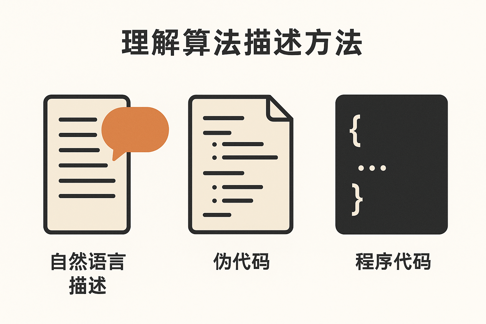
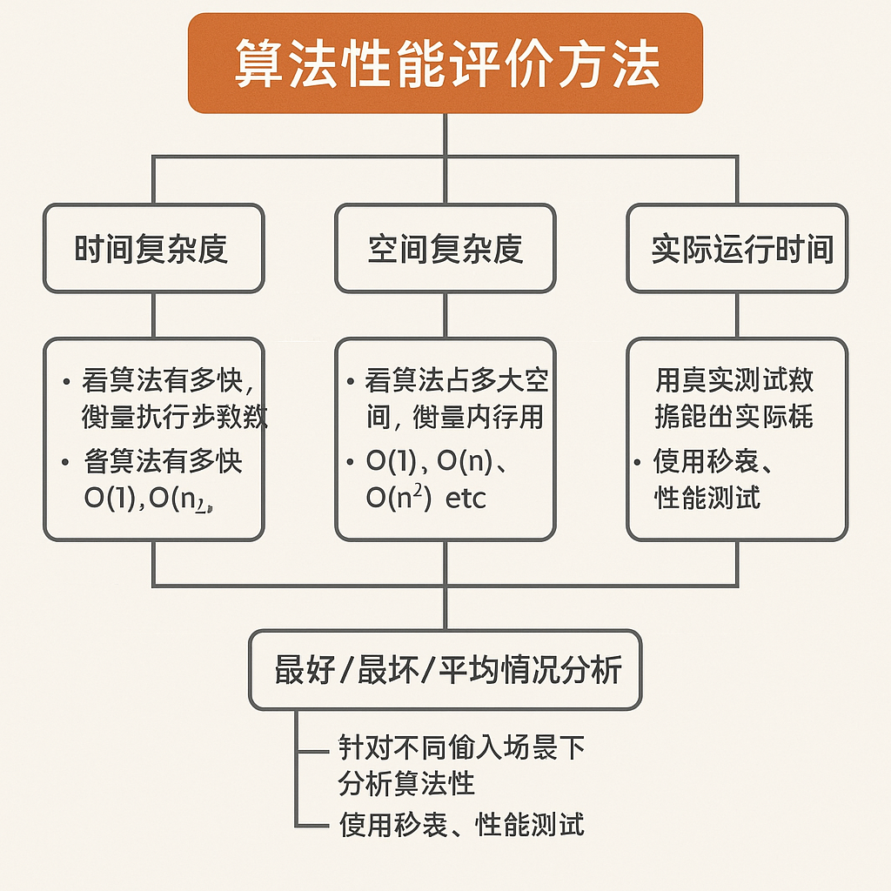
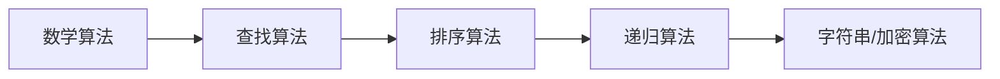

## 一、算法的概念(考点)
在编程中，**算法（Algorithm）**是指解决某个问题的一系列**明确的、有限的步骤或规则**。

简单来说：

> **算法 = 解决问题的步骤 + 明确的执行顺序**

---

生活中的算法例子

**问题**：泡一杯奶茶
**算法**可能是：

1. 烧一壶水
2. 取一个杯子
3. 加入奶茶粉
4. 倒入热水
5. 搅拌均匀
6. 完成

这就是一个“泡奶茶的算法”。

---

编程中的算法例子

**问题**：找出一组数字中最大的一个
**算法**可能是：

```csharp
int max = numbers[0];
for (int i = 1; i < numbers.Length; i++)
{
    if (numbers[i] > max)
    {
        max = numbers[i];
    }
}
```

这个过程的每一步都清晰、有限，最终得到一个结果，这就是一个“求最大值”的算法。

编程中的算法是**解决问题的明确、可执行的步骤序列**，是计算机程序的逻辑核心。它定义了如何将输入数据转化为期望的输出结果，如同“菜谱”指导计算机一步步完成任务。

关键特征：

1. **明确性（无歧义）**  
      - 每一步操作必须清晰、精确，无二义性。  
      - *例：* “将数组第一个元素与后续元素比较”而非“找最小的数”。

2. **有限步骤（可终止）**  
      - 必须在有限时间内结束，避免无限循环。  
      - *例：* 二分查找在数组范围内逐步缩小搜索区域直至找到目标。

3. **输入与输出**  
      - 接受输入数据（如待排序的数组），产生确定输出（如排序后的数组）。  
      - *例：* 输入 `[3,1,2]` → 冒泡排序 → 输出 `[1,2,3]`。

4. **可行性（用基础操作实现）**  
      - 步骤必须能由编程语言的基本指令（赋值、比较、循环等）组合实现。  
      - *例：* 用 `for` 循环 + `if` 比较实现选择排序。

5. **有效性（解决问题）**  
      - 必须正确解决目标问题（如排序后数组有序）。

---
## 二、理解算法描述方法(考点)

“理解算法描述方法”这个说法，其实是指：

> **我们要学会如何准确地阅读、表达和书写一个算法的过程。**

通俗说，就是你不但要能看懂别人写的算法，还要能自己清晰地写出算法，用人或计算机都能理解的形式。


---

常见的算法描述方法

| 描述方式             | 说明                  | 举例                                   |
| ---------------- | ------------------- | ------------------------------------ |
| 自然语言描述           | 用人类语言描述算法步骤，简单直观    | “从第一项开始，依次比较所有数字，找到最大的那一个”           |
| 伪代码（Pseudo-code） | 介于自然语言和代码之间，更接近编程语言 | `if a > b then max = a else max = b` |
| 程序代码             | 用某种具体的编程语言书写的算法     | `if (a > b) max = a; else max = b;`  |

---

举个例子：找出两个数中较大的数

1.自然语言描述：

> 输入两个数a和b，比较它们的大小，如果a大，就输出a；否则输出b。

2.伪代码描述：

```plaintext
输入：a, b
如果 a > b
    输出 a
否则
    输出 b
```

3.C#代码实现：

```csharp
int a = 5, b = 9;
int max;
if (a > b)
    max = a;
else
    max = b;
Console.WriteLine(max);
```

---

为什么要学会“理解算法描述方法”？

* 阅读时：能看懂书本、老师或面试题中用各种方式写的算法
* 交流时：能准确讲出算法逻辑，团队沟通更顺畅
* 写程序时：能把思路转换为代码，避免逻辑错误

---

初学者建议：

1. **多练习从自然语言 → 伪代码 → 真代码**的转换过程
2. **反复理解算法逻辑，而不是死记硬背**
3. **画流程图**也是很好的描述方法，能帮助你理清思路

---

## 三、理解算法的设计步骤(考点)

“理解算法的设计步骤”意味着我们要掌握**设计一个好算法的完整过程**，不仅仅是照搬代码，而是从**分析问题 → 拆解逻辑 → 逐步构建解决方案**。

理解“算法的设计步骤”，就是掌握一套能**独立思考并构造解法的流程**，避免“看得懂但写不出”的尴尬。

---

算法设计的 5 个常见步骤：

| 步骤 | 名称          | 说明                           |
| -- | ----------- | ---------------------------- |
| ①  | **明确问题**    | 弄清楚要解决什么问题，有哪些输入、输出、目标是什么    |
| ②  | **分析需求与约束** | 输入数据范围大不大？是否有重复？要不要考虑效率？     |
| ③  | **设计算法思路**  | 选择合适的策略：遍历、排序、递归、贪心、分治、动态规划等 |
| ④  | **描述算法过程**  | 用自然语言、伪代码或流程图把算法步骤清晰写出来      |
| ⑤  | **验证与优化**   | 检查是否正确、是否高效，必要时优化算法结构        |

---

示例：**找出数组中最大值**

① 明确问题：

* 输入：一个整数数组 `nums`
* 输出：最大值，比如 `[2, 9, 4]` → 输出 `9`

② 分析需求与约束：

* 数组长度未知，可能有负数
* 只需要找一个最大值，遍历一遍就够了

③ 设计算法思路：

* 初始化 `max = nums[0]`
* 遍历每个元素，与 `max` 比较，大就更新它

④ 描述算法过程：

```plaintext
1. 设 max 为数组第一个元素
2. 对数组中每个元素：
   如果它比 max 大，就更新 max
3. 返回 max
```

⑤ 验证与优化：

* 对空数组要做额外判断
* 时间复杂度是 O(n)，最优解，无需优化

---

常见的算法设计策略（常用在第③步）：

| 名称   | 适用场景举例      |
| ---- | ----------- |
| 暴力枚举 | 所有可能都尝试一遍   |
| 分治法  | 快速排序、归并排序   |
| 贪心算法 | 找零钱问题       |
| 动态规划 | 最短路径、背包问题   |
| 回溯算法 | 八皇后、排列组合    |
| 递归   | 斐波那契、汉诺塔    |
| 哈希思想 | 查找是否出现过重复元素 |

---
## 四、算法性能评价的方法(考点)
算法性能评价的基本方法，主要是从两个维度进行分析：**时间复杂度** 和 **空间复杂度**，也就是：

> 这个算法**有多快？**（执行时间）
> 这个算法**占多大地方？**（内存空间）



下面是详细解释：

---

**（一)时间复杂度**

时间复杂度（Time Complexity）用于估算**算法执行所需的基本操作次数**，不看具体运行时间，只看增长趋势。

常见时间复杂度等级（从快到慢）：

| 时间复杂度      | 名称    | 示例说明           |
| ---------- | ----- | -------------- |
| O(1)       | 常数级   | 不管输入多大，都只执行一次  |
| O(log n)   | 对数级   | 二分查找           |
| O(n)       | 线性级   | 遍历一个数组         |
| O(n log n) | 线性对数级 | 快速排序、归并排序      |
| O(n²)      | 平方级   | 冒泡排序、选择排序      |
| O(2ⁿ)      | 指数级   | 斐波那契递归、穷举型回溯问题 |
| O(n!)      | 阶乘级   | 排列组合问题（如八皇后）   |

示例：

遍历一个长度为 `n` 的数组找最大值，时间复杂度是 `O(n)`
因为每个元素都要比较一次。

---

**（二）空间复杂度**

空间复杂度（Space Complexity）是指：**算法在执行过程中额外占用的内存空间大小**。

常见空间复杂度：

| 空间复杂度 | 示例说明          |
| ----- | ------------- |
| O(1)  | 只使用少量变量       |
| O(n)  | 需要一个和输入一样大的数组 |
| O(n²) | 创建二维矩阵，如邻接矩阵  |

例如，递归函数调用会占用额外的调用栈空间，这也算进空间复杂度。

---

**(三)实际运行测试（Benchmark）**

除了理论分析，有时我们还会**用真实数据测试算法的运行时间**，例如：

* 用秒表测执行时间
* 用 `System.Diagnostics.Stopwatch`（C#）测性能
* 用大数据跑多个算法做对比实验

虽然受硬件、编译器等影响，但能验证理论结果是否符合实际。

---

(四)**小结**

| 方法           | 说明                  |
| ------------ | ------------------- |
| 时间复杂度        | 看算法**有多快**，衡量执行步骤数  |
| 空间复杂度        | 看算法**占多大空间**，衡量内存占用 |
| 实际运行时间       | 用真实测试数据跑出实际耗时       |
| 最好/最坏/平均情况分析 | 针对不同输入场景下分析算法性能     |

---

## 五、算法与程序的关系（考点）
| **算法**                     | **程序**                     |
|------------------------------|------------------------------|
| 解决问题的**逻辑思路**         | 算法的**具体代码实现**        |
| 与编程语言无关（可用伪代码描述） | 依赖特定语言（如Python/C++） |
| *例：* 快速排序的分治思想       | *例：* Python 的 `def quicksort(arr):` |

> **关键结论**：算法是程序的“灵魂”，程序是算法的“载体”。

---


## 六、典型算法示例（考点16种）
| **类型**       | **算法**          | 应用场景                     |
|----------------|-------------------|------------------------------|
| **排序算法**   | 冒泡排序、选择排序 | 对数组/列表升序或降序排列      |
| **查找算法**   | 顺序查找、二分查找 | 在数据集中定位特定元素         |
| **数学算法**   | 欧几里得算法      | 计算两数的最大公约数（GCD）    |
|                | 埃拉托斯特尼筛法  | 高效筛选素数                 |
|                | 斐波那契数列      | 递归或动态规划的经典案例       |
| **字符串算法** | 凯撒加密          | 字符移位实现基础文本加密       |
| **递归算法**   | 阶乘计算          | `n! = n × (n-1)!` 的递归实现 |

---
针对初学者，我推荐以下**循序渐进的学习顺序**，从易到难、由具体到抽象，兼顾理解深度与考试实用性：

---

### **阶段1：基础数学算法（建立问题分解思维）**
*目标：掌握基础编程结构（循环、条件判断）与简单计算逻辑*

1. **累加与累乘**  
      - 用循环实现 `1+2+...+n` 和 `1×2×...×n`  
      - *核心训练*：`for`/`while`循环、变量累加器
2. **最值与均值**  
      - 求数组最大值/最小值 → 理解遍历与比较  
      - 计算数组平均值 → 结合累加与除法
3. **公约数与素数**  
      - 暴力法求最大公约数（GCD）→ 训练循环与`%`运算  
      - 判断素数（试除法）→ 理解循环边界优化（如只需判到√n）
4. **阶乘与斐波那契数列**  
      - 阶乘的循环实现 → 为递归做铺垫  
      - 斐波那契循环版（非递归）→ 避免初学递归的困惑

✅ **为何先学这些？**  
> - 代码逻辑简单（20行内）  
> - 强化**循环**与**分支**两大核心结构  
> - 直接解决具体数学问题，成就感强

---

### **阶段2：查找算法（理解效率重要性）**
*目标：引入算法效率概念，对比不同策略的优劣*

1. **顺序查找**  
      - 遍历数组找目标值 → 时间复杂度`O(n)`  
      - *重点*：理解“最坏情况”概念
2. **二分查找**  
      - 要求**数组有序** → 自然引出排序需求  
      - 递归/循环双实现 → 为递归算法预热  
      - *重点*：画图理解`分治思想`，分析`O(log n)`高效性

> ✅ **关键过渡**：  
> 二分查找需有序数组 → 顺理成章引出排序算法学习

---

### **阶段3：排序算法（强化循环与嵌套）**
*目标：掌握经典排序思想，理解时间复杂度的实际影响*

1. **冒泡排序**  
      - 相邻元素比较交换 → 直观易理解  
      - *重点*：可视化“元素像气泡上浮”的过程
2. **选择排序**  
      - 每轮选最小元素放前列 → 理解“选择”思想  
      - *对比冒泡*：减少交换次数，但仍是`O(n²)`
3. **插入排序**  
      - 模拟扑克牌插入 → 理解“有序区扩张”  
      - *进阶点*：对小规模数据效率优于冒泡/选择

> ✅ **学习技巧**：  
> 用纸笔模拟每轮排序过程（如数组`[5,3,8,1]`），彻底理解循环边界

---

### **阶段4：递归算法（提升抽象思维）**
*目标：掌握递归三要素（终止条件+递归调用+问题分解）*

1. **阶乘递归版**  
      - `n! = n * (n-1)!` → 最简递归案例
2. **斐波那契递归版**  
      - `fib(n) = fib(n-1) + fib(n-2)`  
      - *重点*：分析递归树，理解重复计算缺陷
3. **汉诺塔问题**  
      - 经典递归思想训练 → 理解“分而治之”
4. **二分查找递归版**  
      - 将循环转化为递归调用 → 巩固阶段2知识

> ⚠️ **避坑提示**：  
> 先确保理解循环版斐波那契，再学递归版，避免陷入递归调用栈的困惑

---

### **阶段5：字符串与加密算法（综合应用）**
 *目标：融合数组操作、循环、数学运算解决实际问题*

1. **回文数判断**  
      - 数字反转比较（如121 vs 123）→ 结合`%`和`//`运算  
2. **字符串加密**  
      - 实现凯撒密码（字符偏移）→ 练习ASCII码操作  
      - *例*：`A→D, B→E`（偏移量=3）

---

## **学习路径图**


---

## **高效学习策略**
1. **先理解伪代码，再写真实代码**  
   - 用中文步骤描述算法（如：“1. 从第一个元素遍历到最后一个”）
2. **可视化工具辅助**  
   - 使用 [Visualgo](https://visualgo.net/) 动态观察排序/查找过程
3. **对比同类算法**  
   - 如：对比冒泡/选择/插入的交换次数与代码逻辑
4. **复杂度分析三问**  
   - 问1：有几层循环？  
   - 问2：每层循环次数与n的关系？  
   - 问3：是否有递归？递归深度是多少？
5. **真题驱动练习**  
   - 用考试真题（如“用冒泡排序对[4,2,5,1]升序排列，写出第2轮结果”）检验理解

> 按照此顺序学习，可逐步构建算法思维，避免“递归劝退”“排序混乱”等常见困境，精准覆盖考试要求！

## 好算法的特点

| 特点  | 含义             |
| --- | -------------- |
| 有限性 | 步骤数是有限的        |
| 明确性 | 每一步都清楚，不含糊     |
| 输入  | 可以有零个或多个输入     |
| 输出  | 至少有一个输出（结果）    |
| 有效性 | 每一步都可以通过计算机来执行 |

---

## 算法常见应用场景

* 排序（如冒泡排序、快速排序）
* 查找（如二分查找）
* 路径规划（如地图导航）
* 数据分析（如统计平均值、最大值）
* 图像处理、人工智能、密码学等也大量使用算法

---

如果你是初学者，可以先从这些**经典算法**入手学习：

* 冒泡排序（Bubble Sort）
* 选择排序（Selection Sort）
* 二分查找（Binary Search）
* 递归（Recursion）
* 斐波那契数列（Fibonacci Sequence）

---