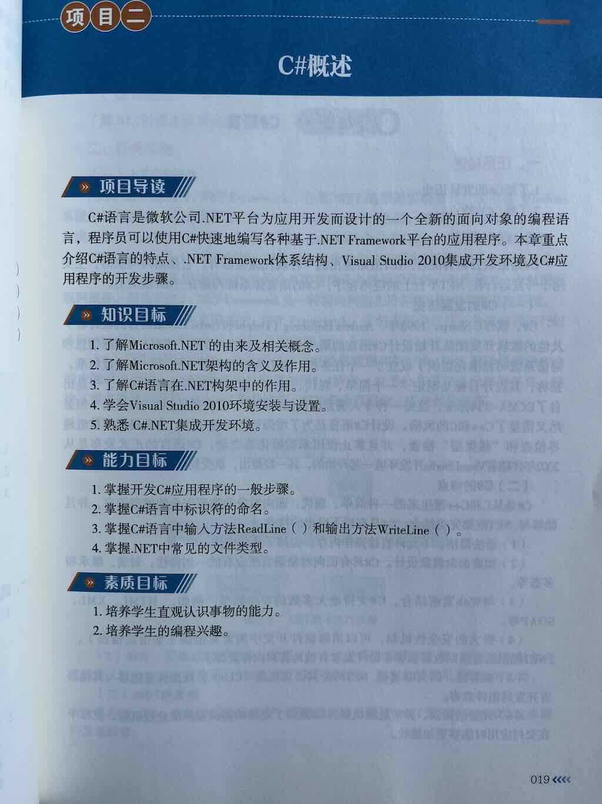
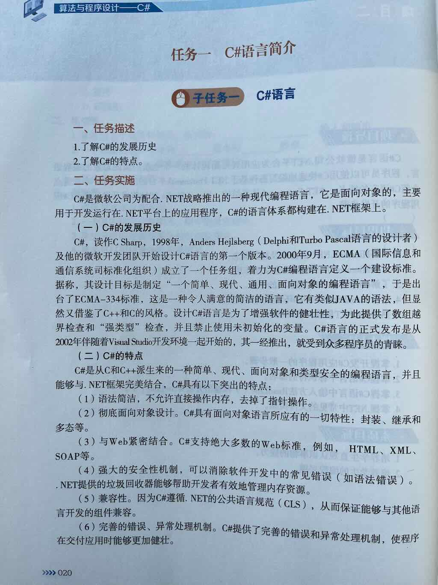

## 简述C#的发展史
1. 1998年，C#第一版发布。
2. 2000年，C#在ECMA的支持下，开始标准化。
3. 2002年，C#伴随Visual Studio正式发布。
## C#的特点是什么

1. C#是一种高度面向对象的语言。
2. C#基于.NET平台开发应用程序。
3. 支持众多Web标准。
4. 兼容性强。
5. 完善的错误、异常处理机制。

## .NET是什么
.NET 是微软退出的跨语言、跨平台的开发环境。（不同编程语言:C#、F#、VB）。主要包含以下两部分：

1. CLR： 公共语言运行时，主要负责即时编译，把中间代码编译为本地机器的二进制代码。
2. 类库: 预先开发的工具类库，拿来即用。

## .NET发展简史

1. 2002年，.NET Framework 1.0发布(只支持Windows)
2. 2016年，.NET Core 1.0发布 （跨平台：Windows、MacOS、Linux）
3. 2020年，.NET 5.0发布（统一时代：不再区分 Core 与 Framework）
4. 2021年，.NET 6.0发布

