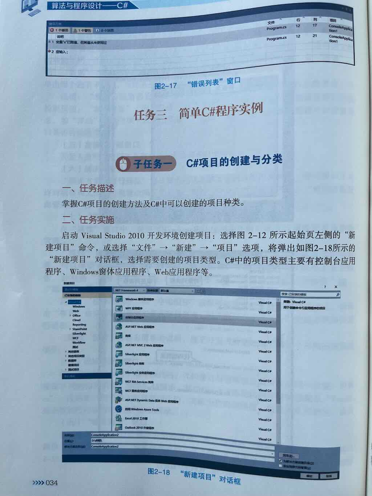
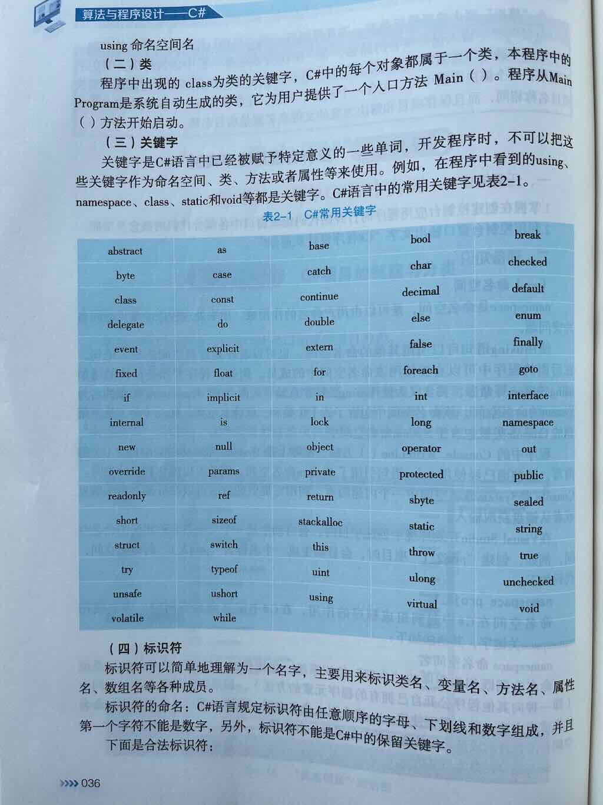
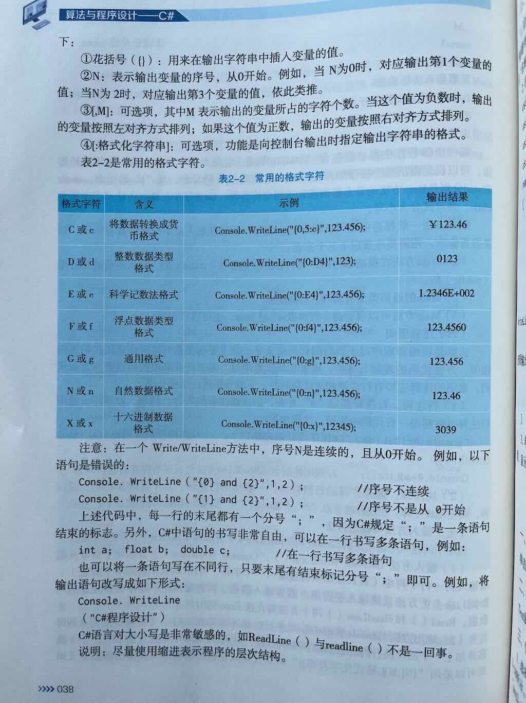
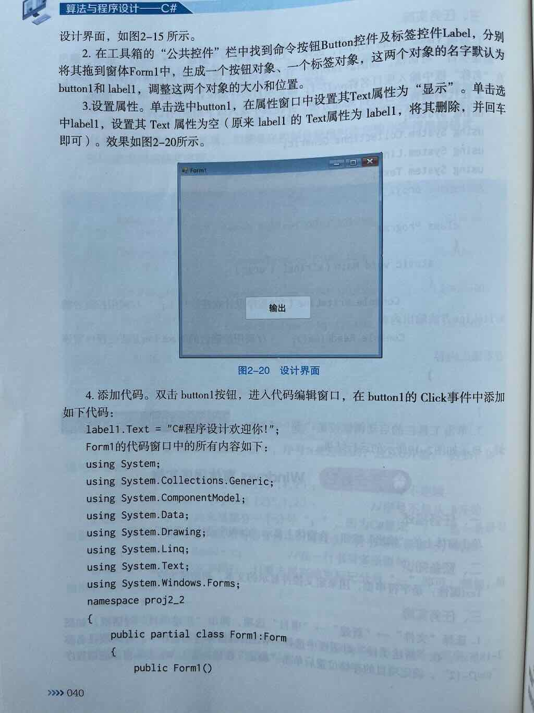
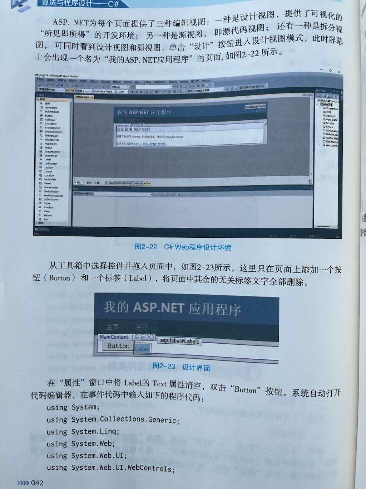
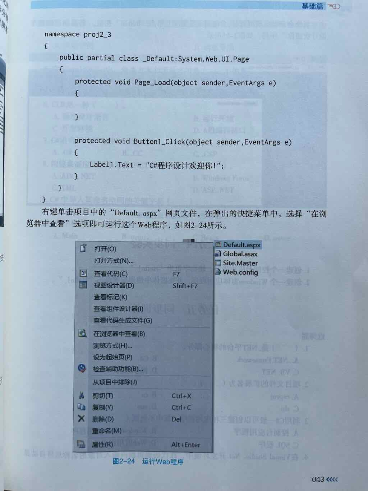
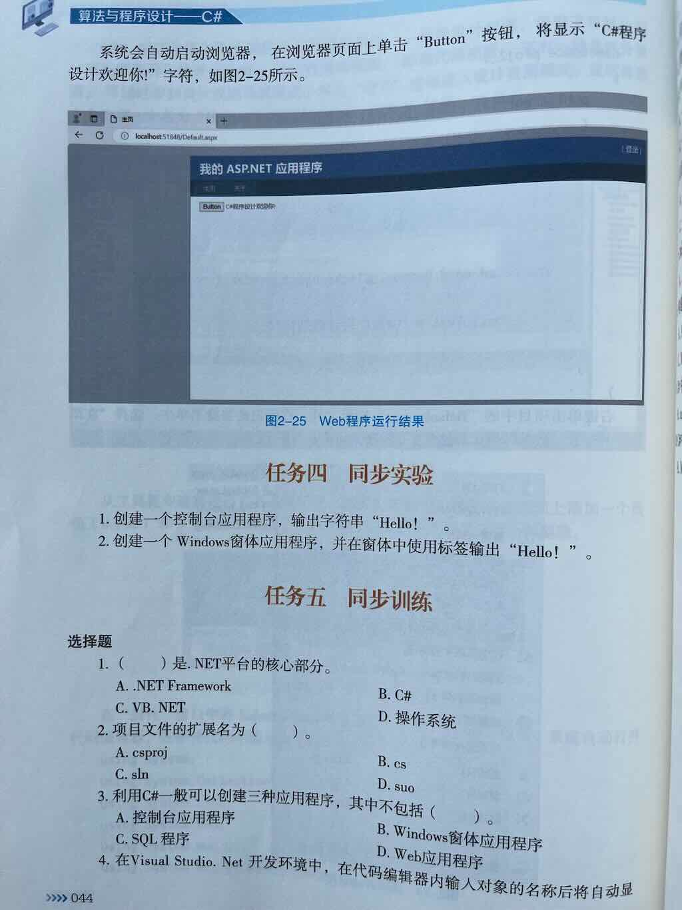

## C#项目的创建方法

略

## C#中可以创建的项目种类

- 控制台应用程序
- Windows窗体应用程序
- Web应用程序

## 命名空间是什么

- 定义：命名空间是一块拥有名字的独立空间。
- 作用：通过命名空间可以解决命名冲突的问题。
- 注意：命名空间的名字建议与项目名称保持一致。使用帕斯卡命名法

## Console.WriteLine()是什么

- Console: 是.NET类库提供的内建类,用于向屏幕输出消息或从屏幕获取消息。
- WriteLine()：是Console类的一个方法，用于向屏幕输出消息。

## Using指令的语法

```c#
using 命名空间名
```
## 类是什么

- 类是创建对象的模板
- class关键词用于创建类
- Program是系统自动生成的类，通常称为“入口类”
- Program类为用户提供了一个入口方法Main()

## 关键字是什么

- 关键字是C#语言中被赋予特定意义的一些单词。
- 空间、类、方法、属性、变量不可以使用关键词命名

## 标识符
标识符是一个名字，主要用来标识：

- 类名
- 变量名
- 方法名
- 属性名
- 数组名等

## 标识符的命名规则是什么

- 合法字符：字母、数字、下划线
- 数字不能放首位
- 标识符不能是关键字

## Main()方法是什么

- Main()方法是在每个C#项目创建时自动生成的
- Main()是程序执行的入口

## Main()方法的注意事项

- 在class或struct内声明时，必须是静态的
- 在class或struct内声明时，不应该是public的（原因：是CLR在调用，CLR拥有上帝权限）
- Main()的返回类型：
    - void： 无需返回执行状态
    - int：约定俗成：0表示程序成功完成；非0值表示程序错误。
- 参数`string[] args`可省略

## 注释语句

- 行注释：`//`
- 块注释: `/* */`

## 输入与输出

- Console.WriteLine()
- Console.Write()
- Console.ReadLine()
- Console.Read()

## 格式化字符串的语法

```c#
Console.WriteLine("{n,[m][:格式字符]},字符串");
```

## 常见的格式字符有哪些

- `:C` 将数据转换成货币格式
- `:D` 整数数据类型格式
- `:E` 科学计数法格式
- `:F` 浮点数据类型格式
- `:G` 通用格式
- `:N` 自然数据格式
- `:X` 十六进制数据格式

## 分号

分号表示一条语句的结束。

## 

