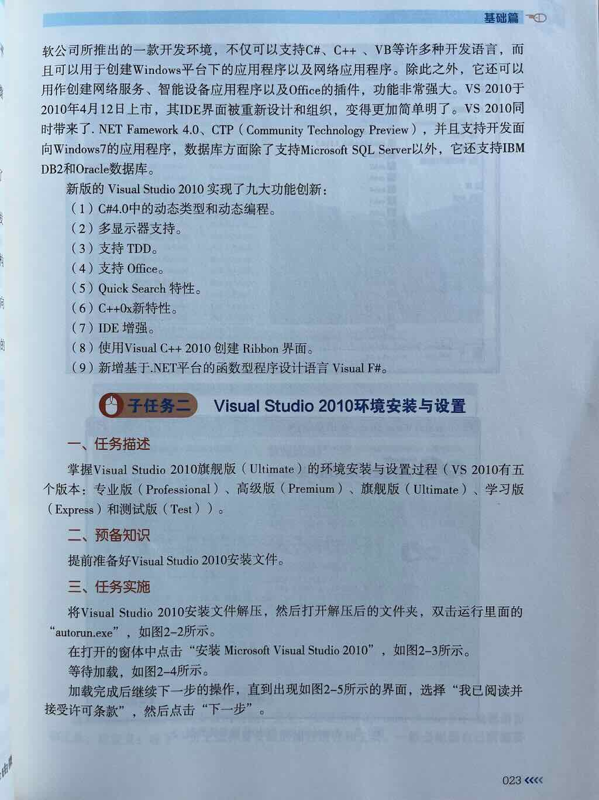
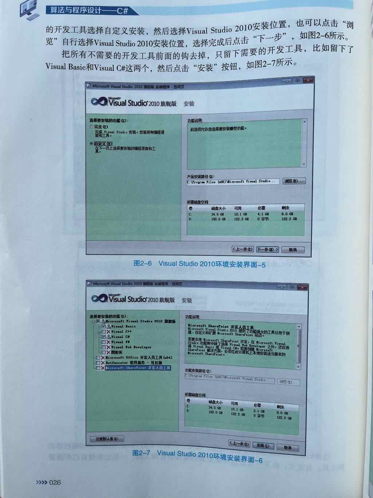
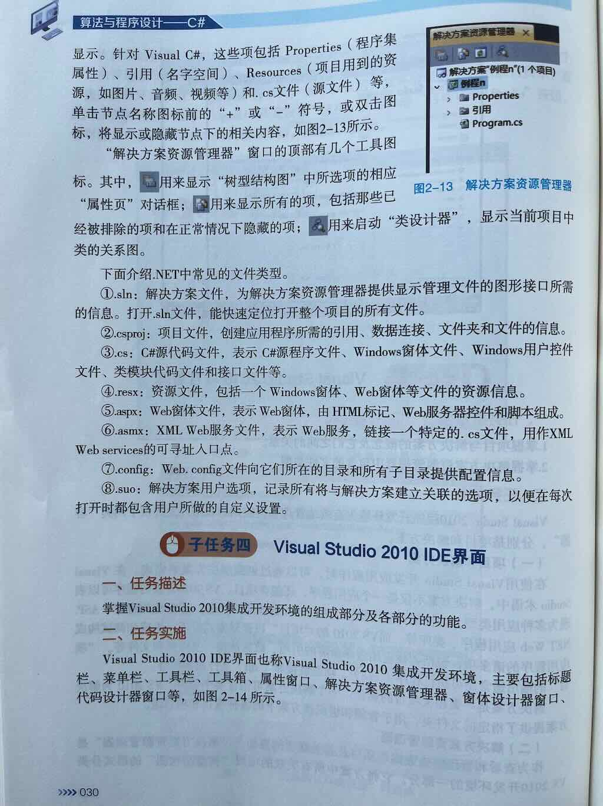
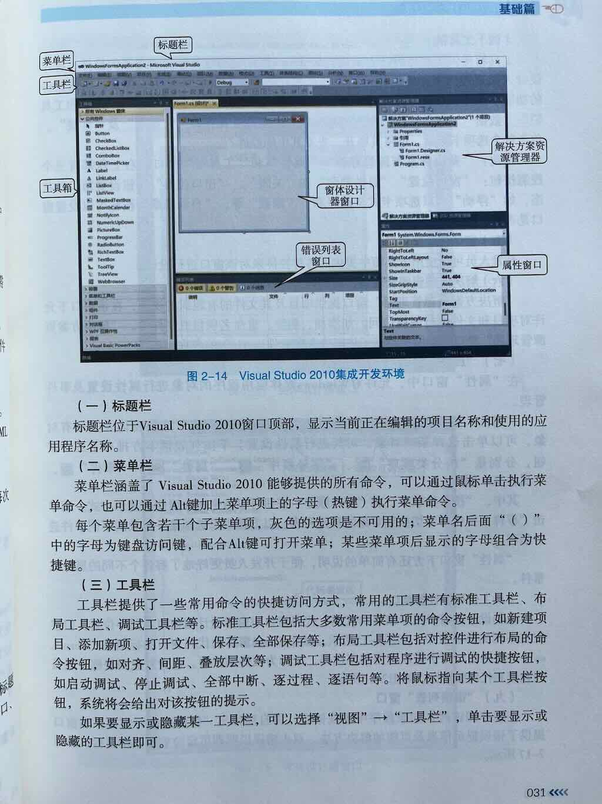
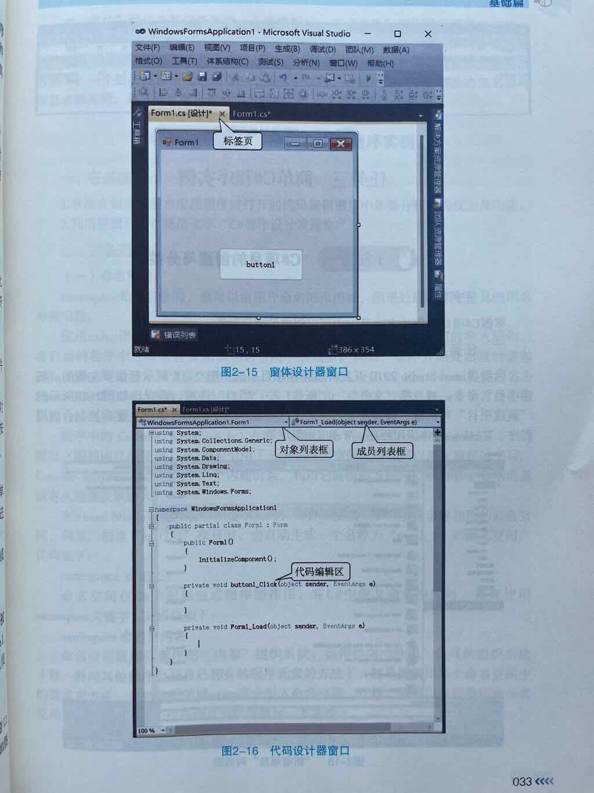

## VS支持哪些语言的开发

- C#
- C++
- VB

## VS的用途
- Windows应用程序
- 网络应用程序
- 网络服务
- 智能设备应用程序
- OFFICE插件

## VS提供了哪两种容器？如何理解

- 解决方案：就是一个应用程序
- 项目：构建应用程序的模块（每一个项目会生成一个文件夹）

## VS可以开发哪些应用程序
- 控制台应用程序
- Windows窗体应用程序
- WPF应用程序
- ASP.NET WEb应用程序
- 类库

## 理解.NET中常见的文件类型
- .sln: 解决方案文件（快速打开整个项目）
- .csproj: 项目文件(项目配置文件)
- .cs: C#源代码文件、Windows窗体文件、Windows用户控件文件、类模块文件、接口文件
- .resx: 资源文件（项目中引用的各种资源）
- .aspx: Web窗体文件
- .asmx: XML Web服务文件
- .config: web.config配置文件
- .suo: 用户选项

## VS的界面组成

- 标题栏
- 菜单栏
- 工具栏
- 工具箱
- 窗体设计器
- 错误列表
- 解决方案资源管理器
- 属性窗口

