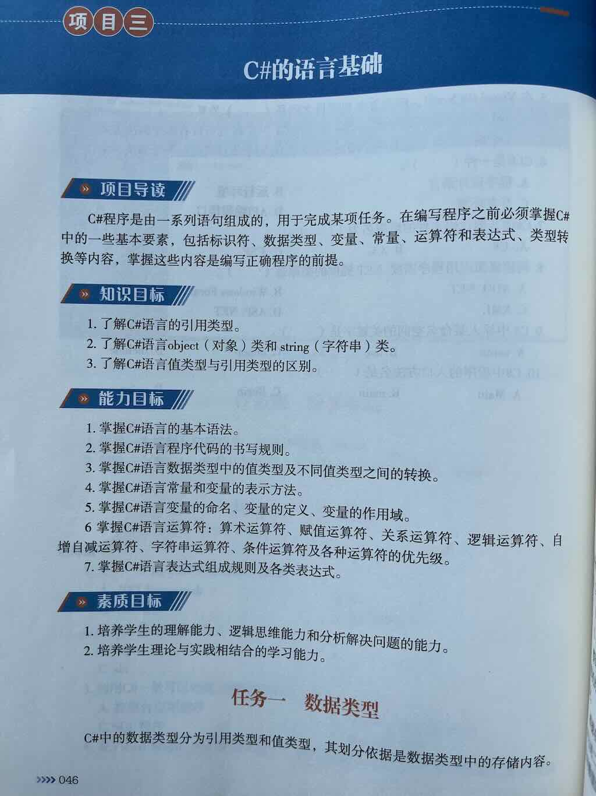
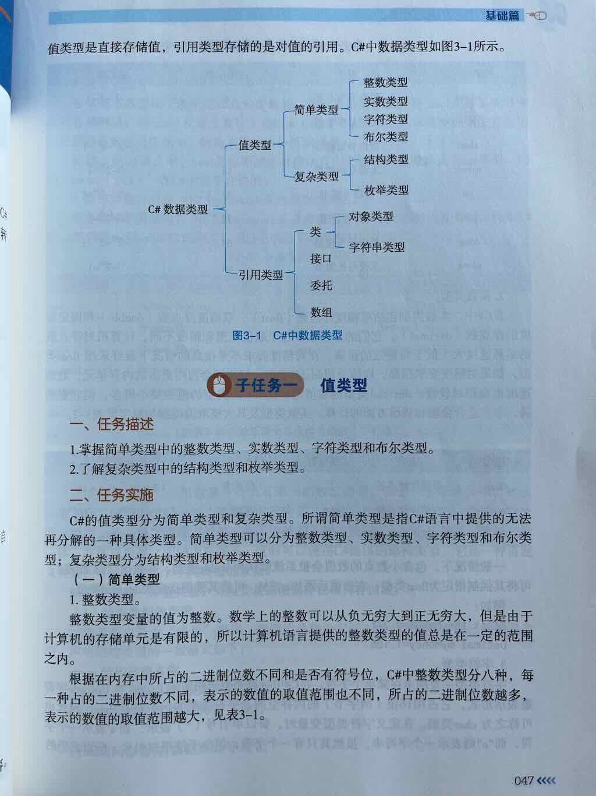
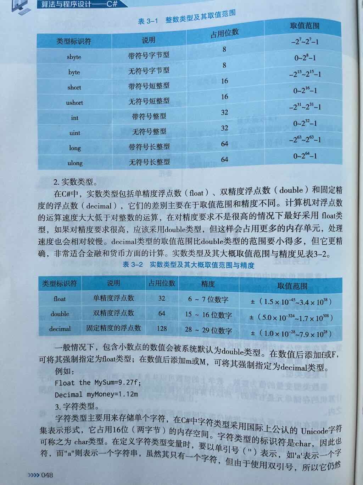
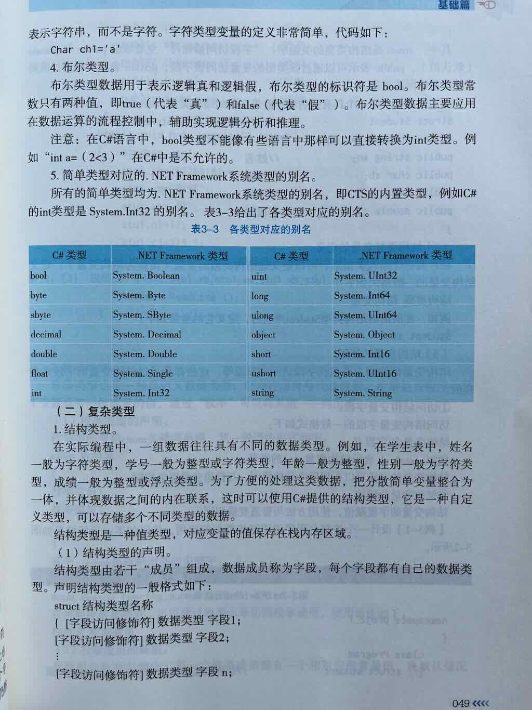
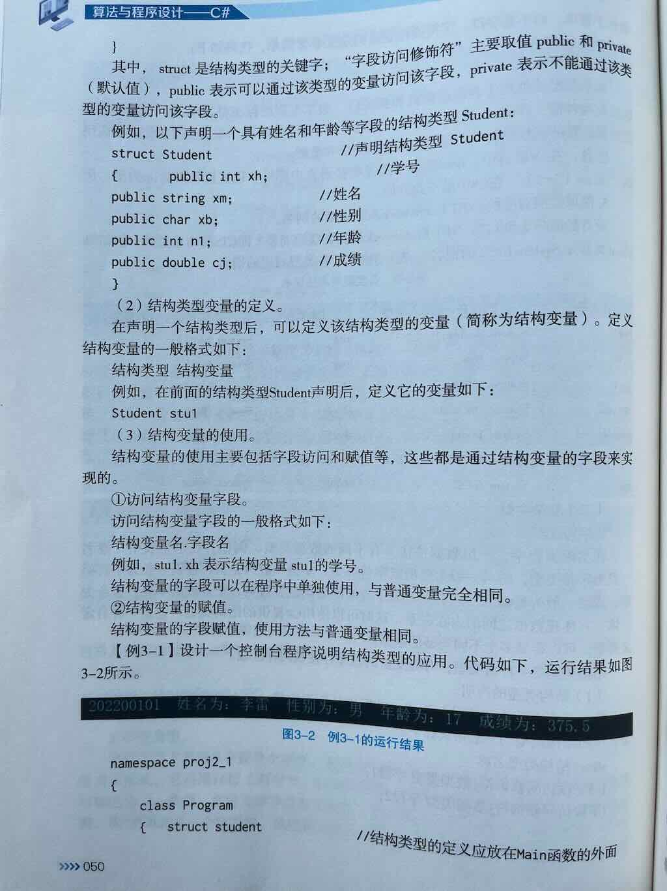
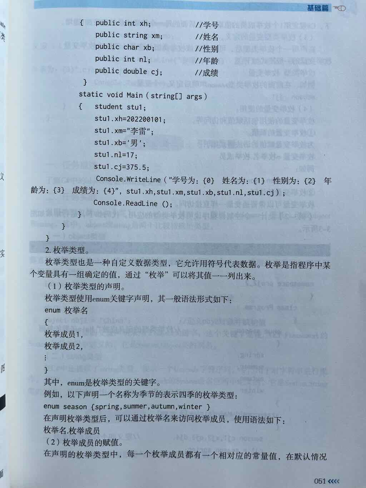
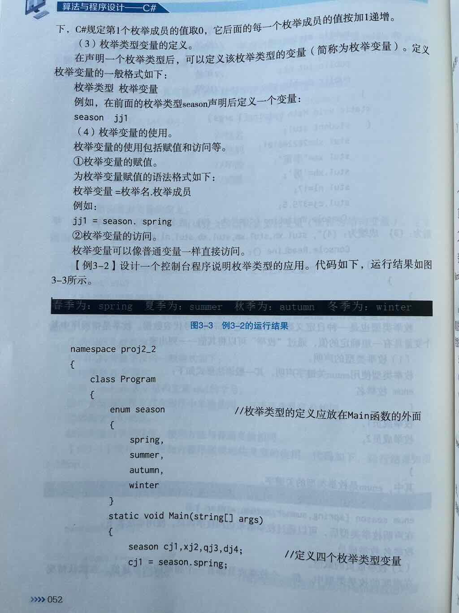
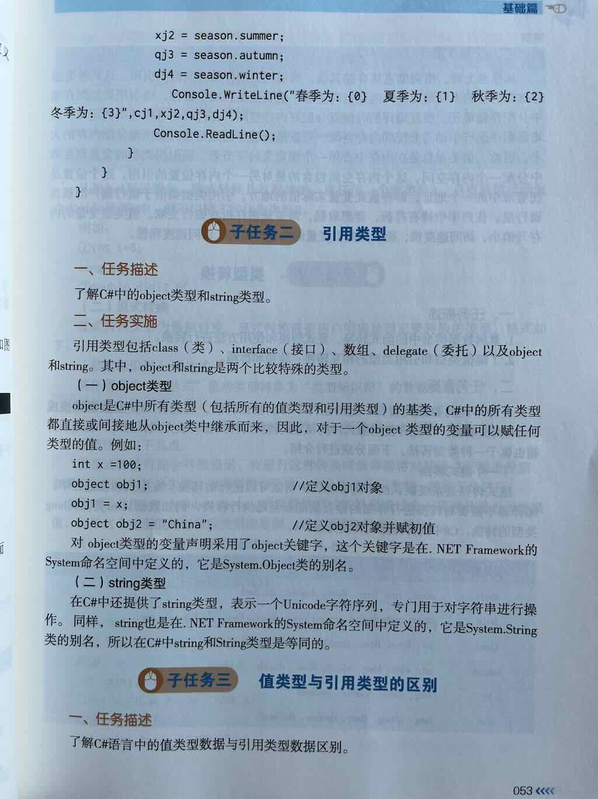
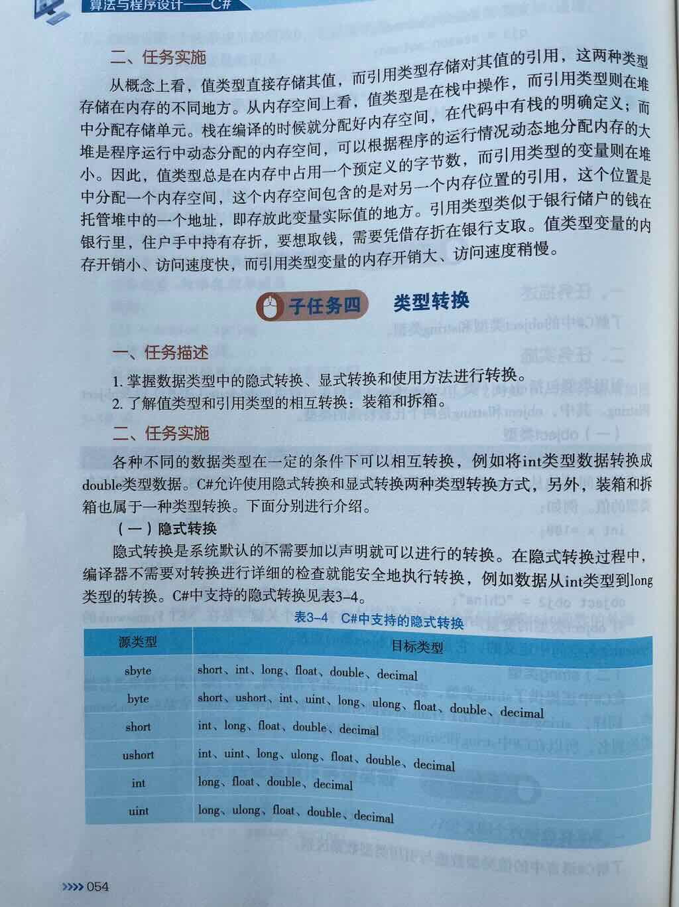
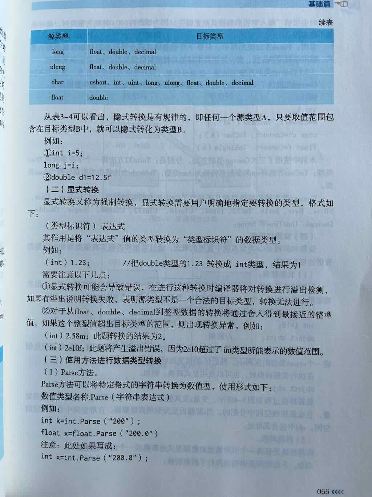
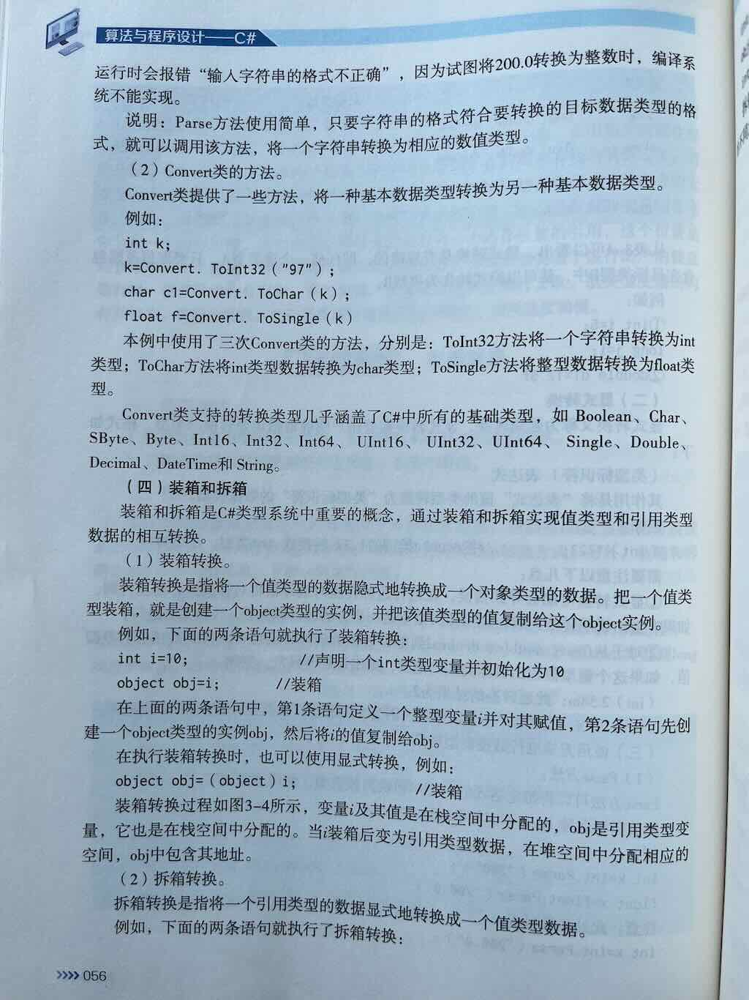
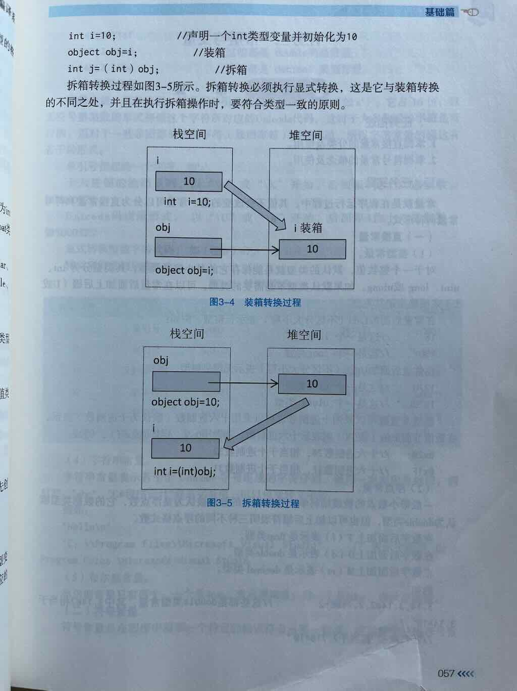

## 简述数据类型的分类

根据数据类型中存储的内容,C#的数据类型分为两大类：

值类型：直接存储值的数据类型。

- 简单数据类型
    - 整数类型
    - 实数类型
    - 字符串
    - 字符
    - 布尔
- 复杂数据类型
    - struct
    - Enum

引用类型：存储值的引用的数据类型。

- 类
    - 对象类型
    - 字符串类型
- 接口
- 委托
- 数组

## .NET系统类型的别名

System.Boolean -> bool
System.Single -> float
System.Int16 -> short
System.Int32 -> int
System.Int64 -> long

## 整数类型

### 整数类型是什么

- 整数就是不包含小数的数值。整数类型用于表示整数。
- 数学上的整数可以从负无穷大到正无穷大
- 计算机中的整数类型是有范围的，因为计算机的存储单元是有限的。

### 整数类型分为哪8种？
带符号的整数类型：

| 类型|术语| 大小| 范围|
|--|--|--|----|
| **sbyte**   | 字节整型  | 1字节(8位)    | -128 到 
| **short**   | 短整型  | 2字节(16位)   | `-32,768` 到 `32,767 `|
| **int**     | 整型 | 4字节(32位)   |-2,147,483,648 到 2,147,483,647 | 
| **long**    | 长整型| 8字节(64位)   | -9,223,372,036,854,775,808 到 9,223,372,036,854,775,807 | 

无符号的整数类型：

| 类型|术语| 大小| 范围|
|--|--|--|----|
| **byte**    |字节整型|1字节(8位)    |  0 到255| 
| **ushort**  | 短整型  | 2字节(16位)   | `0` 到 `65,535 ` |
| **uint**    |整型 | 4字节(32位)   |0 到 4,294,967,295 |
| **ulong**   | 长整型|8字节(64位)  |  0 到 18,446,744,073,709,551,615  |

## 小数类型

### 小数类型是什么
小数就是带有小数点的数字，比如： 3.14、0.5、100.0。这些都是我们常说的小数。

在计算机中，小数有两种实现方式：

1. 浮点数: 用二进制科学计数法来近似表示小数。如：float和double
2. 定点数: 用十进制数更精确地存储小数。 如: decimal
      - 数学上的小数可以从负无穷大到正无穷大
      - 计算机中的小数类型是有范围的，因为计算机的存储单元是有限的。

### 小数类型的分类

- 单精度浮点数：32精度 小范围  类型标识符是: `float`。
- 双精度浮点数：64精度 大范围  类型标识符是: `double`。
- 固定精度浮点数：128精度 小范围  类型标识符是: `decimal`。

### 小数类型的后缀是什么

一般情况下，程序中出现的小数会被系统默认为double类型。

为了告诉编译器，这是float类型，需要在小数后面加后缀：`F`。

为了告诉编译器，这是decimal类型，需要在小数后面加后缀：`M`。

## 字符类型

### 字符类型是什么

在C#中，字符是使用单引号包裹的单个字符。

如果是双引号，即使包裹的是单字符也被视为字符串。

字符类型主要用来存储单个字符。使用16位(2字节)存储单个字符。

字符类型标识符是: `char`。

## 布尔类型
### 布尔类型是什么

布尔类型用于表示逻辑真和逻辑假。

布尔类型的标识符是： `bool`

布尔类型主要应用在数据运算的流程控制中，辅助实现逻辑分析和推理。

## struct类型
### 为什么需要结构类型？

1. 数据类型不同：在实际编程中，一组数据往往具有不同的数据类型。
2. 不方便处理：这些不同类型的数据类型比较分散，无法体现数据之间的内在联系。

所以，C#提供了struct类型。

### struct类型是什么

- struct类型是一种值类型。
- struct类型用于封装一组相关的变量(字段)。
- struct类型可以存储多个不同类型的数据。
- struct类型是一种自定义类型。

### struct类型的典型成员有哪些

一个典型的struct类型的成员通常有以下四个：

- 字段：数据成员
- 属性
- 方法
- 构造函数

### 声明struct类型的语法是什么

1. 语法:定义只包含字段的struct
```c# linenums="1"
struct 结构类型名称
{
    [修饰符] 数据类型 字段1;
    [修饰符] 数据类型 字段2;
}
```
- struct: 声明结构类型的关键字
- 结构类型名称：结构类型的变量名
- 修饰符: 控制字段的可访问性，通常设为私有
    - public
    - private(默认值)

### 示例: 定义及使用结构类型Student

要求：

> 声明一个 ​​结构体类型 Student​​，该结构体包含以下字段：

> - id（Id）
> - 姓名（Name）
> - 学号（StudentNumber 或 No）
> - 年龄（Age）
> - 性别（Gender）
> - 成绩（Score）


参考答案：如何 ​​声明、赋值和使用这个 Student 结构体变量​​：

```c# linenums="1"
using System;

class Program
{
    // 定义一个结构体，表示学生信息
    struct Student
    {
        public string Name;
        public string Id; // 可以是学号、身份证号等，根据需求
        public string StudentNumber;
        public int Age;
        public string Gender;
        public double Score;
    }

    static void Main()
    {
        // ✅ 声明一个 Student 类型的变量
        Student stu1;

        // ✅ 为该学生的各个字段赋值
        stu1.Name = "张三";
        stu1.Id = "S20240001";
        stu1.StudentNumber = "20240001";
        stu1.Age = 20;
        stu1.Gender = "男";
        stu1.Score = 92.5;

        // ✅ 打印学生信息
        Console.WriteLine("学生信息如下：");
        Console.WriteLine($"姓名: {stu1.Name}");
        Console.WriteLine($"ID: {stu1.Id}");
        Console.WriteLine($"学号: {stu1.StudentNumber}");
        Console.WriteLine($"年龄: {stu1.Age}");
        Console.WriteLine($"性别: {stu1.Gender}");
        Console.WriteLine($"成绩: {stu1.Score}");

        // ✅ 再声明一个学生，看看值类型的特性
        Student stu2 = stu1;  // 值拷贝
        stu2.Name = "李四";   // 修改的是副本

        Console.WriteLine("\n修改后：");
        Console.WriteLine($"stu1 的姓名还是：{stu1.Name}（未被改变）");
        Console.WriteLine($"stu2 的姓名是：{stu2.Name}（已改为李四）");
    }
}
```

说明

> 这是一个​​最基础的 struct，只包含公共字段（public fields）​​，没有方法、属性、构造函数等。
> 字段使用了 public修饰符以便于直接访问（适合示例/学习）。实际项目中建议使用​​私有字段 + 公共属性（Property）​​，以提高封装性。

## 枚举类型是什么

枚举类型也是一种自定义数据类型。