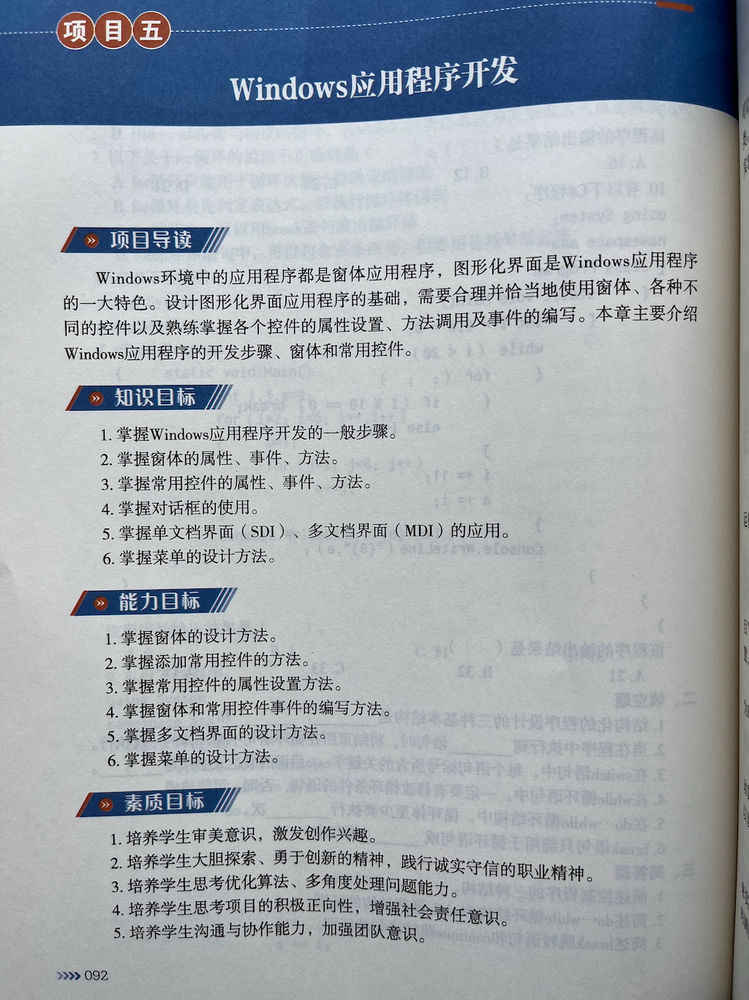
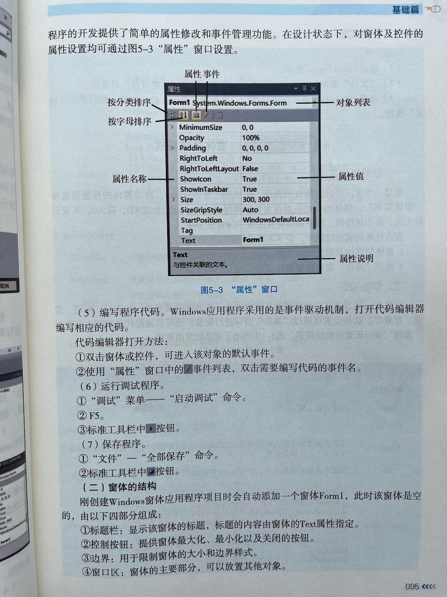
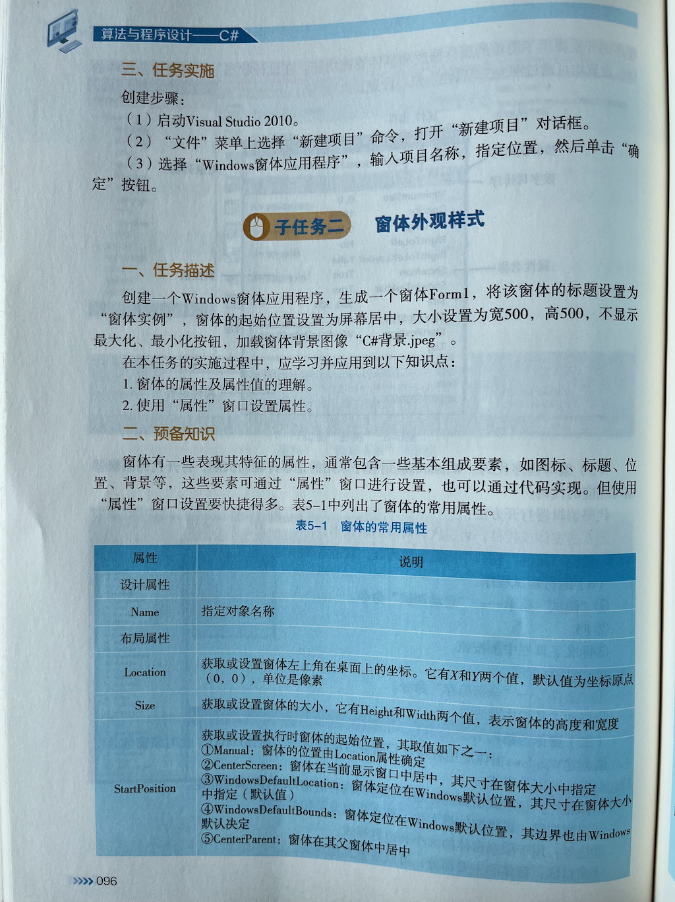
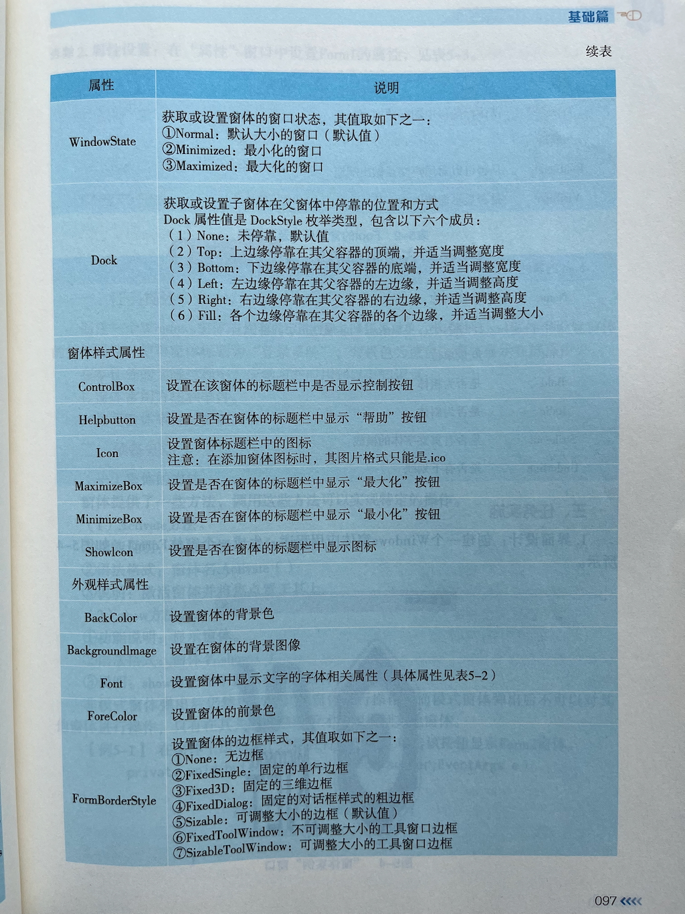
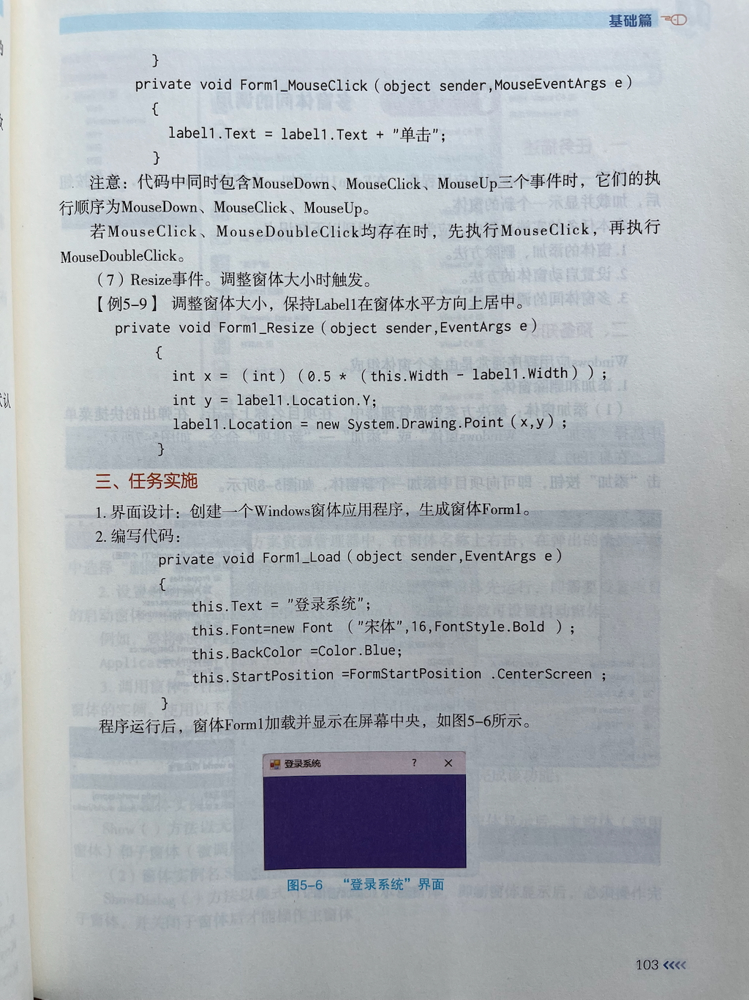
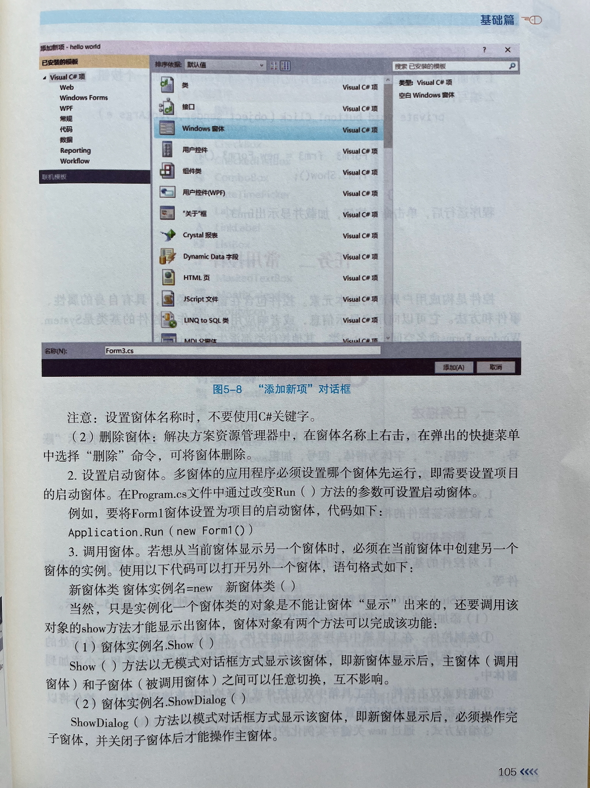
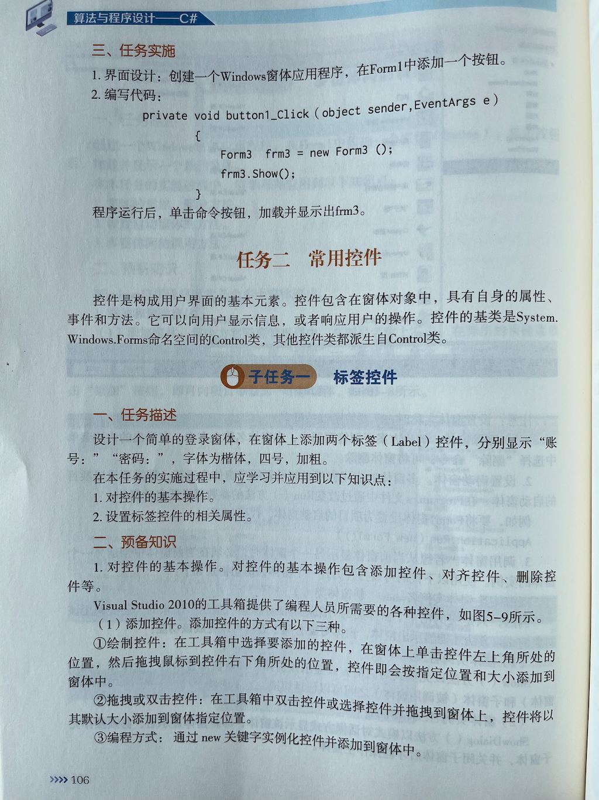

## 简答题

### 窗体的创建
1. 窗体是什么
2. 如何使用C#创建一个窗体
3. C#中通过什么工具设计窗体
4. Windows应用程序的开发步骤是什么
   
### 窗体外观样式

### 窗体的常用方法与事件

### 多窗体间的调用

## 练习

以下是10个适合C#初学者入门WinForms的案例，从简单到进阶逐步提升，每个案例都聚焦基础控件和核心概念：

---

### 1. **Hello World 窗口**
- **目标**：熟悉项目创建和窗体基础
- **功能**：显示一个带按钮的窗口，点击后弹出"Hello World"消息框
- **知识点**：Form设计、Button控件、MessageBox

### 2. **简易计算器**
- **目标**：掌握事件处理和基础逻辑
- **功能**：实现加减乘除四则运算（两个TextBox输入数字）
- **知识点**：TextBox、Button、事件绑定、基本运算

### 3. **用户登录界面**
- **目标**：学习控件组合和简单验证
- **功能**：用户名/密码输入框 + 登录按钮（硬编码验证如admin/123）
- **知识点**：Label、TextBox、Button、条件判断

### 4. **待办事项列表**
- **目标**：理解动态UI更新
- **功能**：输入框+添加按钮，将任务显示在ListBox中（可删除选中项）
- **知识点**：ListBox、动态数据管理

### 5. **数字猜谜游戏**
- **目标**：随机数生成与用户交互
- **功能**：系统生成1-100的随机数，用户输入猜测（提示"大了/小了"）
- **知识点**：Random类、循环逻辑、反馈提示

### 6. **简易画板**
- **目标**：鼠标事件和图形绘制
- **功能**：用鼠标在Panel上拖拽画线（选择颜色/粗细）
- **知识点**：Panel、MouseEvents、Graphics类

### 7. **倒计时器**
- **目标**：Timer控件和时间格式化
- **功能**：输入分钟数，点击开始后倒计时显示（到0时弹窗提醒）
- **知识点**：Timer、DateTime/TimeSpan、Label动态更新

### 8. **文件浏览器（简化版）**
- **目标**：基础文件操作
- **功能**：显示当前目录下的文件列表（ListBox），双击打开文件
- **知识点**：ListBox、OpenFileDialog、System.IO

### 9. **简易记事本**
- **目标**：综合文本处理
- **功能**：多行TextBox编辑文本，支持保存/打开（用SaveFileDialog/OpenFileDialog）
- **知识点**：MenuStrip、对话框控件、文件读写

### 10. **BMI计算器**
- **目标**：数据输入与结果展示
- **功能**：输入身高体重，计算BMI并显示健康状态（用PictureBox显示胖瘦图标）
- **知识点**：PictureBox、条件分支、数值格式化

---

### 学习建议：
1. **循序渐进**：从1-3开始熟悉基础控件，逐步挑战图形和文件操作
2. **调试实践**：多使用断点观察变量变化（如计算器中的数字转换）
3. **扩展挑战**：比如为待办事项添加本地存储（XML/JSON），或为画板增加撤销功能
4. **官方资源**：参考微软Learn平台的https://learn.microsoft.com/en-us/dotnet/desktop/winforms/

每个案例代码量通常在50-200行之间，适合边学边练！如果需要某个案例的详细代码思路，可以告诉我具体编号~