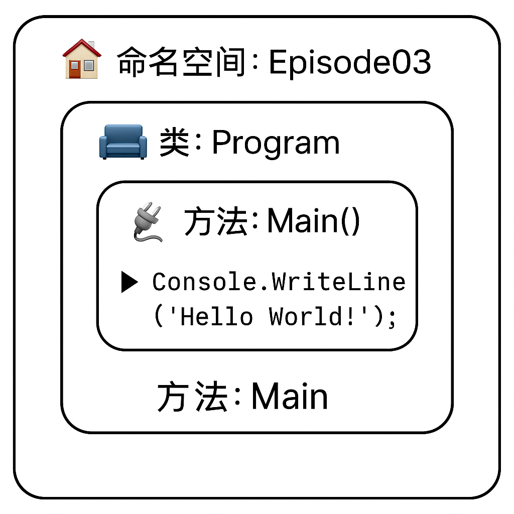

## **开场**  

> 🎙️ “大家好！欢迎观看《C#初学者实例教程》的第3课《手写Hello World程序》。
> 
> 我是张杰。
> 
> 在上期视频中，我们创建了一个解决方案。
> 
> 本期视频：我们要手动编写一个Hello World程序。对于初学者，我的建议是：先学会“跑”程序，再慢慢“理解”结构。
>
> Hello World程序实现的功能非常简单：就是从程序内部向外部控制台输出一句：Hello World。
> 
> 这段程序也几乎是每个C#初学者编写的第一个程序。
> 
> Hello World程序的功能虽然简单，但它更重要的意义在于：帮助我们检测运行环境是否工作正常以及了解C#的基本语法。

---

## Program.cs

Program.cs文件是我们写代码的文件。

在手写Hello World之前，让我们来了解一下Program.cs文件的代码结构。

首先，来看这段在创建项目时自动生成的模板代码：


```csharp linenums="1"
//最顶部有一条using 语句。
using System;

//我们的项目名称叫:Episode03,默认情况下，VS会创建一个同名的命名空间namespace
//namespace 是装 class 的容器
namespace Episode03
{
    //class 是装方法（和属性）的容器  
    class Program
    {
        //方法（如 Main）是装语句的容器，语句控制程序一步步执行
        static void Main(string[] args)
        {
            Console.WriteLine("Hello World!");
        }
    }
}
```

C#程序结构最大特点是一层套一层，就像一个“套娃”。
这12行代码中，一共出现了三组花括号，分别代表三个容器，记住: 

- 花括号就是用来创建容器的。
- 什么容器？当然是存放代码的容器。
- 那这三个代码容器一样吗？答案是不一样！哪里不一样？
    - 第一层容器，通过namespace关键词创建，我们称之为“命名空间”。命名空间是一个大容器，里面可以放类和其他代码单元。在这里：一个Episode03的命名空间内，存储了一个Program类。命名空间很像我家的门牌号码902，类很像902房间里的客厅、卧室、餐厅等功能单元。
    - 第二层容器，通过class关键词创建，我们称之为“类”,类专门用于存放属性和方法。属性就好比我家厨房墙壁的颜色，是名词，是静态的数据。方法就好比厨房里的能热饭的微波炉，是动词，具有某种功能的代码。在这里：带有小括号的Main()就是一个方法。方法的最大特征之一就是“带有小括号”，以后只要你看到像 SayHi()、PrintScore() 这样的形式，恭喜你——你看到的是一个方法！
    - 第三层容器，通过Main方法创建，Main 方法是一个特殊的方法，特殊在于它总是程序执行的入口，你必须把Main的首字母大写。Main方法的内部，是我们写具体“指令”的地方，一条条指令控制程序运行。告诉程序“去做一件事”。就好比指挥洗衣机洗衣服，你需要写下：进水、浸泡、洗涤、甩干等这些指令。在这里，我们做的事情非常简单，就是从程序内部向外部控制台输出一句话：Hello World。如何输出呢？我们可以借助System命名空间下的Console类的WriteLine方法完成这件事。`System.Console.WriteLine("Hello World");`。WriteLine 的意思就是“写一行”。程序就是调用 Console 这个控制台帮我们输出一句话。如果每次向控制台输出内容，都必须写System是有点麻烦，我们可以在namespace的上一行，添加一条语句：`using System;` 这样就可以省略掉`System.`。

接下来，我们清空全部代码，手写一遍：

最后总结：**命名空间是家的地址，类是房子的功能区，方法是房间里的电器，语句是电器运转的指令。**这些结构共同构成了一个能运行的C#程序。

看懂这12行代码，你就迈出了C#编程的第一步！后面我们会在Main()方法里慢慢加代码，让程序一步步动起来！


这就好比：




## 结束语

本节课就到这里，这里是不好奇编程，我是张杰。感谢你的认真学习，你的支持是我更新最大的动力！我们下节课见！

下节预告：《数据类型入门》

慢慢学，一点点进步就很好！