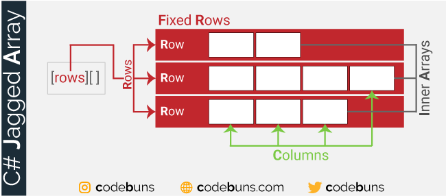

## **开场**  
“大家好！欢迎观看《C#初学者实例教程》的第49课《创建数组》。
我是村长。

本期视频有四个知识点：

1. 数组是什么
2. 字面量法
3. new关键字法
4. 访问数组元素的方法

---

## 数组是什么

首先让我们来看一个问题："如果计算2名同学的英语平均分，你会怎么做？"

很容易：声明2个变量把两名同学的成绩存起来

```c#
double score1 = 90, score2 = 85;
```

然后把两个变量相加之后，除以2，就得到了2人的平均分：

```c#
Console.WriteLine("两人的平均分是：" + (score1 + score2) / 2);
```
是的，很简单。

但是"如果要统计的不是2人，而是全班30人的成绩呢？要声明30个变量吗？这听上去就很麻烦。

你肯定猜到了:使用数组，是的！使用数组就可以了。

使用数组声明一个变量就可以存储全部30名同学的成绩。

你可以这样写：

```csharp linenums="1"
//声明一个double变量，它的值是大括号包括的分数列表。
double[] scores = { 90, 85, 70, 100, 65,  96 };
double sum = 0;
foreach(int score in scores) // 遍历数组中的每个成绩
{
    sum += score; 
}
Console.WriteLine(sum / scores.Length);
```
这样，我们就求得了全班30人的平均分。

暂时看不懂这些代码没关系，你只需知道：

- 变量是一个容器，可以存储一个值。
- 数组也是一个容器，可以存储一组值。数组可以让我们的代码变得更简洁和高效。

想要创建一个数组，有两种常见的方法：

- 字面量法
- new关键字法

## 字面量法

“字面量法”就是在声明一个数组的同时，必须进行初始化，否则编译器不会放过你的，直接报错。字面量法创建数组的语法如下：

```c#
数据类型[] 数组名 = {元素1, 元素2, 元素3, ..., 元素N};

```

- 首先声明数组中存储的数据的类型，所有数据必须是同一类型。
- 方括号用于告诉编译器：这是一个数组类型，不是单个变量。
- 数组名就是一个普通的变量名，用来引用数组。
- 等号右边花括号是数组初始化器，包裹的是数组的值列表。数组中的每一个值，我们称之为“数组元素”。多个元素之间使用英文的分号隔开，最后一个数组元素后面不要加逗号

比如，存储二班全部同学的姓名，可以创建一个字符串数组：

```c#
string[] studentNames = {"张三","李四","王五","杨老五","老六"};
```
存储学生的年龄，可以创建一个整数型数据

```c#
int[] studentAges = {18,17,16,17,16};
```
存储全班同学的身高，我们可以创建一个单精度浮点数数组：

```c#
float[] studentHeights = {1.75F,1.80F,1.65F,1.73F,1.82F};
```

## new关键字法

new关键字法就是使用关键字new显式的在内存里开辟一块空间存放数组元素。它的语法如下：

```c#
数据类型[] 数组名 = new 数据类型[长度];
```
在这里：

- new关键字标识在内存里开辟一块空间
- 长度表示数组元素的个数，这个整数必须在创建时确定，并且一旦创建就不能改变。

正因如此，通常，new关键字法适合不确定数组元素的值，比如我们希望创建一个字符串数组，存储班级前三名同学名字，但是我们并不知道这三名同学是谁。

这时可以使用new关键字法

```c#
string[] top3 = new string[3];
```

这样就在内存中创建了一个数组长度为3的数组，数组元素会被自动填充为默认值null。

## 数组索引

数组每个元素都有一个“编号”叫做**索引（index）**。索引用于标识数组元素在数组中的位置。

索引从 0 开始​​，也就是说：

- 第 1 个元素的索引是 0
- 第 2 个元素的索引是 1
- 第 3 个元素的索引是 2
…
- 第 n 个元素的索引是 n - 1

通过数组的索引，可以读取数组中的元素，它的语法如下

```c#
数组名[索引];
```
比如，我们要获取数组中第一个同学的名字、年龄和身高，可以这样写：

```c#
Console.WriteLine($"姓名:{studentNames[0]}, 年龄:{studentAges[0]}, 身高:{studentHeights[0]*100}cm");
```

通过索引，也可以修改数组中的元素。​它的语法如下

```c#
数组名[索引] = 新值;
```

```c#
studentAges[1] = 19; //将第1个元素的值从 10 修改为 100
Console.WriteLine(studentAges[1]); // 19
```


## 总结

数组（Array）就是：**一组相同类型的数据的有序集合**。数组元素的类型必须是相同类型。



这些数据在内存中连续存放。数据可以是字符串，也可以是整数或浮点数。通过索引，既可以对数组元素进行度操作，也可以进行写操作，这是数组最基本也是最常用的功能之一。但数组的长度是固定的，不能通过索引添加或删除元素。​

---

## 结束语

本节课就到这里，这里是不好奇编程，我是张杰。
你的支持是我更新最大的动力！我们下节课见！

下节预告：《》

慢慢学，一点点进步就很好！
"代码不是魔法，每一步都讲逻辑！"

