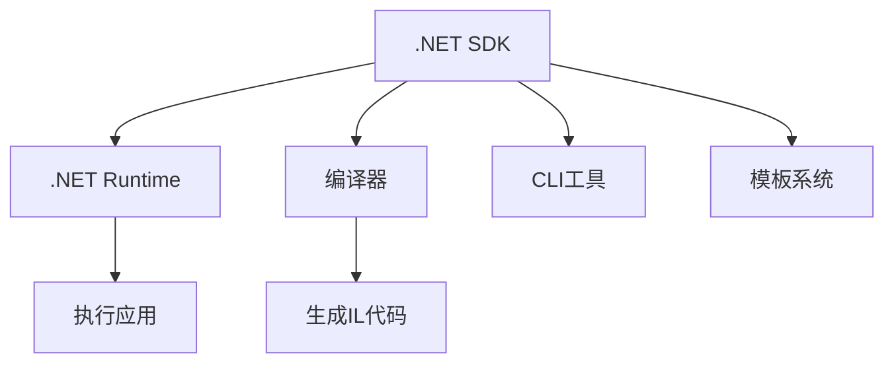

# .NET SDK 详解

.NET SDK（Software Development Kit）是用于开发 .NET 应用程序的**完整工具包**，它包含构建、测试和发布 .NET 应用所需的所有组件。以下是深度解析：

---

## 一、SDK 核心构成
.NET SDK 主要包含以下组件：

| 组件                  | 功能说明                                                                 | 关键工具/命令示例                     |
|-----------------------|--------------------------------------------------------------------------|---------------------------------------|
| **CLI工具链**         | 命令行接口工具                                                          | `dotnet new`, `dotnet build`, `dotnet run` |
| **编译器**            | Roslyn 编译器（C#/VB.NET）                                              | `csc.dll`, `vbc.dll`                  |
| **运行时**            | 包含 .NET Runtime（CLR）和基础类库                                      | `Microsoft.NETCore.App`               |
| **模板系统**          | 项目模板和项模板                                                        | `dotnet new list`                     |
| **NuGet包管理器**     | 依赖管理工具                                                            | `dotnet add package`                  |
| **测试工具**          | 单元测试框架和执行器                                                    | `dotnet test`, MSTest/NUnit/xUnit     |
| **调试工具**          | 调试符号和诊断工具                                                      | `dotnet watch`, `dotnet trace`        |
| **发布工具**          | 应用打包和跨平台发布工具                                                | `dotnet publish`                      |

---

## 二、SDK 与 Runtime 的关系


- **仅需运行应用**：安装 Runtime 即可（约50-150MB）
- **需要开发应用**：必须安装 SDK（约200-500MB）

---

## 三、SDK 版本管理
### 1. 查看已安装SDK
```bash
dotnet --list-sdks
```
输出示例：
```
7.0.400 [/usr/share/dotnet/sdk]
8.0.100 [/usr/share/dotnet/sdk]
```

### 2. 全局版本控制
通过 `global.json` 指定项目使用的SDK版本：
```json
{
  "sdk": {
    "version": "8.0.100",
    "rollForward": "patch"
  }
}
```

### 3. 多版本共存机制
- 并行安装多个SDK版本
- 通过以下路径存储不同版本：
  - Windows: `%ProgramFiles%\dotnet\sdk`
  - Linux/macOS: `/usr/share/dotnet/sdk`

---

## 四、SDK 核心工作流
### 1. 创建项目
```bash
dotnet new console -n MyApp
```

### 2. 添加依赖
```bash
dotnet add package Newtonsoft.Json
```

### 3. 构建项目
```bash
dotnet build --configuration Release
```

### 4. 运行/测试
```bash
dotnet run
dotnet test
```

### 5. 发布应用
```bash
dotnet publish -c Release -r linux-x64 --self-contained true
```

---

## 五、SDK 高级功能
### 1. 项目脚手架
```bash
# 查看所有模板
dotnet new list

# 创建ASP.NET Core Web API
dotnet new webapi -n MyApi
```

### 2. 热重载开发
```bash
dotnet watch run
```

### 3. 性能诊断
```bash
# 生成性能报告
dotnet trace collect -p <PID> --format speedscope
```

### 4. 源码生成器
通过 `Microsoft.CodeAnalysis` 包实现编译时代码生成。

---

## 六、SDK 的安装方式
### 1. 各平台推荐方法
| 平台      | 安装命令                                                                 |
|-----------|--------------------------------------------------------------------------|
| Windows   | `winget install Microsoft.DotNet.SDK` 或官网下载安装包                   |
| macOS     | `brew install --cask dotnet`                                            |
| Linux     | `apt install dotnet-sdk-8.0` (Ubuntu) 或使用安装脚本                     |

### 2. 验证安装
```bash
dotnet --info
```
输出示例：
```
.NET SDK:
 Version:           8.0.100
 Commit:            57efcf1350
Runtime Environment:
 OS Name:     Windows
 OS Version:  10.0.19045
```

---

## 七、SDK 的选择建议
1. **长期支持版(LTS)**：如 .NET 6/8（生产环境首选）
2. **当前版(Current)**：如 .NET 9（体验最新功能）
3. **预览版(Preview)**：测试即将发布的功能（不推荐生产使用）

可通过 [.NET官方下载页](https://dotnet.microsoft.com/download) 获取各版本SDK。

---

.NET SDK 是开发现代 .NET 应用的瑞士军刀，其模块化设计和跨平台支持使其成为构建从控制台程序到云原生微服务的统一开发平台。# .NET SDK 详解

.NET SDK（Software Development Kit）是用于开发 .NET 应用程序的**完整工具包**，它包含构建、测试和发布 .NET 应用所需的所有组件。以下是深度解析：

---

## 一、SDK 核心构成
.NET SDK 主要包含以下组件：

| 组件                  | 功能说明                                                                 | 关键工具/命令示例                     |
|-----------------------|--------------------------------------------------------------------------|---------------------------------------|
| **CLI工具链**         | 命令行接口工具                                                          | `dotnet new`, `dotnet build`, `dotnet run` |
| **编译器**            | Roslyn 编译器（C#/VB.NET）                                              | `csc.dll`, `vbc.dll`                  |
| **运行时**            | 包含 .NET Runtime（CLR）和基础类库                                      | `Microsoft.NETCore.App`               |
| **模板系统**          | 项目模板和项模板                                                        | `dotnet new list`                     |
| **NuGet包管理器**     | 依赖管理工具                                                            | `dotnet add package`                  |
| **测试工具**          | 单元测试框架和执行器                                                    | `dotnet test`, MSTest/NUnit/xUnit     |
| **调试工具**          | 调试符号和诊断工具                                                      | `dotnet watch`, `dotnet trace`        |
| **发布工具**          | 应用打包和跨平台发布工具                                                | `dotnet publish`                      |

---

## 二、SDK 与 Runtime 的关系


- **仅需运行应用**：安装 Runtime 即可（约50-150MB）
- **需要开发应用**：必须安装 SDK（约200-500MB）

---

## 三、SDK 版本管理
### 1. 查看已安装SDK
```bash
dotnet --list-sdks
```
输出示例：
```
7.0.400 [/usr/share/dotnet/sdk]
8.0.100 [/usr/share/dotnet/sdk]
```

### 2. 全局版本控制
通过 `global.json` 指定项目使用的SDK版本：
```json
{
  "sdk": {
    "version": "8.0.100",
    "rollForward": "patch"
  }
}
```

### 3. 多版本共存机制
- 并行安装多个SDK版本
- 通过以下路径存储不同版本：
  - Windows: `%ProgramFiles%\dotnet\sdk`
  - Linux/macOS: `/usr/share/dotnet/sdk`

---

## 四、SDK 核心工作流
### 1. 创建项目
```bash
dotnet new console -n MyApp
```

### 2. 添加依赖
```bash
dotnet add package Newtonsoft.Json
```

### 3. 构建项目
```bash
dotnet build --configuration Release
```

### 4. 运行/测试
```bash
dotnet run
dotnet test
```

### 5. 发布应用
```bash
dotnet publish -c Release -r linux-x64 --self-contained true
```

---

## 五、SDK 高级功能
### 1. 项目脚手架
```bash
# 查看所有模板
dotnet new list

# 创建ASP.NET Core Web API
dotnet new webapi -n MyApi
```

### 2. 热重载开发
```bash
dotnet watch run
```

### 3. 性能诊断
```bash
# 生成性能报告
dotnet trace collect -p <PID> --format speedscope
```

### 4. 源码生成器
通过 `Microsoft.CodeAnalysis` 包实现编译时代码生成。

---

## 六、SDK 的安装方式
### 1. 各平台推荐方法
| 平台      | 安装命令                                                                 |
|-----------|--------------------------------------------------------------------------|
| Windows   | `winget install Microsoft.DotNet.SDK` 或官网下载安装包                   |
| macOS     | `brew install --cask dotnet`                                            |
| Linux     | `apt install dotnet-sdk-8.0` (Ubuntu) 或使用安装脚本                     |

### 2. 验证安装
```bash
dotnet --info
```
输出示例：
```
.NET SDK:
 Version:           8.0.100
 Commit:            57efcf1350
Runtime Environment:
 OS Name:     Windows
 OS Version:  10.0.19045
```

---

## 七、SDK 的选择建议
1. **长期支持版(LTS)**：如 .NET 6/8（生产环境首选）
2. **当前版(Current)**：如 .NET 9（体验最新功能）
3. **预览版(Preview)**：测试即将发布的功能（不推荐生产使用）

可通过 [.NET官方下载页](https://dotnet.microsoft.com/download) 获取各版本SDK。

---

.NET SDK 是开发现代 .NET 应用的瑞士军刀，其模块化设计和跨平台支持使其成为构建从控制台程序到云原生微服务的统一开发平台。