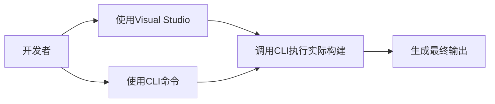

# .NET CLI（命令行接口）详解

.NET CLI（Command-Line Interface）是 .NET SDK 提供的**跨平台命令行工具集**，它是开发 .NET 应用程序的核心工具链。以下是深度解析：

---

## 一、CLI 的核心定位
1. **统一工作流**：提供从项目创建到发布的全生命周期管理
2. **跨平台支持**：Windows/macOS/Linux 使用相同命令
3. **自动化友好**：适合 CI/CD 流水线和脚本操作
4. **IDE 底层工具**：Visual Studio/Rider 等 IDE 实际调用 CLI 执行操作

---

## 二、CLI 核心命令分类

### 1. 项目脚手架
| 命令                      | 功能说明                           | 示例                                  |
|---------------------------|-----------------------------------|---------------------------------------|
| `dotnet new`              | 创建新项目/文件                   | `dotnet new console -n MyApp`         |
| `dotnet new list`         | 查看可用模板                      | `dotnet new list --tag web`           |
| `dotnet new install`      | 安装自定义模板                    | `dotnet new install My.Template::1.0` |

### 2. 构建与运行
| 命令                      | 功能说明                           | 示例                                  |
|---------------------------|-----------------------------------|---------------------------------------|
| `dotnet build`            | 编译项目                          | `dotnet build -c Release`             |
| `dotnet run`              | 编译并立即运行                    | `dotnet run --project src/MyApp`      |
| `dotnet watch`            | 监视文件变化自动重启              | `dotnet watch run`                    |

### 3. 包管理
| 命令                      | 功能说明                           | 示例                                  |
|---------------------------|-----------------------------------|---------------------------------------|
| `dotnet add package`      | 添加NuGet包依赖                   | `dotnet add package Newtonsoft.Json`  |
| `dotnet remove package`   | 移除包依赖                        | `dotnet remove package NLog`          |
| `dotnet restore`          | 还原项目依赖                      | (现代版本中build自动包含此操作)        |

### 4. 测试与诊断
| 命令                      | 功能说明                           | 示例                                  |
|---------------------------|-----------------------------------|---------------------------------------|
| `dotnet test`             | 运行单元测试                      | `dotnet test --filter "Category=Fast"`|
| `dotnet trace`            | 性能分析工具                      | `dotnet trace collect -p <PID>`       |
| `dotnet counters`         | 监控运行时指标                    | `dotnet counters monitor System.Runtime` |

### 5. 发布与部署
| 命令                      | 功能说明                           | 示例                                  |
|---------------------------|-----------------------------------|---------------------------------------|
| `dotnet publish`          | 发布应用                          | `dotnet publish -c Release -r linux-x64` |
| `dotnet pack`             | 创建NuGet包                       | `dotnet pack --configuration Release` |

---

## 三、CLI 关键特性

### 1. 项目文件驱动
CLI 通过 `*.csproj` 文件理解项目结构：
```bash
# 针对特定项目文件操作
dotnet build MyProject.csproj
```

### 2. 响应文件（rsp）
可保存常用参数到文件：
```bash
# build.rsp 内容
-c Release
--no-restore

# 使用响应文件
dotnet build @build.rsp
```

### 3. 全局工具
安装跨项目可用的.NET工具：
```bash
dotnet tool install -g dotnet-ef
dotnet ef migrations add InitialCreate
```

### 4. 工作负载扩展
安装额外开发功能：
```bash
dotnet workload install android
dotnet workload update
```

---

## 四、CLI 与 IDE 的关系



- **IDE 封装**：Visual Studio 的"生成"按钮实际调用 `dotnet build`
- **优势互补**：
  - CLI：适合自动化/高级场景
  - IDE：提供可视化调试和设计时支持

---

## 五、CLI 环境配置

### 1. 常用环境变量
| 变量名                     | 作用                          |
|----------------------------|-------------------------------|
| `DOTNET_ROOT`              | 指定.NET安装路径              |
| `DOTNET_CLI_TELEMETRY_OPTOUT` | 禁用遥测数据收集            |
| `DOTNET_NOLOGO`            | 隐藏启动横幅                  |

### 2. 配置文件位置
| 平台      | 路径                          |
|-----------|-------------------------------|
| Windows   | `%USERPROFILE%\.dotnet\tools` |
| Linux/macOS | `$HOME/.dotnet/tools`       |

---

## 六、实战示例

### 1. 创建并运行ASP.NET Core应用
```bash
dotnet new web -o MyWebApp
cd MyWebApp
dotnet watch run
```

### 2. 多项目解决方案操作
```bash
# 创建解决方案
dotnet new sln -n MySln
# 添加项目到解决方案
dotnet sln add src/MyApp/MyApp.csproj
# 批量构建所有项目
dotnet build MySln.sln
```

### 3. 性能诊断
```bash
# 启动应用并获取PID
dotnet run &
# 收集跟踪数据
dotnet trace collect -p $! --format speedscope
```

---

.NET CLI 的设计体现了微软"开发者优先"的理念，通过简单的 `dotnet` 命令统一了原本分散的开发工具，成为现代 .NET 开发的核心枢纽。掌握 CLI 不仅能提升效率，更是理解 .NET 开发生态系统的基础。