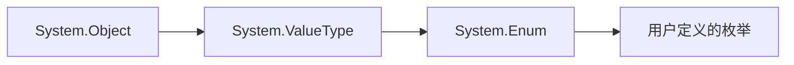

# C# 中 `System.Enum` 的全面解析

`System.Enum` 是 .NET 中所有枚举类型的基类，它提供了丰富的静态方法和实例方法来操作枚举类型。以下是其完整用法的深度剖析：

---

## 一、`System.Enum` 的本质

### 1. 类型层次结构


### 2. 关键特性
- **抽象类**：不能直接实例化
- **值类型基类**：所有枚举都隐式继承 `System.Enum`
- **实现接口**：`IComparable`, `IFormattable`, `IConvertible`

---

## 二、核心静态方法

### 1. 获取枚举值
| 方法                          | 描述                          | 示例                                      |
|-------------------------------|-------------------------------|-------------------------------------------|
| `GetValues(Type)`             | 返回所有枚举值的数组          | `Enum.GetValues(typeof(Weekday))`         |
| `GetValues<T>()` (.NET 5+)    | 泛型版本，返回强类型数组      | `Enum.GetValues<Weekday>()`               |

**代码示例**：
```csharp
enum Status { Pending, Approved, Rejected }

// 获取所有值
foreach (Status status in Enum.GetValues(typeof(Status)))
{
    Console.WriteLine(status);
}
```

### 2. 名称处理
| 方法                  | 描述                      | 示例                              |
|-----------------------|---------------------------|-----------------------------------|
| `GetName(Type, object)` | 获取特定值的名称          | `Enum.GetName(typeof(Status), 1)` → "Approved" |
| `GetNames(Type)`      | 获取所有名称的字符串数组  | `Enum.GetNames(typeof(Status))`   |

### 3. 类型转换
| 方法                      | 描述                          | 示例                                      |
|---------------------------|-------------------------------|-------------------------------------------|
| `Parse(Type, string)`     | 字符串转枚举值                | `Enum.Parse(typeof(Status), "Approved")`  |
| `TryParse<T>(string, out T)` | 安全转换（.NET 5+）          | `Enum.TryParse<Status>("Pending", out var result)` |

**安全转换示例**：
```csharp
if (Enum.TryParse<Status>("Approved", out Status status))
{
    Console.WriteLine($"转换成功: {status}");
}
```

### 4. 值验证
| 方法              | 描述                  | 示例                              |
|-------------------|-----------------------|-----------------------------------|
| `IsDefined(Type, object)` | 检查值是否有效      | `Enum.IsDefined(typeof(Status), 2)` → true |

---

## 三、实例方法

### 1. 格式化输出
```csharp
Status status = Status.Approved;

Console.WriteLine(status.ToString());    // "Approved"
Console.WriteLine(status.ToString("D")); // 数字格式 "1"
Console.WriteLine(status.ToString("X")); // 十六进制 "0x00000001"
```

### 2. 比较与转换
```csharp
// 实现 IComparable
Status.Pending.CompareTo(Status.Approved); // -1

// 实现 IConvertible
int code = Convert.ToInt32(Status.Rejected); // 2
```

---

## 四、高级用法

### 1. 标志枚举（[Flags]）处理
```csharp
[Flags]
enum Permissions
{
    None = 0,
    Read = 1,
    Write = 2,
    Execute = 4
}

var combo = Permissions.Read | Permissions.Write;

// 检查标志
bool canWrite = combo.HasFlag(Permissions.Write); // true

// 组合值转名称
Console.WriteLine(combo.ToString()); // "Read, Write"
```

### 2. 自定义特性扩展
```csharp
enum LogLevel
{
    [Description("调试信息")]
    Debug,
    
    [Description("警告信息")]
    Warning
}

// 获取描述特性
public static string GetDescription(this Enum value)
{
    FieldInfo field = value.GetType().GetField(value.ToString());
    DescriptionAttribute attribute = field.GetCustomAttribute<DescriptionAttribute>();
    return attribute?.Description ?? value.ToString();
}

Console.WriteLine(LogLevel.Debug.GetDescription()); // "调试信息"
```

### 3. 枚举迭代器模式
```csharp
public static IEnumerable<T> Enumerate<T>() where T : Enum
{
    foreach (T value in Enum.GetValues(typeof(T)))
    {
        yield return value;
    }
}

foreach (var day in Enumerate<Weekday>())
{
    Console.WriteLine(day);
}
```

---

## 五、性能优化

### 1. 缓存反射结果
```csharp
private static readonly Dictionary<Type, Array> _enumValuesCache = new();

public static Array GetCachedValues(Type enumType)
{
    if (!_enumValuesCache.TryGetValue(enumType, out Array values))
    {
        values = Enum.GetValues(enumType);
        _enumValuesCache[enumType] = values;
    }
    return values;
}
```

### 2. 避免装箱（.NET 5+）
```csharp
// 传统方式（有装箱）
object boxedValue = Enum.ToObject(typeof(Status), 1);

// 现代方式（无装箱）
Status unboxedValue = (Status)1;
```

---

## 六、与其他技术的结合

### 1. 与 switch 表达式
```csharp
string HandleStatus(Status status) => status switch
{
    Status.Pending => "处理中",
    Status.Approved => "已批准",
    Status.Rejected => "已拒绝",
    _ => throw new ArgumentOutOfRangeException()
};
```

### 2. JSON 序列化控制
```csharp
// System.Text.Json 配置
options.Converters.Add(new JsonStringEnumConverter());

// 结果示例
// {"Status":"Approved"} 而不是 {"Status":1}
```

### 3. Entity Framework Core
```csharp
// 配置枚举存储为字符串
modelBuilder.Entity<Order>()
            .Property(o => o.Status)
            .HasConversion<string>();
```

---

## 七、最佳实践

1. **输入验证**：始终用 `Enum.IsDefined` 或 `TryParse` 验证外部输入
2. **标志枚举**：使用 `HasFlag` 而非位运算（可读性更好）
3. **避免魔法数字**：不要直接使用 `(Status)3` 这样的强制转换
4. **文档化枚举**：为每个值添加 XML 注释或特性说明

---

`System.Enum` 是 .NET 类型系统中极具特色的设计，它既保持了值类型的高效性，又通过丰富的方法提供了类似引用类型的灵活性。掌握其完整用法可以显著提升枚举相关代码的健壮性和可维护性。