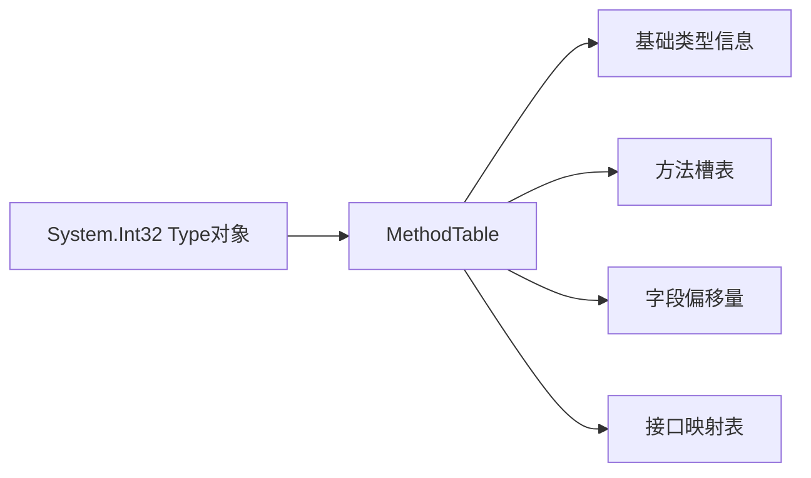

在 .NET 中，`System.Int32` 作为基础值类型，其元数据包含丰富的类型定义信息。以下是其完整元数据结构的详细解析：

---

### **一、核心元数据类型**
通过 `typeof(int)` 获取的 `System.Int32` 元数据（`System.Type` 对象）包含以下关键信息：

#### **1. 类型基本信息**
| 元数据属性                | 值/说明                                | 获取方式示例                     |
|---------------------------|----------------------------------------|----------------------------------|
| `Name`                    | "Int32"                                | `typeof(int).Name`               |
| `FullName`                | "System.Int32"                         | `typeof(int).FullName`           |
| `Namespace`               | "System"                               | `typeof(int).Namespace`          |
| `IsValueType`             | `true`                                 | `typeof(int).IsValueType`        |
| `IsPrimitive`             | `true`（属于基本类型）                 | `typeof(int).IsPrimitive`        |
| `BaseType`                | `System.ValueType`                     | `typeof(int).BaseType`           |
| `UnderlyingSystemType`     | `System.Int32` 自身                    | `typeof(int).UnderlyingSystemType` |

#### **2. 类型结构信息**
| 元数据属性                | 值/说明                                |
|---------------------------|----------------------------------------|
| `IsSealed`                | `true`（值类型都是密封的）             |
| `IsEnum`                  | `false`                                |
| `IsSerializable`          | `true`（可序列化）                     |
| `IsPublic`                | `true`（公开访问）                     |
| `Attributes`              | `Public | Sealed | Serializable`       |

#### **3. 内存布局信息**
| 元数据属性                | 值/说明                                |
|---------------------------|----------------------------------------|
| `TypeHandle`              | 运行时类型句柄（内存地址）             |
| `Size`                    | 4 字节（通过 `sizeof(int)` 获取更准确）|

---

### **二、包含的成员元数据**
`System.Int32` 的元数据还包含其所有成员的完整定义：

#### **1. 字段**
| 字段名           | 值      | 说明                     |
|------------------|---------|--------------------------|
| `MaxValue`       | 2147483647 | 静态常量字段           |
| `MinValue`       | -2147483648 | 静态常量字段           |

```csharp
FieldInfo[] fields = typeof(int).GetFields();
foreach (var f in fields) 
{
    Console.WriteLine($"{f.Name} = {f.GetValue(null)}");
}
```

#### **2. 方法**
包含数十个方法，主要分为：
- **实例方法**：
  ```csharp
  int.Parse("123")       // 字符串转换
  42.ToString()          // 转为字符串
  5.CompareTo(10)       // 数值比较
  ```
- **静态方法**：
  ```csharp
  int.TryParse("123", out var result)
  int.Max(10, 20)
  ```

通过反射查看：
```csharp
MethodInfo[] methods = typeof(int).GetMethods();
foreach (var m in methods.Take(5)) 
{
    Console.WriteLine(m);
}
/* 输出示例：
Int32 CompareTo(Int32)
Int32 CompareTo(System.Object)
Boolean Equals(Int32)
Boolean Equals(System.Object)
Int32 GetHashCode()
*/
```

#### **3. 实现的接口**
`System.Int32` 实现的接口元数据：
- `IComparable`
- `IConvertible`
- `IFormattable`
- `ISpanFormattable`
- `IComparable<int>`
- `IEquatable<int>`

验证：
```csharp
Type[] interfaces = typeof(int).GetInterfaces();
foreach (var i in interfaces) 
{
    Console.WriteLine(i.Name);
}
```

---

### **三、元数据的存储形式**
#### **1. 在程序集中的存储**
- **位置**：`System.Private.CoreLib.dll`（.NET 核心库）
- **格式**：ECMA-335 标准元数据表（CLI 规范）
  - `TypeDef` 表：类型定义
  - `MethodDef` 表：方法定义
  - `FieldDef` 表：字段定义
  - `InterfaceImpl` 表：接口实现

#### **2. 运行时内存结构**


---

### **四、元数据的实际用途**
#### **1. 编译器使用**
- 类型检查：确保 `int i = "text";` 这样的代码编译失败
- 方法绑定：解析 `i.ToString()` 调用

#### **2. 运行时使用**
- 垃圾回收：识别值类型不需要GC处理
- 序列化：知道 `int` 是4字节二进制格式
- 跨语言操作：确保C#的 `int` 与VB.NET的 `Integer` 行为一致

#### **3. 开发者使用**
```csharp
// 反射创建实例
object intObj = Activator.CreateInstance(typeof(int)); // 返回 0

// 类型转换验证
if (typeof(int).IsAssignableFrom(someType)) { ... }
```

---

### **五、查看完整元数据的工具**
1. **ILDasm.exe**  
   .NET 自带的工具，可查看程序集元数据表：
   ```
   ildasm System.Private.CoreLib.dll /out=int32_meta.il
   ```

2. **dotPeek/ILSpy**  
   反编译工具，可视化展示元数据：
   ```csharp
   // 反编译System.Int32部分定义
   public struct Int32 : IComparable, IConvertible, IFormattable, ... 
   {
       public const int MaxValue = 2147483647;
       public const int MinValue = -2147483648;
       public int CompareTo(object? value);
       // ...
   }
   ```

3. **C# 交互窗口**  
   直接查询：
   ```csharp
   > typeof(int).GetMembers().Select(m => m.Name).Distinct()
   { "MaxValue", "MinValue", "Parse", "TryParse", "ToString", ... }
   ```

---

### **总结**
`System.Int32` 的元数据是 .NET 类型系统的基石，包含：
1. **类型身份信息**（名称、基类、接口等）
2. **成员定义**（字段、方法、属性）
3. **运行时特征**（内存布局、序列化能力等）
4. **跨语言支持**（通过标准 ECMA-335 格式存储）

这些元数据使得 `int` 不仅是一个简单的数值类型，而是一个完整的 .NET 对象，支持面向对象操作、反射和跨语言互操作。