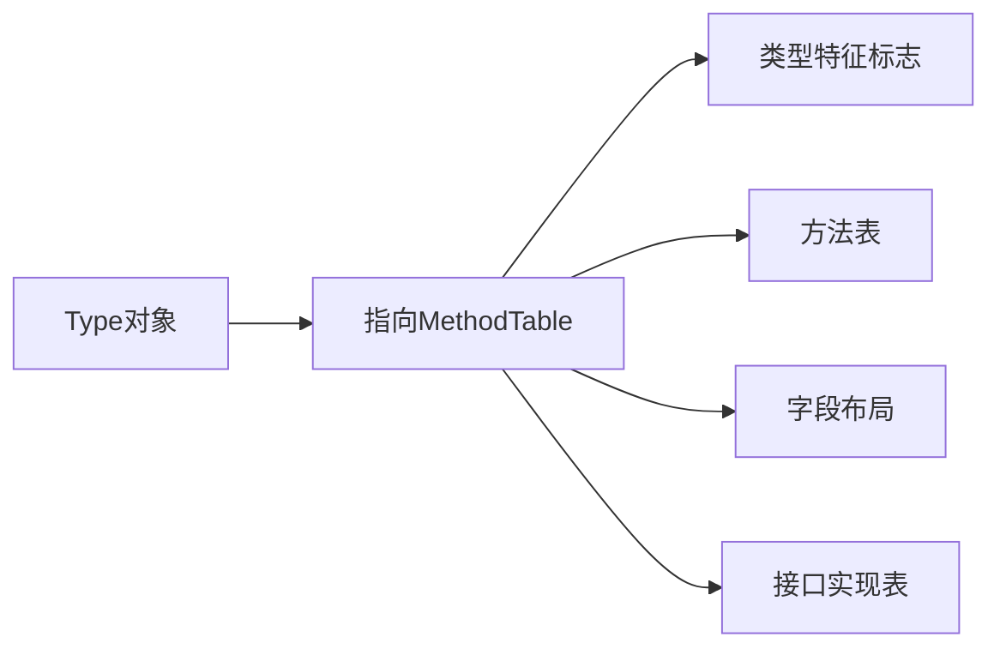

# `System.Type` 类型详解

`System.Type` 是 .NET 中表示类型元数据的核心类，它是反射系统的入口点，提供了对类型信息的完整访问能力。以下是深度解析：

---

## 一、本质与作用
`System.Type` 是一个**抽象类**，其每个实例代表：

- 一个 .NET 类型（类、结构体、接口、枚举等）
- 该类型在运行时的完整元数据描述
- 类型系统的操作入口

```csharp
Type intType = typeof(int);  // 获取System.Int32的Type对象
```

---

## 二、关键特性

### 1. 获取方式对比
| 获取方式                  | 示例                          | 适用场景                     |
|---------------------------|-------------------------------|------------------------------|
| `typeof` 运算符           | `typeof(string)`              | 编译时已知类型               |
| `GetType()` 实例方法       | `"text".GetType()`            | 运行时获取对象实际类型       |
| `Type.GetType()` 静态方法  | `Type.GetType("System.Int32")` | 通过字符串名称动态获取类型   |

### 2. 核心功能分类
#### **类型身份识别**
```csharp
Console.WriteLine(intType.Name);        // 输出 "Int32"
Console.WriteLine(intType.FullName);    // 输出 "System.Int32"
Console.WriteLine(intType.Namespace);   // 输出 "System"
```

#### **类型关系检查**
```csharp
bool isValueType = intType.IsValueType;  // true
bool isPrimitive = intType.IsPrimitive;  // true
Type baseType = intType.BaseType;        // System.ValueType
```

#### **成员探索**
```csharp
MemberInfo[] members = intType.GetMembers();
MethodInfo toStringMethod = intType.GetMethod("ToString");
FieldInfo maxValueField = intType.GetField("MaxValue");
```

---

## 三、底层实现原理

### 1. 元数据存储

- **位置**：存储在程序集的 `#~` 流（元数据表）
- **内容**：
  - `TypeDef` 表：类型定义
  - `MethodDef` 表：方法定义
  - `FieldDef` 表：字段定义

### 2. 运行时表示


### 3. 类型系统层次
```
System.Object
  └── System.Type (抽象类)
      ├── System.RuntimeType (CLR内部实现)
      └── 其他派生类型（如反射发出类型）
```

---

## 四、典型应用场景

### 1. 反射操作
```csharp
// 动态创建实例
object instance = Activator.CreateInstance(intType);

// 调用方法
MethodInfo parseMethod = intType.GetMethod("Parse", new[] { typeof(string) });
int result = (int)parseMethod.Invoke(null, new object[] { "123" });
```

### 2. 类型检查
```csharp
// 类型兼容性检查
if (typeof(IEnumerable).IsAssignableFrom(someType))
{
    Console.WriteLine("该类型可枚举");
}
```

### 3. 依赖注入
```csharp
// 自动注册所有实现某接口的类型
var implTypes = Assembly.GetExecutingAssembly()
                       .GetTypes()
                       .Where(t => t.GetInterfaces().Contains(typeof(IService)));
```

---

## 五、性能优化要点

### 1. 缓存 Type 对象
```csharp
// 避免重复反射开销
private static readonly Type _cachedType = typeof(MyClass);
```

### 2. 使用轻量级反射
```csharp
// C# 9.0+ 的静态匿名委托
var propertyGetter = (Func<object, object>)Delegate.CreateDelegate(
    typeof(Func<object, object>), 
    propertyInfo.GetMethod!);
```

### 3. 避免频繁操作
```csharp
// 错误示范（每次循环都反射）
foreach (var item in collection) {
    var type = item.GetType();
    // ...
}

// 正确做法（预先获取）
Type itemType = collection.GetType().GetGenericArguments()[0];
```

---

## 六、与其他类型的关系

| 类型                | 与 System.Type 的关系                          |
|---------------------|-----------------------------------------------|
| `Assembly`          | 通过 `Assembly.GetTypes()` 获取多个 Type       |
| `MemberInfo`        | Type 是成员信息的容器（包含方法/字段/属性等） |
| `TypeInfo`          | .NET Core 中的扩展类型信息（通过 `GetTypeInfo()`） |

---

`System.Type` 是 .NET 反射系统的基石，它使得运行时类型检查、动态代码生成和元数据探索成为可能。理解其工作原理有助于：
- 构建灵活的插件架构
- 实现高效的序列化/反序列化
- 开发依赖注入容器等高级框架