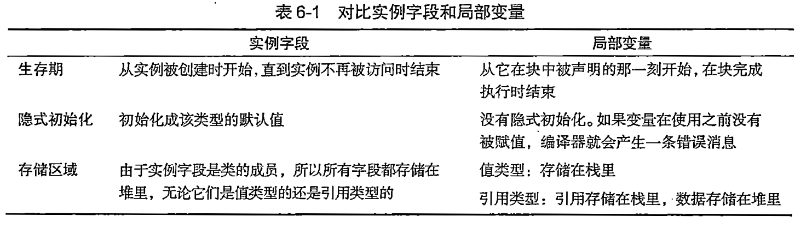

## 方法的结构
方法主要有两个部分：

- 方法头
- 方法体


## 方法头是什么
方法头指定方法的特征。包括：

- 方法是否返回数据，如果返回，返回什么类型；
- 方法的名称；
- 哪种类型的数据可以传递给方法或从方法返回，以及应如何处理这些数据。


示例

```c# linenums="1"
void MyMethod()
{
    Console.WriteLine("First");
    Console.WriteLine("Last");
}
```
## 方法体是什么
- 方法体是一个语句块。
- 方法体是花括号包裹起来的语句序列。

方法体包含以下项目：

- 局部变量
- 局部函数
- 控制流结构
- 方法调用
- 内嵌的块


## 局部变量是什么
- 字段通常保存和对象状态有关的数据。
- 局部变量通常用于保存局部的或临时的计算数据。
- 局部变量的存在和生存期仅限于创建它的块及其内嵌的块。从声明它的那一点开始存在，在块完成执行时结束存在。



## 声明局部变量的语法是什么
可以在方法体内任意位置声明局部变量，但必须在使用它们之前声明。

```c# linenums="1"
Type Identifier = Value;
      (变量名称)  (可选的初始化语句)
```
示例:两个局部变量的声明和使用

```c# linenums="1"
static void Main()
{
    int myInt = 15;//int类型变量
    SomeClass sc = new SomeClass();//SomeClass类型变量
    ...
}
```

## 请谈谈var关键字的用法
1. 编译器可以从书适合语句的右侧推断出来时，声明的开始部分包含的显式类型是多余的。
2. 为了避免冗余，可以在变量声明的开始部分显式类型名的位置使用新的关键字var
3. var关键字不表示特殊变量，它只是语法上的速记。
4. var关键字表示任何可以从初始化语句的右边推断出的类型。
5. 使用var关键字的条件
      1. 只能用于局部变量，不能用于字段；
      2. 只能在变量声明中包含初始化时使用
      3. 一旦编译器推断出变量的类型，它就是固定且不能更改的。

## 嵌套块中的局部变量
方法体内可以嵌套其他的块。

- 可以有任意数量的块
- 局部变量可以在嵌套块的内部声明，并且和所有的局部变量一样，它们的生存期和可见性仅限于声明它们的块及其内嵌块。

## 控制流是什么

术语控制流指的是程序从头到尾的执行流程。

- 默认情况下，程序执行顺序地从一条语句到下一条语句。
- 控制流语句允许你改变执行的顺序。
- 常见的控制语句包括：
    - 选择语句
    - 迭代语句
    - 跳转语句


我学习了C#图解教程第5章：类的基本概念，第6章：方法 第7章：深入理解类。请给我出20道应用题
## 方法调用

## 返回值

## 返回语句和void方法

## 局部函数

## 参数

## 值参数

## 引用参数

## 引用类型作为值参考数和引用数

## 输出参数

## 参数数组

## 参数类型总结

## 方法重载

## 命名参数

## 可选参数

## 栈帧

## 递归


以下是20道基于C#方法概念的应用题，涵盖参数传递、方法重载、可选参数、局部函数等核心知识点：

1. **值参数与引用参数**  
   创建`SwapService`类，包含两个方法：  
   - `SwapByValue(int a, int b)`（值参数）  
   - `SwapByRef(ref int a, ref int b)`（引用参数）  
   调用方法验证值参数交换是否影响原始变量。

2. **输出参数应用**  
   实现`TryDivide`方法：接受两个整数，使用`out`参数返回商和余数。当除数为0时返回false。测试(10,3)和(5,0)两种情况。

3. **参数数组实践**  
   创建`MathUtil.Sum(params int[] values)`方法，计算任意数量整数的和。分别测试`Sum(1,2)`和`Sum(1,2,3,4,5)`。

4. **可选参数方法**  
   设计`GreetingGenerator`类：  
   `string Generate(string name, bool formal = false, string suffix = "!")`  
   当formal为true时返回"Dear [name][suffix]"，否则返回"Hi [name][suffix]"。测试不同参数组合。

5. **命名参数调用**  
   使用上题的`Generate`方法，通过命名参数调用：  
   `Generate(suffix: "?", name: "Alice", formal: true)`

6. **方法重载实践**  
   在`Printer`类中创建三个重载方法：  
   - `Print(int number)`  
   - `Print(double number)`  
   - `Print(string text, int count)`  
   调用`Print(5)`, `Print(3.14)`, `Print("Hello", 3)`

7. **表达式体方法**  
   用表达式体语法实现：  
   - `bool IsEven(int num) => num % 2 == 0;`  
   - `double CircleArea(double r) => Math.PI * r * r;`  
   测试IsEven(4)和CircleArea(1)

8. **迭代器方法**  
   创建`NumberGenerator.GetEvenSequence(int max)`方法，使用`yield return`生成所有≤max的正偶数。用foreach遍历输出≤10的偶数。

9. **局部函数应用**  
   在`Factorial`方法中定义局部递归函数计算阶乘：  
   ```csharp
   public int Factorial(int n) {
       int Recursive(int x) => x <= 1 ? 1 : x * Recursive(x-1);
       return Recursive(n);
   }
   ```
   测试Factorial(5)

10. **扩展方法实践**  
    为`string`类型创建扩展方法：  
    `public static int WordCount(this string str) => str.Split(' ').Length;`  
    测试`"Hello world".WordCount()`

11. **ref局部变量**  
    实现`ArrayUtil.FindFirstEven`方法：在整数数组中找到首个偶数，通过`ref return`返回其引用，并通过该引用修改原数组值。

12. **in参数修饰符**  
    创建`DistanceCalculator`：  
    `public double Euclidean(in Point p1, in Point p2)`  
    使用`in`参数计算两点欧氏距离（防止结构体复制）

13. **方法重载冲突**  
    创建含以下重载的类：  
    - `Process(int num)`  
    - `Process(double num)`  
    调用`Process(10)`和`Process(5.5)`后，再调用`Process(10L)`观察结果

14. **条件方法**  
    使用`[Conditional("DEBUG")]`特性创建`DebugLogger.Log`方法：  
    ```csharp
    [Conditional("DEBUG")]
    public static void Log(string msg) => Console.WriteLine(msg);
    ```
    在DEBUG/RELEASE模式下测试调用

15. **元组返回类型**  
    实现`MinMaxFinder`方法：  
    `public (int min, int max) FindMinMax(int[] data)`  
    返回数组中的最小值和最大值。测试数组[3,1,9,5]

16. **异常处理方法**  
    创建`SafeParseInt`方法：  
    ```csharp
    public bool TryParseToInt(string input, out int result) {
        try {
            result = int.Parse(input);
            return true;
        }
        catch {
            result = 0;
            return false;
        }
    }
    ```
    测试输入"123"和"abc"

17. **递归方法**  
    实现`Recursion.Fibonacci(n)`方法递归计算斐波那契数列第n项。测试n=6（结果应为8）

18. **方法参数默认值**  
    设计`Timer`类：  
    `public void Start(int interval = 1000, int duration = 5000)`  
    验证调用`Start()`、`Start(500)`和`Start(interval:200, duration:10000)`

19. **静态局部函数**  
    修改阶乘方法，将局部函数标记为`static`：  
    ```csharp
    public int Factorial(int n) {
        static int Recursive(int x) => ... //静态局部函数
        return Recursive(n);
    }
    ```
    注意静态局部函数不能访问外部变量

20. **综合应用：购物车**  
    设计`ShoppingCart`类：  
    - 方法`AddItem(string name, double price)`  
    - 方法`AddItems(params (string, double)[] items)`  
    - 方法`ApplyDiscount(double percent = 10.0)`  
    - 方法`CalculateTotal()`  
    测试添加商品并应用折扣

每个题目聚焦方法的不同特性，通过实现和测试深入理解参数传递机制、方法设计技巧及C#7.0+的新特性。