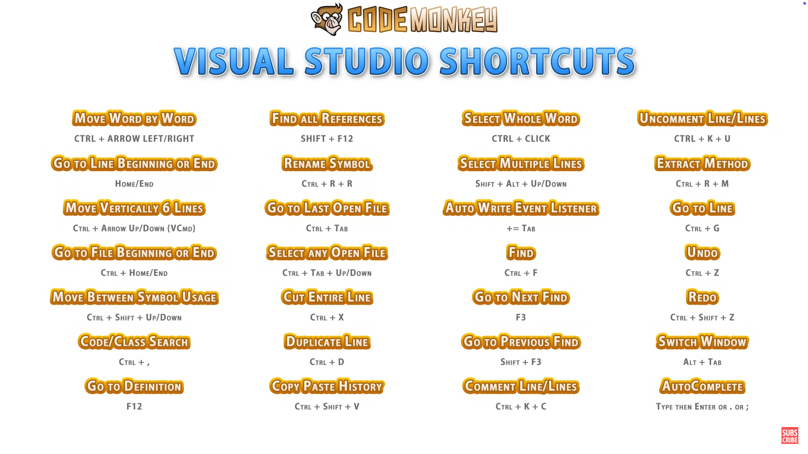

## 常用快捷键
| 快捷键                        | 功能说明               |
| -------------------------- | ------------------ |
| Ctrl + / |单行注释|
|Ctrl + K + C|注释选定内容|
|Ctrl + K + U|取消注释选定内容|
|Ctrl + K + D|格式化代码|
|Ctrl + Shift + .|放大|
|Ctrl + Shift + ,|缩小|
|Shift + Alt + .|匹配下一个|
|Shift + Alt + ;|匹配全部|
|Shift + Enter| 换行|
|Shift + Home| 行内向前全选|
|Shift + End| 行内向后全选|
|Ctrl + Shift + Home|向上全选
|Ctrl + Shift + End|向下全选
|Ctrl + Home|定位光标到首行|
|Ctrl + End|定位光标到尾行|
|Ctrl + L|删除行|
|Ctrl + D|复制行|
|Ctrl + M + M| 折叠代码｜

