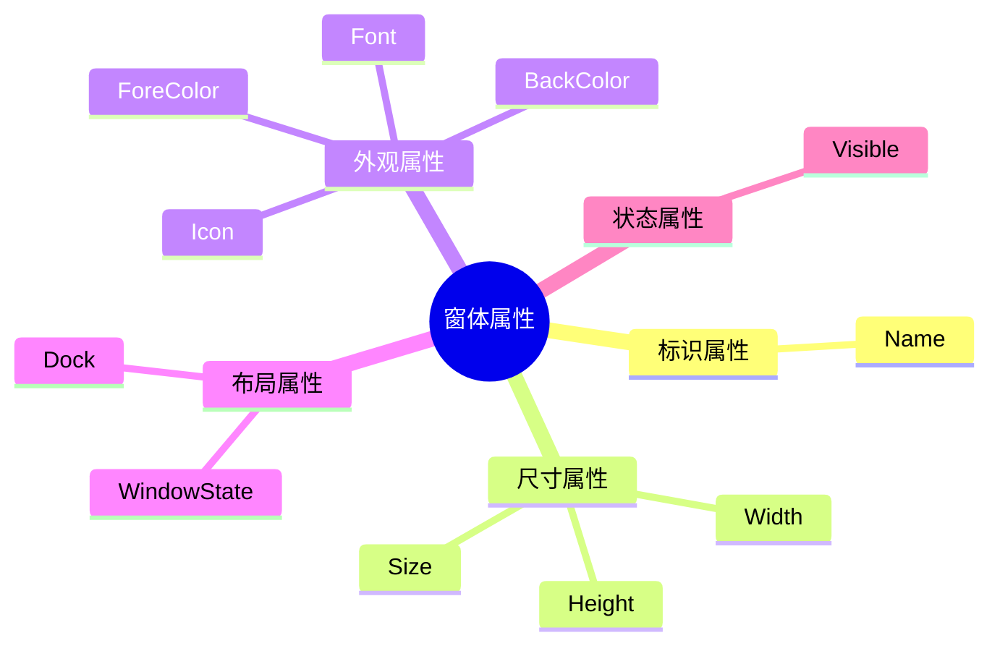

> 掌握窗体的属性：Name、Height、Width、Visible、WindowState、Dock、Font、BackColor、ForeColor、Icon、Size；

我将详细解析窗体开发中必须掌握的11个核心属性，包括概念说明、使用方法和实际应用场景。

## 属性全景概览



## 属性详解与代码示例

### 1. Name - 窗体标识
```csharp
// 设置窗体名称
this.Name = "MainForm";

// 通过名称引用窗体
Form loginForm = Application.OpenForms["LoginForm"];
```

**特点**：
- 窗体在代码中的唯一标识符
- 命名规范：使用有意义的名称（如`MainForm`、`LoginForm`）
- 设计时设置，运行时通常不修改

### 2. Size - 窗体尺寸
```csharp
// 设置初始尺寸
this.Size = new Size(800, 600);

// 动态调整尺寸
this.Size = new Size(this.Width + 100, this.Height);
```

**属性关系**：
- `Size` = `Width` + `Height`
- 等价于同时设置Width和Height
- 推荐使用Size进行整体设置

### 3. Height/Width - 单独尺寸控制
```csharp
// 响应屏幕大小变化
private void Form_Resize(object sender, EventArgs e)
{
    if (this.Width < 600)
    {
        // 最小宽度限制
        this.Width = 600;
    }
    
    // 保持16:9比例
    this.Height = (int)(this.Width * 9 / 16);
}
```

**应用场景**：
- 响应式布局
- 窗体最小/最大尺寸限制
- 保持特定宽高比例

### 4. Visible - 可见性控制
```csharp
// 显示/隐藏窗体
public void ToggleFormVisibility()
{
    this.Visible = !this.Visible;
    
    // 等效方法
    // if(this.Visible) this.Hide();
    // else this.Show();
}

// 启动时隐藏
public MainForm()
{
    InitializeComponent();
    this.Visible = false; // 后台运行
}
```

**使用注意**：
- `true`：显示窗体
- `false`：隐藏窗体
- 与`Show()`/`Hide()`方法效果相同
- 隐藏窗体仍在内存中运行

### 5. WindowState - 窗口状态
```csharp
// 最大化按钮点击事件
private void btnMaximize_Click(object sender, EventArgs e)
{
    if (this.WindowState == FormWindowState.Maximized)
    {
        this.WindowState = FormWindowState.Normal;
    }
    else
    {
        this.WindowState = FormWindowState.Maximized;
    }
}

// 启动最小化到托盘
protected override void OnLoad(EventArgs e)
{
    this.WindowState = FormWindowState.Minimized;
    this.ShowInTaskbar = false;
    notifyIcon.Visible = true;
}
```

**状态选项**：
```csharp
public enum FormWindowState
{
    Normal,     // 正常大小
    Minimized,  // 最小化（任务栏）
    Maximized   // 最大化（全屏）
}
```

### 6. Dock - 停靠方式
```csharp
// 创建停靠布局
private void SetupDockLayout()
{
    // 顶部菜单栏
    MenuStrip menu = new MenuStrip();
    menu.Dock = DockStyle.Top;
    
    // 左侧导航
    TreeView navTree = new TreeView();
    navTree.Dock = DockStyle.Left;
    navTree.Width = 200;
    
    // 底部状态栏
    StatusStrip status = new StatusStrip();
    status.Dock = DockStyle.Bottom;
    
    // 中央内容区
    Panel content = new Panel();
    content.Dock = DockStyle.Fill;
    
    // 添加到窗体
    this.Controls.AddRange(new Control[] { menu, navTree, status, content });
}
```

**停靠选项**：
```csharp
public enum DockStyle
{
    None,    // 无停靠
    Top,     // 顶部
    Bottom,  // 底部
    Left,    // 左侧
    Right,   // 右侧
    Fill     // 填充剩余空间
}
```

### 7. Font - 字体设置
```csharp
// 设置全局字体
this.Font = new Font("微软雅黑", 10, FontStyle.Regular);

// 创建自适应字体
private void UpdateFontSize()
{
    float baseSize = 9f;
    float scale = this.Width / 800f; // 基于800px宽度缩放
    this.Font = new Font("Segoe UI", baseSize * scale);
}

// 恢复默认字体
private void btnResetFont_Click(object sender, EventArgs e)
{
    this.Font = SystemFonts.DefaultFont;
}
```

**使用技巧**：
- 影响窗体上所有控件的默认字体
- 使用`SystemFonts`获取系统字体
- 支持动态调整实现响应式字体

### 8. BackColor - 背景颜色
```csharp
// 设置主题色
private void ApplyTheme(Color themeColor)
{
    this.BackColor = themeColor;
    
    // 计算合适的文本颜色
    this.ForeColor = GetContrastColor(themeColor);
}

// 计算对比色（确保可读性）
private Color GetContrastColor(Color color)
{
    // 计算亮度 (0.299*R + 0.587*G + 0.114*B)
    double luminance = (0.299 * color.R + 0.587 * color.G + 0.114 * color.B) / 255;
    return luminance > 0.5 ? Color.Black : Color.White;
}
```

**颜色选择方法**：
- 命名颜色：`Color.Red`, `Color.LightBlue`
- RGB值：`Color.FromArgb(255, 0, 0)`
- 十六进制：`ColorTranslator.FromHtml("#FF5733")`
- 系统颜色：`SystemColors.Control`

### 9. ForeColor - 前景颜色
```csharp
// 设置文本颜色
this.ForeColor = Color.White;

// 自适应颜色方案
private void UpdateColorScheme(bool darkMode)
{
    if (darkMode)
    {
        this.BackColor = Color.FromArgb(30, 30, 30);
        this.ForeColor = Color.LightGray;
    }
    else
    {
        this.BackColor = SystemColors.Window;
        this.ForeColor = SystemColors.WindowText;
    }
}
```

**使用注意**：
- 影响窗体上所有控件的默认文本颜色
- 与BackColor配合确保足够的对比度
- 可通过重写OnPaint自定义绘制

### 10. Icon - 窗体图标
```csharp
// 设置应用程序图标
this.Icon = Properties.Resources.AppIcon;

// 动态加载图标
private void LoadIconFromFile(string path)
{
    if (File.Exists(path))
    {
        this.Icon = new Icon(path);
    }
    else
    {
        this.Icon = SystemIcons.Application;
    }
}

// 任务栏图标
notifyIcon.Icon = this.Icon;
```

**图标规范**：
- 推荐尺寸：16x16, 32x32, 48x48, 256x256
- 文件格式：.ico（支持多分辨率）
- 位置：通常存储在资源文件或项目目录

### 11. Size - 尺寸控制（进阶）
```csharp
// 限制窗体尺寸
protected override void SetBoundsCore(int x, int y, 
    int width, int height, BoundsSpecified specified)
{
    // 最小尺寸限制
    int minWidth = 600;
    int minHeight = 400;
    
    width = Math.Max(width, minWidth);
    height = Math.Max(height, minHeight);
    
    base.SetBoundsCore(x, y, width, height, specified);
}

// 记住用户设置的尺寸
protected override void OnClosing(CancelEventArgs e)
{
    Properties.Settings.Default.FormSize = this.Size;
    Properties.Settings.Default.Save();
    base.OnClosing(e);
}

protected override void OnLoad(EventArgs e)
{
    if (Properties.Settings.Default.FormSize != Size.Empty)
    {
        this.Size = Properties.Settings.Default.FormSize;
    }
    base.OnLoad(e);
}
```

## 属性综合应用示例

```csharp
public class SettingsForm : Form
{
    public SettingsForm()
    {
        // 基础属性设置
        this.Name = "AppSettings";
        this.Text = "应用程序设置";
        this.Size = new Size(700, 500);
        this.MinimumSize = new Size(600, 400);
        this.StartPosition = FormStartPosition.CenterParent;
        
        // 外观设置
        this.BackColor = Color.WhiteSmoke;
        this.ForeColor = Color.DarkSlateGray;
        this.Font = new Font("Segoe UI", 9);
        this.Icon = Properties.Resources.SettingsIcon;
        
        // 布局设置
        this.WindowState = FormWindowState.Normal;
        
        // 创建停靠面板
        TableLayoutPanel mainLayout = new TableLayoutPanel();
        mainLayout.Dock = DockStyle.Fill;
        mainLayout.ColumnCount = 2;
        
        // 添加控件
        mainLayout.Controls.Add(new Label { Text = "主题颜色：" }, 0, 0);
        mainLayout.Controls.Add(new ComboBox(), 1, 0);
        
        // 添加窗体
        this.Controls.Add(mainLayout);
        
        // 事件处理
        this.Resize += (s, e) => {
            if (this.WindowState != FormWindowState.Minimized)
            {
                // 动态调整布局
            }
        };
    }
}
```

## 属性使用最佳实践

1. **命名规范**：
   - 前缀表示窗体类型：`frmMain`, `dlgSettings`
   - 使用帕斯卡命名法：`LoginForm` 而非 `login_form`

2. **尺寸管理**：
   ```mermaid
   graph TD
     A[设置窗体尺寸] --> B{需要固定比例?}
     B -->|是| C[重写SetBoundsCore]
     B -->|否| D[设置MinimumSize/MaximumSize]
     D --> E[处理Resize事件]
   ```

3. **主题一致性**：
   - 创建`ApplyTheme()`方法统一设置颜色和字体
   - 将主题设置存储在配置文件中
   - 使用系统颜色增强兼容性

4. **图标设计原则**：
   - 保持简洁的视觉风格
   - 在不同背景下都能清晰显示
   - 提供16x16到256x256多种尺寸

5. **可见性管理**：
   - 使用`Hide()`替代`Close()`实现后台运行
   - 配合`NotifyIcon`实现托盘应用
   - 通过`Shown`/`VisibleChanged`事件处理状态变更

掌握这些窗体属性是WinForms开发的基础，合理使用它们可以创建出既美观又功能强大的Windows应用程序界面。