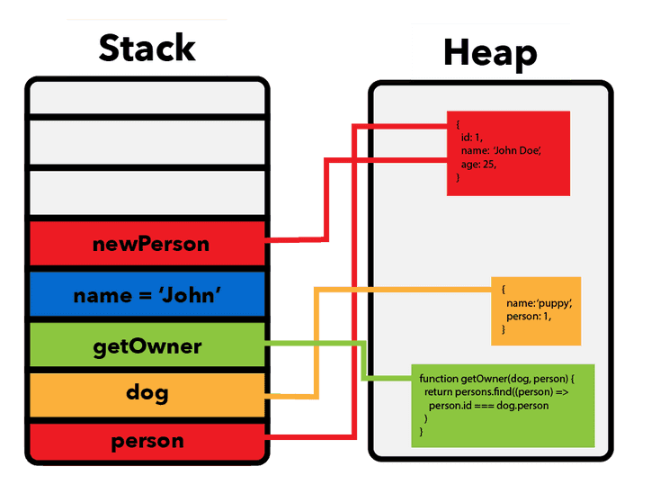

## 数据是什么
- 数据就是信息。
- 数据是程序运行过程中操作的对象。
- 程序的核心任务就是：获取数据、处理数据、输出数据。
- “数据”根据自身特点，可以具有多种形式，如：数字、文本、图像、声音，表格等形式。

## 数据类型是什么
数据类型定义了：

- **数据的种类**：为了表示和操作不同特点的数据，同时为了提升程序的运行性能，会把数据定义为不同类型。
- **数据的大小**：数据类型决定数据的“存储方式”和“行为”，值类型存在栈中，引用类型则是“地址在栈，内容在堆”。
- **数据的操作方式**：计算机程序通过操作数据来工作。程序对不同特点的数据，操作的方式也不同。比如：数字值可以用来计算，文本可以拼接，但不会用于计算。

一门语言支持的类型集也是这门语言最基本的特征。

## 为什么需要数据类型？
为相应变量使用正确的数据类型很重要。因为：

- 避免错误：类型检查能避免把文本误当成数字计算
- 节省内存：不同类型占用空间不同（如 int 占4字节，bool 占1字节）
- 明确操作：不同类型支持的操作不同（字符串可拼接，数字可加减）
- 使代码更加可维护和可读

## C# 中的数据类型的分类

- 值类型：直接保存数据，存储在 **栈内存(stack)** 中。
- 引用类型：保存的是数据的**内存地址**，数据存储在 **堆内存(heap)** 中
- 特殊类型

## 练习

1. 讲出“数据”是什么
2. 讲出“数据类型”定义了什么