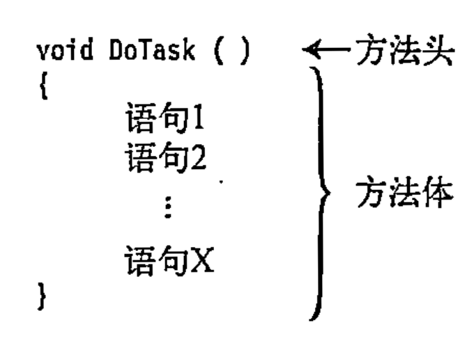

很高兴你开始学习C#！方法是C#的核心组成部分，掌握它们对编程至关重要。下面是一个**清晰的学习路径**和**关键知识点总结**，帮你系统性地掌握C#方法：

---

## **一、方法是什么？**
**方法（Method）** 是一个具有名字的代码块。

>代码块：代码块是使用花括号包裹的指令的集合。代码块是一个由一条或多条语句组成的单元。

---

## 二、方法的特点

1. 名字调用：可使用名字调用代码块。
2. 参数调用: 调用方法时可以传入参数。
3. 重复调用：可重复调用代码块。
4. 特定任务：方法用于执行特定任务。
5. 返回值：方法执行完毕后必须要有返回值。

---

## **三、方法的结构组成**



方法有四大核心组成部分：

```csharp
// 示例方法
public int Add(int a, int b)  // ① 访问修饰符 ② 返回类型 ③ 方法名 ④ 参数列表
{
    return a + b;              // ⑤ 方法体（逻辑代码）
}
```

1. **访问修饰符**（如 `public`, `private`）→ 控制谁可以调用此方法
2. **返回类型**（如 `int`, `void`）→ 定义方法返回的数据类型（无返回用 `void`）
3. **方法名** → 遵循驼峰命名法（如 `CalculateTotal`）
4. **参数列表** → 输入数据的通道（可为空）
5. **方法体** → 包含实际执行的代码

---

## **三、初学者必须掌握的6种方法类型**
### 1. **无参无返回值方法**
```csharp
void SayHello() 
{
    Console.WriteLine("你好，世界！");
}
```

### 2. **带参数的方法**
```csharp
void Greet(string name) 
{
    Console.WriteLine($"你好，{name}！");
}
```

### 3. **带返回值的方法**
```csharp
int Multiply(int x, int y) 
{
    return x * y;
}
```

### 4. **方法重载（Overload）**
> 同名不同参的方法
```csharp
int Add(int a, int b) => a + b;
double Add(double a, double b) => a + b; // 重载：参数类型不同
```

### 5. **可选参数方法**
> 使用默认值简化调用
```csharp
void CreateUser(string name, int age = 18) 
{
    Console.WriteLine($"{name}, 年龄: {age}");
}
// 调用：CreateUser("小明"); // age自动用18
```

### 6. **Lambda表达式（简洁方法）**
> 适用于简单逻辑
```csharp
Func<int, int> square = x => x * x; 
Console.WriteLine(square(5)); // 输出25
```

---

## **四、关键进阶概念**
| **概念**         | **说明**                                                                 | **代码示例**                          |
|------------------|-------------------------------------------------------------------------|---------------------------------------|
| **递归方法**     | 方法调用自身                                                            | `int Factorial(int n) { ... }`        |
| **ref/out参数**  | 按引用传递（修改原值）                                                  | `void Modify(ref int x) { x++; }`     |
| **params参数**   | 传递可变数量参数                                                        | `int Sum(params int[] nums) { ... }`  |
| **扩展方法**     | 为现有类添加新方法（不需继承）                                          | `static class StringExtensions { ... }` |

---

## **五、高效学习路径**
1. **基础阶段**  
   - 练习创建/调用各种参数类型的方法
   - 掌握`return`和`void`的区别
   - 尝试方法重载（同名不同参）

2. **项目实践**  
   ```csharp
   // 实战案例：温度转换器
   static double CelsiusToFahrenheit(double celsius) 
       => (celsius * 9/5) + 32;
   
   static void Main() 
   {
       Console.Write("输入摄氏温度：");
       double c = double.Parse(Console.ReadLine());
       Console.WriteLine($"华氏温度：{CelsiusToFahrenheit(c)}");
   }
   ```

3. **进阶训练**  
   - 实现递归算法（如斐波那契数列）
   - 用`ref`交换两个变量的值
   - 为`string`类创建扩展方法（如`"abc".ReverseString()`）

---

## **六、避坑指南**
- ⚠️ **递归陷阱**：忘记设置终止条件 → 导致栈溢出
- ⚠️ **命名冲突**：避免方法与变量同名
- ⚠️ **参数顺序**：传参时类型/顺序必须匹配
- ⚠️ **Null引用**：调用对象方法前检查是否为`null`

---

## **七、学习资源推荐**
1. **交互式教程**  
   - [Microsoft Learn C#路径](https://learn.microsoft.com/zh-cn/dotnet/csharp/)（官方免费）
   - [Codecademy C#课程](https://www.codecademy.com/learn/learn-c-sharp)（实践导向）

2. **工具推荐**  
   - 使用[LINQPad](https://www.linqpad.net/)快速测试代码片段
   - 在[.NET Fiddle](https://dotnetfiddle.net/)在线编写C#

3. **书籍参考**  
   - 《C#入门经典》 - 适合零基础
   - 《C#本质论》 - 深入理解核心机制

---

> **重要提示**：学习编程的核心原则是 **“写代码 > 看代码”** ！每学一个概念后，立即动手实现以下练习：
> 1. 写方法计算圆的面积（参数：半径）
> 2. 重载该方法使其支持输入直径计算
> 3. 用递归实现阶乘计算（5! = 120）

坚持每天写代码，你会快速掌握C#方法体系。遇到问题随时来问，祝你学习顺利！ 🚀

在 C# 中，`string.Join()` 和 `string.Split()` 是处理字符串的两种核心方法，它们的**本质区别在于操作方向相反**，且调用方式不同是由方法类型（静态 vs 实例）决定的。以下是详细解释：

---

## 一、核心区别对比表
| **特性**         | **string.Join()**                     | **string.Split()**                  |
|------------------|--------------------------------------|-------------------------------------|
| **作用**         | **连接**多个字符串                   | **分割**单个字符串                 |
| **输入**         | 字符串集合 + 分隔符                 | 单个字符串 + 分隔符                |
| **输出**         | 单个合并后的字符串                  | 字符串数组                         |
| **方法类型**     | **静态方法**                         | **实例方法**                       |
| **调用方式**     | `string.Join(分隔符, 数组)`          | `"字符串".Split(分隔符)`           |
| **示例**         | `string.Join("-", ["a","b"])` → `"a-b"` | `"a-b".Split('-')` → `["a","b"]` |

---

## 二、为什么调用方式不同？
### 1. **`string.Join()` 是静态方法**
- **原因**：它需要操作**外部数据**（字符串集合），不依赖于某个具体的字符串实例
- **调用方式**：通过类名 `string` 直接调用
- **典型场景**：合并数组、列表等集合
```csharp
string[] words = {"C#", "is", "awesome"};
string result = string.Join(" ", words);  // 输出："C# is awesome"
```

### 2. **`string.Split()` 是实例方法**
- **原因**：它操作的是**当前字符串自身**的内容
- **调用方式**：在字符串实例（变量或字面量）上调用
- **典型场景**：解析文本数据
```csharp
string text = "apple,banana,cherry";
string[] fruits = text.Split(',');  // 输出：["apple", "banana", "cherry"]
```

### 3. **为什么设计成这样？**
| **方法类型** | **特点**                  | **代表方法**          | **内存示意图**          |
|-------------|--------------------------|----------------------|-----------------------|
| **静态方法** | 不依赖对象状态，处理外部数据 | `Join()`, `Concat()` |  → 处理 |
| **实例方法** | 依赖当前对象的状态         | `Split()`, `Substring()` | `"abc"` → 处理自身内容 |

---

## 三、关键技术细节
### ▶ `string.Join()` 深入用法
```csharp
// 连接不同类型集合（自动调用ToString()）
List<int> numbers = new List<int> {1, 2, 3};
string joined = string.Join("|", numbers);  // "1|2|3"

// 连接对象属性
class Person { 
    public string Name {get; set;} 
}
Person[] people = { new Person{Name="Alice"}, new Person{Name="Bob"} };
string names = string.Join(", ", people.Select(p => p.Name)); // "Alice, Bob"
```

### ▶ `string.Split()` 深入用法
```csharp
// 多分隔符分割
string data = "apple;banana,cherry|date";
char[] delimiters = {';', ',', '|'};
string[] parts = data.Split(delimiters);  // ["apple","banana","cherry","date"]

// 控制分割数量
string text = "one.two.three.four";
string[] result = text.Split('.', 2);  // ["one", "two.three.four"] 

// 移除空条目
string csv = "a,,b,c";
string[] items = csv.Split(',', StringSplitOptions.RemoveEmptyEntries); // ["a","b","c"]
```

---

## 四、如何区分静态方法 vs 实例方法？
| **特征**                | **静态方法**                     | **实例方法**                     |
|-------------------------|----------------------------------|----------------------------------|
| **定义关键字**          | 有 `static` 修饰符               | 无 `static` 修饰符              |
| **依赖对象状态？**      | ❌ 不依赖特定对象                | ✅ 依赖当前对象内容             |
| **调用主体**            | 类名（如 `string.Method()`）     | 对象实例（如 `str.Method()`）   |
| **典型字符串方法**      | `Join()`, `Format()`, `IsNullOrEmpty()` | `Split()`, `Substring()`, `ToUpper()` |

---

## 五、类比理解（生活例子）
| **场景**             | **`Join()` 类比**               | **`Split()` 类比**              |
|----------------------|--------------------------------|--------------------------------|
| **操作**             | 用胶水拼接碎片                 | 用剪刀裁剪纸张                 |
| **输入**             | 碎片 + 胶水                   | 整张纸 + 裁剪线               |
| **输出**             | 完整作品                      | 碎片集合                      |
| **操作者角色**       | **外部工具**（胶水瓶）         | **自身动作**（纸张被剪）      |

---

## 六、最佳实践建议
1. **优先用 `string.Join()` 代替循环拼接**
   ```csharp
   // 错误做法（产生中间垃圾字符串）
   string s = "";
   foreach(var item in list) s += item;

   // 正确做法（高效）
   string s = string.Join("", list);
   ```

2. **分割时指定 `StringSplitOptions`**
   ```csharp
   // 避免空字符串污染结果
   string[] parts = input.Split(new[] {','}, StringSplitOptions.RemoveEmptyEntries);
   ```

3. **处理大文本时用 `StringBuilder` + 索引**
   ```csharp
   // 替代 Split() 避免创建临时数组
   var sb = new StringBuilder();
   int start = 0;
   for(int i=0; i<text.Length; i++){
       if(text[i] == ','){
           sb.Append(text.AsSpan(start, i - start));
           start = i + 1;
       }
   }
   ```

> 💡 **黄金法则**：  
> - 当需要**组合多个元素**时 → 找 `string.Join()`  
> - 当需要**分解单个字符串**时 → 用 `yourString.Split()`

在 C# 中，方法除了静态方法和实例方法外，还有几种重要的分类方式。以下是完整的 C# 方法分类体系，包含每种类型的详细说明和示例：

---

## 一、按方法类型分类（核心分类）
| **类型**         | **关键字** | **调用方式**       | **特点**                     | **示例**                     |
|------------------|------------|--------------------|------------------------------|------------------------------|
| **静态方法**     | `static`   | `类名.方法名()`    | 不依赖对象实例               | `Math.Sqrt(25)`              |
| **实例方法**     | (无)       | `对象.方法名()`    | 操作特定对象的状态           | `"hello".ToUpper()`          |
| **扩展方法**     | `static` + `this` | `对象.方法名()` | 为现有类添加新方法           | `list.Where(x => x > 5)`     |
| **构造方法**     | (无)       | `new 类名()`       | 创建对象时初始化             | `new Person("Alice", 30)`    |
| **终结器方法**   | `~`        | 自动调用           | 对象销毁前执行清理           | `~FileHandler() { ... }`     |

---

## 二、按功能用途分类
| **类型**         | **特点**                     | **典型应用场景**             | **示例**                     |
|------------------|------------------------------|------------------------------|------------------------------|
| **属性访问器**   | 封装字段访问                 | 实现数据验证和逻辑控制       | `public int Age { get; set; }` |
| **索引器方法**   | 使对象支持数组式访问         | 自定义集合类                 | `public T this[int index] { ... }` |
| **运算符重载**   | 重定义运算符行为             | 自定义类型的数学运算         | `public static Vector operator+(Vector a, Vector b)` |
| **异步方法**     | 使用 `async/await` 处理异步  | I/O 操作、网络请求           | `async Task<string> GetDataAsync()` |
| **事件处理方法** | 响应事件触发                 | GUI 编程、观察者模式         | `button.Click += OnButtonClick;` |

---

## 三、特殊方法类型详解

### 1. **扩展方法 (Extension Methods)**
- **特点**：为现有类型添加新方法而无需修改源码
- **定义要求**：
  - 静态类中的静态方法
  - 第一个参数使用 `this` 修饰
```csharp
// 为 string 添加反转方法
public static class StringExtensions
{
    public static string Reverse(this string input)
    {
        char[] chars = input.ToCharArray();
        Array.Reverse(chars);
        return new string(chars);
    }
}

// 使用
string result = "hello".Reverse(); // => "olleh"
```

### 2. **局部方法 (Local Methods)**
- **特点**：方法内定义的方法（C# 7.0+）
- **优势**：封装复杂逻辑，避免外部访问
```csharp
public void ProcessData()
{
    int Calculate(int a, int b) => a * b + 10; // 局部方法
    
    int result = Calculate(3, 5); // 仅在ProcessData内可用
}
```

### 3. **分部方法 (Partial Methods)**
- **特点**：跨多个文件定义方法（常用于代码生成场景）
- **限制**：
  - 必须返回 `void`
  - 隐式为 `private`
```csharp
// File1.cs
partial class DataProcessor
{
    partial void ValidateData(); // 声明
}

// File2.cs
partial class DataProcessor
{
    partial void ValidateData()  // 实现
    {
        Console.WriteLine("Data validated!");
    }
}
```

### 4. **异步方法 (Async Methods)**
- **特点**：使用 `async` 和 `await` 处理异步操作
- **返回类型**：`Task`, `Task<T>` 或 `ValueTask<T>`
```csharp
public async Task<string> DownloadContentAsync(string url)
{
    using HttpClient client = new();
    return await client.GetStringAsync(url);
}
```

### 5. **记录方法 (Record Methods)**
- **特点**：针对记录类型(`record`)的特殊方法
- **核心方法**：
  - `ToString()`：自动生成友好输出
  - `Deconstruct()`：解构方法
```csharp
public record Person(string Name, int Age)
{
    public void Deconstruct(out string name, out int age)
    {
        name = Name;
        age = Age;
    }
}

// 使用
var person = new Person("Alice", 30);
var (name, age) = person; // 解构
```

---

## 四、按参数传递方式分类
| **类型**         | **关键字** | **特点**                     | **示例**                     |
|------------------|------------|------------------------------|------------------------------|
| **值参数方法**   | (无)       | 默认方式，传递值副本         | `void Process(int num)`      |
| **引用参数方法** | `ref`      | 传递引用，修改影响原变量     | `void Swap(ref int a, ref int b)` |
| **输出参数方法** | `out`      | 用于返回多个值               | `bool TryParse(string s, out int result)` |
| **参数数组方法** | `params`   | 接受可变数量参数             | `int Sum(params int[] numbers)` |
| **可选参数方法** | 默认值     | 参数可省略                   | `void Log(string msg, bool isError = false)` |

---

## 五、方法选择最佳实践
1. **优先使用实例方法**：当逻辑与对象状态相关时
2. **使用静态方法**：对于工具类、无状态操作（如 `Math.PI`）
3. **考虑扩展方法**：扩展现有类型功能而不破坏封装
4. **异步方法选择**：
   ```mermaid
   graph LR
   A[需要异步操作?] -->|是| B[返回Task/Task<T>]
   A -->|否| C[同步方法]
   B --> D{需要返回值?}
   D -->|是| E[Task<T>]
   D -->|否| F[Task]
   ```
5. **特殊场景**：
   - 对象初始化 → 构造方法
   - 资源清理 → 终结器
   - 事件处理 → 事件处理方法

---

## 六、完整方法定义模板
```csharp
[访问修饰符] [static/async/virtual等] [返回类型] 方法名(
    [参数类型] 参数名,
    [ref/out/params] [可选参数] ...
)
{
    // 方法体
    [return 值;] // 非void方法需要
}

// 示例：包含多种特性
public static async Task<string> ProcessAsync(
    this string input, 
    ref int counter, 
    bool log = true
)
{
    counter++;
    if(log) Console.WriteLine($"Processing: {input}");
    return await Task.Run(() => input.ToUpper());
}
```

掌握这些方法类型及其适用场景，能帮助你写出更清晰、更高效的 C# 代码。每种方法类型都有其特定用途，理解它们的设计哲学比死记硬背更重要！