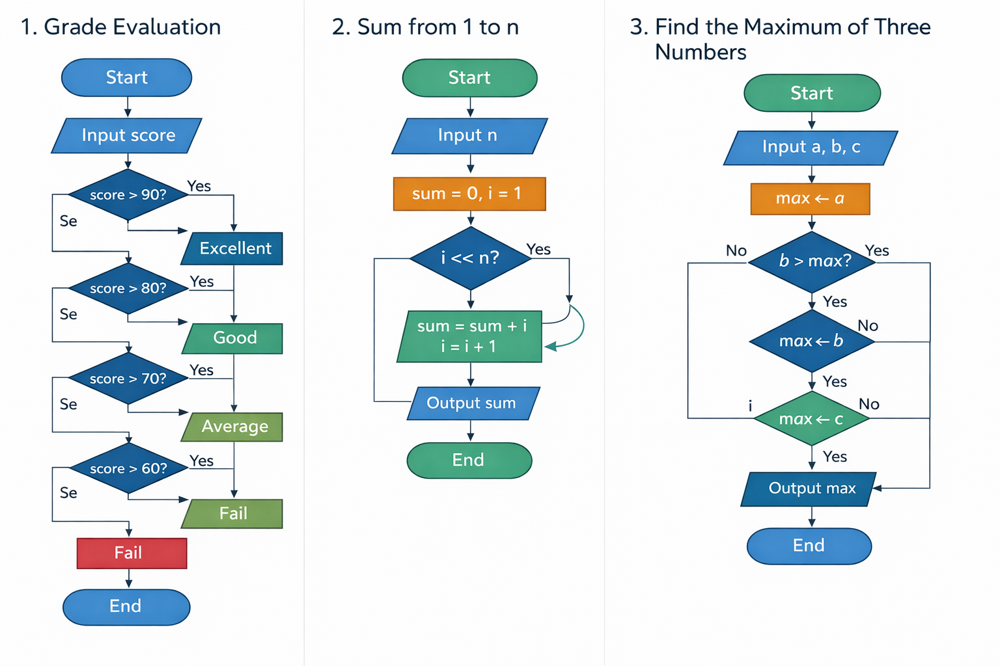

---
# 这部分是关键！侧边栏显示名由这里决定
title: 任务二 流程图设计练习  # 文档标题，若无 sidebar_label 则作为侧边栏名
sidebar_label: 任务二 流程图设计练习  # 显式指定侧边栏显示名（优先级最高）
sidebar_position: 4  # 侧边栏中排在第1位
---

# C#基础流程图练习题（3道）



## 题目一：成绩等级判断

### 流程图逻辑：
```
开始
↓
输入一个成绩score
↓
判断 score >= 90 ?
    ↓是
输出 "优秀"
    ↓否
判断 score >= 80 ?
    ↓是
输出 "良好"
    ↓否  
判断 score >= 70 ?
    ↓是
输出 "中等"
    ↓否
判断 score >= 60 ?
    ↓是
输出 "及格"
    ↓否
输出 "不及格"
↓
结束
```

### C#代码实现任务：
```csharp
using System;

public class Program
{
    public static void Main()
    {
        // 你的代码从这里开始
        Console.Write("请输入成绩：");
        int score = Convert.ToInt32(Console.ReadLine());
        
        // 请根据上面的流程图逻辑，补全下面的判断代码
        
        // 提示：使用 if-else if-else 结构
        // if (score >= 90) {...}
        // else if (score >= 80) {...}
        // ...
        
        // 你的代码到这里结束
    }
}
```

### 任务要求：
1. 根据流程图逻辑补全代码
2. 确保判断顺序正确
3. 测试不同成绩的输出是否正确

---

## 题目二：计算1到n的累加和

### 流程图逻辑：
```
开始
↓
输入正整数 n
↓
sum ← 0, i ← 1
↓
判断 i <= n ?
    ↓是
sum ← sum + i
i ← i + 1
    ↑
    ↓ (返回判断)
    ↓否
输出 sum
↓
结束
```

### C#代码实现任务：
```csharp
using System;

public class Program
{
    public static void Main()
    {
        // 你的代码从这里开始
        Console.Write("请输入一个正整数：");
        int n = Convert.ToInt32(Console.ReadLine());
        
        int sum = 0;
        
        // 请根据上面的流程图逻辑，补全循环代码
        // 提示：使用 for 循环或 while 循环
        
        Console.WriteLine($"1到{n}的累加和是：{sum}");
        // 你的代码到这里结束
    }
}
```

### 任务要求：
1. 使用循环结构实现累加
2. 确保循环从1开始到n结束
3. 验证结果是否正确（公式：n*(n+1)/2）

---

## 题目三：找三个数中的最大值

### 流程图逻辑：
```
开始
↓
输入三个数 a, b, c
↓
max ← a
↓
判断 b > max ?
    ↓是
max ← b
    ↓否
判断 c > max ?
    ↓是
max ← c
    ↓否
输出 max
↓
结束
```

### C#代码实现任务：
```csharp
using System;

public class Program
{
    public static void Main()
    {
        // 你的代码从这里开始
        Console.Write("请输入第一个数：");
        double a = Convert.ToDouble(Console.ReadLine());
        
        Console.Write("请输入第二个数：");
        double b = Convert.ToDouble(Console.ReadLine());
        
        Console.Write("请输入第三个数：");
        double c = Convert.ToDouble(Console.ReadLine());
        
        double max;
        
        // 请根据上面的流程图逻辑，补全判断代码
        // 提示：先假设第一个数最大，然后依次比较
        
        Console.WriteLine($"三个数中的最大值是：{max}");
        // 你的代码到这里结束
    }
}
```

### 任务要求：
1. 按照流程图的分支结构实现
2. 不要使用 Math.Max 函数
3. 测试各种情况（a最大、b最大、c最大）

---

## 扩展思考题（可选）：

### 题目四：判断闰年
流程图逻辑：
```
开始
↓
输入年份 year
↓
判断 year % 4 == 0 ?
    ↓是
判断 year % 100 == 0 ?
    ↓是
判断 year % 400 == 0 ?
    ↓是
输出 "是闰年"
    ↓否
输出 "不是闰年"
    ↓否
输出 "是闰年"
    ↓否
输出 "不是闰年"
↓
结束
```

### C#实现提示：
```csharp
// 闰年规则：
// 1. 能被4整除但不能被100整除
// 2. 或能被400整除
```

---

## 评分标准：
1. **流程图理解**：能正确理解流程图逻辑（30分）
2. **代码转换**：能正确将流程图转为C#代码（40分）
3. **语法正确**：C#语法正确，无编译错误（20分）
4. **测试验证**：能测试多种情况并验证结果（10分）

---

## 参考答案（供教师参考）：

### 题目一参考答案：
```csharp
if (score >= 90)
{
    Console.WriteLine("优秀");
}
else if (score >= 80)
{
    Console.WriteLine("良好");
}
else if (score >= 70)
{
    Console.WriteLine("中等");
}
else if (score >= 60)
{
    Console.WriteLine("及格");
}
else
{
    Console.WriteLine("不及格");
}
```

### 题目二参考答案：
```csharp
// 方法1：for循环
for (int i = 1; i <= n; i++)
{
    sum += i;
}

// 方法2：while循环
int i = 1;
while (i <= n)
{
    sum += i;
    i++;
}
```

### 题目三参考答案：
```csharp
max = a;

if (b > max)
{
    max = b;
}

if (c > max)
{
    max = c;
}
```
