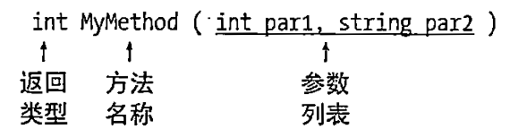

---
# 这部分是关键！侧边栏显示名由这里决定
title: 一、方法是什么  # 文档标题，若无 sidebar_label 则作为侧边栏名
sidebar_label: 一、方法是什么  # 显式指定侧边栏显示名（优先级最高）
sidebar_position:  1  # 侧边栏中排在第1位
---

## 一、方法的由来

案例：求一个整数的平方

```csharp
int a = 5;
int result = a * a;
Console.WriteLine(result);

a = 6;
result = a * a;
Console.WriteLine(result);

a = 7;
result = a * a;
Console.WriteLine(result);
```

没有“方法”的概念，代码可能是这样的流水账。这段代码存在三个问题：

1. 代码逻辑重复: 重复写相同的指令“输入一个数→计算平方→输出”。
2. 维护困难，如果要修改求平方的逻辑或修改输出格式，需要修改多处。
3. 可读性差：代码意图被重复的细节淹没。

代码的方法改造

第一步：方法体

使用花括号把重复的代码包裹起来，形成一个代码块，称之为“方法体”。我们希望方法体可以重复调用。

```csharp
{
    int a = 5;
    int result = a * a;
    Console.WriteLine(result);
}
```

第二步：方法名

为了调用方法体，需要为“方法体”起个名字，我们起名叫Square。这个名字就叫“方法名"。

```csharp
Square{
    int a = 5;
    int result = a * a;
    Console.WriteLine(result);
}
```

第三步：参数

删掉变量a的初始化值5。我们不需要初始化，我们需要每次向方法体内传入不同的值。可以这样做：在方法名Square后面再添加一组小括号,然后把`int a`移动到小括号内，记得去掉分号。小括号里定义的变量叫参数，用于接收外部传入的值。

```csharp
Square(int a){
    int result = a * a;
    Console.WriteLine(result);
}
```

第四步：返回值

所有的方法必须设置返回值，在这里，返回值就是result。所以我们在代码底部，添加一行代码：`return result;`;同时必须在方法名的前面指定返回值的类型是int。 最后可以把`Console.WriteLine(result)`删掉。

```csharp
Square(int a){
    int result = a * a;
    return result;
}
```

第五步：static

```csharp
static void Main(){
    Console.WriteLine(Square(6));
}
```

这是代码会报错：因为Main是一个静态方法，在静态方法内只能调用静态方法，所以修改代码：

```csharp
Static int Square(int a){
    int result = a * a;
    //Console.WriteLine(result);
    return result;
}
```

第六步：调用方法
在方法名`Square()`后面紧跟着写一组小括号，小括号在这里表示”执行“。当调用“方法名和小括号”时就可以执行方法体内的代码：

```csharp
Square()
```

## 二、方法是什么

- 方法的本质是一段封装好的可重复执行的代码块。
- 方法是类的行为载体。
- 方法是绑定了数据的行为。方法定义在类中，与类中的数据（字段 / 属性）绑定，用于描述类的 “行为”。它通过操作类中的数据，实现特定的功能。

## 三、方法的基本语法

### 1.方法的结构
#### 方法头是什么


方法头指定方法的特征。包括：

- 方法是否返回数据，如果返回，返回什么类型；
- 方法的名称；
- 哪种类型的数据可以传递给方法或从方法返回，以及应如何处理这些数据。



示例

```c# linenums="1"
void MyMethod()
{
    Console.WriteLine("First");
    Console.WriteLine("Last");
}
```

#### 方法体

- 方法体是一个语句块。
- 方法体是花括号包裹起来的语句序列。

方法体包含以下项目：

- 局部变量
- 局部函数
- 控制流结构
- 方法调用
- 内嵌的块


### 2.定义方法的语法

```csharp
访问修饰符 特性修饰符 返回值类型 方法名(参数列表)
{
    // 方法体：具体的操作逻辑
    [return 返回值;] 
}
```

示例

```csharp
// 示例：计算两个整数的和
public int Add(int num1, int num2)
{
    int result = num1 + num2;
    return result; // 返回计算结果
}
```
### 3.调用方法的语法

方法定义好后，需要通过对象来调用。就像现实中“学生张三上课”，在代码中就是“张三对象调用AttendClass方法”：

```csharp
// 创建对象
Student zhangSan = new Student();
zhangSan.Name = "张三";

// 调用方法
zhangSan.AttendClass(); // 输出：张三正在认真上课

// 调用带参数的方法
int examScore = zhangSan.TakeExam(100); // 传入100道题
Console.WriteLine($"{zhangSan.Name}的考试分数是：{examScore}");
```

调用方法的语法是“对象名.方法名(参数)”，如果方法有返回值，还可以用变量接收返回的结果。

### 4.访问修饰符
方法的访问修饰符和属性类似，`public`修饰的方法可以在类外部通过对象调用，`private`修饰的方法只能在类内部调用，用来封装内部逻辑。比如我们可以把一些复杂的计算逻辑放在私有方法中，只暴露简单的公共方法给外部使用。


### 5.特性修饰符

### 6.返回值类型

### 7.方法名命名规则
#### 基本语法规则（必须遵守）

这些是编译器会检查的硬性规则，违反会导致编译错误：

1. **不能以数字开头**  
   方法名必须以字母（`a-z`、`A-Z`）或下划线（`_`）开头，后续可以包含字母、数字或下划线。  
   ❌ 错误示例：`123Calculate()`、`3Sum()`  
   ✅ 正确示例：`Calculate123()`、`Sum3()`

2. **不能包含特殊字符**  
   不能使用`@`、`#`、`$`、`%`等特殊符号（下划线`_`除外），也不能包含空格。  
   ❌ 错误示例：`Get-User()`、`Calculate$Total()`  
   ✅ 正确示例：`GetUser()`、`CalculateTotal()`

3. **不能使用C#关键字**  
   不能直接使用`class`、`int`、`void`等C#保留字作为方法名。如果必须使用（极特殊情况），需在关键字前加`@`（不推荐）。  
   ❌ 错误示例：`class()`、`void()`  
   ✅ 特殊情况：`@class()`（不建议使用）


#### 通用命名规范(建议严格遵守)

这些是微软官方推荐（[Framework Design Guidelines](https://learn.microsoft.com/en-us/dotnet/standard/design-guidelines/)）的规则，是C#开发者的共识：

1. **使用帕斯卡命名法（PascalCase）**  
   方法名的每个单词首字母大写，其余字母小写，不使用下划线分隔。这是C#方法命名最核心的规范。  
   ❌ 错误示例：`getuser()`、`Get_user()`、`getUser()`  
   ✅ 正确示例：`GetUser()`、`CalculateTotal()`、`PrintInfo()`

   > 对比：变量/参数使用驼峰命名法（camelCase，首字母小写），而方法名必须用帕斯卡命名法，这是两者的关键区别。

2. **使用动词或动词短语**  
   方法表示“行为”，命名应体现“做什么”，通常以动词开头，清晰描述方法的功能。  
   ❌ 不推荐：`UserInfo()`、`TotalAmount()`（更像属性名）  
   ✅ 推荐：`GetUserInfo()`、`CalculateTotalAmount()`、`SaveData()`、`ValidateInput()`

3. **避免缩写（除非是广为人知的缩写）**  
   尽量使用完整单词，不随意缩写，除非是公认的缩写（如`ID`、`URL`、`API`）。  
   ❌ 不推荐：`GetUsr()`、`CalcTot()`、`UpdData()`  
   ✅ 推荐：`GetUser()`、`CalculateTotal()`、`UpdateData()`、`GetID()`（`ID`是公认缩写）

4. **体现参数和返回值的含义**  
   如果方法有明确的参数或返回值，命名应暗示其用途，让调用者无需查看内部实现就能理解。  
   ❌ 模糊示例：`Process()`、`Handle()`、`DoSomething()`  
   ✅ 清晰示例：  

   - `ProcessOrder(int orderId)`（处理指定ID的订单）  
   - `ConvertToInt(string input)`（将字符串转换为int）  
   - `IsValidEmail(string email)`（返回bool，验证邮箱是否有效）

5. **方法重载的命名**  
   重载方法（同名不同参数）应保持名称一致，通过参数列表区分，名称需能概括所有重载的共同功能。  

   ```csharp
   // 正确：重载方法名称一致，都体现“添加用户”的功能
   public void AddUser(string name) { .. }
   public void AddUser(string name, int age) { .. }
   public void AddUser(User user) { .. }
   ```

#### 特殊场景的命名规范

1. **构造函数**  
   必须与类名完全相同（遵循类名的帕斯卡命名法），无返回值。  

   ```csharp
   public class Student
   {
       // 构造函数：与类名一致
       public Student(string name) { .. }
   }
   ```

2. **异步方法**  
   异步方法（返回`Task`或`Task<T>`）需在末尾添加`Async`后缀，明确表示这是异步操作。  
   ❌ 不推荐：`GetData()`（异步方法）  
   ✅ 推荐：`GetDataAsync()`  

   ```csharp
   public async Task<string> GetDataAsync()
   {
       // 异步逻辑
   }
   ```

3. **事件相关方法**  
   触发事件的方法通常以`On`开头，后跟事件名（如`OnClick`、`OnDataReceived`）。  

   ```csharp
   protected virtual void OnUserLoggedIn(EventArgs e)
   {
       UserLoggedIn?.Invoke(this, e); // 触发事件
   }
   ```

4. **布尔返回值的方法**  
   返回`bool`的方法通常以`Is`、`Has`、`Can`等前缀开头，明确表示“是否/有无/能否”。  
   ✅ 示例：`IsEmpty()`、`HasPermission()`、`CanExecute()`、`ContainsKey()`


小结

C#方法命名的关键规则可归纳为：  

1. 语法上：字母/下划线开头，无特殊字符，不使用关键字。  
2. 格式上：严格使用帕斯卡命名法（每个单词首字母大写）。  
3. 语义上：用动词短语，清晰描述功能，避免缩写，体现参数和返回值含义。  

遵循这些规则，能让你的代码更符合C#社区的习惯，便于团队协作和后续维护。记住：**好的命名是写给“人”看的，不是给编译器看的**。
### 8.参数列表


### 9.返回值


## 四、定义方法的位置

静态方法既可以定义在`Program`类中，也可以定义在自定义类中，具体取决于你的代码设计需求：

1.如果是**临时的、仅在入口附近使用**的简单方法，放在`Program`类中更简洁。

```csharp
class Program
{
    static void Main(string[] args)
    {
        int num = 5;
        int square = Square(num); // 直接调用同类型中的静态方法
    }

    // 定义在Program类中
    static int Square(int a)
    {
        return a * a;
    }
}
```


2. 定义在自定义类中（更符合面向对象设计）

如果是**可复用的功能**（比如多个地方需要计算平方），放在**自定义类**中更符合“封装”思想，也让代码结构更清晰（遵循“单一职责原则”：一个类专注于一类功能）。方便复用和管理：

```csharp
// 自定义工具类
class MathHelper
{
    // 定义在自定义类中
    public static int Square(int a)
    {
        return a * a;
    }
}

class Program
{
    static void Main(string[] args)
    {
        int num = 5;
        // 通过类名调用自定义类中的静态方法
        int square = MathHelper.Square(num); 
    }
}
```
## 五、理解方法

### 1.方法是重复调用的代码块

方法是**一段可以被重复调用的代码块**，

来一个简单的例子：

```csharp
static void SayHello()
{
    Console.WriteLine("你好，欢迎学习C#！");
}
```


### 2.方法是操作数据的行为

为什么要和数据绑定？因为现实世界中，“行为” 总是属于某个 “事物” 的。比如：

“计算面积” 这个行为，属于 “圆”（需要圆的半径数据）
“考试得分” 这个行为，属于 “学生”（需要学生的答题情况数据）

在 C# 中，方法作为类的成员，天然可以访问类中的数据，实现 “数据 + 行为” 的封装：

```csharp
class Circle {
    public double Radius;  // 数据（半径）
    
    // 方法（行为）：计算面积（直接使用类中的Radius数据）
    public double CalculateArea() {
        return 3.14 * Radius * Radius;
    }
}
```

## 六、示例

我们来给“学生类”添加几个成员方法：

```csharp
class Student
{
    // 属性：存储数据
    public string Name { get; set; }
    public int Score { get; set; }

    // 成员方法：上课
    public void AttendClass()
    {
        Console.WriteLine($"{Name}正在认真上课");
    }

    // 成员方法：考试（带参数和返回值）
    public int TakeExam(int questionsCount)
    {
        // 模拟考试得分：做对80%的题目
        int score = (int)(questionsCount * 0.8);
        Score = score; // 操作类中的属性
        return score; // 返回考试分数
    }
}
```

在这个例子中，`AttendClass`和`TakeExam`都是Student类的成员方法。它们都定义在类的内部，能够直接访问类中的属性。


