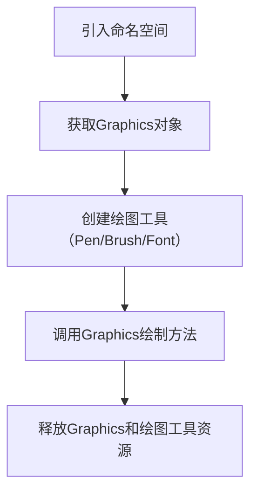

---
# 这部分是关键！侧边栏显示名由这里决定
title: 任务一 图形设计基础   # 文档标题，若无 sidebar_label 则作为侧边栏名
sidebar_label: 任务一 图形设计基础   # 显式指定侧边栏显示名（优先级最高）
sidebar_position:  1  # 侧边栏中排在第1位
---


## 说明
- GDI+是C#中用于2D图形绘制的核心技术，主要应用于`WinForm/WPF`（WinForm更常用）；
- 所有示例基于WinForm项目（需创建Windows Forms App模板），核心代码可直接在`Form_Paint`事件中运行。

---

## 1. GDI 是什么
| 项         | 说明                                                                 |
|------------|----------------------------------------------------------------------|
| **全称**   | Graphics Device Interface（图形设备接口）|
| **定位**   | Windows系统底层的图形绘制接口，C#早期版本（.NET 1.x）基于GDI封装图形操作 |
| **核心特点** | 1. 面向过程的底层接口，功能有限；<br />2. 仅支持简单2D图形，无抗锯齿；<br />3. 性能一般，现已被GDI+替代 |
| **适用场景** | 仅兼容老旧Windows程序，现代C#开发几乎不用                             |

## 2. GDI+ 是什么
| 项         | 说明                                                                 |
|------------|----------------------------------------------------------------------|
| **全称**   | GDI+ (Graphics Device Interface Plus)                               |
| **定位**   | GDI的升级版，.NET Framework/.NET Core中封装的2D图形绘制类库           |
| **核心特点** | 1. 面向对象封装，API更易用；<br />2. 支持抗锯齿、渐变、透明、图像缩放等高级功能；<br />3. 兼容所有Windows系统，是WinForm图形绘制的核心；<br />4. 仅支持2D图形，不支持3D |
| **适用场景** | WinForm界面绘制、报表/图表生成、图片处理、打印预览等                 |

## 3. Graphics类是什么
| 项         | 说明                                                                 |
|------------|----------------------------------------------------------------------|
| **定位**   | GDI+的核心类，相当于“画布”，所有2D图形绘制操作都通过该类完成           |
| **核心作用** | 1. 提供绘制直线、矩形、文本、图像等方法；<br />2. 管理绘图上下文（如画布大小、分辨率、抗锯齿）；<br />3. 关联具体的绘制目标（窗体、控件、图片、打印机） |
| **关键特性** | 1. 实例类，需通过特定方式获取（不能直接new）；<br />2. 使用后需手动释放资源（`Dispose()`）；<br />3. 支持绘图状态保存/恢复（`Save()`/`Restore()`） |

## 4. 如何使用Graphics
### 核心步骤（固定流程）


### 基础示例（WinForm中绘制直线）
```csharp
// 步骤1：引入命名空间
using System.Drawing;
using System.Windows.Forms;

// 步骤2：在Form的Paint事件中绘制（Paint事件会自动传入Graphics对象）
private void Form1_Paint(object sender, PaintEventArgs e)
{
    // 步骤3：获取Graphics对象（从PaintEventArgs）
    Graphics g = e.Graphics;
    // 步骤4：创建Pen（画笔）
    Pen pen = new Pen(Color.Red, 2);
    // 步骤5：绘制直线
    g.DrawLine(pen, 10, 10, 200, 10);
    // 步骤6：释放资源
    pen.Dispose();
    // Graphics由Paint事件自动释放，无需手动Dispose
}
```

## 5. 获取Graphics对象的三种方法
| 方法 | 语法 | 适用场景 | 注意事项 |
|------|------|----------|----------|
| **从控件/窗体的Paint事件获取** | `private void Form1_Paint(object sender, PaintEventArgs e) { Graphics g = e.Graphics; }` | 窗体/控件的实时绘制（推荐） | 无需手动释放，由系统管理 |
| **通过Control.CreateGraphics()获取** | `Graphics g = this.CreateGraphics();` | 临时绘制（如按钮点击后绘制） | 绘制内容会被窗体刷新覆盖，需手动`g.Dispose()` |
| **从Image/Bitmap创建** | `Bitmap bmp = new Bitmap(200, 200); Graphics g = Graphics.FromImage(bmp);` | 绘制到图片文件（如生成验证码、水印） | 必须手动`g.Dispose()`，否则内存泄漏 |

### 代码示例（三种获取方式）
```csharp
// 方式1：Paint事件（推荐）
private void Form1_Paint(object sender, PaintEventArgs e)
{
    Graphics g1 = e.Graphics;
    g1.DrawString("Paint事件获取", new Font("宋体", 12), Brushes.Black, 10, 10);
}

// 方式2：CreateGraphics（按钮点击事件）
private void btnDraw_Click(object sender, EventArgs e)
{
    Graphics g2 = this.CreateGraphics();
    Pen pen = new Pen(Color.Blue);
    g2.DrawRectangle(pen, 10, 40, 100, 50);
    // 释放资源
    pen.Dispose();
    g2.Dispose();
}

// 方式3：FromImage（绘制到图片）
private void CreateImage()
{
    Bitmap bmp = new Bitmap(200, 100);
    Graphics g3 = Graphics.FromImage(bmp);
    // 填充背景
    g3.FillRectangle(Brushes.White, 0, 0, 200, 100);
    // 绘制文本
    g3.DrawString("绘制到图片", new Font("微软雅黑", 14), Brushes.Red, 20, 30);
    // 保存图片
    bmp.Save("test.png");
    // 释放资源
    g3.Dispose();
    bmp.Dispose();
}
```

## 6. 相关的命名空间
| 命名空间 | 核心作用 | 包含的关键类 |
|----------|----------|--------------|
| `System.Drawing` | 核心命名空间，包含所有基础绘图类 | Graphics、Pen、Brush、Font、Color、Bitmap、Image |
| `System.Drawing.Drawing2D` | 高级2D绘图功能 | LinearGradientBrush（渐变画刷）、Matrix（坐标变换）、PathGradientBrush |
| `System.Drawing.Imaging` | 图像处理相关 | ImageFormat（图片格式）、ImageAttributes（图片属性） |
| `System.Drawing.Text` | 字体/文本相关 | PrivateFontCollection（自定义字体） |

### 引用说明
- WinForm项目默认引用`System.Drawing`程序集；
- 非WinForm项目（如Console）需手动添加`System.Drawing.Common` NuGet包（.NET Core/.NET 5+）。

## 7. Graphics类的常用方法
| 方法分类 | 方法名 | 用途 |
|----------|--------|------|
| **基础图形绘制** | `DrawLine(Pen, x1, y1, x2, y2)` | 绘制直线 |
| | `DrawRectangle(Pen, x, y, width, height)` | 绘制矩形边框 |
| | `DrawEllipse(Pen, x, y, width, height)` | 绘制椭圆边框 |
| | `DrawArc(Pen, x, y, width, height, startAngle, sweepAngle)` | 绘制圆弧 |
| | `DrawPie(Pen, x, y, width, height, startAngle, sweepAngle)` | 绘制扇形边框 |
| | `DrawPolygon(Pen, Point[] points)` | 绘制多边形边框 |
| **填充图形** | `FillRectangle(Brush, x, y, width, height)` | 填充矩形 |
| | `FillEllipse(Brush, x, y, width, height)` | 填充椭圆 |
| | `FillPie(Brush, x, y, width, height, startAngle, sweepAngle)` | 填充扇形 |
| | `FillPolygon(Brush, Point[] points)` | 填充多边形 |
| **文本/图像** | `DrawString(string, Font, Brush, x, y)` | 绘制文本 |
| | `DrawImage(Image, x, y)` | 绘制图像 |
| **状态管理** | `Save()` | 保存当前绘图状态 |
| | `Restore()` | 恢复保存的绘图状态 |
| | `SetSmoothingMode(SmoothingMode.AntiAlias)` | 设置抗锯齿 |


## 16. Font类的用途
| 项         | 说明                                                                 |
|------------|----------------------------------------------------------------------|
| **核心用途** | 定义绘制文本的字体样式（字体名称、大小、样式），是绘制文本的必备参数   |
| **核心属性** | 1. `Name`：字体名称（如“宋体”、“微软雅黑”）；<br />2. `Size`：字体大小（像素/磅）；<br />3. `Style`：字体样式（Regular/粗体Bold/斜体Italic/下划线Underline等）；<br />4. `Unit`：尺寸单位（默认Point，磅） |
| **创建语法** | `Font font = new Font("微软雅黑", 12);`（默认常规样式）<br />`Font font = new Font("宋体", 14, FontStyle.Bold | FontStyle.Italic);`（粗体+斜体） |
| **资源释放** | 使用后需调用`font.Dispose()`释放资源 |

## 17. 如何绘制文本
| 项         | 说明                                                                 |
|------------|----------------------------------------------------------------------|
| **核心方法** | `Graphics.DrawString(string text, Font font, Brush brush, float x, float y)` |
| **参数说明** | - text：要绘制的文本；<br />- font：字体样式；<br />- brush：文本填充画刷；<br />- x/y：文本左上角坐标 |

### 代码示例
```csharp
private void Form1_Paint(object sender, PaintEventArgs e)
{
    Graphics g = e.Graphics;
    // 抗锯齿（让文字更清晰）
    g.TextRenderingHint = System.Drawing.Text.TextRenderingHint.AntiAlias;

    // 1. 常规文本
    Font font1 = new Font("宋体", 12);
    SolidBrush brush1 = new SolidBrush(Color.Black);
    g.DrawString("常规文本：Hello C# GDI+", font1, brush1, 20, 20);

    // 2. 粗体+斜体文本
    Font font2 = new Font("微软雅黑", 14, FontStyle.Bold | FontStyle.Italic);
    SolidBrush brush2 = new SolidBrush(Color.Red);
    g.DrawString("粗体+斜体文本", font2, brush2, 20, 50);

    // 3. 下划线文本
    Font font3 = new Font("Arial", 16, FontStyle.Underline);
    SolidBrush brush3 = new SolidBrush(Color.Blue);
    g.DrawString("Underline Text", font3, brush3, 20, 80);

    // 释放资源
    font1.Dispose();
    font2.Dispose();
    font3.Dispose();
    brush1.Dispose();
    brush2.Dispose();
    brush3.Dispose();
}
```

## 18. 如何绘制图像
| 项         | 说明                                                                 |
|------------|----------------------------------------------------------------------|
| **核心方法** | 1. `Graphics.DrawImage(Image image, float x, float y)`（原尺寸绘制）；<br />2. `Graphics.DrawImage(Image image, float x, float y, float width, float height)`（缩放绘制） |
| **参数说明** | - image：要绘制的图像（Bitmap/Image对象）；<br />- x/y：图像左上角坐标；<br />- width/height：缩放后的宽/高 |

### 代码示例
```csharp
private void Form1_Paint(object sender, PaintEventArgs e)
{
    Graphics g = e.Graphics;
    g.SmoothingMode = System.Drawing.Drawing2D.SmoothingMode.AntiAlias;

    // 1. 加载图片（替换为你的图片路径）
    string imgPath = "test.png";
    if (File.Exists(imgPath))
    {
        Image img = Image.FromFile(imgPath);
        
        // 2. 原尺寸绘制
        g.DrawImage(img, 20, 20);
        
        // 3. 缩放绘制（宽高减半）
        g.DrawImage(img, 200, 20, img.Width / 2, img.Height / 2);
        
        // 释放资源
        img.Dispose();
    }
    else
    {
        // 图片不存在时绘制提示文本
        g.DrawString("图片不存在", new Font("宋体", 12), Brushes.Red, 20, 20);
    }
}
```

---

### 总结（核心关键点）
1. **核心流程**：GDI+绘图 = 获取Graphics对象 + 创建Pen/Brush/Font工具 + 调用绘制方法 + 释放资源；
2. **资源管理**：Pen/Brush/Font/Image/Graphics（除Paint事件外）必须手动Dispose，避免内存泄漏；
3. **抗锯齿**：设置`g.SmoothingMode = SmoothingMode.AntiAlias`让图形更平滑，`g.TextRenderingHint = AntiAlias`让文字更清晰；
4. **坐标规则**：GDI+坐标原点在左上角，x向右递增，y向下递增；
5. **工具分工**：Pen绘轮廓、Brush填区域、Font定文字样式，三者配合完成绘图。


## **本章内容**

1. 图形操作基础：GDI和GDI+
2. 绘图工具：Graphics类
3. 处理字体和图像：Font类和Image类

### **1.GDI是什么**

- Graphic Device Interface 图形设备接口

  - 接口：GDI提供了一个统一的、标准化的编程接口。

  用途：在窗体上绘制矢量图形和文字，处理像素图。

- GDI是传统的、过去的、第一代的图形设备接口。

### **2.GDI+是什么**

GDI+现代的增强版图形设备接口。主要由二维矢量图形、图像处理和版式三部分组成。

### **3. Graphics类是什么**

定义：Graphics用于绘图。Graphics类代表一个块画布，画布提供了各种绘图工具。

- GDI+ 的核心类，封装了绘制直线、曲线、图形、图像和文本的方法。
- 不能直接实例化，必须通过特定方法获取其对象。
- 代表一个画布，与特定的设备上下文关联。

### **4.如何使用Graphics**

答：一句话：通过获取它的实例，调用其方法，在“画布”（如窗体、位图）上绘制图形。

**绘图的基本步骤**

- 创建 Graphics 对象。
- 创建绘图工具（画笔、画刷等）。
- 使用 Graphics 类的方法进行绘制。
- 清空 Graphics 对象。
- 释放资源。

### **5.获取Graphics对象的三种方法**

方法1：通过窗体的事件获取（最常用、最推荐）

在Paint事件中获取这是最标准的方式，用于绘制持久的、需要重绘的图形。

```
//创建了一个画布（画布自带各种绘画工具：钢笔、笔刷、颜色、填充颜色的工具）
private void Form1_Paint(object sender, PaintEventArgs e)
{
    // 从事件参数中获取Graphics对象
    Graphics g = e.Graphics;
}
```

方法2：通过窗体的方法获取

为控件创建Graphics对象（临时绘制），用于响应事件（如按钮点击）时的临时绘制，但绘制内容在窗体重绘后会消失。

```
private void Button1_Click(object sender, EventArgs e)
{
    // 为窗体创建Graphics对象
    Graphics g = this.CreateGraphics()
}
```

方式3：通过Graphics类的方法获取

用途：在位图上绘图

```
private void DrawOnBitmap()
{
    // 创建一个与窗体同样大小的位图
    Bitmap bmp = new Bitmap(this.Width, this.Height);
    // 获取位图的Graphics对象
    Graphics g = Graphics.FromImage(bmp)
}
```

### **6.相关的命名空间**

- `System.Drawing`：提供 GDI+ 基本图形功能（Graphics, Pen, Brush, Font 等）。
- `System.Drawing.Drawing2D`：提供高级二维和矢量图形功能（渐变画刷、矩阵等）。
- `System.Drawing.Imaging`：提供高级图像处理功能。
- `System.Drawing.Text`：提供高级字体和文本排版功能。

### **7.Graphics 类的常用方法有哪些**

- **绘制图形**：`DrawLine`, `DrawRectangle`, `DrawEllipse`, `DrawArc`, `DrawPie`, `DrawPolygon`。
- **填充图形**：`FillRectangle`, `FillEllipse`, `FillPie`, `FillPolygon`。
- **绘制文本**：`DrawString`。
- **绘制图像**：`DrawImage`。
- **其他**：`Clear`（清除画布）, `Dispose`（释放资源）。

### **8.画笔 (Pen 类)的用途是什么**

- 用于绘制线条和图形轮廓。
- 可以设置颜色和宽度。
- 可以使用 `Color.FromArgb` 方法创建自定义颜色。

### **9. 画刷 (Brush 类)的用途是什么**

- 用于填充图形的内部。
- 是一个抽象基类，需使用其派生类：
  - `SolidBrush`：单色画刷。
  - `HatchBrush`：图案画刷（位于 `System.Drawing.Drawing2D` 命名空间）。
  - `LinearGradientBrush`：线性渐变画刷（位于 `System.Drawing.Drawing2D` 命名空间）。

### **10.如何绘制直线**

- 方法：`DrawLine`。
- 参数：可以使用两个 `Point` 结构，或直接使用四个坐标值 (x1, y1, x2, y2)。

### **11. 如何绘制矩形**

- 方法：`DrawRectangle`。
- 参数：指定左上角坐标、宽度和高度。

### **12. 如何绘制椭圆**

- 方法：`DrawEllipse`。
- 参数：指定外接矩形的左上角坐标、宽度和高度。宽高相等时即为圆。

### **13. 如何绘制圆弧**

- 方法：`DrawArc`。
- 参数：指定一个边界矩形、起始角度和扫过的角度。

### **14. 如何绘制扇形**

- 方法：`DrawPie`。
- 参数：与 `DrawArc` 类似，指定边界矩形、起始角度和扫过的角度。

### **15. 如何绘制多边形**

- 方法：`DrawPolygon`。
- 参数：一个 `Point` 结构数组，表示多边形的各个顶点。

### **16. Font类的用途是什么**

- 用于定义文本的格式，包括字体、字号和样式。
- 样式 (`FontStyle`)：Regular（普通）、Bold（加粗）、Italic（斜体）、Underline（下划线）等。

### **17.如何绘制文本**

- 方法：`DrawString`。
- 参数：需要绘制的字符串、Font 对象、Brush 对象、起始坐标。

### **18. 如何绘制图像**

- 方法：`DrawImage`。
- 参数：Image 对象、坐标，或坐标加指定大小。