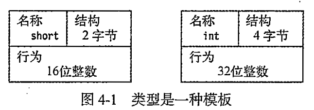
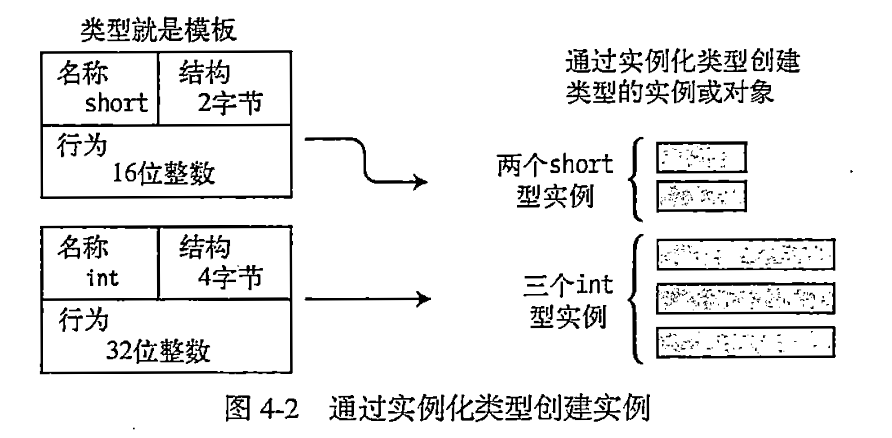
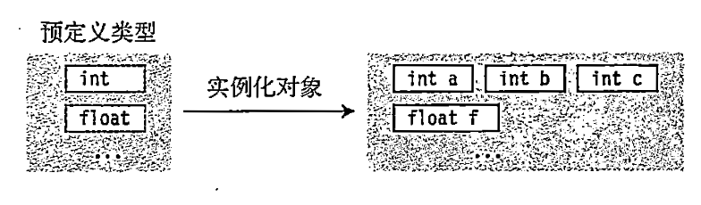
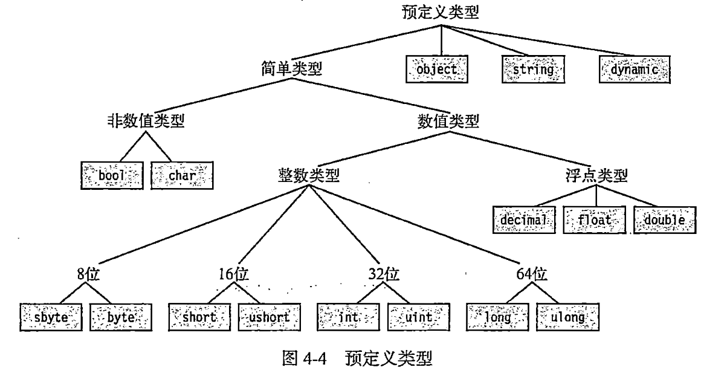
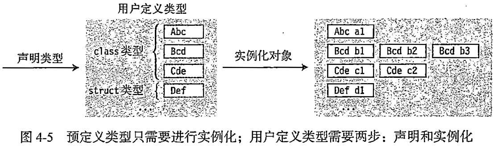
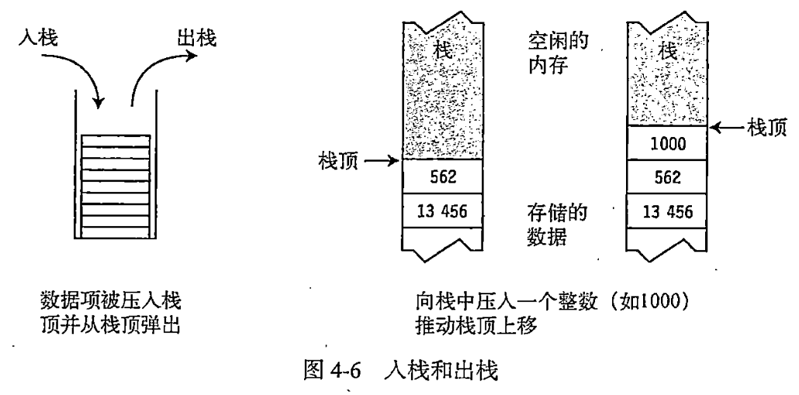

今日作业

1. 阅读《C#图解教程》第4章 类型、存储和变量
2. 回答1-20题，答案写在笔记本或简书(www.jianshu.com)上。

## 1.谈一谈C#程序的结构特征

## 2.请写出C#程序的语法结构

## 3.类型是什么

## 4.实例化类型是什么

## 5.类型的实例是什么

## 7.成员是什么

## 8.成员分为哪两类

## 9.数据成员是什么

## 10.函数成员是什么

## 11.预定义类型是什么

## 12.C#预定义了多少种类型

## 13.用户定义类型是什么

## 14.用户定义类型分为几类

## 15.如何创建用户定义类型

## 16.使用用户定义类型的步骤

## 17.为什么要理解栈和堆


## 18.栈是什么

## 19.栈存储什么数据

## 20.栈的特征是什么

## 参考答案

1.谈一谈C#程序的结构特征

- C#程序是一组类型声明。（学习C#的过程就是学习如何创建和使用类型的过程）
- 在这组类型声明中必须有一个包含Main()方法的类。
- C#使用命名空间将相关的类型声明分组并命名。

2.请写出C#程序的语法结构

```c# linenums="1"
namespace MyProgram
{
    DeclarationOfTypeA
    DeclarationOfTypeB
    class C
    {
        static void Main()
        {
            ...
        }
    }
}

```
3.类型是什么


- 类型是一种创建数据结构模板。
- 类型由下面的元素定义
    - 名称
    - 用于保存数据成员的数据结构
    - 一些行为和约束条件

示例:short类型和int类型的组成元素




4.实例化类型是什么


实例化类型指从某个类型模板创建实际对象的过程。

5.类型的实例是什么

通过实例化类型创建的对象被称为类型的实例或类型的对象。



6.类型分为哪几类

- 存储一个数据项
- 存储多个同类型数据项
- 存储多个不同类型数据项

7.成员是什么

在存储多个不同类型的数据项的类型中，每个数据项个体称为“成员”。

8.成员分为哪两类

成员分为两种：

- 数据成员
- 函数成员

9.数据成员是什么

数据成员保存了与这个类的对象或整个类相关的数据。

示例

```c# linenums="1"
DataMember1
DataMember2
```

10.函数成员是什么

函数成员定义类型的行为。（执行代码）

示例

```c# linenums="1"
F1()
{
    ExecutableCode
}
F2()
{
    ExecutableCode
}
```

11.预定义类型是什么

在 C# 中，**预定义类型（Predefined Types）** 是语言提前内置的基础数据类型，无需声明，简单的实例化对象即可直接使用。



12.C#预定义了多少种类型

C#预定义了16种类型。包括：

13种简单类型：

- 11种数值类型:sbyte、byte、short、ushort、int、uint、long、ulong、float、double、decimal
- 2种非数值类型:bool、char

3种非简单类型：

- string: Unicode字符数组
- object: 所有其他类型的基类
- dynamic: 使用动态语言编写的程序集时使用



13.用户定义类型是什么


用户定义类型指由用户自己创建的类型。

14.用户定义类型分为几类


- 类类型(class)
- 结构类型(struct)
- 数组类型(array)
- 枚举类型(enum)
- 委托类型(delegate)
- 接口类型(interface)

15.如何创建用户定义类型

创建用户定义类型需要包含以下信息：

1. 类型种类
2. 类型名称
3. 声明类型成员（array和delegate类型除外)

16.使用用户定义类型的步骤


1. 先声明类型
2. 实例化类型的对象



17.为什么要理解栈和堆

程序运行时，数据必须存储在内存中。一个数据项需如何存储、要多大内存、存储在什么地方，都依赖于该数据项的类型。运行中的程序使用两个内存区域存储数据：栈和堆。

18.栈是什么

- 栈是一个内存数组。
- 栈是一个LIFO(Last-In First-Out，后进先出)的数据结构。
- 作为程序员，理解栈的工作原理即可，不需对栈做任何操作。

19.栈存储什么数据

- 某些变量的值
- 程序当前的执行环境
- 传递给方法的参数

20.栈的特征是什么

- 数据只能从栈的顶端插入和删除
- 把数据放到栈顶称为入栈(push)
- 从栈顶删除数据称为出栈(pop)



