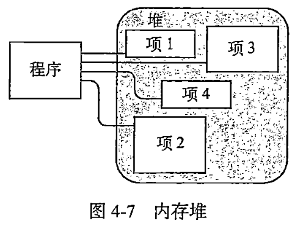
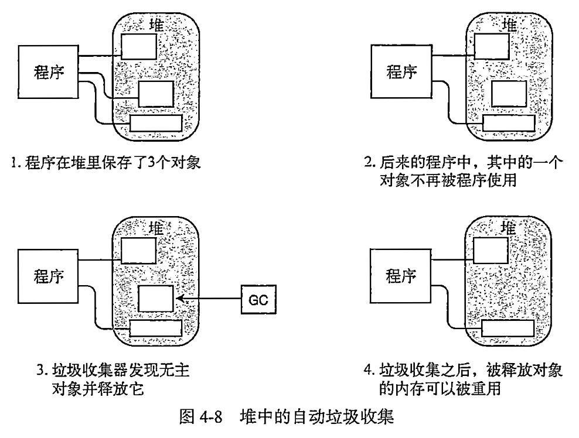
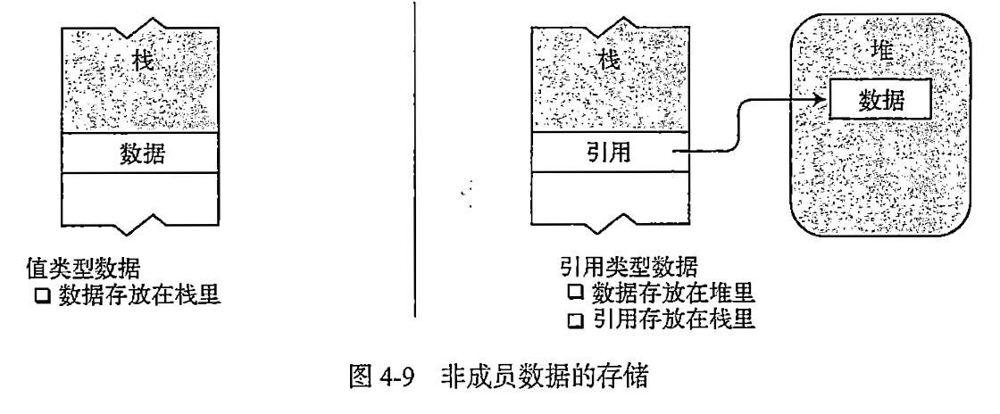
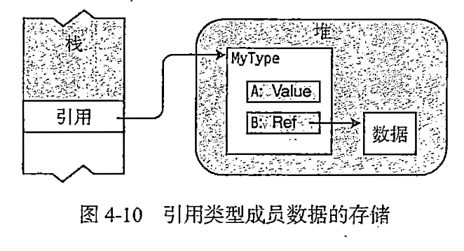
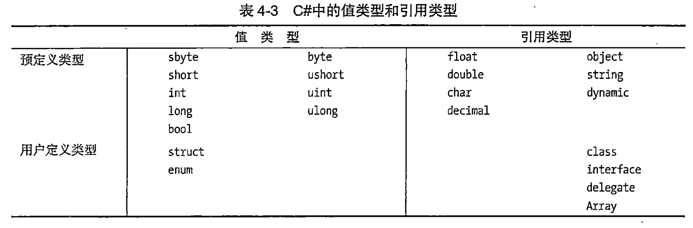
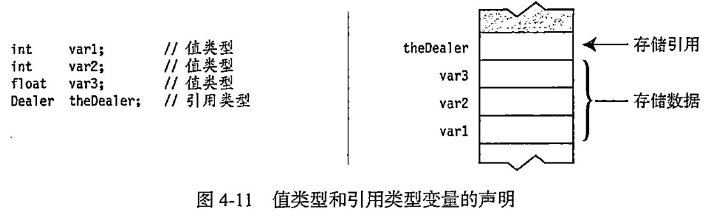
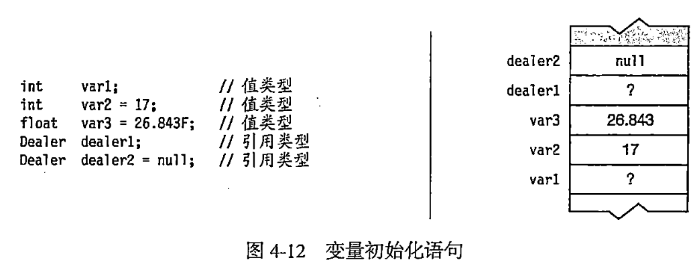

今日作业

1. 阅读《C#图解教程》第4章 类型、存储和变量
2. 回答21-38题，答案写在笔记本或简书(www.jianshu.com)上。

## 21.堆是什么

## 22.堆的垃圾收集过程依赖什么

## 23.类型与内存的关系是什么

## 24.按内存存储方式类型分几类

## 25.如何存储引用类型对象的成员

## 26.谈一谈你对C#类型分类的认识

## 27.变量是什么

## 28.C#提供了几种变量

## 29.变量声明是什么

## 30.变量声明的过程是什么

## 31.变量声明的语法是什么

## 32.变量声明的存储过程是什么

## 33.变量初始化是什么

## 34.哪些变量会自动初始化

## 35.多变量声明的语法是什么

## 36.如何使用变量的值

## 37.静态类型是什么

## 38.dynamic关键字的作用是什么

## 参考答案

21.堆是什么

- 堆是一块内存区域。
- 堆可以分配大块的内存用于存储某种类型的数据对象。
- 堆里的内存能够以任意顺序存入和移除。



22.堆的垃圾收集过程依赖什么


程序可以在堆里保存数据，但并不能显式的删除它们。CLR的自动垃圾收集器在判断出程序的代码将不会再访问某项数据时，会自动清除无主的堆对象。程序员无需操心。


23.类型与内存的关系是什么


- 数据项的类型定义了存储数据需要的内存大小及组成该类型的数据成员。
- 类型决定了对象在内存中的存储位置——栈或堆。

24.按内存存储方式类型分几类

类型被分为两种：

- 值类型：只需要一段单独的内存栈，用于存储实际数据。
- 引用类型：需要两段内存，第一段在堆中存储实际的数据。第二段在栈中存储一个引用，指向数据在堆中的存放位置。



25.如何存储引用类型对象的成员


对于引用类型的任何对象，它所有的数据成员都存放在堆里，无论它们是值类型还是引用类型。



示例

>假设由一个引用类型的实例，名为MyType，它由两个成员：一个值类型成员，一个引用类型成员。它将如何存储呢？

思考

是否值类型的成员存储在栈里，而引用类型的成员在栈和堆之间分成两半呢？

解释

答案是否定的。请记住，对于一个引用类型，其实例的数据部分始终存放在堆里。既然两个成员都是对象数据的一部分，那么它们都会被存放在堆里，无论它们是值类型还是引用类型。

- 尽管成员A是值类型，但它也是MyType实例数据的一部分，因此和对象的数据一起被存放在堆里。
- 成员B是引用类型，所以它的数据部分会始终存放在堆里，不同的是，它的引用部分也被存放在堆里，封装在MyType对象的数据部分。

26.谈一谈你对C#类型分类的认识




27.变量是什么

变量是一个名称，表示程序执行时存储在内存中的数据。

28.C#提供了几种变量

- 局部变量
- 字段
- 参数
- 数组元素

29.变量声明是什么

- 变量在使用前必须声明。
- 变量声明就是定义变量。

30.变量声明的过程是什么

- 给变量命名，并为它关联一种类型
- 让编译器为变量分配一块内存

31.变量声明的语法是什么

一个简单的变量声明至少需要一个类型和一个名称。

示例：声明一个名为var2的int类型的变量

```c# linenums="1"
int var2;
```

32.变量声明的存储过程是什么

变量声明按照声明的先后顺序存储在内存栈中。



33.变量初始化是什么

变量声明除了声明变量的名称和类型以外，声明还能把它的内存初始化为一个明确的值。

变量初始化是由一个等号后面跟一个初始值组成。

示例

int var2 = 17;

无初始化的局部变量由一个未定义的值，在赋值之前不能使用。试图使用未定义的局部变量会导致编译器产生一条错误信息。




34.哪些变量会自动初始化


|变量类型|存储位置|自动初始化|用途|
|--|--|--|--|
|局部变量|栈或栈和堆|否|用于函数成员内部的局部计算|
|类字段|堆|是|类的成员|
|结构字段|栈或堆|是|结构的成员|
|参数|栈|否|用于把值传入或传出方法|
|数组元素|堆|是|数组的成员|


35.多变量声明的语法是什么

可以在单个声明语句中声明多个变量。

- 多变量声明中的变量必须类型相同
- 变量名必须用逗号分隔，可以在变量名后包含初始化语句。

```c# linenums="1"
int var3 = 7, var4,var5=3;
double var6,var7=6.52;
```

36.如何使用变量的值


可以通过使用变量名使用变量的值。因为变量名代表该变量保存的值。

示例

```c# linenums="1"
Console.WriteLine("{0}",var2);
```

37.静态类型是什么


变量的类型在编译时确定并且不能在运行时修改，这叫做静态类型。

每个变量都包括变量类型，这样编译器就可以确定运行时需要的内存总量和哪些部分应该存储在栈上，哪些部分应该存储在堆中。

38.dynamic关键字的作用是什么


dynamic关键字表示一个特定的C#类型。

在编译时，编译器不会对dynamic类型的变量做类型检查，而在运行时会对这些信息进行检查。