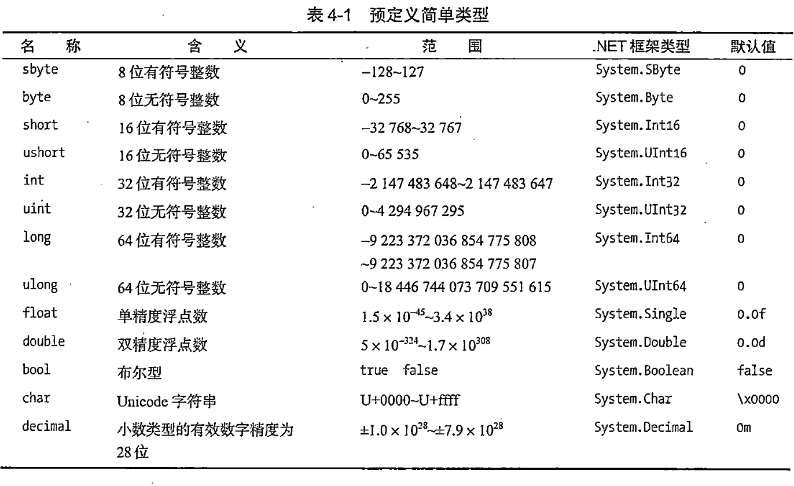

今日作业

1. 阅读《C#图解教程》第5章”类的基本概念“。
2. 回答以下问题，写在笔记本或简书(www.jianshu.com)上。


## 1.类是什么

## 2.构成类的成员有哪些？

## 3.数据成员是什么

## 4.函数成员是什么

## 5.类的数据成员有哪些

## 6.类的函数成员有哪些

## 7.程序和类的关系是什么

## 8.声明类的语法是什么

## 9.类成员是什么

## 10.字段是什么

## 11.声明字段的语法是什么

## 12.初始化字段语法是什么

## 13.方法是什么

## 14.声明方法的语法是什么

## 15.如何创建类类型变量

## 16.如何创建类实例

## 17.类的实例成员是什么

## 18.访问修饰符是什么

## 19.私有访问是什么

## 20.公有访问是什么


## 参考答案

**1.类是什么**

- 类是一种数据结构。
- 类用来组织数据和功能。
- 类用来模拟现实世界事物的特性和功能。
**2.构成类的成员有哪些？**

类包含数据成员和函数成员。
**3.数据成员是什么**

- 数据成员定义了类的数据（状态）。
- 函数成员指用于存储类数据或类实例数据的变量。
- 数据成员通常模拟该类所表示的现实世界事物的特性。
**4.函数成员是什么**

- 函数成员指类中定义的可执行代码块。
- 函数成员定义了类的行为(操作)。
- 函数成员提供对数据的操作。
- 函数成员实现类的功能。
- 函数成员通常会模拟现实世界事物的功能和操作。
**5.类的数据成员有哪些**

数据成员存储数据

- 字段
- 常量
**6.类的函数成员有哪些**


- 方法
- 属性
- 构造函数
- 析构函数
- 运算符
- 索引器
- 事件

**7.程序和类的关系是什么**


**8.声明类的语法是什么**

- 声明类又叫定义类。
- 声明类就是声明定义类的特征和成员。
- 声明类就是创建实例的模板。
- 声明类需要提供以下内容
    - 类的名称
    - 类的成员
    - 类的特征

```c# linenums="1"
class 类名
{
    成员声明
}
```

示例

```c# linenums="1"
class Dealer
{
    ...
}
```

**9.类成员是什么**

- 字段：数据成员
- 方法：函数成员

以上是最重要的类成员类型。

**10.字段是什么**

- 字段是隶属于类的变量。
- 字段可以是任何类型（无论预定义类型还是用户定义类型）
- 字段用来保存数据（字段可以被读取和写入）

**11.声明字段的语法是什么**


声明一个字段最简单的语法：

```c# linenums="1"
类型 字段名称;
```
示例

```c# linenums="1"
class MyClass
{
    int MyField;
}
```

**声明多个字段**

可以在同一条语句中生命多个相同类型的字段。但不能在一个声明中混合不同的类型。多个字段之间使用逗号分隔。

```c# linenums="1"
class MyClass
{
    int F1,F3 = 25;
    string F2,F4 = "abcd";
}
```

**12.初始化字段语法是什么**


字段初始化语法和变量初始化语法相同。字段初始化语句是字段声明的一部分，由一个等号后面跟着一个求值表达式组成。初始化值必须是编译时可确定的。

```c# linenums="1"
class MyClass
{
    int F1 = 17;//字段初始化
}
```

如果没有初始化语句，字段的值会被编译器设置为默认值，默认值由字段的类型决定。



示例

```c# linenums="1"
class MyClass
{
    int F1;  //初始化为0
    string F2; //初始化为null
    int F3 = 25; //初始化为25
    string F4 = "abcd"; //初始化为"abcd"
}
```

**13.方法是什么**


- 方法是具有名称的可执行代码块。
- 当方法被调用时，它执行自己所包裹的代码。

**14.声明方法的语法是什么**

声明方法的最简单语法包括以下组成部分：

- 返回类型：声明方法返回值的类型。如果一个方法不返回值，那么返回类型被指定为void
- 方法名称: 命名方法
- 参数列表：至少由一对空的圆括号组成。如果由参数，将被包裹在圆括号内；
- 方法体：由一对花括号组成，花括号内包含执行代码。

示例:声明一个类，带有一个名为PrintNums的简单方法

```c# linenums="1"
class SimpleClass
{
    void PrintNums()
    {
        Console.WriteLine("1");
        Console.WriteLine("2");
    }
}
```
**15.如何创建类类型变量**


**16.如何创建类实例**

一旦声明了类，就可以创建类的实例。

类是引用类型，这意味着他们要为数据引用和实际数据申请内存。

数据的引用保存在一个类类型的变量中。所以，要创建类的实例，需要从声明一个类类型的变量开始。如果变量没有被初始化，它的值是未定义的。


**17.类的实例成员是什么**


**18.访问修饰符是什么**


**19.私有访问是什么**


**20.公有访问是什么**
