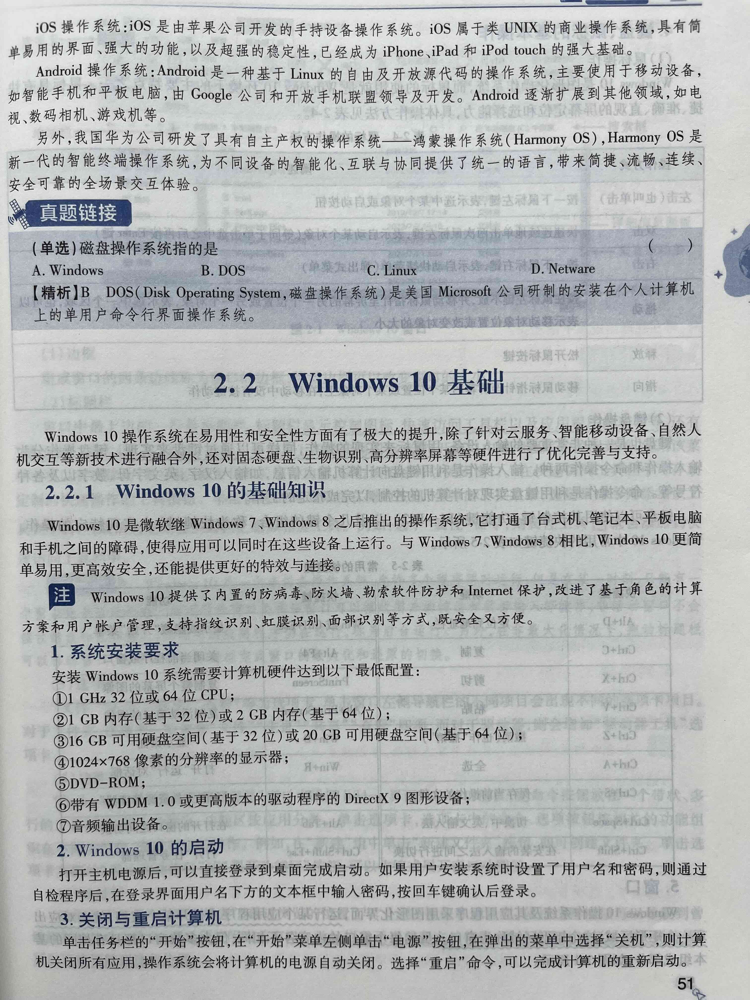
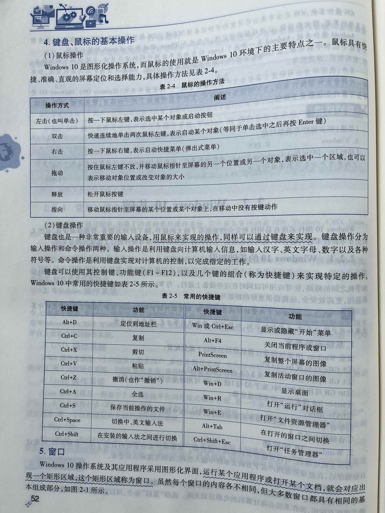
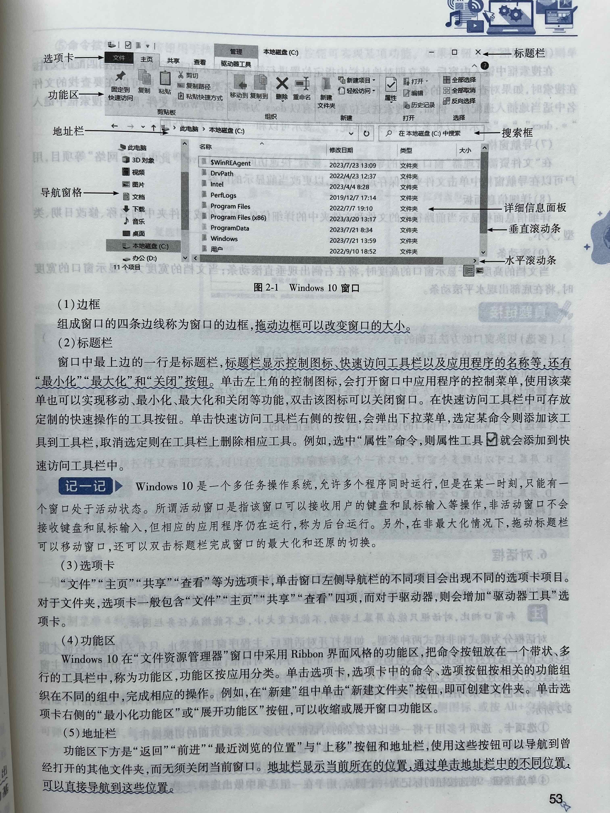
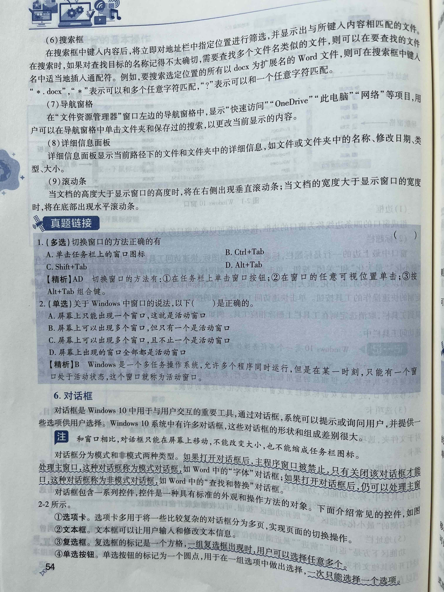
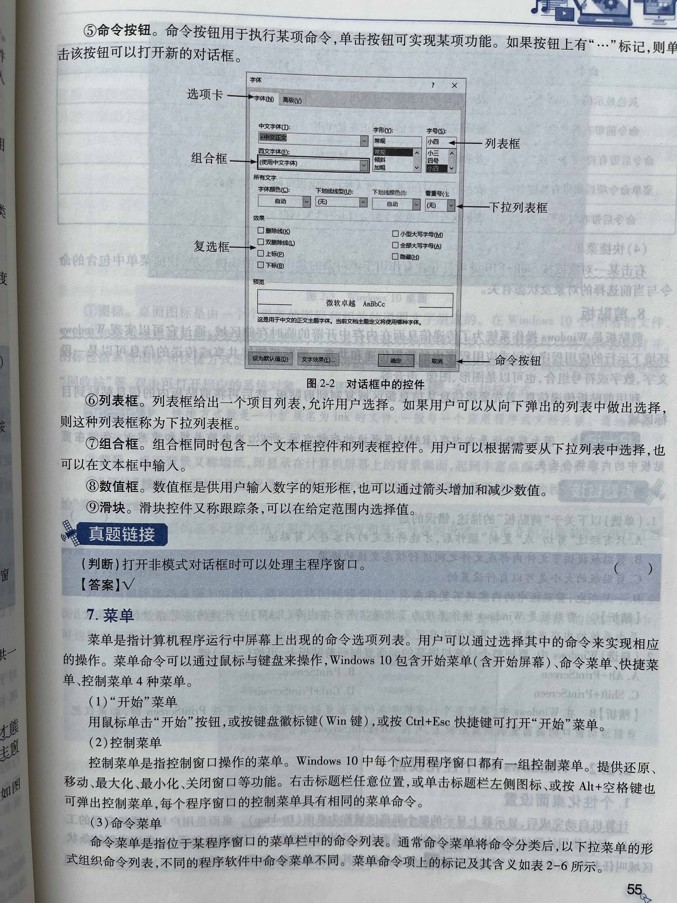
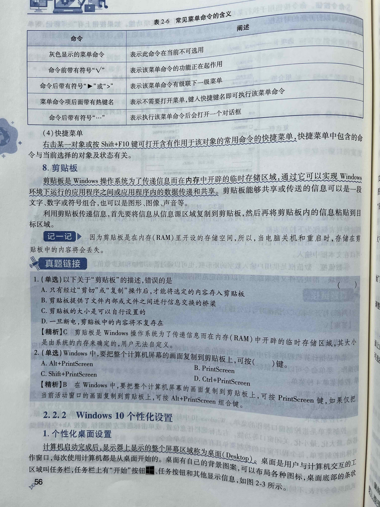

今日作业：
> 1. 阅读底部的“中文 Windows 操作系统”第2节《Windows10基础》
> 2. 把下面22个问题记在笔记本上
> 3. 背诵22道题，能够熟练的口述

## 1.简述Win10操作系统的新特点

## 2.Win10系统安装的最低配置

## 3.操作鼠标的方法有几种及含义

## 4.谈谈你对键盘操作的认识

## 5.记住键盘操作的18个快捷键

## 6.简述窗口的组成部分

## 7.通常标题栏包含哪些项目

## 8.活动窗口是什么

## 9.谈谈你对地址栏的认识

## 10.如何使用搜索框

## 11.对话框是什么

## 12.对话框有几种模式？

## 13.控件是什么

## 14.常见的控件有那几种类型

## 15.菜单是什么

## 16.windows10有几种菜单？

## 17.如何打开开始菜单

## 18.控制菜单是什么

## 19.命令菜单是什么

## 20.简述常见菜单命令的含义

## 21.如何打开快捷菜单

## 22.剪贴板是什么

