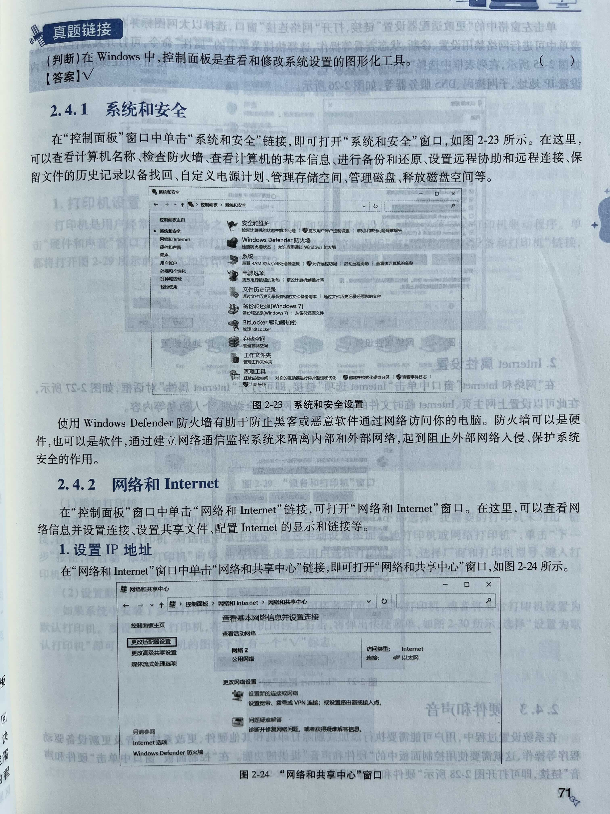
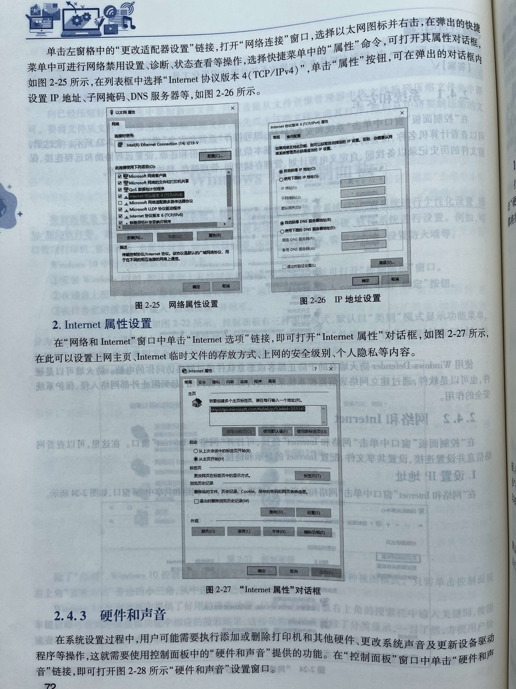
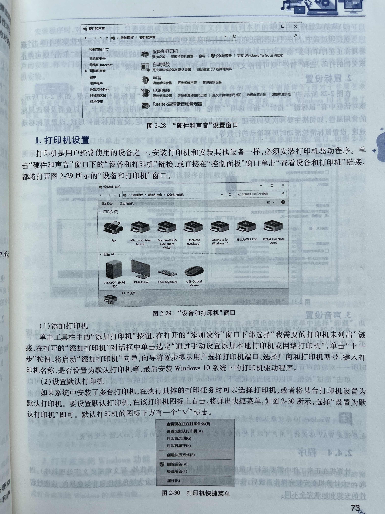
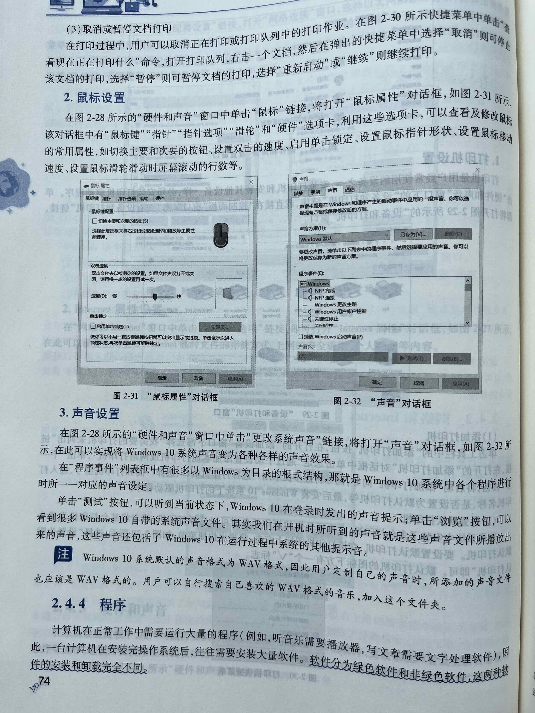
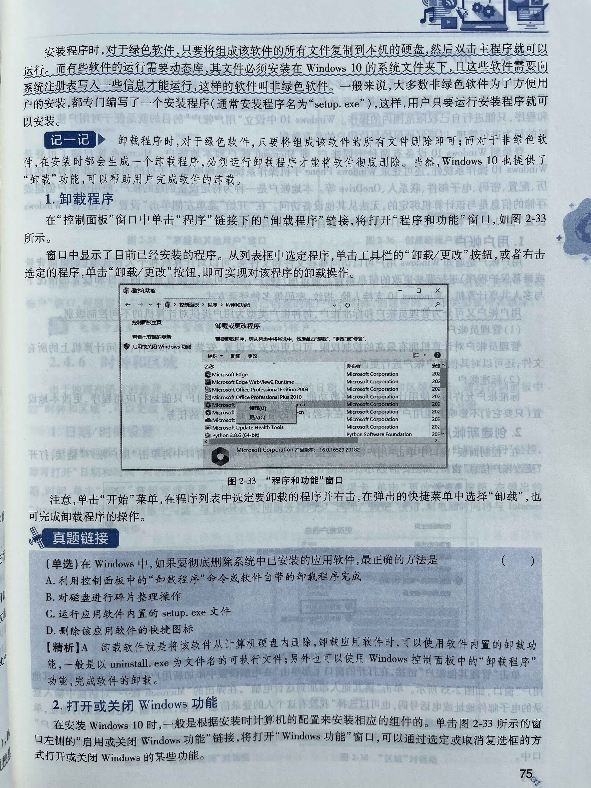
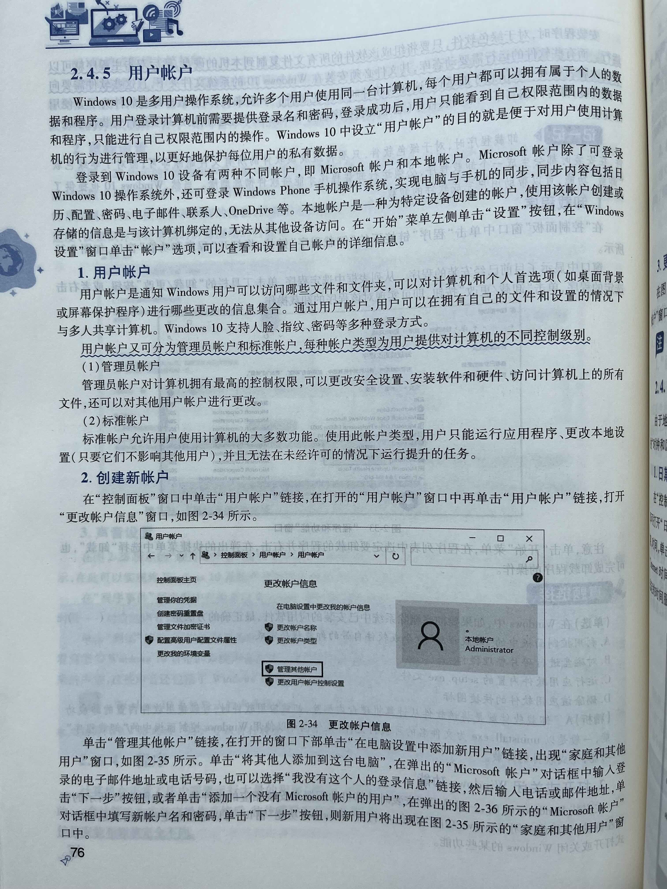
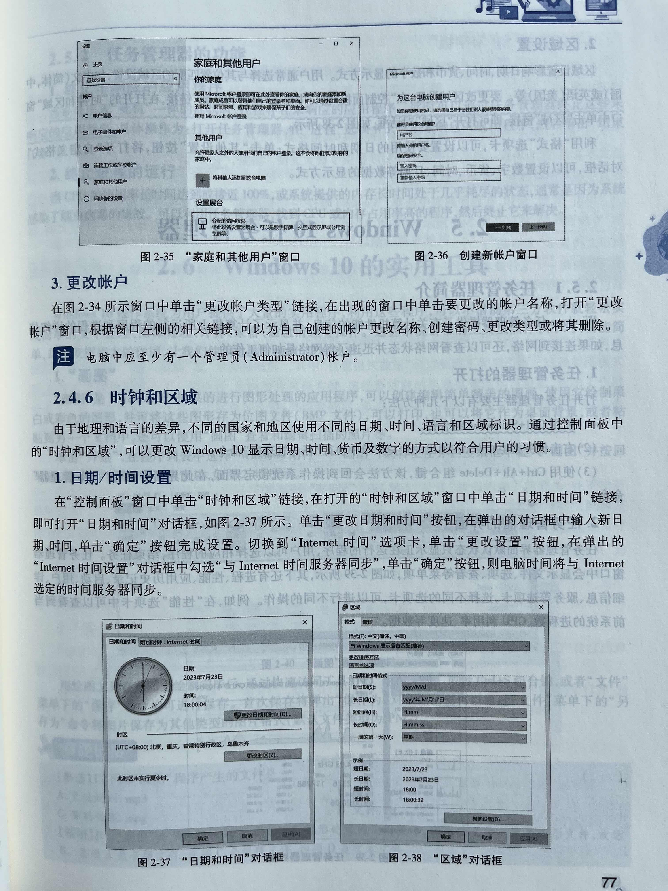

今日作业：
> 1. 阅读底部的“中文 Windows 操作系统”第6节《控制面板》并跟着教程在电脑上操作
> 2. 把下面20个问题记在笔记本上
> 3. 背诵20道题，能够熟练的口述

1. Windows 10中打开“控制面板”的三种常用方法是什么？

2. 控制面板默认以什么视图模式显示？

3. 控制面板包含哪八个主要功能类别？（写出任意五个即可）

4. 在“系统和安全”中，可以进行哪些操作？（写出三项）

5. Windows防火墙的作用是什么？

6. 如何进入“网络和共享中心”？

7. 设置IP地址、子网掩码、DNS服务器的窗口名称是什么？

8. 判断：Windows 10中，防火墙只能是软件形式。（  ）

9. 在“Internet属性”对话框中，可以设置哪些内容？（写出两项）

10. “硬件和声音”类别中，可以设置哪些设备？（写出三种）

11. 添加打印机的入口路径是什么？

12. 如何将某台打印机设置为默认打印机？

13. “鼠标属性”对话框中可以设置哪些内容？（写出两项）

14. 绿色软件与非绿色软件在卸载时有何区别？

15. 在Windows 10中，彻底卸载软件最正确的方法是？（单选）
   A. 利用控制面板中的“卸载程序”命令或软件自带的卸载程序完成  
   B. 对磁盘进行碎片整理操作  
   C. 运行应用软件内置的 setup.exe 文件  
   D. 删除该应用软件的快捷图标  

16. 判断：删除桌面上的快捷图标等于卸载该软件。（  ）

17. 管理员账户与标准账户的最大区别是什么？

18. 如何创建一个新的本地用户账户？

19. 如何更改系统日期和时间？

20. “区域”设置中可以更改哪些内容？（写出三项）

## 教程

