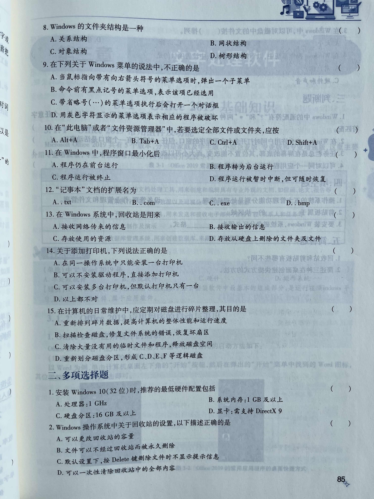
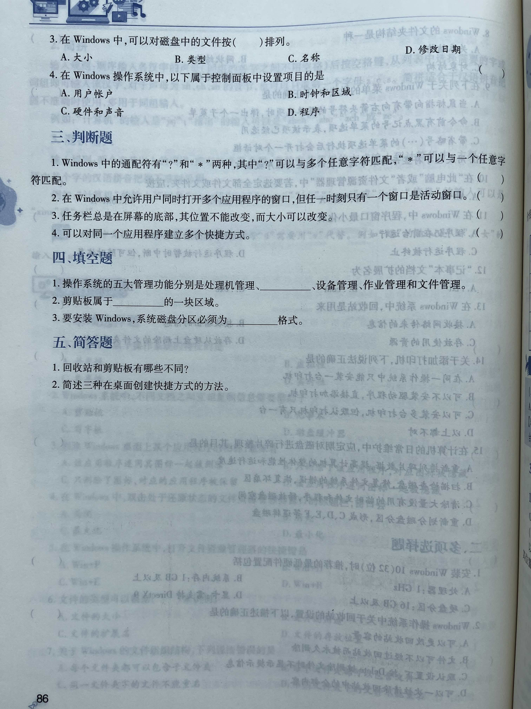

## 练习题

## 答案

第二章 Windows 10 操作系统  

一、单项选择题  

1. [答案] D  
【精析】操作系统的主要特征有：并发性、共享性、异步性、虚拟性。  
2. [答案] A  
【精析】剪贴板是 Windows 操作系统为了传递信息而在内存中开辟的临时存储区域，通过它可以实现 Windows 环境下运行的应用程序之间或应用程序内的数据传递和共享。  
3. [答案] C  
【精析】仅删除图标并不能删除对应的应用程序。  
4. [答案] C  
【精析】在 Windows 操作系统中，双击窗口的标题栏，窗口会在最大化和还原状态之间进行切换。双击处于还原状态的文件资源管理器窗口的标题栏，窗口会最大化。  
5. [答案] C  
【精析】按 Win+E 快捷键可以打开文件资源管理器窗口，按 Win+D 快捷键可以显示桌面，按 Win+R 快捷键可以打开“运行”对话框。
6. [答案] C  
【精析】文件的扩展名用来表示文件的类型。  
7. [答案] D  
【精析】同一文件夹中的文件不能重名，不同文件夹中的文件可以重名。  
8. [答案] D  
【精析】文件夹中可以存放子文件夹和文件。子文件夹中还可以存放下一级的子文件夹和文件。这样逐级地展开，整个文件夹的结构是一种树状的组织结构，因此也称为“树形结构”，即一个文件夹可以包含多个文件和文件夹。  
9. [答案] D  
【精析】用灰色字符显示的菜单选项表示当前不可用。  
10. [答案] C  
【精析】Ctrl+A 组合键表示全选。  
11. [答案] B  
【精析】在 Windows 中，程序窗口最小化后，程序未被终止而是转入后台继续运行。  
12. [答案] A  
【精析】“记事本”文档又称为文本文档，文件扩展名为 txt。  
13. [答案] D  
【精析】回收站是硬盘上的一块存储区域，用来存放用户从硬盘上删除的文件。硬盘上删除的文件不一定会放入回收站，一旦文件大小超过回收站容量或用户对文件进行物理删除（彻底删除），这些文件将不会过回收站而是直接被删除。  
14. [答案] C  
【精析】安装打印机前必须安装驱动程序，同一操作系统中可以安装多台打印机，但默认打印机只有一台。  
15. [答案] A  
【精析】通过磁盘碎片整理程序可以重新排列磁盘碎片，以便磁盘和驱动器能够有效地工作。  

二、多项选择题  

1. [答案] ABCD  
2. [答案] ABD  
【精析】默认设置下用户删除文件，系统会提示用户是否确定进行删除操作，用户可根据意愿进行下一步的操作。  
3. [答案] ABCD  
4. [答案] ABCD  

三、判断题  

1. [答案] ×  
【精析】“?”可以和任意一个字符匹配；“*”可以和任意多个字符匹配。  
2. [答案] √  
3. [答案] ×  
【精析】在任务栏未锁定的情况下，可以用鼠标左键拖动的方式，将任务栏移动到窗口的上、下、左、右位置。将鼠标移动到任务栏的边缘部分，当鼠标变为双向箭头时，可以用左键拖动改变任务栏的大小。  
4. [答案] √  

四、填空题  

1. 存储管理  
2. 内存  
3. NTFS  

五、简答题  

1. (1) 回收站是硬盘中的一块区域，剪贴板是内存中的一块区域。  
(2) 回收站中的信息断电后不会丢失，可以长期存放；剪贴板中的信息断电后就会丢失。  
(3) 用户可以设置回收站容量的大小，用户不能设置剪贴板容量的大小。

2. (1) 选定要创建快捷方式的项目，右击，选择“创建快捷方式”命令，可以创建相应的快捷方式，然后将快捷方式图标从“文件资源管理器”中移到桌面上。  
(2) 右击选中的项目，在快捷菜单中单击“发送到”→“桌面快捷方式”命令。  
(3) 用鼠标右键将项目拖到桌面上，释放鼠标右键，然后在弹出的快捷菜单中选择“在当前位置创建快捷方式”选项。  
(4) 选择原始对象的图标，按住 Ctrl+Shift 键不放将其拖至桌面，释放鼠标和按键。  
