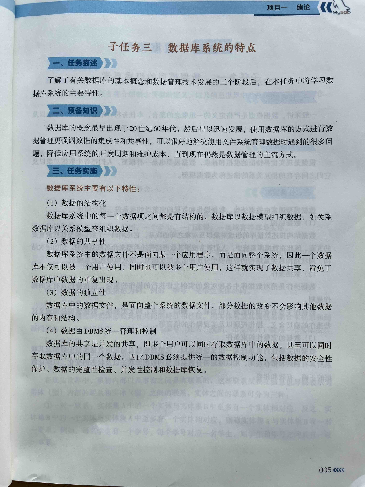

## 内容大纲
### 数据库的基本概念
1. 与数据技术密切相关的4个基本概念是什么
2. 数据是什么
3. 数据库是什么
4. 数据库管理系统是什么
5. 数据库系统是什么
6. 数据库系统由哪四个部分组成
7. DATA、DB、DBMS、DBS分别表示什么
### 数据管理技术的产生与发展
8. 数据管理技术是如何出现和发展的
9.  数据管理指什么
10. 数据处理指什么
11. 数据管理技术经历了哪三个阶段
12. 数据管理技术每个阶段的特征是什么
13. 使用数据库的方式进行数据管理强调什么？
### 数据库系统的特点
14. 使用数据库管理数据优点是什么
15. 数据库系统的主要特性是什么


## 数据库是什么

定义：

> 数据库(Database)是按照数据结构来组织、存储和管理数据的仓库。 

理解:

- 数据库是存储数据的仓库。
- 数据库必须是具有某种**管理功能**的数据的集合。(随便收集起来的数据不能称为数据库)
- 功能是指数据库具备”增删改查“等管理功能。
- 数据库为了实现“增删改查”等功能，必须按照特定的数据结构组织起来。
- 数据库的英文是：`database`

## 练习

### 单选题

1. 数据库系统的核心是（    ）。  
   A. 数据  
   B. 数据库  
   C. 数据库管理系统  
   D. 数据库管理员 

2. 数据库管理系统是（ ）。  
   A. 教学软件    B. 应用软件  
   C. 计算机辅助设计软件    D. 系统软件  

3. 数据库技术发展先后经历了以下哪几个阶段？（    ）  
   A. 人工管理、文件管理、数据库管理系统  
   B. 数据库管理系统、人工管理、文件系统  
   C. 人工管理、文件系统、数据库管理系统  
   D. 文件系统、人工管理、数据库管理系统  

4. 按一定的组织形式存储在一起的相互关联的数据库集合称为（ ）。  
   A. 数据库管理系统    B. 数据库  
   C. 数据库应用系统    D. 数据库系统  

5. 在数据管理技术的发展过程中，经历了人工管理阶段、文件系统阶段和数据库系统阶段，在这几个阶段中，数据独立性最高的是（ ）阶段。  
   A. 数据库系统    B. 文件系统  
   C. 人工智能    D. 数据库管理  

6. 数据库DB、数据库系统DBS、数据库管理系统DBMS三者之间的关系是（ ）。  
   A. DBS包括DB和DBMS  
   B. DBMS包括DB和DBS  
   C. DB包括DBS和DBMS  
   D. DBS就是DB，也就是DBMS  

7. 数据库系统是由若干部分组成，以下不属于数据库系统组成部分的是（ ）。  
   A. 数据库    B. 应用程序  
   C. 操作系统    D. 数据库管理系统  

8. 数据库系统的特点不包括（ ）。  
   A. 数据共享  
   B. 加强对数据安全性和完整性保护  
   C. 完全没有数据冗余  
   D. 具有较高的数据独立性  

9. 数据库系统由哪几个基本部分组成？（    ）  
   A. 数据库、操作系统、硬件、用户  
   B. 数据库、用户、操作系统  
   C. 数据库、硬件、管理员  
   D. 数据库、软件、硬件、用户  

10. 以一定的结构组织并长期存储在计算机存储器中的相关数据的集合是（    ）。  
   A. 数据  
   B. 数据库  
   C. 数据库系统  
   D. 数据库管理系统  

11. 数据库、数据库系统、数据库管理系统之间的关系是（    ）。  
   A. 数据库包括数据库系统和数据库管理系统  
   B. 数据库管理系统包括数据库和数据库系统  
   C. 数据库系统包括数据库和数据库管理系统  
   D. 三者之间没有关系  

12. 在数据库发展的三个阶段中，能够实现数据长期保留，程序与数据分离的阶段是（    ）。  
   A. 人工管理阶段  
   B. 文件系统阶段  
   C. 数据库管理系统阶段  
   D. 面向对象阶段  

13. 在数据库发展的三个阶段中，数据独立性最高的阶段是（    ）。  
   A. 人工管理阶段  
   B. 文件系统阶段  
   C. 数据库管理系统阶段  
   D. 面向对象管理系统阶段  

14. 数据库规范化的主要目的是（    ）。  
   A. 提高查询速度  
   B. 减少数据冗余  
   C. 增加数据存储量  
   D. 简化数据库结构  

--- 

答案: 
```
1-5 CDCBA  6-10 ACCDB 11-14 CBCB
```

