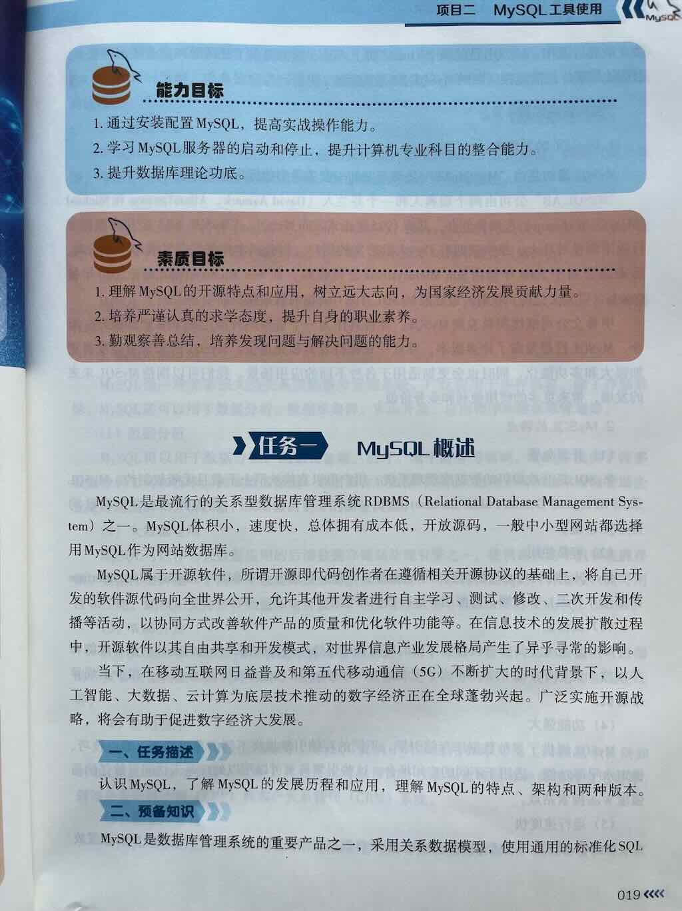
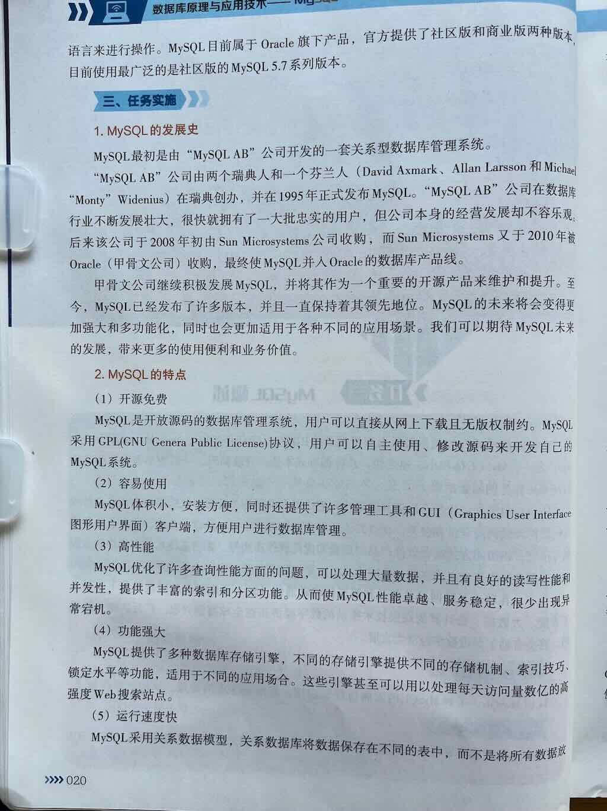

## 简答题
### MySQL概述
1. MySQL是什么
2. 简介MySQL的发展史
3. MySQL的特点是什么
4. MySQL的应用领域是什么
5. MySQL的架构是什么
6. 简介MySQL的版本

## MySQL是什么
MySQL 是世界上最流行的 **关系型数据库管理系统RDBMS（Relation Database Management System）** 之一。

MySQL属于开源软件。

## 简介MySQL的发展史
## MySQL的特点是什么
## MySQL的应用领域是什么
## MySQL的架构是什么
## 简介MySQL的版本

## 练习
### 单选题