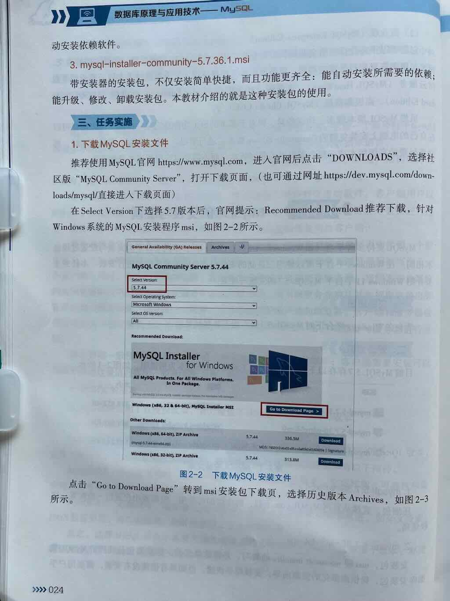
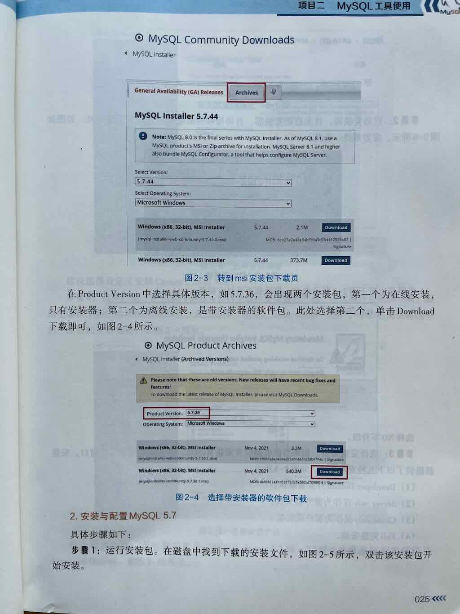
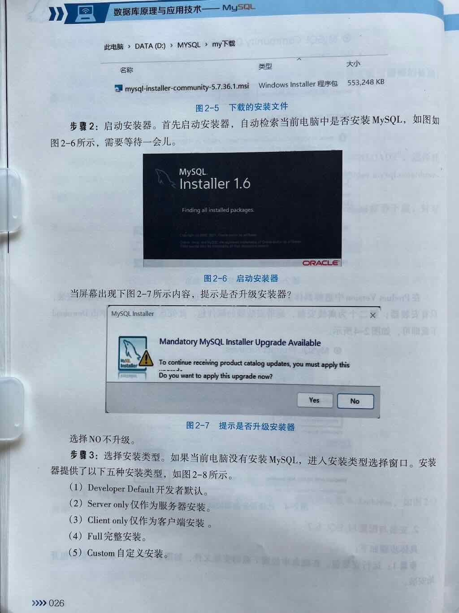
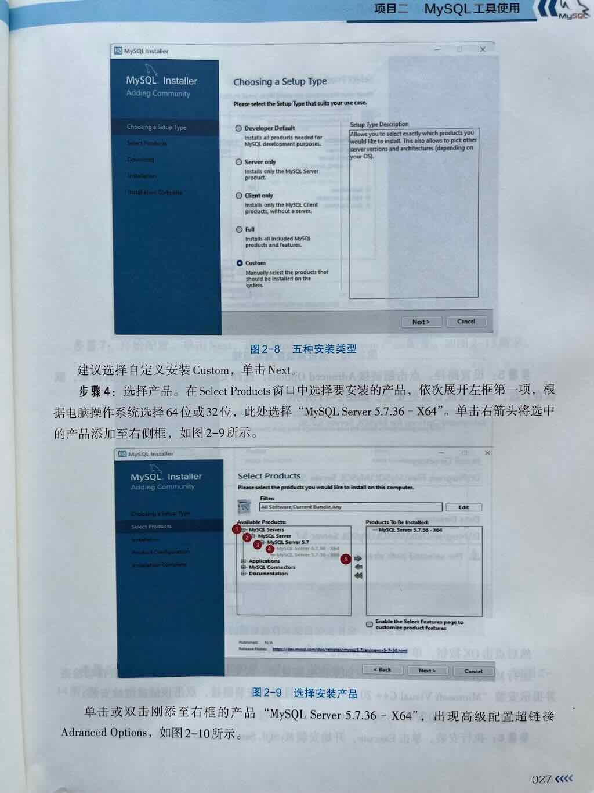
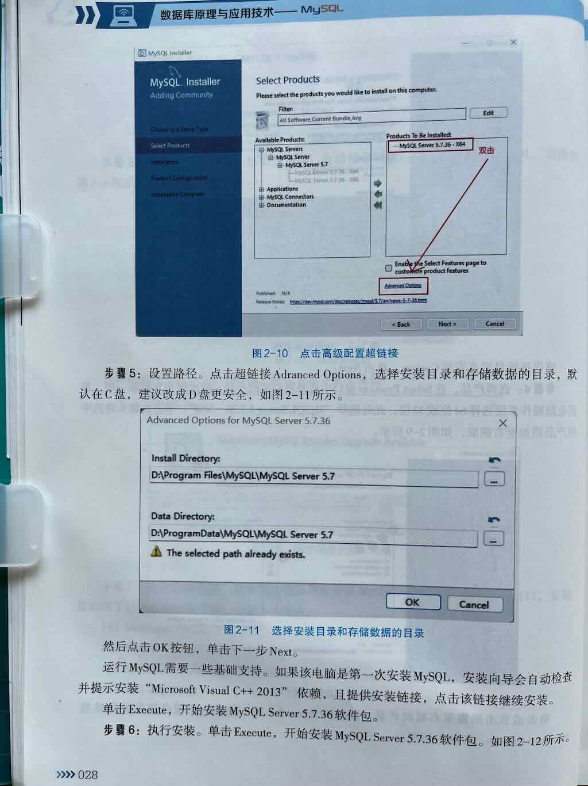
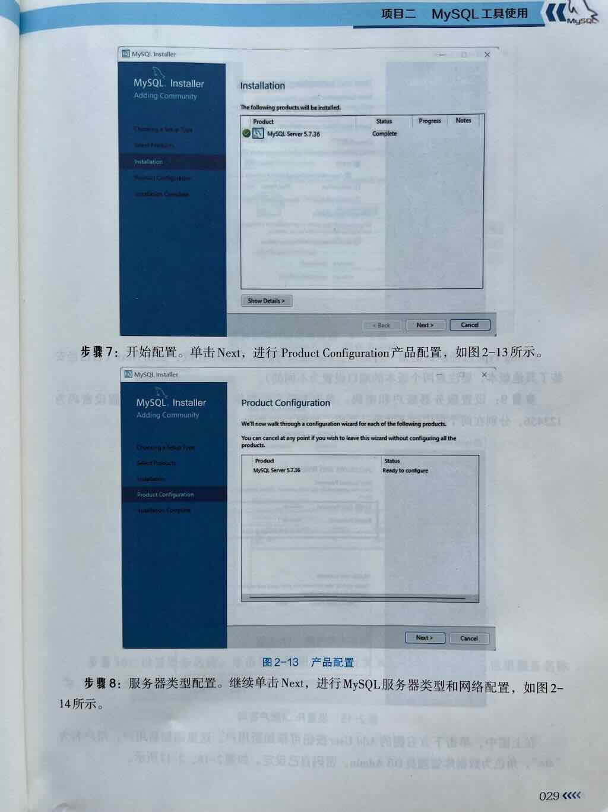
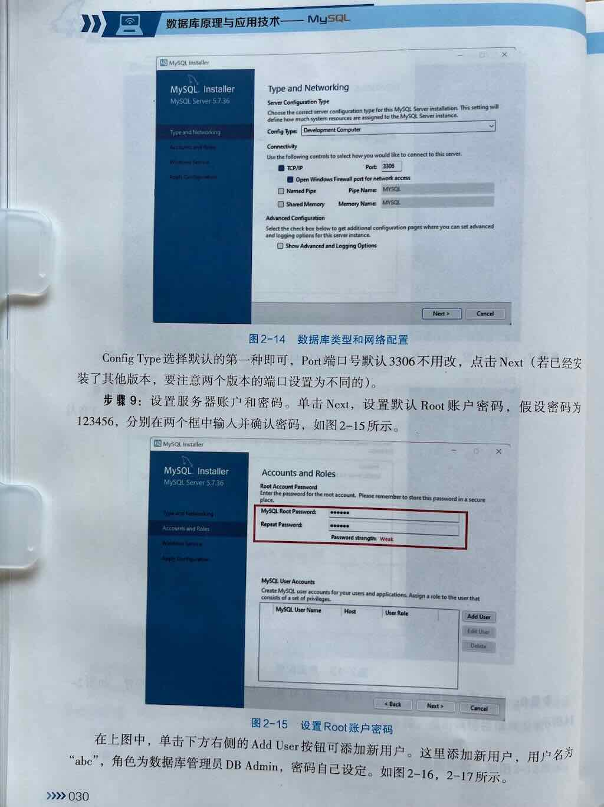
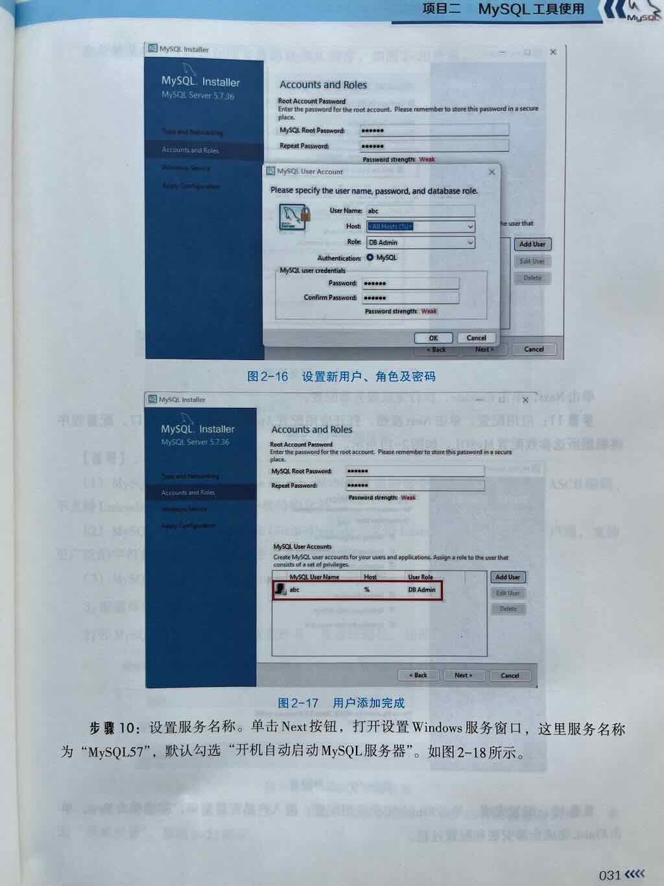
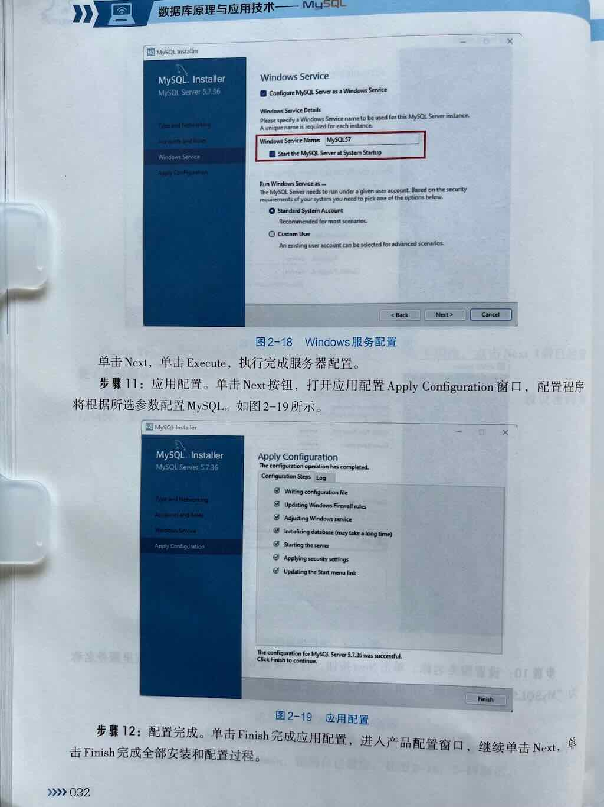
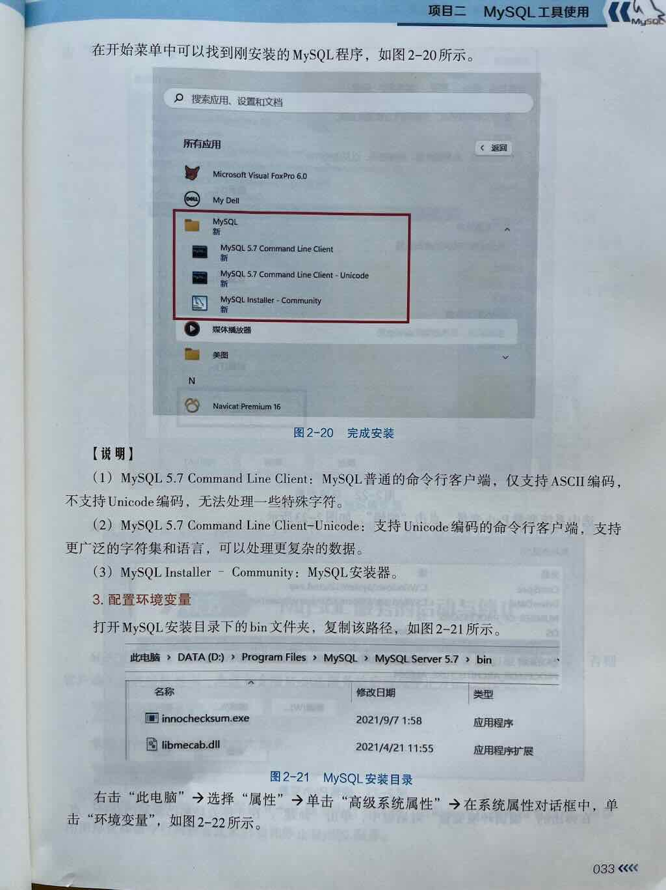

## 简答题
1. MySQL三种安装包的区别是什么
2. 简述安装MySQL的过程
3. 在安装MySQL的过程中，主要需要进行哪些配置？
4. 如何配置MySQL环境变量
5. 安装成功后，开始菜单下MySQL的三个工具的用途是什么


## MySQL三种安装包的区别是什么

mysql-5.7.36-winx64.zip

mysql-5.7.36-winx64.msi

mysql-installer-community-5.7.36.1.msi

## 简述MySQL的安装与配置过程
1. **下载安装包**  
      - 访问 [MySQL官网下载页面](https://dev.mysql.com/downloads/installer/)。
      - 选择 **MySQL Installer for Windows**（推荐下载完整版）。

2. **运行安装向导**  
      - 选择安装类型：  
        - **Developer Default**（开发默认，包含常用工具）。  
        - **Server only**（仅安装MySQL服务器）。  
      - 按提示完成安装，记住设置的**root用户密码**。

3. **配置环境变量**（可选）  
      - 将MySQL的`bin`目录（如 `C:\Program Files\MySQL\MySQL Server 8.0\bin`）添加到系统`PATH`。

---
## 在安装MySQL的过程中，主要需要进行哪些配置？


## 如何配置MySQL环境变量

```mysql
# 第一步：进入bin目录
cd C:\Program Files\MySQL\MySQL Server 8.4\bin
```


## 安装成功后，开始菜单下MySQL的三个工具的用途是什么


## 补充知识：MySQL客户端管理工具有哪些

- MySQL客户端（官方命令行管理工具）
- CMD：windows7命令行工具
- PowerSheel：windows10命令行工具
- **MySQL Workbench**（官方界面管理工具）

> 补充知识：如何打开命令行窗口

- 方式1：通过"运行"对话框打开
    - Win + R > 输入cmd > 回车
- 方式2：通过“开始”菜单打开
    - 右键单击开始菜单
    - 找到“命令行工具”
- 方式3：通过“目标文件夹” 打开(推荐)
    - 进入目标文件夹
    - 按住Shift + 右键单击窗口空白处
    - 选择“在此处打开命令行工具”

> 补充知识：Command-Line Client是什么

- 是MySQL官方的命令行工具。
- 是MySQL官方的数据库管理工具。
- 是一个交互界面，用户可直接与MySQL服务器交互。


## 练习
### 单选题