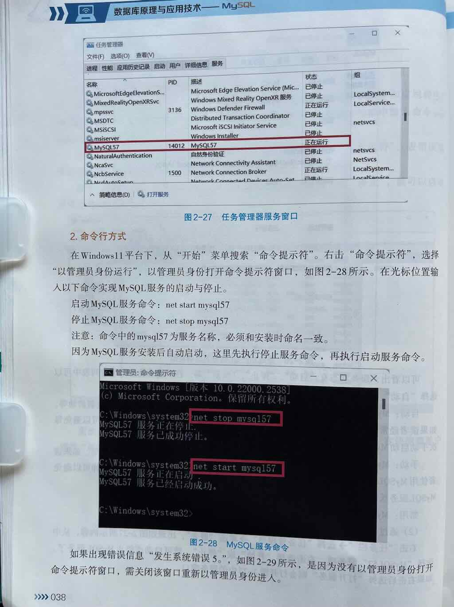

## 简答题
1. MySQL数据库分为哪两端？
2. 从哪里启动客户端？
3. 如何启动服务端？


## MySQL数据库分为哪两端？
答：

- 客户端
    - MySQL5.7 Command Line Client
    - MySQL5.7 Command Line Client - Unicode
- 服务端

## 从哪里启动客户端？
答: 

方式1：开始菜单 > MySQL > 

- MySQL5.7 Command Line Client
- MySQL5.7 Command Line Client - Unicode

## 如何启动MySQL的服务端(win)
方法一：**通过服务管理器**：

- 按 `Win + R`，输入 `services.msc` 回车。
- 找到 **MySQL** 服务，右键选择 **启动**。

方法二：**命令行启动**：

```cmd
net start mysql
```

**查看 MySQL 状态**
```cmd
sc query mysql
```
如果显示 `STATE : 4 RUNNING`，表示 MySQL 正在运行。

重启MySQL服务

```bash
# Windows
通过“服务”管理工具重启 MySQL 服务。

# Linux/macOS
sudo systemctl restart mysql   # 或 sudo service mysql restart

```
关闭MySQL的服务端(win)

方法一：**服务管理器**：
   
- 进入 `services.msc`，找到 MySQL 服务，右键 **停止**。

方法二：**命令行关闭**：
```cmd
net stop mysql
```
**总结**

| **操作**       | **Linux/macOS**                     | **Windows**                  |
|----------------|------------------------------------|-----------------------------|
| **启动 MySQL** | `sudo systemctl start mysql`       | `net start mysql`           |
| **关闭 MySQL** | `sudo systemctl stop mysql`        | `net stop mysql`            |
| **重启 MySQL** | `sudo systemctl restart mysql`     | `net stop mysql && net start mysql` |
| **查看状态**   | `sudo systemctl status mysql`      | `sc query mysql`            |

如果 MySQL 无法启动，建议检查日志文件（`/var/log/mysql/error.log`）排查问题。

---

## 练习
### 单选题
