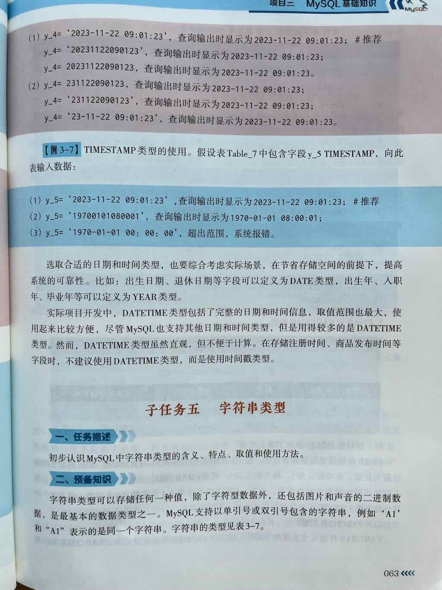
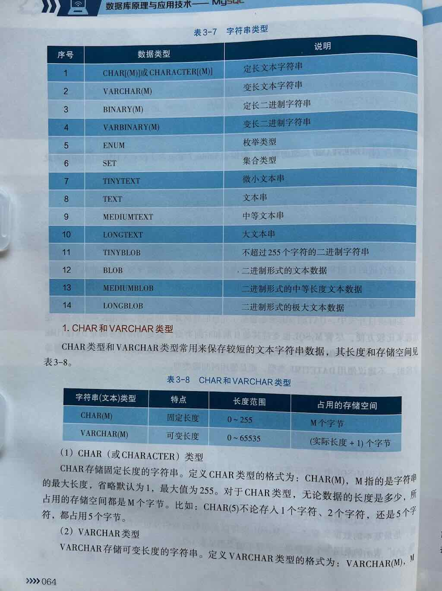
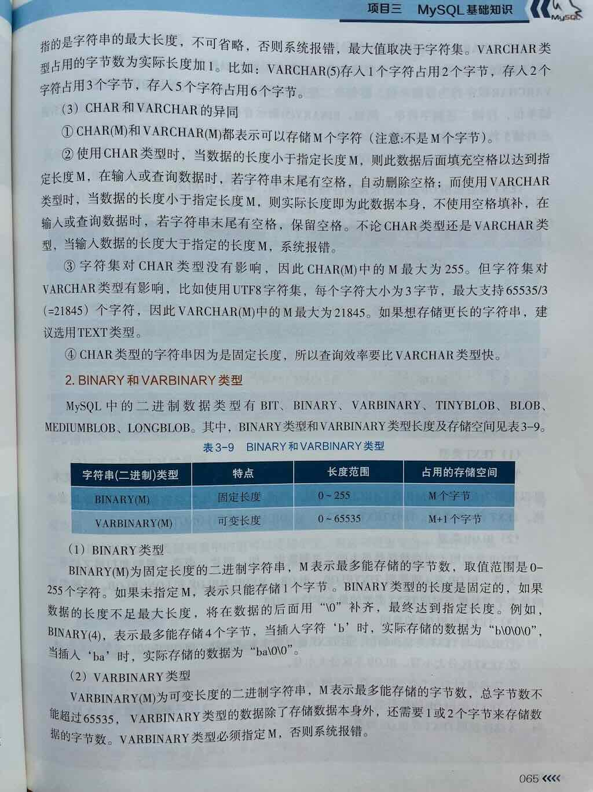
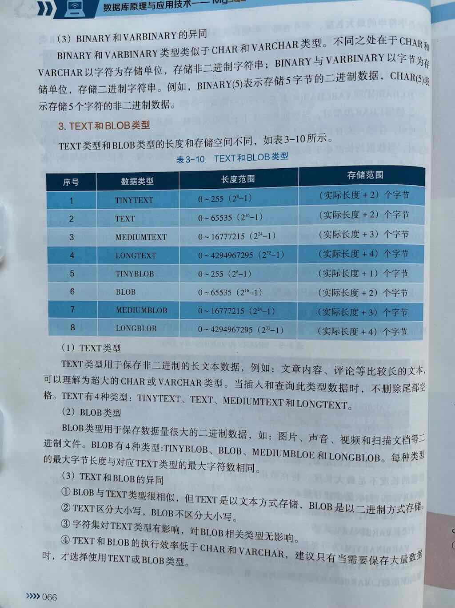
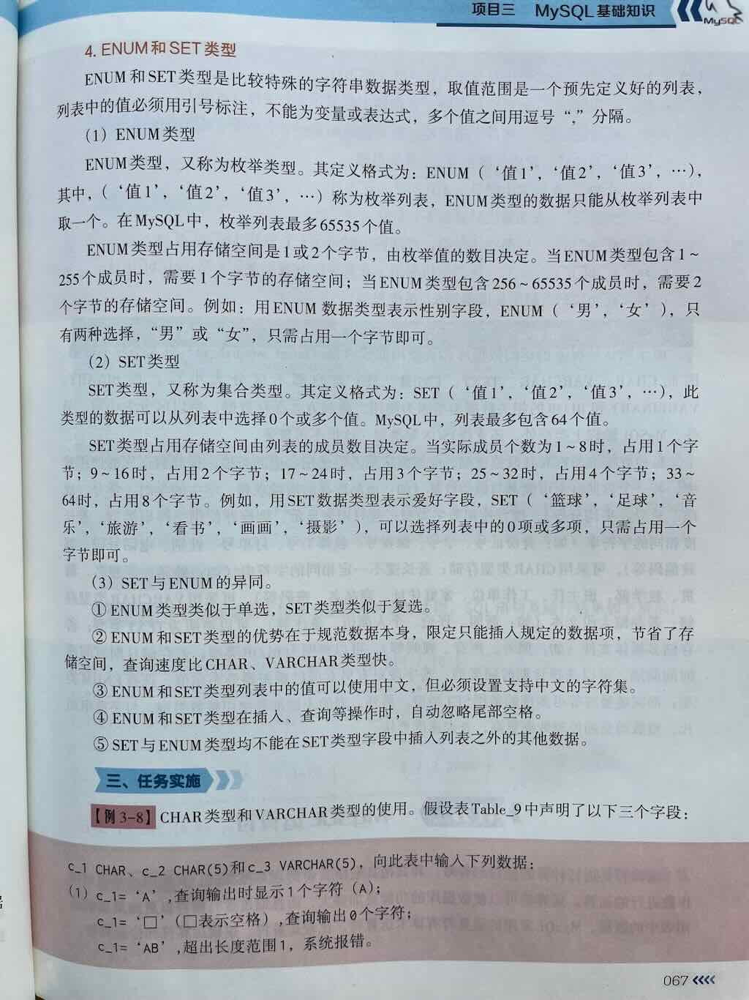

在 MySQL 中，**字符串类型（String Types）** 用于存储文本数据（字符序列）的数据类型。无论是存储用户名、地址、描述、JSON 文本、HTML 内容，还是日志信息，都离不开字符串类型。

MySQL 提供了多种字符串类型，适用于不同的场景。

---


 
 
 
 


## 一、MySQL 常见字符串类型总览

| 数据类型 | 最大长度 | 是否定长 | 说明与用途 |
|----------|-----------|-----------|-------------|
| **CHAR(M)** | 0 ~ 255 字符 | ✅ 定长 | 存储固定长度的字符串，不足部分用空格填充，适合存储长度固定的值（如国家代码、性别代码等） |
| **VARCHAR(M)** | 0 ~ 65,535 **字节**（实际受行大小和字符集影响） | ❌ 变长 | 存储可变长度的字符串，适合大多数文本字段，如用户名、标题、描述等 |
| **TINYTEXT** | 2^8 - 1 = **255 字节** | ❌ 变长 | 非常小的文本，比如状态说明 |
| **TEXT** | 2^16 - 1 = **65,535 字节 (~64KB)** | ❌ 变长 | 一般的长文本，如文章内容、说明、评论 |
| **MEDIUMTEXT** | 2^24 - 1 = **16,777,215 字节 (~16MB)** | ❌ 变长 | 中等长度的大文本，如长文章、日志内容 |
| **LONGTEXT** | 2^32 - 1 = **4,294,967,295 字节 (~4GB)** | ❌ 变长 | 超大文本，如整本书、XML/JSON 内容 |
| **ENUM('值1','值2',...)** | 最多 65,535 个不同的值 | ✅ 枚举类型 | 只能从预定义的一组值中选择一个，如性别、状态、类型等 |
| **SET('值1','值2',...)** | 最多 64 个成员 | ✅ 多选集合 | 可存储一组预定义值中的一个或多个，如用户的兴趣标签 |

🎯 **注意：**

- `CHAR` 和 `VARCHAR` 是**字符类型**，存储的是**文本字符**；
- `TINYTEXT`、`TEXT`、`MEDIUMTEXT`、`LONGTEXT` 是**长文本类型**，适合存储大段文字；
- `ENUM` 和 `SET` 是特殊的字符串类型，用于表示**一组固定选项中的值（单选/多选）**；
- 还有 `BINARY`、`VARBINARY`、`BLOB` 等**二进制字符串类型**，用于存储二进制数据（如图片、文件），本文主要聚焦于**普通文本字符串类型**。

---

## CHAR（定长字符串）

语法：

```sql
CHAR(M)
```

- **M 表示字符个数（不是字节数）**，范围是 0 ~ 255
- 如果存入的字符数小于 M，则**自动用空格填充**到 M 个字符，**取出时会自动去掉尾部空格**
- 适合存储**长度固定**的数据，比如：
    - 性别（'M' / 'F'）
    - 国家/地区代码（如 'CN', 'US'）
    - 状态码（如 'Y', 'N'）

示例：

```sql
CREATE TABLE users (
    id INT PRIMARY KEY,
    gender CHAR(1),       -- 存 'M' 或 'F'
    country_code CHAR(2)  -- 如 'CN', 'US'
);
```

---

## VARCHAR（变长字符串）

语法：
```sql
VARCHAR(M)
```

- **M 表示最大字符数**，范围是 **0 ~ 65,535 字节（实际受行大小和字符集影响，通常建议不超过几千字符）**
- **变长存储，只占用实际需要的空间 + 1~2个字节记录长度**
- 适合存储**长度不固定**的文本，比如：
    - 用户名
    - 商品名称
    - 标题、摘要、描述等

**示例**

```sql
CREATE TABLE products (
    id INT PRIMARY KEY,
    name VARCHAR(100),        -- 商品名称
    description VARCHAR(500)  -- 商品描述
);
```

> ⚠️ 注意：`VARCHAR(M)` 中的 M 是**字符数，不是字节数**，但实际存储时会受**字符集影响**（如 utf8mb4 下一个中文占 4 字节）

用途：`VARCHAR()`用于表示长度变化的字符串。

语法

```sql
VARCHAR(n)
```

参数：n表示一个整数，用于规定字符串的最大长度。

示例

```sql
CREATE TABLE users (
    user_name VARCHAR(20),
    email VARCHAR(255) NOT NULL
);
```

应用场景：适合存储长度变化的字符串，比如: 用户名、电子邮箱地址等

1. 短字符串

| 类型         | 最大长度  | 存储方式        | 特点                       | 应用场景               |
| ------------ | --------- | --------------- | -------------------------- | ---------------------- |
| `CHAR(N)`    | 255字符   | 固定长度        | 尾部空格自动去除           | 固定长度数据（如MD5）  |
| `VARCHAR(N)` | 65535字节 | 变长 + 长度前缀 | 节省空间，但更新可能碎片化 | 用户名、地址等变长数据 |

**性能对比**：

- `CHAR(10)` vs `VARCHAR(10)` 存储"abc"：
  - CHAR占用10字节（补空格）
  - VARCHAR占用3字节 + 1字节长度前缀

---

## TINYTEXT

**语法**

```sql
TINYTEXT
```

- 最大 **255 字节**
- 适合存储非常短的文本内容，如状态说明、简短备注等
- 比 VARCHAR 更节省空间，但不支持默认值，也不适合频繁查询/索引

**示例**

```sql
CREATE TABLE logs (
    id INT PRIMARY KEY,
    action TINYTEXT  -- 如 'login', 'logout'
);
```

---

## TEXT（普通长文本）

**语法**

```sql
TEXT
```

- 最大 **65,535 字节 (~64KB)**
- 适合存储：
    - 文章内容
    - 用户评论
    - 较长的描述、说明

**示例**

```sql
CREATE TABLE articles (
    id INT PRIMARY KEY,
    title VARCHAR(200),
    content TEXT  -- 文章正文
);
```

---

## MEDIUMTEXT

**语法**

```sql
MEDIUMTEXT
```

- 最大 **16,777,215 字节 (~16MB)**
- 适合存储：
    - 长文章
    - 日志内容
    - 较大的 JSON / XML 内容

**示例**

```sql
CREATE TABLE logs (
    id INT PRIMARY KEY,
    details MEDIUMTEXT  -- 存储较长的日志详情
);
```

---

## LONGTEXT

**语法**

```sql
LONGTEXT
```

- 最大 **4,294,967,295 字节 (~4GB)**
- 适合存储：
    - 非常大的文本内容
    - 电子书、整本小说
    - 大型 JSON / XML 数据

**示例**

```sql
CREATE TABLE ebooks (
    id INT PRIMARY KEY,
    title VARCHAR(200),
    content LONGTEXT  -- 存储整本书内容
);
```


| 类型         | 最大长度       | 特点                              |
| ------------ | -------------- | --------------------------------- |
| `TEXT`       | 64KB (L+2字节) | 纯文本，字符集相关                |
| `MEDIUMTEXT` | 16MB           | 长文章、JSON字符串（MySQL 5.7前） |
| `LONGTEXT`   | 4GB            | 超长文本                          |
| `BLOB`       | 同TEXT系列     | 存储二进制数据（如图片、文件）    |

**注意事项**：

- TEXT/BLOB字段会使用外部存储，避免`SELECT *`全量读取
- 大字段建议拆分到独立表（优化查询性能）


---

## ENUM（枚举类型）

用途：`ENUM ()`用于表示字符串值列表。它允许你从预定义的值列表中选择一个值。

语法

```sql
ENUM('值1', '值2', '值3', ...)
```

参数：值是一个字符串，必须用引号包裹。

示例

```sql
CREATE TABLE users (
    gender ENUM("男","女"),
    week ENUM("星期一","星期二","星期三"),
    cup ENUM("大杯","中杯","小杯"),
    order ENUM("待支付","支付完成","待收货","已完成")
);
```

应用场景：适合存储长度变化的字符串，比如: 用户名、电子邮箱地址等

> ENUM() 创建字符串数据类型（字符串值列表）
>
> 1. enumurate 翻译为”枚举“。
> 2. ”举"就是列举
> 3. ”枚“的本意是“树干”
> 4. ”枚“作量词的意思是：”个”
> 5. ”枚“作副词的意思是：“逐个”
> 6. “枚举”的意思是：逐个列举，但是每次只能取一个。简单说就是：多选一


**语法**

```sql
ENUM('值1', '值2', '值3', ...)
```

- 只能从预定义的一组字符串值中选择一个
- 实际存储的是**整数值（索引）**，但表现为字符串
- 最多支持 **65,535 个不同的值**
- 适合存储**固定选项**，如性别、状态、类型等

**示例**

```sql
CREATE TABLE users (
    id INT PRIMARY KEY,
    gender ENUM('M', 'F', 'O'),  -- M:男, F:女, O:其他
    status ENUM('active', 'inactive', 'pending')
);
```

> ✅ 优点：节省空间、提高数据一致性  
> ❌ 缺点：不够灵活，新增选项需修改表结构

---

## SET（多选集合）

**语法**

```sql
SET('值1', '值2', '值3', ...)
```

- 可存储一组预定义值中的**一个或多个值**
- 最多支持 **64 个成员**
- 实际存储也是整数（位掩码），但表现为字符串集合
- 适合存储**标签、爱好、权限组合**等

**示例**

```sql
CREATE TABLE users (
    id INT PRIMARY KEY,
    interests SET('music', 'sports', 'reading', 'travel')
);
```

> ✅ 适合存储多选项，比如用户的兴趣爱好  
> ❌ 不适合频繁更新的场景，且选项不能太多

---

## 三、字符串类型的选择建议

| 使用场景 | 推荐类型 |
|----------|----------|
| 固定长度的简短文本（如性别、状态码） | **CHAR(M)** |
| 可变长度的普通文本（如用户名、标题、摘要） | **VARCHAR(M)** |
| 非常短的文本（如状态说明） | **TINYTEXT** |
| 一般长文本（如文章内容、评论） | **TEXT** |
| 较大长文本（如日志详情、长描述） | **MEDIUMTEXT** |
| 超大文本（如整本书、大型 JSON） | **LONGTEXT** |
| 固定选项中选择一个（如性别、订单状态） | **ENUM** |
| 固定选项中选择多个（如兴趣标签） | **SET** |

---

## 四、其他注意事项

1. **字符集影响存储大小**
- `VARCHAR(100)` 在 `utf8mb4` 字符集下，一个中文或 emoji 占 **4 字节**，所以最多能存约 25 个中文
- 建议根据实际语言选择字符集，比如：
    - `utf8mb4`：支持中文、emoji（推荐）
    - `latin1`：单字节，仅支持西文
    - `utf8`：MySQL 中的旧 UTF-8（最多 3 字节，不支持某些 emoji）

2. **VARCHAR 的最大长度限制**
- 虽然语法上 `VARCHAR(M)` 最大是 65,535 **字符**，但实际受**行最大字节数（约 65,535 字节）和字符集影响**
- 通常单个 `VARCHAR` 不建议超过几千字符

3. **TEXT 类型不能有默认值（MySQL 5.7 及之前）**
- 在 MySQL 8.0 开始，`TEXT` 和 `VARCHAR` 都**可以设置默认值了**

4. **排序、索引与性能**
- `CHAR` 和 `VARCHAR` 支持索引、排序、分组等操作，性能较好
- `TEXT` 类型也可以建索引（但通常是前缀索引），但**不建议用于频繁查询/排序的字段**
- `ENUM` 和 `SET` 是特殊类型，查询效率高，但修改选项需改表结构

---

## 五、总结

| 类型 | 是否定长 | 最大长度 | 适用场景 | 特点 |
|------|-----------|-------------|----------------|--------|
| **CHAR(M)** | ✅ 定长 | 0 ~ 255 字符 | 固定长度文本（如代码、状态） | 不够灵活但节省空间 |
| **VARCHAR(M)** | ❌ 变长 | 0 ~ 65,535 字节（实际更少） | 普通文本（用户名、标题、描述） | 最常用的字符串类型 |
| **TINYTEXT** | ❌ 变长 | 255 字节 | 极短文本 | 很少用 |
| **TEXT** | ❌ 变长 | ~64KB | 文章、评论、描述 | 常用于长文本 |
| **MEDIUMTEXT** | ❌ 变长 | ~16MB | 较大文本内容 | 如日志、长文章 |
| **LONGTEXT** | ❌ 变长 | ~4GB | 超大文本（如电子书、JSON） | 存储非常大的文本内容 |
| **ENUM** | ✅ 枚举 | 最多 65,535 个值 | 单选固定值（如性别、状态） | 节省空间，数据一致性强 |
| **SET** | ✅ 多选集合 | 最多 64 个成员 | 多选固定值（如兴趣标签） | 可存储多个预定义值 |


