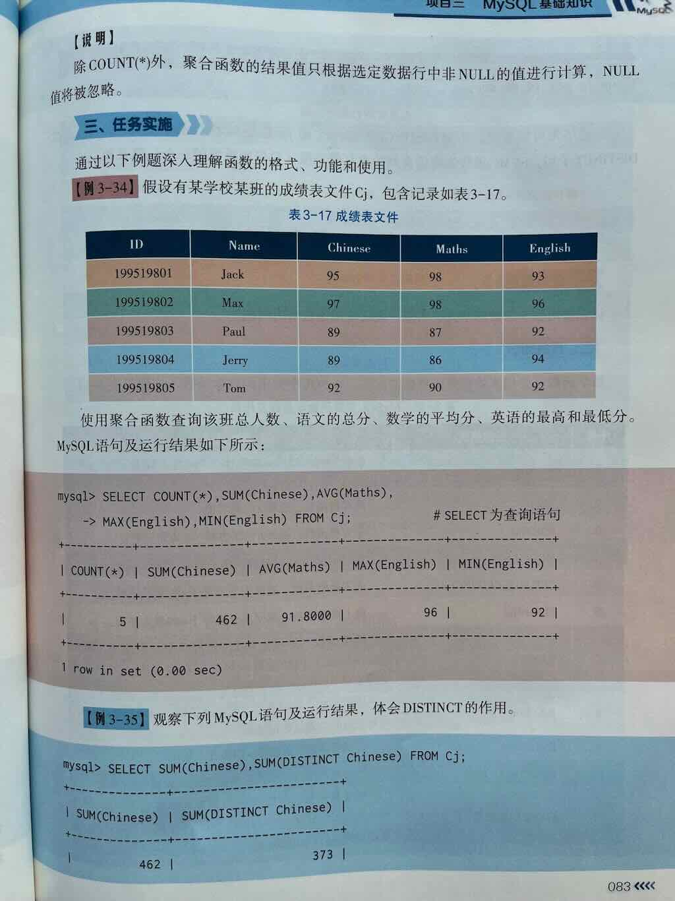
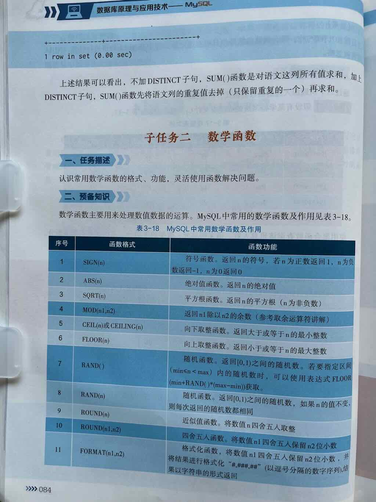

在 MySQL 中，**聚合函数（Aggregate Functions）** 是一种对一组值执行计算并返回单一汇总值的函数。它们通常用于统计、分组和数据分析场景，帮助用户快速获取数据的整体特征（如总和、平均值、最大值等）。

---
 
 
 

## **常见聚合函数**
以下是 MySQL 中最常用的聚合函数：

| 函数          | 作用                   | 示例                              |
|---------------|------------------------|-----------------------------------|
| `COUNT()`     | 统计行数               | `SELECT COUNT(*) FROM orders;`    |
| `SUM()`       | 计算数值列的总和       | `SELECT SUM(amount) FROM sales;`  |
| `AVG()`       | 计算数值列的平均值     | `SELECT AVG(salary) FROM staff;`  |
| `MAX()`       | 返回列中的最大值       | `SELECT MAX(price) FROM products;`|
| `MIN()`       | 返回列中的最小值       | `SELECT MIN(age) FROM users;`     |
| `GROUP_CONCAT()`| 将多行数据合并为字符串 | `SELECT GROUP_CONCAT(name) FROM students;` |

---

## **核心特点**
1. **输入多行，输出单值**  
   聚合函数将多行数据压缩为单一结果，例如：
   ```sql
   -- 计算员工表中的平均年龄
   SELECT AVG(age) FROM employees;
   ```

2. **常与 `GROUP BY` 结合使用**  
   按分组统计时，聚合函数为每个分组返回结果：
   ```sql
   -- 统计每个部门的平均薪资
   SELECT department, AVG(salary) 
   FROM employees 
   GROUP BY department;
   ```

3. **自动忽略 `NULL` 值（除 `COUNT(*)`）**  
   ```sql
   -- 统计非空邮箱数量
   SELECT COUNT(email) FROM users;  -- 忽略 NULL
   ```

---

## **使用场景示例**
### **场景 1：统计订单总金额**
```sql
SELECT SUM(total_price) AS total_revenue 
FROM orders 
WHERE order_date >= '2023-01-01';
```
**结果**：  
```
+---------------+
| total_revenue |
+---------------+
|   1250000.50  |
+---------------+
```

---

### **场景 2：查找最畅销商品**
```sql
SELECT product_id, COUNT(*) AS sales_count 
FROM order_details 
GROUP BY product_id 
ORDER BY sales_count DESC 
LIMIT 1;
```
**结果**：  
```
+------------+-------------+
| product_id | sales_count |
+------------+-------------+
|        101 |         892 |
+------------+-------------+
```

---

### **场景 3：计算学生成绩分布**
```sql
SELECT 
    AVG(score) AS avg_score,
    MAX(score) AS max_score,
    MIN(score) AS min_score 
FROM exam_results;
```
**结果**：  
```
+------------+-----------+-----------+
| avg_score  | max_score | min_score |
+------------+-----------+-----------+
|   78.5     |    99     |    42     |
+------------+-----------+-----------+
```

---

## **注意事项**
1. **与非聚合字段混用时必须分组**  
   ```sql
   -- 错误写法（department 是非聚合字段）
   SELECT department, AVG(salary) FROM employees;

   -- 正确写法
   SELECT department, AVG(salary) 
   FROM employees 
   GROUP BY department;
   ```

2. **`COUNT(*)` vs `COUNT(列名)`**  
   - `COUNT(*)`：统计所有行数（包括 `NULL`）。  
   - `COUNT(列名)`：统计该列非 `NULL` 的行数。

3. **`HAVING` 过滤分组结果**  
   ```sql
   -- 筛选平均薪资 > 10000 的部门
   SELECT department, AVG(salary) 
   FROM employees 
   GROUP BY department 
   HAVING AVG(salary) > 10000;
   ```

---

## **总结**
聚合函数是 SQL 数据分析的核心工具，用于快速汇总数据特征。结合 `GROUP BY` 和 `HAVING` 可实现复杂的分组统计逻辑，是报表生成、业务分析的基础技能。


## **1. `COUNT()` 的作用**
`COUNT()` 是一个 **聚合函数**，用于统计满足条件的行数。它可以：
- 统计表中所有行的数量。
- 统计某列非 `NULL` 值的数量。
- 结合 `DISTINCT` 统计唯一值的数量。

---

## **2. 基本语法**
```sql
SELECT COUNT(表达式) FROM 表名 [WHERE 条件];
```
- **表达式**：可以是 `*`、列名、`DISTINCT 列名` 或具体值（如 `1`）。

---

## **3. 常见用法及区别**

### **(1) `COUNT(*)`**
- **统计所有行的数量**，包括 `NULL` 行。
- **不关心列值**，即使所有列均为 `NULL`，也会被计数。
- **示例**：
  ```sql
  SELECT COUNT(*) FROM users;  -- 返回 users 表的总行数
  ```

### **(2) `COUNT(列名)`**
- **统计该列非 `NULL` 值的行数**。
- 如果列中有 `NULL`，则这些行会被忽略。
- **示例**：
  ```sql
  SELECT COUNT(email) FROM users;  -- 统计 email 列非空的行数
  ```

### **(3) `COUNT(1)` 或 `COUNT(0)`**
- 与 `COUNT(*)` 效果相同，直接统计行数，不依赖列值。
- 优化器可能将其简化为 `COUNT(*)`。
- **示例**：
  ```sql
  SELECT COUNT(1) FROM users;  -- 等价于 COUNT(*)
  ```

### **(4) `COUNT(DISTINCT 列名)`**
- **统计某列的唯一非 `NULL` 值的数量**。
- **示例**：
  ```sql
  SELECT COUNT(DISTINCT city) FROM users;  -- 统计不同城市的数量
  ```

---

## **4. 结合 `WHERE` 条件**
可以配合 `WHERE` 子句筛选特定行：
```sql
SELECT COUNT(*) FROM orders WHERE amount > 100;  -- 统计金额大于 100 的订单数
```

---

## **5. 与 `GROUP BY` 结合**
按分组统计行数：
```sql
SELECT department, COUNT(*) FROM employees 
GROUP BY department;  -- 统计每个部门的员工数量
```

---

## **6. 性能优化**
### **(1) InnoDB 引擎的 `COUNT(*)`**
- **InnoDB** 不会直接存储总行数，执行 `COUNT(*)` 时需要遍历索引（优先选择较小的二级索引）。
- 对超大表统计行数可能较慢，可考虑以下优化：
  - 使用近似值（如 `EXPLAIN` 的 `rows` 字段）。
  - 维护一个统计表（实时更新行数）。
  - 利用缓存（如 Redis 存储总行数）。

### **(2) 避免全表扫描**
- 对带条件的 `COUNT()`，确保查询条件列有索引：
  ```sql
  SELECT COUNT(*) FROM users WHERE status = 'active';  -- status 列需有索引
  ```

---

## **7. 常见问题**
### **(1) `COUNT(*)` vs `COUNT(列名)`**
- `COUNT(*)`：统计所有行，无论列值是否为 `NULL`。
- `COUNT(列名)`：仅统计该列非 `NULL` 的行。

### **(2) `COUNT(DISTINCT)` 的性能**
- 对大数据量的列，`COUNT(DISTINCT)` 可能较慢，需权衡精确性与效率。

---

## **8. 示例**
### **表结构（`employees`）**
| id | name   | department | salary | hire_date  |
|----|--------|------------|--------|------------|
| 1  | Alice  | Sales      | 5000   | 2020-01-01 |
| 2  | Bob    | HR         | NULL   | 2021-05-01 |
| 3  | Charlie| Sales      | 6000   | NULL       |

### **查询示例**
```sql
-- 统计总员工数（结果为 3）
SELECT COUNT(*) FROM employees;

-- 统计有工资记录的员工数（结果为 2，Bob 的 salary 为 NULL）
SELECT COUNT(salary) FROM employees;

-- 统计唯一部门数量（结果为 2：Sales 和 HR）
SELECT COUNT(DISTINCT department) FROM employees;

-- 按部门统计员工数
SELECT department, COUNT(*) 
FROM employees 
GROUP BY department;
```

---

## **总结**
`COUNT()` 是 MySQL 中最常用的聚合函数，核心要点：
- 根据需求选择 `COUNT(*)`、`COUNT(列名)` 或 `COUNT(DISTINCT)`。
- 注意 `NULL` 值的处理逻辑。
- 对大数据量场景需优化查询（索引、近似值、缓存）。

# ✅ MySQL 聚合查询详解（Aggregate Functions）

在 MySQL 中，**聚合查询（Aggregate Query）** 是指：

> **使用聚合函数（如 COUNT、SUM、AVG、MAX、MIN 等）对一组数据进行统计计算，并通常配合 `GROUP BY` 子句对数据进行分组统计的查询方式。**

聚合查询是数据分析、报表统计、业务汇总等场景中最常用的功能之一。

---

## 🎯 一、什么是聚合查询？

**聚合查询的核心是：对多行数据进行汇总、统计、计算，返回一个或多个汇总值。**

比如：

- 一个班级有多少学生？ → `COUNT`
- 全班的总分是多少？ → `SUM`
- 平均分是多少？ → `AVG`
- 最高分是多少？ → `MAX`
- 最低分是多少？ → `MIN`

这些操作，就是典型的 **聚合操作（Aggregation）**，在 SQL 中通过 **聚合函数** 来实现。


在 MySQL 中，**聚合函数（Aggregate Functions）** 是一种对一组值执行计算并返回单一汇总值的函数。它们通常用于统计、分组和数据分析场景，帮助用户快速获取数据的整体特征（如总和、平均值、最大值等）。

## **常见聚合函数**

以下是 MySQL 中最常用的聚合函数：

| 函数      | 作用               | 示例                               |
| --------- | ------------------ | ---------------------------------- |
| `COUNT()` | 统计行数           | `SELECT COUNT(*) FROM orders;`     |
| `SUM()`   | 计算数值列的总和   | `SELECT SUM(amount) FROM sales;`   |
| `AVG()`   | 计算数值列的平均值 | `SELECT AVG(salary) FROM staff;`   |
| `MAX()`   | 返回列中的最大值   | `SELECT MAX(price) FROM products;` |
| `MIN()`   | 返回列中的最小值   | `SELECT MIN(age) FROM users;`      |


---

## 🧩 二、MySQL 常见的聚合函数

| 函数 | 说明 | 示例 |
|------|------|------|
| `COUNT()` | 统计行数（记录数量） | `COUNT(*)`、`COUNT(列名)` |
| `SUM()` | 求某一列数值的总和 | `SUM(score)` |
| `AVG()` | 求某一列数值的平均值 | `AVG(score)` |
| `MAX()` | 求某一列的最大值 | `MAX(score)` |
| `MIN()` | 求某一列的最小值 | `MIN(score)` |
| `GROUP_CONCAT()` | 将分组中的多个值合并为一个字符串（常用于标签、明细拼接） | `GROUP_CONCAT(name)` |

> ✅ 这些函数通常与 `GROUP BY` 子句一起使用，用于**按某个字段分组后，对每组数据进行聚合计算**。

---

## 📦 三、聚合查询的基本语法

### 1️⃣ 基本聚合（不分组，统计全表）

```sql
SELECT 
    COUNT(*) AS 总行数,
    SUM(列名) AS 总和,
    AVG(列名) AS 平均值,
    MAX(列名) AS 最大值,
    MIN(列名) AS 最小值
FROM 表名;
```

---

### 2️⃣ 分组聚合（GROUP BY）

```sql
SELECT 
    分组字段,
    COUNT(*) AS 数量,
    SUM(数值字段) AS 总和,
    AVG(数值字段) AS 平均
FROM 表名
GROUP BY 分组字段;
```

> 🎯 **GROUP BY 的作用：将数据按照某个字段的不同值进行分组，然后对每组数据分别做聚合计算**

---

**业务场景：**

- “统计每个部门的工资总和”
- “找出每个类别销量最高的商品”
- “统计每天的订单数与金额”

## 🎮 四、实例详解（附表 + 详细解析）

---

### 📌 示例表：students（学生表）

假设我们有如下表结构和数据：

```sql
CREATE TABLE students (
    id INT PRIMARY KEY,
    name VARCHAR(50),
    age INT,
    gender VARCHAR(10),
    score DECIMAL(5,2),
    class_id INT
);

INSERT INTO students VALUES
(1, '小明', 18, '男', 88.5, 1),
(2, '小红', 19, '女', 92.0, 1),
(3, '小刚', 18, '男', 76.5, 1),
(4, '小丽', 20, '女', 85.0, 2),
(5, '小华', 19, '男', 90.0, 2),
(6, '小芳', 18, '女', 88.0, 2);
```
**示例**

```sql
SELECT department, COUNT(*) AS '人数', AVG(salary) AS '平均薪资'
FROM employees
GROUP BY department
HAVING AVG(salary) > 5000;
```
- **说明**：按部门分组，筛选平均薪资超过5000的部门。
- **HAVING vs WHERE**：
  - `WHERE`：过滤原始数据（分组前）。
  - `HAVING`：过滤分组后的数据（分组后）。


---

## 🔹 练习 1：统计学生总人数

### ✅ 查询：表里一共有多少学生？

```sql
SELECT COUNT(*) AS 总人数
FROM students;
```

🔍 结果：

```
总人数
------
6
```

> `COUNT(*)` 统计所有行数，不管字段是否为 NULL。

---

## 🔹 练习 2：统计所有学生的平均分

### ✅ 查询：所有学生的平均成绩是多少？

```sql
SELECT AVG(score) AS 平均分
FROM students;
```

🔍 结果可能是：`86.58`（根据实际数据计算）

> `AVG(score)` 只计算 `score` 列中 **非 NULL 值** 的平均值。

---

## 🔹 练习 3：统计最高分和最低分

### ✅ 查询：最高分和最低分分别是多少？

```sql
SELECT 
    MAX(score) AS 最高分,
    MIN(score) AS 最低分
FROM students;
```

🔍 结果可能为：

```
最高分   | 最低分
--------|-------
92.00   | 76.50
```

---

## 🔹 练习 4：统计每个班级的学生人数（分组聚合）

### ✅ 查询：每个班级有多少学生？

```sql
SELECT 
    class_id,
    COUNT(*) AS 学生人数
FROM students
GROUP BY class_id;
```

🔍 结果可能为：

| class_id | 学生人数 |
|----------|---------|
| 1        | 3       |
| 2        | 3       |

> ✅ 说明：
> - `GROUP BY class_id`：按班级 ID 分组
> - 每组（每个班级）都单独计算 `COUNT(*)`

---

## 🔹 练习 5：统计每个班级的平均分

### ✅ 查询：每个班级的平均成绩是多少？

```sql
SELECT 
    class_id,
    AVG(score) AS 班级平均分
FROM students
GROUP BY class_id;
```

🔍 结果类似：

| class_id | 班级平均分 |
|----------|-------------|
| 1        | 85.67       |
| 2        | 87.67       |

> 每个班级的 score 平均值被单独计算

---

## 🔹 练习 6：统计每个班级的人数、最高分、最低分、平均分

### ✅ 综合查询：

```sql
SELECT 
    class_id,
    COUNT(*) AS 人数,
    MAX(score) AS 最高分,
    MIN(score) AS 最低分,
    AVG(score) AS 平均分
FROM students
GROUP BY class_id;
```

🔍 输出示例：

| class_id | 人数 | 最高分 | 最低分 | 平均分 |
|----------|------|--------|--------|--------|
| 1        | 3    | 92.00  | 76.50  | 85.67  |
| 2        | 3    | 90.00  | 85.00  | 87.67  |

> ✅ 这就是典型的 **分组聚合统计报表**，在业务系统中非常常见！

---

## 🔹 练习 7：统计每个性别的学生人数

```sql
SELECT 
    gender,
    COUNT(*) AS 人数
FROM students
GROUP BY gender;
```

🔍 结果可能为：

| gender | 人数 |
|--------|------|
| 男     | 3    |
| 女     | 3    |

---

## 🔹 练习 8：查询每个班级中分数最高的学生（进阶，结合子查询）

> 这是聚合 + 子查询的综合应用，稍后会讲解如何实现“每组中的最大值对应明细”。

---

## 🧠 五、聚合函数使用注意事项

| 注意事项 | 说明 |
|---------|------|
| `COUNT(*)` | 统计所有行，包括字段为 NULL 的行 |
| `COUNT(列名)` | 只统计该列 **非 NULL** 的行数 |
| `AVG()`, `SUM()`, `MAX()`, `MIN()` | 只作用于 **数值类型字段**，忽略 NULL 值 |
| `GROUP BY` | 用于分组，**SELECT 中的非聚合列，必须出现在 GROUP BY 中** |
| **聚合与普通列搭配** | 如果 SELECT 中有非聚合字段，必须用 GROUP BY 指定它的分组依据 |

---

## ❗ 常见错误示例

### ❌ 错误写法：

```sql
SELECT class_id, name, AVG(score)
FROM students
GROUP BY class_id;
```

🔴 问题：`name` 不是聚合列，也没有在 `GROUP BY` 中，MySQL 会报错（严格模式下）或返回不可预期的结果。

✅ 正确做法：要么去掉 `name`，要么按 `class_id, name` 分组，或者用子查询找出每组的某个学生。

---

## 🎨 六、扩展：GROUP_CONCAT() —— 聚合拼接字符串

### 作用：将每组中的多个值合并为一个字符串，常用于标签、明细展示等

### 示例：查询每个班级有哪些学生姓名（拼接成一个字符串）

```sql
SELECT 
    class_id,
    GROUP_CONCAT(name) AS 学生名单
FROM students
GROUP BY class_id;
```

🔍 结果可能为：

| class_id | 学生名单       |
|----------|----------------|
| 1        | 小明,小红,小刚 |
| 2        | 小丽,小华,小芳 |

> 可通过 `SEPARATOR` 指定分隔符，如：`GROUP_CONCAT(name SEPARATOR '|')`

---

# ✅ 七、总结：聚合查询核心要点

| 项目 | 说明 |
|------|------|
| **常用聚合函数** | COUNT, SUM, AVG, MAX, MIN, GROUP_CONCAT |
| **作用** | 对多行数据进行统计、求和、求平均、找最值等 |
| **通常搭配** | `GROUP BY` 进行分组统计 |
| **注意** | SELECT 中非聚合列一般要出现在 GROUP BY 中 |
| **应用场景** | 数据报表、业务统计、分组汇总、数据分析等 |

聚合函数配合 SELECT 使用

| 函数 | 说明 | 示例 |
|------|------|------|
| `COUNT(*)` | 统计行数 | `SELECT COUNT(*) FROM students;` |
| `AVG(score)` | 平均分 | `SELECT AVG(score) FROM students;` |
| `SUM(score)` | 总分 | `SELECT SUM(score) FROM students;` |
| `MAX(score)` | 最高分 | `SELECT MAX(score) FROM students;` |
| `MIN(score)` | 最低分 | `SELECT MIN(score) FROM students;` |

---


😊 **聚合查询，让你的数据会“说话”！**

## 练习