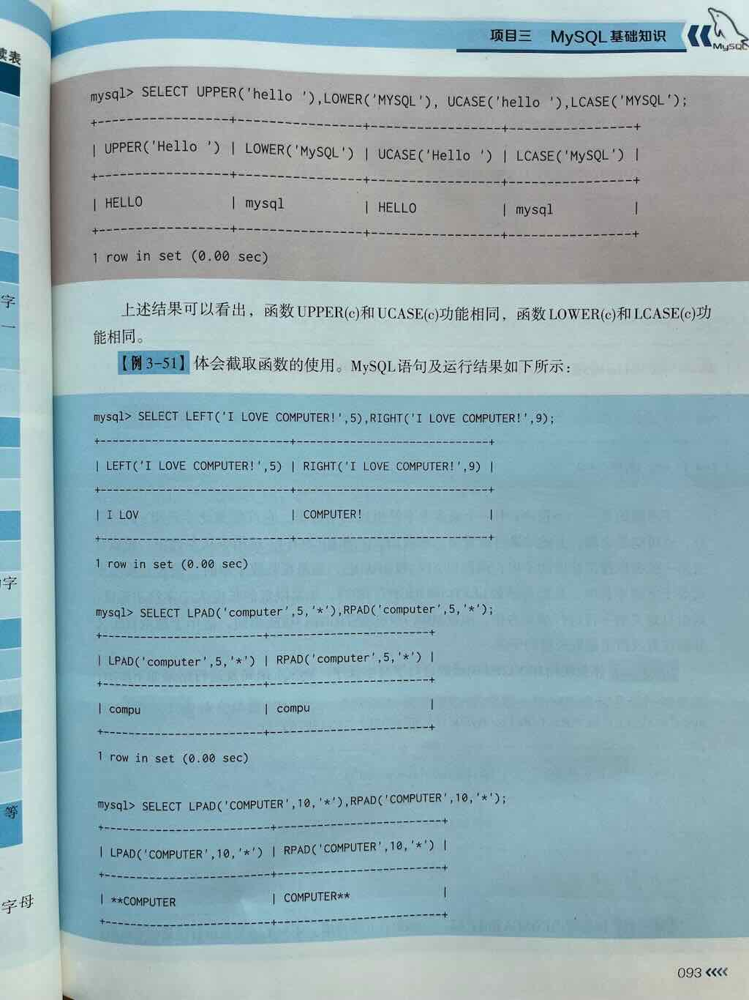
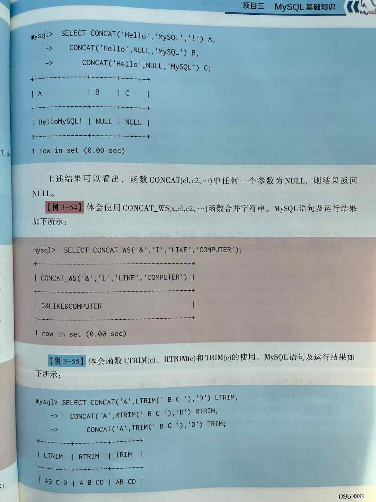
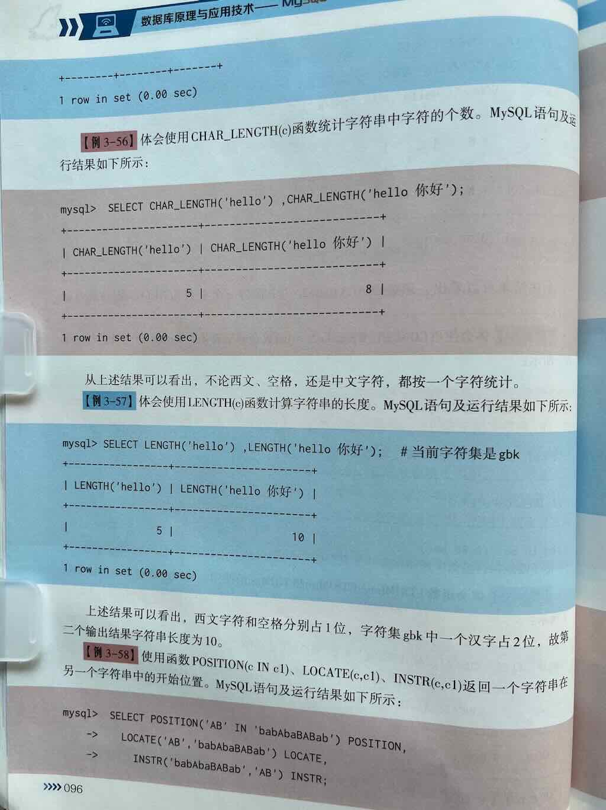
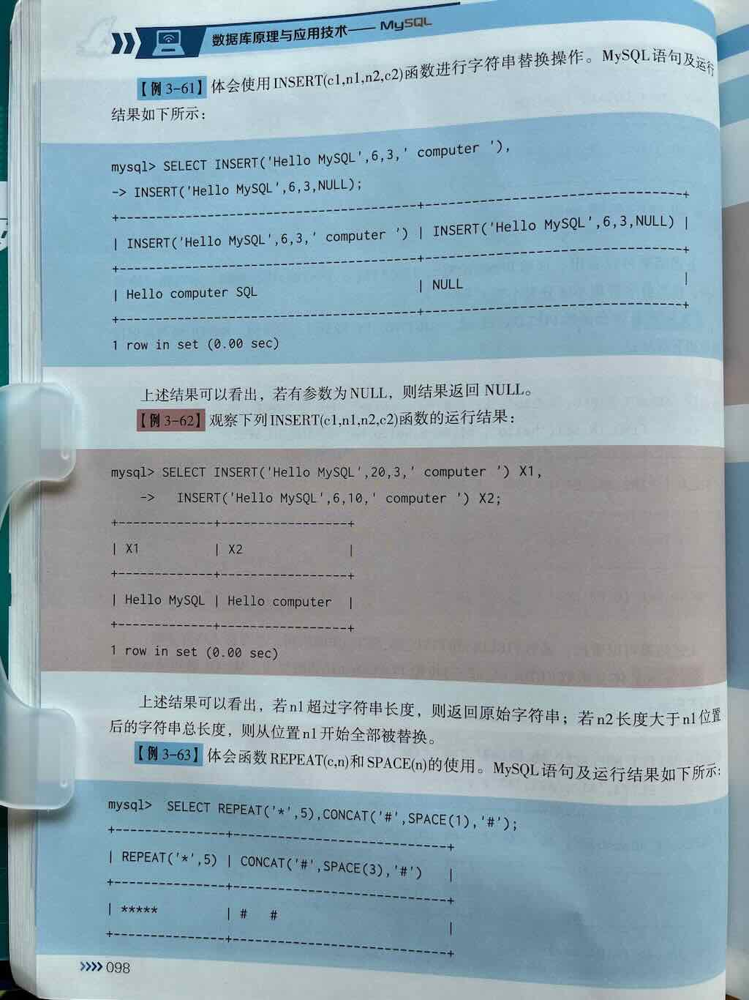

# MySQL 中常见字符串函数的用法详解

在 MySQL 中，**字符串函数（String Functions）** 是用于对 **字符串（VARCHAR, CHAR, TEXT 等类型）进行各种操作** 的内置函数，它们在数据清洗、格式化、搜索、拼接、截取等场景中非常常用。

掌握这些函数可以帮助你：

- 🔤 对字符串进行**拼接、截取、大小写转换**
- ✂️ 进行**子串提取、查找、替换**
- 🧹 实现**去除空格、格式化、填充**
- 🔍 支持**模糊查询、字符串匹配、编码处理**

---
 
 
 
 
 
 
 
 
 
## 🧩 一、字符串拼接类函数

### 1. `CONCAT(str1, str2, ...)` —— 拼接多个字符串

**作用：** 将多个字符串拼接成一个字符串

```sql
SELECT CONCAT('Hello', ' ', 'MySQL');  -- 结果：'Hello MySQL'
```

**示例（字段拼接）：**
```sql
SELECT CONCAT(first_name, ' ', last_name) AS full_name FROM users;
```

---

### 2. `CONCAT_WS(separator, str1, str2, ...)` —— 带分隔符的拼接

**作用：** 使用指定的分隔符 `separator` 拼接多个字符串

```sql
SELECT CONCAT_WS('-', '2024', '06', '01');  -- 结果：'2024-06-01'
```

**应用场景：** 拼接日期、姓名、地址等带分隔内容

---

## 📏 二、字符串长度与信息类函数

### 3. `LENGTH(str)` —— 返回字符串的字节长度

```sql
SELECT LENGTH('你好');    -- 结果：6（UTF-8 下每个中文占 3 字节）
SELECT LENGTH('abc');     -- 结果：3
```

> ⚠️ 注意：`LENGTH()` 返回的是**字节长度**，不是字符数！

---

### 4. `CHAR_LENGTH(str)` 或 `CHARACTER_LENGTH(str)` —— 返回字符串的**字符数**

```sql
SELECT CHAR_LENGTH('你好');   -- 结果：2（2个字符）
SELECT CHAR_LENGTH('abc');    -- 结果：3
```

> ✅ 推荐在需要统计**字符个数**时使用（如用户名长度、昵称等）

---

## 🔤 三、大小写转换类函数

### 5. `UPPER(str)` 或 `UCASE(str)` —— 转换为大写字母

```sql
SELECT UPPER('hello');   -- 结果：'HELLO'
```

---

### 6. `LOWER(str)` 或 `LCASE(str)` —— 转换为小写字母

```sql
SELECT LOWER('HELLO');   -- 结果：'hello'
```

---

## ✂️ 四、字符串截取类函数

### 7. `SUBSTRING(str, pos, len)` 或 `SUBSTR(str, pos, len)`

**作用：** 从字符串 `str` 的指定位置 `pos` 开始，截取长度为 `len` 的子串

- **pos 可以是正数（从左开始）或负数（从右开始）**
- **len 是可选的，不填则截取到末尾**

```sql
SELECT SUBSTRING('Hello MySQL', 7);       -- 结果：'MySQL'（从第7个字符开始）
SELECT SUBSTRING('Hello MySQL', 1, 5);    -- 结果：'Hello'
SELECT SUBSTRING('Hello MySQL', -5);      -- 结果：'MySQL'（倒数第5个字符开始）
```

---

### 8. `LEFT(str, len)` —— 从左边开始截取指定长度

```sql
SELECT LEFT('Hello MySQL', 5);  -- 结果：'Hello'
```

---

### 9. `RIGHT(str, len)` —— 从右边开始截取指定长度

```sql
SELECT RIGHT('Hello MySQL', 5);  -- 结果：'MySQL'
```

---

## 🔍 五、字符串查找与位置类函数

### 10. `LOCATE(substr, str)` 或 `INSTR(str, substr)` —— 查找子串位置

**作用：** 返回 `substr` 在 `str` 中第一次出现的**位置（从1开始）**，找不到返回 0

```sql
SELECT LOCATE('My', 'Hello MySQL');    -- 结果：7
SELECT INSTR('Hello MySQL', 'My');     -- 结果：7（与 LOCATE 顺序相反）
```

---

### 11. `POSITION(substr IN str)` —— 类似 LOCATE（标准 SQL 写法）

```sql
SELECT POSITION('My' IN 'Hello MySQL');  -- 结果：7
```

---

## 🔧 六、字符串替换类函数

### 12. `REPLACE(str, old_str, new_str)` —— 替换子串

**作用：** 将字符串中的 `old_str` 替换为 `new_str`

```sql
SELECT REPLACE('Hello MySQL', 'MySQL', 'World');  -- 结果：'Hello World'
```

**应用场景：** 数据脱敏、统一替换敏感词、格式标准化

---

## 🧼 七、字符串去除与填充类函数

### 13. `TRIM([remstr FROM] str)` —— 去除字符串两端空格或指定字符

```sql
SELECT TRIM('   Hello   ');             -- 结果：'Hello'
SELECT TRIM(BOTH 'x' FROM 'xxxHelloxxx'); -- 结果：'Hello'
```

- `LTRIM(str)`：去除左边空格
- `RTRIM(str)`：去除右边空格

---

### 14. `LPAD(str, len, padstr)` / `RPAD(str, len, padstr)` —— 左填充 / 右填充

**作用：** 用指定字符 `padstr` 将字符串填充到指定长度 `len`

```sql
SELECT LPAD('Hi', 5, '*');    -- 结果：'**Hi'（左边填充到总长为5）
SELECT RPAD('Hi', 5, '*');    -- 结果：'Hi***'（右边填充）
```

> ✅ 应用于：格式化输出、编号补零等场景

---

## 🆔 八、字符串格式化与编码类函数

### 15. `FORMAT(X, D)` —— 数字格式化（带千分位，返回字符串）

```sql
SELECT FORMAT(1234567.89, 2);  -- 结果：'1,234,567.89'
```

> ⚠️ 注意：虽然常用于数字，但返回的是**格式化后的字符串**

---

### 16. `ASCII(str)` —— 返回字符串第一个字符的 ASCII 码

```sql
SELECT ASCII('A');  -- 结果：65
```

---

### 17. `CHAR(N)` —— 根据 ASCII 码返回对应字符

```sql
SELECT CHAR(65);  -- 结果：'A'
```

---

## ✅ 常用字符串函数速查表

| 函数 | 说明 | 示例 | 结果 |
|------|------|------|------|
| `CONCAT(str1, str2)` | 拼接字符串 | `CONCAT('Hello', 'MySQL')` | `'HelloMySQL'` |
| `CONCAT_WS('-', str1, str2)` | 带分隔符拼接 | `CONCAT_WS('-', '2024', '06')` | `'2024-06'` |
| `LENGTH(str)` | 字节长度 | `LENGTH('你好')` | `6`（UTF-8） |
| `CHAR_LENGTH(str)` | 字符个数 | `CHAR_LENGTH('你好')` | `2` |
| `UPPER(str)` | 转大写 | `UPPER('abc')` | `'ABC'` |
| `LOWER(str)` | 转小写 | `LOWER('ABC')` | `'abc'` |
| `SUBSTRING(str, pos, len)` | 截取子串 | `SUBSTRING('abcde', 2, 3)` | `'bcd'` |
| `LEFT(str, len)` | 左侧截取 | `LEFT('abcde', 2)` | `'ab'` |
| `RIGHT(str, len)` | 右侧截取 | `RIGHT('abcde', 2)` | `'de'` |
| `LOCATE(substr, str)` | 查找位置 | `LOCATE('bc', 'abcde')` | `2` |
| `REPLACE(str, old, new)` | 替换子串 | `REPLACE('abab', 'ab', 'x')` | `'xx'` |
| `TRIM(str)` | 去两端空格 | `TRIM('  a  ')` | `'a'` |
| `LPAD(str, len, pad)` | 左填充 | `LPAD('Hi', 5, '*')` | `'**Hi'` |
| `RPAD(str, len, pad)` | 右填充 | `RPAD('Hi', 5, '*')` | `'Hi***'` |

---

# 📌 总结

| 功能类别 | 常用函数 | 用途简述 |
|----------|----------|----------|
| **拼接** | `CONCAT()`, `CONCAT_WS()` | 拼接多个字符串，支持分隔符 |
| **长度/字符数** | `LENGTH()`, `CHAR_LENGTH()` | 获取字节长度或字符个数 |
| **大小写转换** | `UPPER()`, `LOWER()` | 转换大小写 |
| **截取子串** | `SUBSTRING()`, `LEFT()`, `RIGHT()` | 提取部分字符串 |
| **查找位置** | `LOCATE()`, `INSTR()`, `POSITION()` | 查找子串位置 |
| **替换** | `REPLACE()` | 替换指定子串 |
| **去除空格/填充** | `TRIM()`, `LPAD()`, `RPAD()` | 清理或格式化字符串 |
| **格式化/编码** | `FORMAT()`, `ASCII()`, `CHAR()` | 数字格式化、字符编码处理 |

---

## ✅ 下一步建议

你可以尝试以下练习来巩固字符串函数的使用：

1. ✅ 使用 `CONCAT_WS` 拼接用户的姓和名，中间加空格
2. ✅ 用 `SUBSTRING` 提取邮箱的用户名部分（@ 之前）
3. ✅ 用 `REPLACE` 对敏感词进行脱敏处理（如将手机号中间4位替换为****）
4. ✅ 使用 `LEFT` + `RIGHT` 提取身份证的年份或地区码
5. ✅ 用 `TRIM` 清理用户输入的前后空格

---

如你希望获取：

- ✅ 这些函数的 **建表 + 数据 + 实战查询示例**
- ✅ 如何在 **WHERE 条件、ORDER BY、GROUP BY 中使用字符串函数**
- ✅ 或者与 **LIKE 模糊匹配、正则表达式 REGEXP 结合使用**

欢迎继续提问！我可以为你提供完整的 SQL 实战案例与详细解释。


### **MySQL 中 `CONCAT()` 函数详解**

`CONCAT()` 是 MySQL 中用于 **将多个字符串或字段值连接成一个字符串** 的核心函数，适用于数据格式化、动态拼接字段等场景。以下是其详细用法及示例。

---

### **一、基本语法**
```sql
CONCAT(str1, str2, ..., strN)
```
- **参数**：
  - `str1, str2, ..., strN`：可以是字符串字面量、字段名、表达式或 `NULL`。
  - 最少需要 **1 个参数**，最多支持 **255 个参数**。
- **返回值**：
  - 所有参数按顺序拼接后的字符串。
  - **若任一参数为 `NULL`，则整个结果为 `NULL`**（需特别注意）。

---

### **二、核心功能与示例**

#### **1. 基本字符串拼接**
```sql
SELECT CONCAT('Hello', ' ', 'World'); 
-- 输出：Hello World
```

#### **2. 字段值拼接**
```sql
-- 将 first_name 和 last_name 合并为全名
SELECT CONCAT(first_name, ' ', last_name) AS full_name 
FROM employees;
```
**输出示例**：
```
+-----------------+
| full_name       |
+-----------------+
| John Doe        |
| Jane Smith      |
+-----------------+
```

#### **3. 处理 NULL 值**
若参数中存在 `NULL`，结果将变为 `NULL`。需用 `COALESCE()` 或 `IFNULL()` 处理：
```sql
-- 使用 COALESCE 替换 NULL 为空字符串
SELECT CONCAT(
    COALESCE(first_name, ''), 
    ' ', 
    COALESCE(last_name, '')
) AS safe_full_name 
FROM employees;
```

---

### **三、与其他函数的结合使用**

#### **1. 与 `CONCAT_WS()` 的区别**
- **`CONCAT()`**：直接拼接所有参数，无分隔符。
- **`CONCAT_WS(separator, str1, str2, ...)`**：自动添加分隔符，忽略 `NULL`。
  ```sql
  SELECT CONCAT_WS('-', '2023', '10', '01');  -- 输出：2023-10-01
  SELECT CONCAT_WS(',', 'Apple', NULL, 'Banana');  -- 输出：Apple,Banana
  ```

#### **2. 与 `CAST()` 转换数据类型**
拼接非字符串类型（如数字、日期）时需显式转换：
```sql
-- 拼接字符串与数字
SELECT CONCAT('Order ID: ', CAST(order_id AS CHAR)) AS order_info 
FROM orders;
```

---

### **四、实际应用场景**

#### **场景 1：生成完整地址**
```sql
SELECT 
    CONCAT_WS(', ', 
        address, 
        city, 
        province, 
        postcode
    ) AS full_address 
FROM users;
```
**输出示例**：
```
+---------------------------------+
| full_address                    |
+---------------------------------+
| 123 Main St, Beijing, 100001    |
+---------------------------------+
```

#### **场景 2：动态生成日志格式**
```sql
-- 将日志时间和消息合并
SELECT 
    CONCAT(
        '[', 
        log_time, 
        '] ERROR: ', 
        message
    ) AS log_entry 
FROM system_logs;
```

#### **场景 3：处理多语言内容**
```sql
-- 中英文混合拼接
SELECT CONCAT('欢迎回来, ', username, '! Your last login: ', last_login) AS greeting 
FROM users;
```

---

### **五、注意事项**

#### **1. NULL 值处理**
- **默认行为**：任一参数为 `NULL`，结果即为 `NULL`。
- **解决方案**：
  - 使用 `COALESCE()` 替换 `NULL`：
    ```sql
    SELECT CONCAT(COALESCE(column1, ''), COALESCE(column2, ''));
    ```
  - 使用 `IFNULL()` 指定默认值：
    ```sql
    SELECT CONCAT(IFNULL(column1, 'N/A'), IFNULL(column2, ''));
    ```

#### **2. 性能优化**
- **避免大字段拼接**：对 `TEXT` 或 `BLOB` 类型频繁拼接可能影响性能。
- **预计算字段**：对高频拼接需求，可新增存储生成列：
  ```sql
  ALTER TABLE users 
  ADD COLUMN full_name VARCHAR(255) AS (CONCAT(first_name, ' ', last_name)) STORED;
  ```

#### **3. 字符集一致性**
- 确保所有参数的字符集兼容（如 `utf8mb4`），否则可能引发乱码：
  ```sql
  SELECT CONCAT(_utf8mb4 '中文', _utf8mb3 'text');  -- 可能出错
  ```

---

### **六、总结**
- **核心作用**：灵活拼接字符串，支持动态数据格式化。
- **最佳实践**：
  - 使用 `CONCAT_WS()` 简化分隔符处理。
  - 用 `COALESCE()` 或 `IFNULL()` 规避 `NULL` 问题。
  - 对高频拼接字段预计算存储。
- **适用场景**：
  - 地址、姓名、日志等字段拼接。
  - 动态生成报告内容。
  - 多语言混合内容处理。

掌握 `CONCAT()` 的使用技巧，可显著提升数据处理的灵活性和效率！


### **MySQL 中 `LEFT()` 函数详解**

`LEFT()` 是 MySQL 中用于从字符串 **左侧截取指定长度字符** 的函数，适用于提取固定格式数据的场景（如订单号前缀、身份证号前6位等）。以下是详细说明及用法示例。

---

### **一、语法与参数**
```sql
LEFT(str, length)
```
- **参数说明**：
  - `str`：原始字符串（可以是字段名或字符串字面量）。
  - `length`：要截取的字符数（必须是正整数）。
- **返回值**：
  - 从字符串左侧开始截取的子字符串。
  - 若 `length` 为 `0` 或负数，返回空字符串 `''`。
  - 若 `str` 为 `NULL`，返回 `NULL`。

---

### **二、核心功能与示例**

#### **1. 基础截取**
| **场景**               | **示例**                   | **输出结果**      | **说明**                     |
|------------------------|---------------------------|-------------------|-----------------------------|
| 截取前 N 个字符        | `LEFT('Hello World', 5)`  | `'Hello'`         | 截取前5个字符               |
| 长度等于字符串长度     | `LEFT('MySQL', 5)`        | `'MySQL'`         | 完整返回原字符串            |
| 长度超过字符串长度     | `LEFT('abc', 10)`         | `'abc'`           | 返回整个字符串              |
| 空字符串或长度为0      | `LEFT('', 3)`             | `''`              | 返回空字符串                |

#### **2. 多字节字符处理（如中文、Emoji）**
```sql
-- 示例字符串：'你好世界'（UTF-8 编码，每个中文字符占3字节）
SELECT LEFT('你好世界', 2);  -- 输出 '你好'（按字符计数，而非字节）
```

#### **3. 边界条件处理**
| **场景**               | **示例**                   | **输出结果**      |
|------------------------|---------------------------|-------------------|
| `length` 为负数        | `LEFT('Hello', -2)`       | `''`              |
| `length` 为0           | `LEFT('Hello', 0)`        | `''`              |
| `str` 为 `NULL`        | `LEFT(NULL, 3)`           | `NULL`            |

---

### **三、与 `SUBSTRING()` 的区别**
| **函数**       | **语法**                     | **特点**                          | **适用场景**               |
|----------------|------------------------------|-----------------------------------|----------------------------|
| `LEFT()`       | `LEFT(str, length)`          | 仅支持从左侧截取固定长度          | 提取固定前缀（如订单号）   |
| `SUBSTRING()`  | `SUBSTRING(str, start, len)` | 支持任意起始位置和长度            | 灵活截取任意位置的子字符串 |

---

### **四、实际应用场景**

#### **场景 1：提取身份证号前6位（行政区划代码）**
```sql
SELECT LEFT(id_card, 6) AS area_code FROM employees;
```

#### **场景 2：截取订单号前缀（如年月部分）**
```sql
-- 假设订单号格式为 '20231001-0001'
SELECT LEFT(order_no, 8) AS order_date FROM orders;
```

#### **场景 3：格式化手机号显示**
```sql
-- 显示前3位 + **** + 后4位（如 '138****5678'）
SELECT CONCAT(LEFT(phone, 3), '****', RIGHT(phone, 4)) AS masked_phone 
FROM users;
```

---

### **五、性能与注意事项**
1. **索引影响**：  
   - 在 `WHERE` 子句中直接使用 `LEFT()` 可能导致全表扫描。  
   - **优化方案**：  
     - 预存截取结果到新字段并建立索引。  
     - 使用函数索引（MySQL 8.0+）：  
       ```sql
       CREATE INDEX idx_area_code ON employees ((LEFT(id_card, 6)));
       ```

2. **多字节字符集**：  
   - `LEFT()` 按字符截取，而非字节。确保字符集支持（如 `utf8mb4`）。

3. **长度参数处理**：  
   - `length` 必须是正整数，否则返回空字符串或无效结果。

---

### **六、总结**
- **核心作用**：快速截取字符串左侧固定长度的内容。
- **最佳实践**：  
  - 处理固定格式数据（如日期、编码、前缀）。  
  - 结合 `CONCAT()` 或 `RIGHT()` 实现复杂格式化。  
- **适用场景**：  
  - 数据清洗（提取关键字段）。  
  - 敏感信息脱敏（隐藏部分内容）。  
  - 日志分析（截取固定格式的时间戳）。  

掌握 `LEFT()` 的使用方法，可以高效完成字符串截取需求，但需注意性能优化和字符集兼容性。


### **MySQL 的 `LENGTH()` 函数详解**

`LENGTH()` 是 MySQL 中用于计算字符串 **字节长度** 的函数。它返回字符串的存储字节数，而不是字符数量，因此其返回值会受到字符集的影响。以下是该函数的详细说明及用法示例。

---

### **1. 语法**
```sql
LENGTH(str)
```
- **参数**：  
  - `str`：需要计算长度的字符串。可以是字段名、字符串字面量或表达式。
  - 如果输入为 `NULL`，则返回 `NULL`。

---

### **2. 核心特性**
| **特性**                | **说明**                                                                 |
|-------------------------|--------------------------------------------------------------------------|
| **字节长度**            | 返回字符串占用的字节数（而非字符数）                                     |
| **字符集敏感**          | 不同字符集下，相同字符串的字节长度可能不同                               |
| **多字节字符处理**      | 对多字节字符（如中文、Emoji）会按实际编码计算字节数                       |
| **空格处理**            | 包含空格、换行符等空白字符时，会计算其字节长度                           |
| **二进制数据**          | 对二进制字符串（如 `BLOB`），直接返回字节长度                            |

---

### **3. 与 `CHAR_LENGTH()` 的区别**
| **函数**            | **返回值**       | **示例（字符串：'你好'）**                   |
|---------------------|------------------|---------------------------------------------|
| `LENGTH()`          | 字节长度         | 在 `utf8mb4` 字符集下返回 `6`（每个汉字占 3 字节） |
| `CHAR_LENGTH()`     | 字符数量         | 返回 `2`（两个汉字）                         |

---

### **4. 不同字符集的影响**
#### **示例表**
```sql
-- 创建不同字符集的表
CREATE TABLE test_charset (
    str_latin1 VARCHAR(10) CHARACTER SET latin1,
    str_utf8mb4 VARCHAR(10) CHARACTER SET utf8mb4
);

-- 插入数据
INSERT INTO test_charset VALUES 
    ('abc', 'abc'),
    ('é', 'é'),          -- Latin1 字符
    ('hello', '你好');    -- 中文字符
```

#### **查询结果**
```sql
SELECT 
    str_latin1, 
    LENGTH(str_latin1) AS len_latin1,
    str_utf8mb4,
    LENGTH(str_utf8mb4) AS len_utf8mb4
FROM test_charset;
```

| `str_latin1` | `len_latin1` | `str_utf8mb4` | `len_utf8mb4` |
|--------------|--------------|---------------|---------------|
| `abc`        | 3            | `abc`         | 3             |
| `é`          | 1            | `é`           | 2             |
| `hello`      | 5            | `你好`        | 6             |

- **说明**：
  - `latin1` 字符集：每个字符占 1 字节。
  - `utf8mb4` 字符集：
    - 英文字符：1 字节。
    - 拉丁扩展字符（如 `é`）：2 字节。
    - 中文字符：3 字节。
    - Emoji：4 字节。

---

### **5. 常见使用场景**
#### **场景 1：验证存储限制**
```sql
-- 检查字段是否超出 VARCHAR(255) 的字节限制（假设为 utf8mb4）
SELECT 
    column_name,
    LENGTH(column_name) AS byte_length
FROM table
WHERE LENGTH(column_name) > 255 * 4;  -- utf8mb4 最大 4 字节/字符
```

#### **场景 2：处理二进制数据**
```sql
-- 计算 BLOB 字段的字节长度
SELECT 
    blob_column,
    LENGTH(blob_column) AS blob_size
FROM files;
```

#### **场景 3：数据清洗**
```sql
-- 去除末尾空格（需结合 TRIM）
UPDATE users 
SET username = TRIM(username)
WHERE LENGTH(username) != LENGTH(TRIM(username));
```

---

### **6. 注意事项**
1. **隐式类型转换**：  
   - 若输入为数值或日期，MySQL 会先将其转换为字符串再计算长度。  
     ```sql
     SELECT LENGTH(12345);        -- 输出 5（'12345' 的字节长度）
     SELECT LENGTH(CURDATE());    -- 输出 10（如 '2023-10-01'）
     ```

2. **NULL 值处理**：  
   - 输入为 `NULL` 时返回 `NULL`。  
     ```sql
     SELECT LENGTH(NULL);    -- 输出 NULL
     ```

3. **性能问题**：  
   - 对大表频繁使用 `LENGTH()` 可能导致全表扫描，建议结合索引优化。

---

### **7. 总结**
- **适用场景**：需精确计算存储空间时（如验证字段长度、处理二进制数据）。
- **避坑指南**：  
  - 若需统计字符数，使用 `CHAR_LENGTH()`。  
  - 注意字符集对计算结果的影响。  
  - 处理多语言文本时，优先使用 `utf8mb4` 字符集。  

掌握 `LENGTH()` 的使用方法，可以更精准地管理数据库存储和优化查询性能！


### **MySQL 中的 `LOCATE()` 函数详解**

`LOCATE()` 函数用于查找子字符串在字符串中的首次出现位置，支持指定起始搜索点，是处理字符串定位需求的核心工具。

---

### **一、语法与参数**
```sql
LOCATE(substr, str[, start_pos])
```
- **参数说明**：
  - `substr`：要查找的子字符串。
  - `str`：被搜索的主字符串。
  - `start_pos`（可选）：搜索起始位置（默认从第1位开始）。
- **返回值**：
  - 找到时返回首次出现的位置（从1开始计数）。
  - 未找到时返回 `0`。
  - 若 `substr` 为空字符串，返回 `1`。

---

### **二、基础用法示例**
#### **示例 1：查找简单子字符串**
```sql
SELECT LOCATE('World', 'Hello World');  -- 输出 7
```

#### **示例 2：指定起始位置**
```sql
SELECT LOCATE('o', 'Hello World', 5);   -- 从第5位开始，输出 5
```

#### **示例 3：子字符串不存在**
```sql
SELECT LOCATE('Python', 'MySQL');       -- 输出 0
```

#### **示例 4：空字符串处理**
```sql
SELECT LOCATE('', 'Database');          -- 输出 1
```

---

### **三、与相似函数的区别**
| **函数**       | **语法**                | **参数顺序** | **起始位置支持** | **标准兼容性**      |
|----------------|-------------------------|--------------|------------------|---------------------|
| `LOCATE()`     | `LOCATE(substr, str, start)` | substr 先     | ✅ 是           | MySQL 特有          |
| `INSTR()`      | `INSTR(str, substr)`    | str 先        | ❌ 否           | MySQL 特有          |
| `POSITION()`   | `POSITION(substr IN str)` | substr 先     | ❌ 否           | SQL 标准           |

---

### **四、实际应用场景**
#### **场景 1：邮箱格式验证**
```sql
-- 检查邮箱是否包含 '@' 和 '.'
SELECT 
    email,
    IF(LOCATE('@', email) > 0 AND LOCATE('.', email, LOCATE('@', email)) > 0, 
       '有效', 
       '无效') AS validity
FROM users;
```

#### **场景 2：提取 URL 域名**
```sql
-- 从 URL 中提取域名部分（如 'https://www.example.com/path' → 'www.example.com'）
SELECT 
    url,
    SUBSTRING(
        url, 
        LOCATE('//', url) + 2, 
        LOCATE('/', url, LOCATE('//', url) + 2) - (LOCATE('//', url) + 2)
    ) AS domain
FROM websites;
```

#### **场景 3：查找第 N 次出现的子字符串**
```sql
-- 查找字符串中第二个 'a' 的位置（如 'banana' → 4）
SET @str = 'banana';
SET @first_pos = LOCATE('a', @str);
SELECT LOCATE('a', @str, @first_pos + 1);  -- 输出 4
```

---

### **五、性能优化与注意事项**
1. **索引影响**：  
   - 在 `WHERE` 子句中直接使用 `LOCATE()` 可能导致全表扫描。
   - **优化方案**：预计算并存储关键位置值，或使用函数索引（MySQL 8.0+）。
     ```sql
     -- 创建函数索引
     CREATE INDEX idx_email_at ON users ((LOCATE('@', email)));
     ```

2. **大小写敏感性**：  
   - 结果受数据库校对规则（Collation）影响。
   - **示例**：若校对规则为 `utf8mb4_bin`，则区分大小写：
     ```sql
     SELECT LOCATE('A', 'apple');  -- 输出 0
     ```

3. **多字节字符处理**：  
   - 对中文、Emoji 等多字节字符，按实际字节计算位置。
     ```sql
     SELECT LOCATE('库', '数据库');  -- 输出 3（每个汉字占3字节，'数'1-3，'据'4-6，'库'7-9）
     ```

---

### **六、常见问题解答**
#### **Q1：如何反向查找子字符串（从右向左）？**
```sql
-- 使用 LENGTH() 和 REVERSE() 组合
SELECT LENGTH(str) - LOCATE(REVERSE(substr), REVERSE(str)) + 1 AS reverse_pos;
```

#### **Q2：如何统计子字符串出现的总次数？**
```sql
-- 通过循环或程序计算
SET @count = 0;
SET @start = 1;
WHILE @start > 0 DO
    SET @pos = LOCATE('a', 'banana', @start);
    IF @pos > 0 THEN
        SET @count = @count + 1;
        SET @start = @pos + 1;
    ELSE
        SET @start = 0;
    END IF;
END WHILE;
SELECT @count;  -- 输出 3
```

---

### **七、总结**
- **核心价值**：精准定位子字符串，支持复杂文本解析。
- **最佳实践**：  
  - 结合 `SUBSTRING()` 实现动态截取。  
  - 预计算关键位置提升查询性能。  
  - 注意字符集和校对规则的影响。  
- **适用场景**：数据清洗、格式验证、日志分析等。

### **MySQL 中 `LOWER()` 函数详解**

`LOWER()` 是 MySQL 中用于将字符串转换为全小写的函数，适用于数据规范化、大小写不敏感搜索等场景。以下是其详细说明及使用指南。

---

### **1. 基本语法**
```sql
LOWER(str)
```
- **参数**：  
  - `str`：需要转换的字符串，可以是字段名、字符串字面量或表达式。  
  - 如果 `str` 为 `NULL`，返回 `NULL`。
- **返回值**：全小写格式的字符串。

---

### **2. 核心功能**
| **场景**                | **输入示例**         | **输出结果**         | **说明**                          |
|-------------------------|---------------------|---------------------|-----------------------------------|
| 常规英文转换           | `LOWER('HELLO')`    | `'hello'`           | 大写字母转为小写                 |
| 符号和数字处理         | `LOWER('123!@#Ab')` | `'123!@#ab'`        | 非字母字符保持不变               |
| 多语言字符支持         | `LOWER('CAFÉ')`     | `'café'`            | 支持重音字符（依赖字符集）       |
| 中文字符处理           | `LOWER('你好')`     | `'你好'`            | 无大小写概念，原样返回           |
| 空值处理               | `LOWER(NULL)`       | `NULL`              | 输入为 `NULL` 时返回 `NULL`       |

---

### **3. 与 `LCASE()` 的关系**
- **等价性**：`LOWER()` 和 `LCASE()` 是 MySQL 中的同义词，功能完全相同。
- **示例**：
  ```sql
  SELECT LOWER('MYSQL'), LCASE('MYSQL');  -- 均输出 'mysql'
  ```

---

### **4. 字符集与多字节支持**
#### **支持的字符集**
- `latin1`（西欧语言）
- `utf8` / `utf8mb4`（多语言，包括 Emoji）
- `gbk`（中文字符集）

#### **多字节字符示例**
```sql
-- 德语字符
SELECT LOWER('ÄÖÜ');  -- 输出 'äöü'（依赖字符集配置）

-- 法语字符
SELECT LOWER('ÉÀÈ');  -- 输出 'éàè'

-- 中文字符
SELECT LOWER('数据库'); -- 输出 '数据库'
```

---

### **5. 实际应用场景**
#### **场景 1：数据规范化存储**
```sql
-- 将邮箱统一存储为小写
INSERT INTO users (email) VALUES (LOWER('User@Example.COM'));
-- 结果：user@example.com
```

#### **场景 2：不区分大小写的查询**
```sql
-- 查找忽略大小写的邮箱
SELECT * FROM users WHERE LOWER(email) = LOWER('ADMIN@EXAMPLE.COM');
```

#### **场景 3：格式化输出**
```sql
-- 生成全小写的报告标题
SELECT CONCAT(LOWER(title), ' - ', LOWER(author)) AS formatted_title 
FROM articles;
```

---

### **6. 性能与索引优化**
#### **潜在问题**
- **索引失效**：在 `WHERE` 子句中使用 `LOWER(column)` 可能导致无法使用索引。
  ```sql
  -- 低效写法（全表扫描）
  SELECT * FROM users WHERE LOWER(username) = 'admin';
  
  -- 优化方案：预先存储小写值
  ALTER TABLE users ADD COLUMN username_lower VARCHAR(255) AS (LOWER(username)) STORED;
  CREATE INDEX idx_username_lower ON users(username_lower);
  ```

#### **函数索引（MySQL 8.0+）**
```sql
-- 创建基于小写的函数索引
CREATE INDEX idx_lower_username ON users ((LOWER(username)));
```

---

### **7. 与其他函数的结合使用**
#### **示例 1：拼接全小写姓名**
```sql
SELECT CONCAT(LOWER(first_name), ' ', LOWER(last_name)) AS full_name 
FROM employees;
```

#### **示例 2：提取域名并小写**
```sql
SELECT LOWER(SUBSTRING(email, LOCATE('@', email) + 1)) AS domain 
FROM users;
```

---

### **8. 注意事项**
1. **校对规则（Collation）**：  
   - 若校对规则为大小写不敏感（如 `utf8mb4_general_ci`），直接比较可能无需 `LOWER()`。
   - 明确大小写敏感时使用 `utf8mb4_bin`。

2. **性能开销**：  
   - 对大字段（如 `TEXT`）频繁使用 `LOWER()` 可能影响性能。

3. **二进制数据**：  
   - 对 `BINARY` 或 `BLOB` 类型数据，`LOWER()` 可能无法正确转换。

---

### **总结**
- **核心作用**：规范化文本格式，支持跨大小写查询。
- **适用场景**：数据清洗、报告生成、不区分大小写的搜索。
- **避坑指南**：  
  - 优先在插入数据时转换格式，而非查询时。  
  - 结合索引策略优化性能。  
  - 注意字符集和校对规则的影响。  

掌握 `LOWER()` 的用法，可以显著提升文本处理的灵活性和效率！


### **MySQL 中的 `RIGHT()` 函数详解**

`RIGHT()` 函数用于从字符串的 **右侧（末尾）** 提取指定数量的字符，适用于需要截取固定后缀或末尾数据的场景。以下是其详细说明及使用指南。

---

### **一、语法与参数**
```sql
RIGHT(str, length)
```
- **参数说明**：
  - `str`：原始字符串（可以是字段名或字符串字面量）。
  - `length`：要截取的字符数（必须为正整数）。
- **返回值**：
  - 从字符串右侧开始截取的子字符串。
  - 若 `length` 为 `0` 或负数，返回空字符串 `''`。
  - 若 `str` 为 `NULL`，返回 `NULL`。

---

### **二、核心功能与示例**

#### **1. 基础截取**
| **场景**               | **示例**                   | **输出结果**      | **说明**                     |
|------------------------|---------------------------|-------------------|-----------------------------|
| 截取后 N 个字符        | `RIGHT('Hello World', 5)` | `'World'`         | 截取末尾5个字符             |
| 长度等于字符串长度     | `RIGHT('MySQL', 5)`       | `'MySQL'`         | 完整返回原字符串            |
| 长度超过字符串长度     | `RIGHT('abc', 10)`        | `'abc'`           | 返回整个字符串              |
| 空字符串或长度为0      | `RIGHT('', 3)`            | `''`              | 返回空字符串                |

#### **2. 多字节字符处理（如中文、Emoji）**
```sql
-- 示例字符串：'你好世界'（UTF-8 编码，每个中文字符占3字节）
SELECT RIGHT('你好世界', 2);  -- 输出 '世界'（按字符计数，而非字节）
```

#### **3. 边界条件处理**
| **场景**               | **示例**                   | **输出结果**      |
|------------------------|---------------------------|-------------------|
| `length` 为负数        | `RIGHT('Hello', -2)`      | `''`              |
| `length` 为0           | `RIGHT('Hello', 0)`       | `''`              |
| `str` 为 `NULL`        | `RIGHT(NULL, 3)`          | `NULL`            |

---

### **三、与 `SUBSTRING()` 的关系**
`RIGHT()` 可以看作是 `SUBSTRING()` 的简化形式，以下两种写法等价：
```sql
-- 使用 RIGHT()
SELECT RIGHT('Hello World', 5);  -- 输出 'World'

-- 使用 SUBSTRING()
SELECT SUBSTRING('Hello World', -5);  -- 输出 'World'
```

---

### **四、实际应用场景**

#### **场景 1：提取文件扩展名**
```sql
-- 假设文件名格式为 'document.pdf'
SELECT RIGHT(file_name, 3) AS file_extension FROM files;
-- 结果示例：'pdf'
```

#### **场景 2：隐藏手机号中间四位**
```sql
-- 显示后四位（如 '138****5678'）
SELECT CONCAT('****', RIGHT(phone, 4)) AS masked_phone 
FROM users;
```

#### **场景 3：提取身份证号后4位（校验码）**
```sql
SELECT RIGHT(id_card, 4) AS check_code FROM employees;
```

---

### **五、性能与注意事项**
1. **索引影响**：  
   - 在 `WHERE` 子句中直接使用 `RIGHT()` 可能导致全表扫描。  
   - **优化方案**：  
     - 预存截取结果到新字段并建立索引。  
     - 使用函数索引（MySQL 8.0+）：  
       ```sql
       CREATE INDEX idx_file_extension ON files ((RIGHT(file_name, 3)));
       ```

2. **多字节字符集**：  
   - `RIGHT()` 按字符截取，而非字节。确保字符集支持（如 `utf8mb4`）。

3. **长度参数处理**：  
   - `length` 必须是正整数，否则返回空字符串或无效结果。

---

### **六、与其他函数的对比**
| **函数**       | **语法**                     | **特点**                          | **适用场景**               |
|----------------|------------------------------|-----------------------------------|----------------------------|
| `RIGHT()`      | `RIGHT(str, length)`         | 从右侧截取固定长度的字符          | 提取后缀（如扩展名、校验码）|
| `LEFT()`       | `LEFT(str, length)`          | 从左侧截取固定长度的字符          | 提取前缀（如日期、区号）   |
| `SUBSTRING()`  | `SUBSTRING(str, start, len)` | 灵活截取任意位置的子字符串        | 复杂截取需求               |

---

### **七、总结**
- **核心作用**：快速截取字符串右侧固定长度的内容。
- **最佳实践**：  
  - 处理固定格式数据（如文件扩展名、校验码）。  
  - 结合 `CONCAT()` 或 `LEFT()` 实现复杂格式化。  
- **适用场景**：  
  - 数据清洗（提取关键字段）。  
  - 敏感信息脱敏（隐藏部分内容）。  
  - 格式验证（检查文件类型）。  

掌握 `RIGHT()` 的使用方法，可以高效完成字符串截取需求，但需注意性能优化和字符集兼容性。


### **MySQL 中的 `RTRIM()` 函数详解**

`RTRIM()` 是 MySQL 中用于 **去除字符串右侧（末尾）空格或其他指定字符** 的函数，适用于数据清洗、格式化输出等场景。以下是其详细说明及使用指南。

---

### **一、基本语法**
```sql
RTRIM(str)
```
- **参数**：
  - `str`：需要处理的字符串（可以是字段名或字符串字面量）。
- **返回值**：
  - 去除右侧空格后的字符串。
  - 若 `str` 为 `NULL`，返回 `NULL`。

---

### **二、核心功能**
#### **1. 去除右侧空格**
| **输入示例**       | **输出结果**      | **说明**                     |
|--------------------|-------------------|-----------------------------|
| `RTRIM('  Test  ')` | `'  Test'`        | 仅去除右侧空格               |
| `RTRIM('MySQL   ')` | `'MySQL'`         | 末尾连续空格被清除           |
| `RTRIM(NULL)`       | `NULL`            | 输入为 `NULL` 时返回 `NULL`  |

#### **2. 与其他空白字符的关系**
- **默认行为**：`RTRIM()` **仅去除空格**，不处理其他空白字符（如换行符 `\n`、制表符 `\t`）。
- **扩展需求**：若需去除其他字符，需结合 `TRIM()` 函数：
  ```sql
  -- 去除右侧的换行符和制表符
  SELECT TRIM(TRAILING '\n\t' FROM 'Text\n\t');  -- 输出 'Text'
  ```

---

### **三、与相关函数的对比**
| **函数**       | **语法**                     | **功能**                          | **示例**                      |
|----------------|------------------------------|-----------------------------------|-------------------------------|
| `RTRIM()`      | `RTRIM(str)`                 | 仅去除右侧空格                    | `RTRIM('  Hi  ') → '  Hi'`    |
| `LTRIM()`      | `LTRIM(str)`                 | 仅去除左侧空格                    | `LTRIM('  Hi  ') → 'Hi  '`    |
| `TRIM()`       | `TRIM([选项] FROM str)`      | 可自定义去除方向及字符            | `TRIM(BOTH 'x' FROM 'xxSQLx') → 'SQL'` |

---

### **四、实际应用场景**
#### **场景 1：清理用户输入数据**
```sql
-- 注册时去除用户名的右侧空格
INSERT INTO users (username) VALUES (RTRIM('admin   '));
-- 存储结果：'admin'
```

#### **场景 2：格式化输出**
```sql
-- 生成无末尾空格的地址信息
SELECT CONCAT(RTRIM(city), ', ', RTRIM(province)) AS location 
FROM employees;
```

#### **场景 3：数据一致性校验**
```sql
-- 检查字段是否包含末尾空格
SELECT * FROM products 
WHERE RTRIM(product_name) != product_name;
```

---

### **五、性能与注意事项**
1. **索引影响**：  
   - 在 `WHERE` 子句中直接使用 `RTRIM()` 可能导致无法使用索引，引发全表扫描。
   - **优化方案**：  
     - 插入数据时预处理字段（如 `INSERT ... VALUES (RTRIM(input))`）。  
     - 创建生成列并建立索引（MySQL 5.7+）：  
       ```sql
       ALTER TABLE users 
       ADD COLUMN username_trimmed VARCHAR(255) AS (RTRIM(username)) STORED;
       CREATE INDEX idx_username_trimmed ON users(username_trimmed);
       ```

2. **字符集兼容性**：  
   - 不同字符集中“空格”的定义可能不同（如全角空格 `　`），`RTRIM()` 仅处理标准半角空格。

3. **多字节字符处理**：  
   - 对中文字符、Emoji 等无影响，仅作用于末尾空格。

---

### **六、总结**
- **核心作用**：清理字符串右侧的空格，确保数据一致性。
- **适用场景**：  
  - 用户输入清洗（如用户名、邮箱）。  
  - 格式化输出（如地址拼接）。  
  - 数据校验（检测非法空格）。  
- **替代方案**：  
  - 需去除其他字符时，使用 `TRIM(TRAILING 'chars' FROM str)`。  
  - 需去除所有空白字符时，结合正则表达式：  
    ```sql
    -- MySQL 8.0+ 支持 REGEXP_REPLACE
    SELECT REGEXP_REPLACE('Text\n\t', '[[:space:]]+$', '');
    ```

掌握 `RTRIM()` 的使用方法，可以高效处理字符串末尾空格问题，但需注意其局限性及性能影响！


### **MySQL 中 `SUBSTRING()` 函数详解**

`SUBSTRING()` 是 MySQL 中用于从字符串中提取子字符串的核心函数，支持灵活的位置和长度控制，适用于数据清洗、格式化输出等场景。以下是其详细说明及使用指南。

---

### **一、语法与参数**
```sql
SUBSTRING(str, start[, length])
-- 或
SUBSTRING(str FROM start [FOR length])
```
- **参数说明**：
  - `str`：待处理的字符串（可以是字段名或字符串字面量）。
  - `start`：起始位置（从 `1` 开始计数；负数表示从末尾倒数）。
  - `length`（可选）：截取长度（省略时截取到字符串末尾）。
- **返回值**：
  - 成功时返回子字符串。
  - 若 `str` 为 `NULL`，返回 `NULL`。
  - 若 `start` 超出字符串长度，返回空字符串 `''`。

---

### **二、核心功能与示例**

#### **1. 基础截取**
| **场景**               | **示例**                               | **输出结果**      | **说明**                     |
|------------------------|---------------------------------------|-------------------|-----------------------------|
| 指定起始位置和长度     | `SUBSTRING('Hello World', 7, 5)`      | `'World'`         | 从第7位开始截取5个字符      |
| 省略长度参数           | `SUBSTRING('Database', 4)`            | `'abase'`         | 从第4位截取到末尾           |
| 负数起始位置           | `SUBSTRING('Quadratically', -5)`      | `'ically'`        | 从倒数第5位截取到末尾       |
| 负数起始位置 + 长度    | `SUBSTRING('abcdef', -3, 2)`          | `'de'`            | 从倒数第3位截取2个字符      |

#### **2. 多字节字符处理（如中文、Emoji）**
```sql
-- 示例字符串：'你好世界'（UTF-8 编码，每个中文字符占3字节）
SELECT SUBSTRING('你好世界', 3, 2);  -- 输出 '世界'（按字符截取，而非字节）
```

#### **3. 参数边界处理**
| **场景**               | **示例**                               | **输出结果**      |
|------------------------|---------------------------------------|-------------------|
| `start` 超出字符串长度 | `SUBSTRING('abc', 5, 1)`              | `''`              |
| `start` 为0            | `SUBSTRING('abc', 0, 1)`              | `''`（视为无效）  |
| `length` 为负数        | `SUBSTRING('abc', 2, -1)`             | `''`              |

---

### **三、与相似函数的对比**
| **函数**         | **语法**                     | **功能**                      | **示例**                          |
|------------------|------------------------------|-------------------------------|-----------------------------------|
| `SUBSTRING()`    | `SUBSTRING(str, start, len)` | 灵活截取任意位置子字符串      | `SUBSTRING('MySQL', 3, 3) → 'SQL'` |
| `LEFT()`         | `LEFT(str, len)`             | 截取左侧指定长度的子字符串    | `LEFT('Hello', 3) → 'Hel'`         |
| `RIGHT()`        | `RIGHT(str, len)`            | 截取右侧指定长度的子字符串    | `RIGHT('World', 3) → 'rld'`        |
| `SUBSTR()`       | `SUBSTR(str, start, len)`    | `SUBSTRING()` 的同义词        | 功能与 `SUBSTRING()` 完全相同      |

---

### **四、实际应用场景**

#### **场景 1：提取关键信息**
```sql
-- 从 URL 中提取域名（如 'https://www.example.com/path' → 'www.example.com'）
SELECT 
    SUBSTRING(
        url, 
        LOCATE('//', url) + 2, 
        LOCATE('/', url, LOCATE('//', url) + 2) - (LOCATE('//', url) + 2)
    ) AS domain
FROM websites;
```

#### **场景 2：数据脱敏**
```sql
-- 隐藏手机号中间四位（如 '13812345678' → '138****5678'）
SELECT 
    CONCAT(
        LEFT(phone, 3), 
        '****', 
        SUBSTRING(phone, -4)
    ) AS masked_phone
FROM users;
```

#### **场景 3：动态截取日志**
```sql
-- 截取日志时间戳（如 '[2023-10-01] Error occurred' → '2023-10-01'）
SELECT 
    SUBSTRING(log_message, 2, 10) AS log_date 
FROM system_logs
WHERE log_message LIKE '[____-__-__]%';
```

---

### **五、性能与注意事项**
1. **索引影响**：  
   - 在 `WHERE` 子句中直接使用 `SUBSTRING()` 可能导致全表扫描。  
   - **优化方案**：预计算并存储截取结果，或使用函数索引（MySQL 8.0+）。  
     ```sql
     -- 创建函数索引
     CREATE INDEX idx_domain ON websites ((SUBSTRING(url, LOCATE('//', url) + 2));
     ```

2. **多字节字符集**：  
   - `SUBSTRING()` 按字符截取，而非字节。确保字符集支持（如 `utf8mb4`）。

3. **NULL 值处理**：  
   - 若任一参数为 `NULL`，返回 `NULL`。  
     ```sql
     SELECT SUBSTRING(NULL, 1, 1);   -- 输出 NULL
     SELECT SUBSTRING('abc', NULL, 1); -- 输出 NULL
     ```

---

### **六、总结**
- **核心价值**：灵活截取子字符串，支持正向和逆向定位。
- **最佳实践**：  
  - 结合 `LOCATE()` 实现动态位置计算。  
  - 预存截取结果以优化查询性能。  
- **适用场景**：数据清洗、日志分析、敏感信息脱敏。

### **MySQL 中 `UPPER()` 函数详解**

`UPPER()` 是 MySQL 中用于将字符串转换为全大写的函数。它适用于规范化数据格式或执行不区分大小写的查询。以下是该函数的详细说明及使用场景。

---

### **1. 基本语法**
```sql
UPPER(str)
```
- **参数**：  
  - `str`：需要转换的字符串，可以是字段名、字符串字面量或表达式。  
  - 如果 `str` 为 `NULL`，返回 `NULL`。
- **返回值**：全大写格式的字符串。

---

### **2. 核心功能**
| **场景**                | **输入示例**         | **输出结果**         | **说明**                          |
|-------------------------|---------------------|---------------------|-----------------------------------|
| 常规英文转换           | `UPPER('Hello')`    | `'HELLO'`           | 小写字母转为大写                 |
| 符号和数字处理         | `UPPER('123!@#aB')` | `'123!@#AB'`        | 非字母字符保持不变               |
| 多语言字符支持         | `UPPER('café')`     | `'CAFÉ'`            | 支持重音字符（依赖字符集）       |
| 中文字符处理           | `UPPER('你好')`     | `'你好'`            | 无大小写概念，原样返回           |
| 空值处理               | `UPPER(NULL)`       | `NULL`              | 输入为 `NULL` 时返回 `NULL`       |

---

### **3. 与 `UCASE()` 的关系**
- **等价性**：`UPPER()` 和 `UCASE()` 是 MySQL 中的同义词，功能完全相同。
- **示例**：
  ```sql
  SELECT UPPER('mysql'), UCASE('mysql');  -- 均输出 'MYSQL'
  ```

---

### **4. 字符集与多字节支持**
#### **支持的字符集**
- `latin1`（西欧语言）
- `utf8` / `utf8mb4`（多语言，包括 Emoji）
- `gbk`（中文字符集）

#### **多字节字符示例**
```sql
-- 德语字符
SELECT UPPER('äöüß');  -- 输出 'ÄÖÜSS'（依赖字符集配置）

-- 法语字符
SELECT UPPER('éàè');   -- 输出 'ÉÀÈ'

-- 中文字符
SELECT UPPER('数据库'); -- 输出 '数据库'
```

---

### **5. 实际应用场景**
#### **场景 1：数据规范化存储**
```sql
-- 将用户名统一存储为大写
INSERT INTO users (username) VALUES (UPPER('john_doe'));
```

#### **场景 2：不区分大小写的查询**
```sql
-- 查找忽略大小写的用户名
SELECT * FROM users WHERE UPPER(username) = UPPER('Admin');
```

#### **场景 3：格式化输出**
```sql
-- 生成全大写的报告标题
SELECT CONCAT(UPPER(title), ' - ', UPPER(author)) AS formatted_title 
FROM articles;
```

---

### **6. 性能与索引优化**
#### **潜在问题**
- **索引失效**：在 `WHERE` 子句中使用 `UPPER(column)` 可能导致无法使用索引。
  ```sql
  -- 低效写法（全表扫描）
  SELECT * FROM users WHERE UPPER(username) = 'ADMIN';
  
  -- 优化方案：预先存储大写值
  ALTER TABLE users ADD COLUMN username_upper VARCHAR(255) AS (UPPER(username)) STORED;
  CREATE INDEX idx_username_upper ON users(username_upper);
  ```

#### **函数索引（MySQL 8.0+）**
```sql
-- 创建基于大写的函数索引
CREATE INDEX idx_upper_username ON users ((UPPER(username)));
```

---

### **7. 与其他函数的结合使用**
#### **示例 1：拼接全大写姓名**
```sql
SELECT CONCAT(UPPER(first_name), ' ', UPPER(last_name)) AS full_name 
FROM employees;
```

#### **示例 2：提取域名并大写**
```sql
SELECT UPPER(SUBSTRING(email, LOCATE('@', email) + 1)) AS domain 
FROM users;
```

---

### **8. 注意事项**
1. **校对规则（Collation）**：  
   - 若校对规则为大小写不敏感（如 `utf8mb4_general_ci`），直接比较可能无需 `UPPER()`。
   - 明确大小写敏感时使用 `utf8mb4_bin`。

2. **性能开销**：  
   - 对大字段（如 `TEXT`）频繁使用 `UPPER()` 可能影响性能。

3. **二进制数据**：  
   - 对 `BINARY` 或 `BLOB` 类型数据，`UPPER()` 可能无法正确转换。

---

### **总结**
- **核心作用**：规范化文本格式，支持跨大小写查询。
- **适用场景**：数据清洗、报告生成、不区分大小写的搜索。
- **避坑指南**：  
  - 优先在插入数据时转换格式，而非查询时。  
  - 结合索引策略优化性能。  
  - 注意字符集和校对规则的影响。  

掌握 `UPPER()` 的用法，可以显著提升文本处理的灵活性和效率！


## 练习:字符串函数查询

1. 将邮箱名转换为全大写显示**
2. 提取员工编号的前缀字母（如D001中的D）
3. 从身份证号中提取出生年份（第7-10位）
4. 查找邮箱地址中@符号的位置
5. 去除职位字段右侧的空格（假设存在空格）
6. 反转显示员工姓名
7. 按自定义顺序排序部门（开发部 > 市场部 > 财务部）
8. 检查身份证号最后一位是否是字母X
9. 提取省份名称的前3个字符
10. 从邮箱中提取域名（@后的部分）
11. 将城市名称转换为全大写并反转显示
12. 显示员工编号的后3位数字（如D001中的001）
13. 计算身份证号的长度是否为18位
14. 查找员工姓名中第一个空格的位置
15. 按薪资降序排列，但优先显示开发部员工
16. 将员工姓名格式化为“名-姓”（假设姓名为“张伟”格式）
17. 检查邮箱是否以“.com”结尾
18. 提取身份证号的最后4位（掩码处理用）
19. 显示员工入职日期的年份平方值
20. 查找姓名中包含“强”字的员工
21. 按省份名称的倒序排列记录
22. 将薪资格式化为千分位（如12345.67 → 12,345.67）
23. 计算员工编号的数字部分（如D001 → 1）
24. 显示邮箱用户名部分（@前的部分）
25. 按城市名称的第2个字符排序
26. 将性别字段转换为大写字母缩写（男→M，女→F）
27. 检查身份证号第17位是否为奇数（判断性别）
28. 组合显示省份和城市（格式：广东-深圳）
29. 按邮箱域名的长度排序
30. 统计各部门名称的字符长度


## 参考答案

1.箱名转换为全大写显示

```sql
SELECT UPPER(em_name) AS uppercase_name FROM employees;
```

2. 提取员工编号的前缀字母（如D001中的D）

```sql
SELECT LEFT(em_id, 1) AS prefix FROM employees;
```

3. 从身份证号中提取出生年份（第7-10位）

```sql
SELECT SUBSTRING(id_card, 7, 4) AS birth_year FROM employees;
```

4. 查找邮箱地址中@符号的位置

```sql
SELECT LOCATE('@', email) AS at_position FROM employees;
-- 或
SELECT POSITION('@' IN email) AS at_position FROM employees;
-- 或
SELECT INSTR(email, '@') AS at_position FROM employees;
```

5. 去除职位字段右侧的空格（假设存在空格）

```sql
SELECT RTRIM(job) AS trimmed_job FROM employees;
```

6. 反转显示员工姓名

```sql
SELECT REVERSE(em_name) AS reversed_name FROM employees;
```

7. 按自定义顺序排序部门（开发部 > 市场部 > 财务部）

```sql
SELECT * FROM employees
ORDER BY FIELD(department, '开发部', '市场部', '财务部', '人力部', '设计部', '行政部', '后勤部');
```

8. 检查身份证号最后一位是否是字母X

```sql
SELECT id_card, 
       IF(RIGHT(id_card, 1) = 'X', '是', '否') AS is_last_x
FROM employees;
```

9. 提取省份名称的前1个字符

```sql
SELECT LEFT(province, 3) AS province_short FROM employees;
```

10. 从邮箱中提取域名（@后的部分）

```sql
SELECT SUBSTRING(email, LOCATE('@', email) + 1) AS domain FROM employees;
```

11. 将城市名称转换为全大写并反转显示

```sql
SELECT REVERSE(UCASE(city)) AS reversed_uppercase_city FROM employees;
```

12. 显示员工编号的后3位数字（如D001中的001）

```sql
SELECT SUBSTRING(em_id, 2, 3) AS number_part FROM employees;
```

13. 计算身份证号的长度是否为18位

```sql
SELECT id_card, 
       IF(LENGTH(id_card) = 18, '有效', '无效') AS validity
FROM employees;
```

14. 查找员工姓名中第一个空格的位置

```sql
SELECT em_name, LOCATE(' ', em_name) AS space_position FROM employees;
```

15. 按薪资降序排列，但优先显示开发部员工

```sql
SELECT * FROM employees
ORDER BY FIELD(department, '开发部') DESC, salary DESC;
```

16. 将员工姓名格式化为“名-姓”（假设姓名为“张伟”格式）

```sql
SELECT CONCAT(SUBSTRING(em_name, 2), '-', LEFT(em_name, 1)) AS formatted_name 
FROM employees;
```

17. 检查邮箱是否以“.com”结尾

```sql
SELECT email, 
       IF(SUBSTRING(email, -4) = '.com', '是', '否') AS is_com 
FROM employees;
```

18. 提取身份证号的最后4位（掩码处理用）

```sql
SELECT RIGHT(id_card, 4) AS last_four_digits FROM employees;
```

19. 显示员工入职日期的年份平方值

```sql
SELECT YEAR(hiredate) AS hire_year, 
       POW(YEAR(hiredate), 2) AS year_squared 
FROM employees;
```

20. 查找姓名中包含“强”字的员工

```sql
SELECT * FROM employees
WHERE LOCATE('强', em_name) > 0;
```

21. 按省份名称的倒序排列记录

```sql
SELECT * FROM employees
ORDER BY REVERSE(province);
```

22. 将薪资格式化为千分位（如12345.67 → 12,345.67）

```sql
SELECT FORMAT(salary, 2) AS formatted_salary FROM employees;
```

23. 计算员工编号的数字部分（如D001 → 1）

```sql
SELECT SUBSTRING(em_id, 2) AS numeric_part FROM employees;
```

24. 显示邮箱用户名部分（@前的部分）

```sql
SELECT SUBSTRING(email, 1, LOCATE('@', email)-1) AS username FROM employees;
```

25. 按城市名称的第2个字符排序

```sql
SELECT * FROM employees
ORDER BY SUBSTRING(city, 2, 1);
```

26. 将性别字段转换为大写字母缩写（男→M，女→F）

```sql
SELECT UPPER(LEFT(gender, 1)) AS gender_code FROM employees;
```

27. 检查身份证号第17位是否为奇数（判断性别）

```sql
SELECT id_card,
       IF(SUBSTRING(id_card, 17, 1) % 2 = 1, '男', '女') AS gender_check
FROM employees;
```

28. 组合显示省份和城市（格式：广东-深圳）

```sql
SELECT CONCAT(province, '-', city) AS location FROM employees;
```

29. 按邮箱域名的长度排序

```sql
SELECT email,
       LENGTH(SUBSTRING(email, LOCATE('@', email)+1)) AS domain_length
FROM employees
ORDER BY domain_length;
```

30. 统计各部门名称的字符长度

```sql
SELECT department, LENGTH(department) AS dept_name_length 
FROM employees
GROUP BY department;
```


## 1.查询字节长度

length()

用途：查询字符的字节长度。

语法

```sql
LENGTH(string)
```

参数

- string：必需。字符串

返回值：整数或NUll

- 整数：表示字符串的长度
- 0：查询失败

示例

```sql
SELECT LENGTH("SQL Tutorial") AS LengthOfString;
```

字符集

- gbk：使用2个字节存储一个汉字
- unicode：使用3个字节存储一个汉字


## 2.大小写转换

upper()

用途：将英文字符串转为全大写

语法

```sql
UPPER(英文文本)
```

参数

- 英文文本：必需

示例

```sql
SELECT UPPER('Hello'); -- 输出 'HELLO'
SELECT UCASE('mysql'); -- 输出 'MYSQL'
```

LOWER()
用途：将英文字符串转为全小写。

语法

```sql
lower(英文文本)
```

参数

- 英文文本：必须

示例  

```sql
SELECT LOWER('Hello WORLD');  -- 输出：hello world
SELECT LOWER('ÄÖÜ');         -- 输出：äöü（支持多语言字符）
```

使用场景

```sql
-- 插入数据时统一存储小写
INSERT INTO users (username) VALUES (LOWER('Admin123'));

-- 查找忽略大小写的用户名
SELECT * FROM users WHERE LOWER(username) = LOWER('admin');

-- 将标题转为小写格式
SELECT LOWER(title) AS lowercase_title FROM articles;

-- 批量更新邮箱为小写
UPDATE employees 
SET email = LOWER(email) 
WHERE email REGEXP '[A-Z]';  -- 仅处理含大写字母的记录
```

## 3.删除空格

rtrim()

用途：删除字符串尾随空格。

语法

```sql
RTRIM(string)
```

参数

- string：必须，要删除空格的字符串

示例

```sql
SELECT RTRIM("SQL Tutorial     ") AS RightTrimmedString;
```

## 4.反转字符

reverse()

用途：反转字符串字符顺序。

语法

```sql
REVERSE(string)
```

参数

- string：必须，要反转顺序的字符串

示例

```sql
SELECT REVERSE("SQL Tutorial");
```


## 5.自定义排序

field()

用途：返回值列表中值的索引位置。

注意：如果在值列表中找不到指定的值，则此函数将返回0。如果值为null，则此函数将返回0。

语法

```sql
FIELD(value, val1, val2, val3, ...)
```

参数

- value：必须，要查的值
- val1：值列表

示例

```sql
SELECT FIELD("q", "s", "q", "l");-- 输出 2
```

## 6.提取字符串

left()

用途：从左起截取-指定长度字符

语法

```sql
LEFT(str, length)
```

参数

- str：必需，指定提取的字符串
- length：必需。要提取的字符数。如果此参数大于字符串中的字符数，则此功能将返回全部字符串

示例：  

```sql
SELECT LEFT('ABCDE', 3); -- 输出 'ABC'
```

right()

substring()
用途：从指定位置截取字符串

语法

```sql
SUBSTRING(str, start, [length])
```

参数

- str：必需，要截取的字符串。
- start ：必需的。开始位置。可以是正数或负数。如果是正数，则此函数从字符串的开头提取。如果是负数，则此函数从字符串的末端提取
- [length]：可选。要提取的字符数。如果省略，将返回整个字符串（从开始位置）

示例

```sql
SELECT SUBSTRING('Hello World', 7);    -- 输出 'World'
SELECT SUBSTRING('Hello World', 7, 3); -- 输出 'Wor'
```

## 7.查询字符位置

locate()
用途：返回子字符串首次出现的位置（可指定起始点）。如果在原始字符串中找不到子字符串，则此功能返回0。大小写不敏感。

注意：如果在值列表中找不到指定的值，则此函数将返回0。如果值为null，则此函数将返回0。

语法

```sql
LOCATE(子字符串, 主字符串, [start])
```

参数

- substring：必需的。子字符串

- string：必需的。主字符串

- [start]: 可选。搜索的开始位置。位置1默认

示例

```sql
SELECT LOCATE("3", "W3Schools.com") AS MatchPosition;
SELECT LOCATE("com", "W3Schools.com", 3) AS MatchPosition;
SELECT LOCATE('lo', 'Hello'); -- 输出 4（从第1位开始找）
SELECT LOCATE('o', 'Hello', 5); -- 输出 5
```

1. 默认从第1个字符开始搜索

```sql
SELECT LOCATE('o', 'Hello World! Welcome to MySQL.');
-- 结果：5（第一个 'o' 的位置）
```

2. 指定从第6个字符开始搜索

```sql
SELECT LOCATE('o', 'Hello World! Welcome to MySQL.', 6);
-- 结果：8（从第6个字符开始后的第一个 'o' 的位置）
```

3. 子字符串不存在时返回0

```sql
SELECT LOCATE('Python', 'Hello World! Welcome to MySQL.', 1);
-- 结果：0（未找到）
```

4. 指定起始位置超过字符串长度

```sql
SELECT LOCATE('o', 'Hello World! Welcome to MySQL.', 30);
-- 结果：0（字符串总长度小于30）
```

---

 **关键特性**

| **场景**                  | **结果** | **说明**                            |
| ------------------------- | -------- | ----------------------------------- |
| `start` 是正整数且有效    | 位置值   | 返回从 `start` 位置后的首次匹配位置 |
| `start` 是0或负数         | 0        | 无效参数，直接返回0                 |
| `start` 超出字符串长度    | 0        | 搜索范围超出实际内容                |
| 子字符串为空字符串 (`''`) | 1        | 空字符串在任何位置都被认为存在      |

---

position()

用途：返回字符串中第一次出现的位置。如果在原始字符串中找不到子字符串，则此功能返回0。


语法

```sql
POSITION(子字符串 IN 主字符串)
```

参数

- substring：必需的。在字符串中搜索的子字符串
- string：必需的。将要搜索的原始字符串

示例

```sql
SELECT POSITION("3" IN "W3Schools.com") AS MatchPosition;
SELECT POSITION('@' IN 'user@example.com'); -- 输出 5
```


instr() 
用途：instr（）函数返回另一个字符串中首次出现字符串的位置。不区分大小写

语法

```sql
INSTR(主字符串, 子字符串)
```

参数

- stinrg1：必需的。主字符串
- sting2：必需的。子字符串。如果找不到字符串2，此功能返回0

示例

```sql
SELECT INSTR('Hello', 'el'); -- 输出 2
```


## 8.**关键区别与适用场景**  

| **函数**         | **特点**                     | **典型应用场景**                 |
| ---------------- | ---------------------------- | -------------------------------- |
| `UPPER/UCASE`    | 统一数据格式                 | 用户输入标准化、不区分大小写查询 |
| `LEFT/SUBSTRING` | 精准提取部分数据             | 截取编码、日期、关键词           |
| `REVERSE`        | 反转字符顺序                 | 生成镜像文本、特殊加密逻辑       |
| `FIELD`          | 自定义排序优先级             | 业务规则排序（如状态顺序）       |
| `LOCATE/INSTR`   | 子串位置查找（参数顺序不同） | 解析邮箱、URL、关键词定位        |


## 9.**常见应用**  

1. **组合使用**：  

   ```sql
   -- 提取邮箱用户名（@前的部分）
   SELECT SUBSTRING(email, 1, LOCATE('@', email)-1) FROM users;
   ```

2. **处理空值**：  

   ```sql
   -- 安全截取（避免空值报错）
   SELECT SUBSTRING(COALESCE(column, ''), 1, 5) FROM table;
   ```

3. **动态排序**：  

   ```sql
   -- 按自定义部门顺序排序
   SELECT * FROM employees
   ORDER BY FIELD(department, '开发部', '市场部', '财务部');
   ```