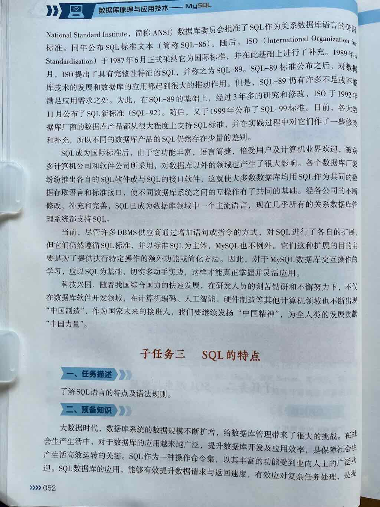
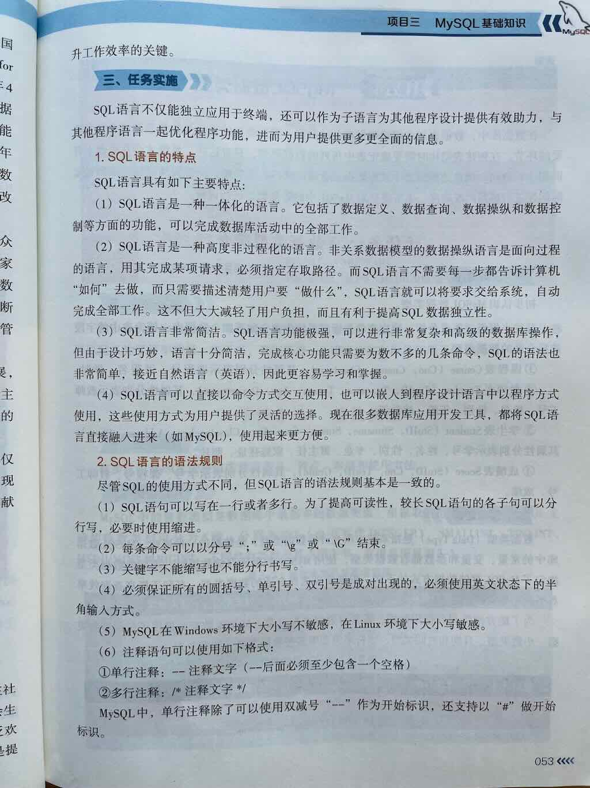

## 结构化查询语言

 
 
 
 

 


而 **MySQL 语言**，本质上就是我们在 MySQL 中使用的 **SQL（Structured Query Language，结构化查询语言）**，它用于**定义、操作、查询和管理数据库中的数据**。

---

## 🎯 一句话总结：

> **MySQL 语言的完整组成，既包括 SQL 的标准功能模块（DDL、DML、DQL、DCL、TCL），也包括一系列基础语法元素（如数据类型、运算符、函数、表达式、注释等）。它们共同构成了 MySQL 操作数据库的完整语法体系，缺一不可。**

---

## 🧩 一、MySQL 语言的整体组成结构（层次清晰版）

我们可以从两个层面来理解 MySQL 语言的完整组成：

---

## 第一层：按功能用途划分（SQL 五大核心模块）

| 分类 | 全称 | 中文名 | 主要作用 | 是否必学 |
|------|------|--------|----------|---------|
| **1. DDL** | Data Definition Language | 数据定义语言 | 定义和管理数据库、表、字段、索引、约束等结构 | ✅ 必学 |
| **2. DML** | Data Manipulation Language | 数据操作语言 | 对表中的数据进行增（INSERT）、删（DELETE）、改（UPDATE） | ✅ 必学 |
| **3. DQL** | Data Query Language | 数据查询语言 | 查询数据，支持条件、排序、分组、聚合、多表连接等 | ✅ 必学（重点！） |
| **4. DCL** | Data Control Language | 数据控制语言 | 控制用户权限，如授权、收回权限 | ⚠️ 重要（多用户/生产环境） |
| **5. TCL** | Transaction Control Language | 事务控制语言 | 控制事务的提交与回滚，保证数据一致性 | ⚠️ 进阶（金融/订单类业务） |

> ✅ 这是 MySQL 语言最经典的 **功能模块分类方式**，也是学习 SQL 功能时的逻辑框架。

---

## 第二层：基础语法元素（极易被忽略但极其重要的底层组成）

这些是构成 SQL 语句的“基石”，在 DDL、DML、DQL 等所有模块中都会用到👇：

| 类别 | 说明 | 是否必学 | 包含内容 |
|------|------|---------|----------|
| **1. 数据类型（Data Types）** | 定义字段/变量存储的数据类型，如整数、字符串、日期等 | ✅ 必学 | `INT`, `VARCHAR`, `DECIMAL`, `DATE`, `DATETIME` 等 |
| **2. 运算符（Operators）** | 用于表达式中的计算、比较、逻辑判断 | ✅ 必学 | 算术、比较、逻辑、连接符、特殊比较（如 `LIKE`, `IN`） |
| **3. 表达式（Expressions）** | 由字段、常量、函数、运算符组合而成的计算式 | ✅ 必学 | 如 `price * quantity`, `score + 10` |
| **4. 函数（Functions）** | 内置函数，用于计算、转换、处理数据 | ✅ 必学 | `COUNT()`, `SUM()`, `CONCAT()`, `NOW()`, `IF()` 等 |
| **5. 注释（Comments）** | 提高代码可读性 | ✅ 推荐 | `-- 单行注释`, `/* 多行注释 */` |
| **6. 常量（Literals）** | 固定值，如数字、字符串、日期等 | ✅ 必学 | `100`, `'Hello'`, `2024-06-01` |
| **7. 变量（Variables）** | 存储临时值（多用于存储过程/函数） | ⚠️ 进阶 | `SET @var = 10;` |
| **8. 控制结构（Control Structures）** | 如条件判断、循环（常见于存储过程/触发器） | ⚠️ 进阶 | `IF`, `CASE`, `LOOP`, `WHILE` |
| **9. 子查询（Subqueries）** | 查询中嵌套另一个查询 | ✅ 重要 | 用于复杂筛选、多表分析 |
| **10. 标识符（Identifiers）** | 如数据库名、表名、字段名等 | ✅ 基础 | 需遵循命名规则，可用反引号 `` ` `` 包裹 |

---

## 🧠 二、MySQL 语言完整组成结构图（文字版分层）

```
MySQL 语言完整组成
├── 一、按功能用途划分（SQL 五大核心模块）
│   ├── 1. DDL（数据定义语言） → 定义数据库、表、字段、约束等结构
│   ├── 2. DML（数据操作语言） → 插入、更新、删除表中的数据
│   ├── 3. DQL（数据查询语言） → 查询数据，支持统计、分组、多表等
│   ├── 4. DCL（数据控制语言） → 控制用户权限（如 GRANT, REVOKE）
│   └── 5. TCL（事务控制语言） → 控制事务提交与回滚（如 COMMIT, ROLLBACK）
│
├── 二、基础语法元素（构成 SQL 的底层基石，每个模块都会用到）
│   ├── 1. 数据类型 → 如 INT, VARCHAR, DATE, DECIMAL
│   ├── 2. 运算符 → 如 +, -, >, AND, LIKE, IN
│   ├── 3. 表达式 → 如 score * 1.1, CONCAT(name, '先生')
│   ├── 4. 函数 → 如 COUNT(), NOW(), UPPER(), IF()
│   ├── 5. 注释 → 如 -- 这是注释，/* 多行注释 */
│   ├── 6. 常量 → 如数字 100, 字符串 'ABC', 日期 '2024-01-01'
│   ├── 7. 变量 → 如 @myvar（常用于存储过程）
│   ├── 8. 控制结构 → 如 IF, CASE, LOOP（存储过程/函数中）
│   ├── 9. 子查询 → 查询中嵌套 SELECT，用于复杂分析
│   └── 10. 标识符 → 如表名 `students`, 字段名 `user_name`
```

---

## ✅ 三、分类详解（含基础语法元素说明）

---

## 🔷 1. DDL（数据定义语言）—— 定义数据库和表的结构

### ✅ 核心功能：
- 创建数据库 / 表
- 定义字段的数据类型
- 设置主键、外键、唯一键、非空等约束
- 修改 / 删除表结构

### ✅ 常用语句：
```sql
CREATE DATABASE db_name;
USE db_name;
CREATE TABLE table_name (...);
ALTER TABLE ...;
DROP TABLE ...;
TRUNCATE TABLE ...;
```

### ✅ 涉及基础语法元素：
- 数据类型（如 `INT`, `VARCHAR(50)`, `DATE`）
- 约束（如 `PRIMARY KEY`, `NOT NULL`, `DEFAULT`）
- 标识符（表名、字段名）
- 注释（说明字段用途）

---

## 🔷 2. DML（数据操作语言）—— 操作表中的数据

### ✅ 核心功能：
- 插入数据（INSERT）
- 更新数据（UPDATE）
- 删除数据（DELETE）

### ✅ 常用语句：
```sql
INSERT INTO table (...) VALUES (...);
UPDATE table SET col=value WHERE ...;
DELETE FROM table WHERE ...;
```

### ✅ 涉及基础语法元素：
- 数据类型匹配（插入的值必须与字段定义一致）
- 表达式（如 `score = score + 5`）
- 运算符（如 `=`, `>`, `AND`）
- 常量（如 `'Tom'`, `100`）

---

## 🔷 3. DQL（数据查询语言）✅（重点！）

### ✅ 核心功能：
- 查询数据（SELECT）
- 支持条件筛选、排序、分组、聚合、多表连接、子查询等

### ✅ 常用语句：
```sql
SELECT ... FROM ... WHERE ... GROUP BY ... HAVING ... ORDER BY ... LIMIT ...;
```

### ✅ 涉及基础语法元素（重点！）：
- 数据类型（影响返回结果格式）
- 函数（如 `COUNT()`, `AVG()`, `CONCAT()`）
- 运算符（如 `>`, `LIKE`, `IN`）
- 表达式（如 `price * quantity`）
- 子查询（嵌套 SELECT）
- 注释（提高可读性）

---

## 🔷 4. DCL（数据控制语言）—— 权限管理

### ✅ 核心功能：
- 创建用户
- 授权 / 收回权限
- 控制谁可以访问哪些表，能执行哪些操作

### ✅ 常用语句：
```sql
CREATE USER 'user'@'host' IDENTIFIED BY 'password';
GRANT SELECT ON db.table TO 'user'@'host';
REVOKE SELECT ON db.table FROM 'user'@'host';
```

### ✅ 涉及基础语法元素：
- 字符串常量（用户名、密码）
- 权限关键字（如 `SELECT`, `INSERT`）

---

## 🔷 5. TCL（事务控制语言）—— 事务管理

### ✅ 核心功能：
- 控制一组 SQL 操作的原子性（要么全部成功，要么全部失败）
- 常用于银行转账、订单支付等场景

### ✅ 常用语句：
```sql
START TRANSACTION;
UPDATE ...;
INSERT ...;
COMMIT;   -- 或 ROLLBACK;
```

### ✅ 涉及基础语法元素：
- 通常与 DML 一起使用
- 无复杂语法元素，但依赖事务一致性逻辑

---

## 🎓 四、总结：MySQL 语言的完整组成一句话版

> **MySQL 语言由功能模块（DDL、DML、DQL、DCL、TCL）和基础语法元素（数据类型、运算符、函数、表达式、注释、常量等）共同构成；功能模块定义了“能做什么”，而基础语法元素是“如何做”的底层基础，两者完整结合，构成了 MySQL 操作数据库的强大、灵活、标准的语言体系。**

---

😎 **掌握 MySQL 语言的完整组成，你的数据库开发与分析能力将真正专业、扎实、全能！🚀**

