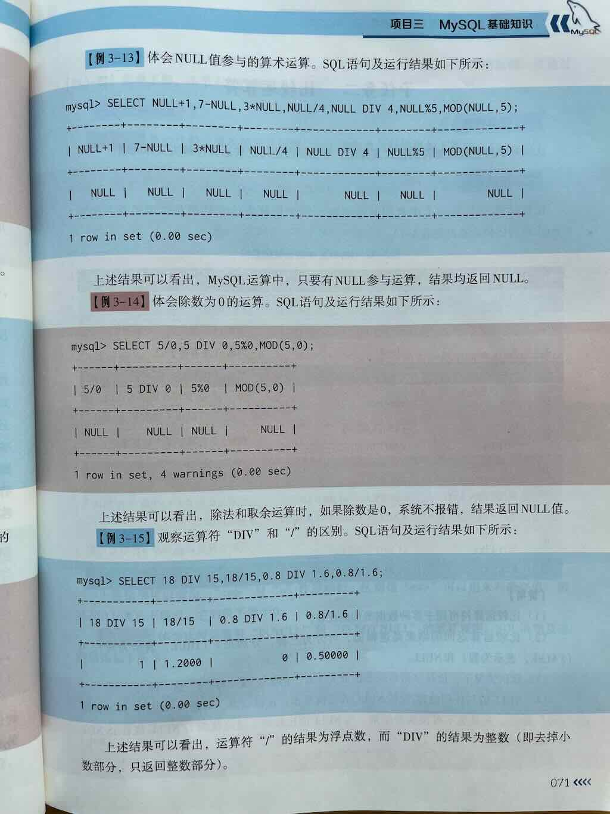

 
 
 

在 MySQL 中，**算术运算符（Arithmetic Operators）** 是用于执行**基本数学运算**的操作符，比如加法、减法、乘法、除法和取模（求余）。

它们在 SQL 查询、计算字段值、数据转换、统计分析等场景中被广泛使用。

---

## 一、算术运算符一览

| 运算符 | 描述     | 示例                | 结果 |
|--------|----------|---------------------|------|
| `+`    | 加法     | `SELECT 5 + 3;`      | 8    |
| `-`    | 减法     | `SELECT 10 - 4;`     | 6    |
| `*`    | 乘法     | `SELECT 6 * 7;`      | 42   |
| `/`    | 除法     | `SELECT 15 / 3;`     | 5    |
| `%`    | 取模     | `SELECT 11 % 4;` 或 `MOD(11,4)`    | 3    |

> ✅ 这些运算符可用于 **SELECT 查询中的计算字段**、**WHERE 条件判断**、以及表达式计算等场景。

---

## 二、算术运算符的基本用法

### 加法运算符 `+`

用于将两个数值相加。

示例：
```sql
SELECT 10 + 20;          -- 结果：30
SELECT price + tax FROM orders;  -- 假如有 price 和 tax 列，计算总金额
```

---

### 减法运算符 `-`

用于将两个数值相减，或者表示负数。

示例：
```sql
SELECT 50 - 30;          -- 结果：20
SELECT salary - bonus FROM employees;  -- 计算税前工资减去奖金
```

---

### 乘法运算符 `*`

用于两个数值相乘。

示例：
```sql
SELECT 5 * 6;            -- 结果：30
SELECT quantity * unit_price FROM order_items;  -- 计算每项总价
```

---

### 除法运算符 `/`

用于两个数值相除，**结果为浮点数（即使能整除）**。

示例：
```sql
SELECT 10 / 2;           -- 结果：5.0000
SELECT 10 / 3;           -- 结果：3.3333
SELECT total_amount / quantity FROM orders;  -- 计算平均单价
```

> ⚠️ 注意：如果除数为 **0**，MySQL 会返回 `NULL` 并给出警告

---

### 取模运算符 `%` 或函数 `MOD()`

用于求两个数相除后的**余数**，也叫取余运算。

示例：
```sql
SELECT 10 % 3;           -- 结果：1
SELECT MOD(10, 3);       -- 结果：1，与上面等价
SELECT student_id % 2 FROM students;  -- 判断学号是奇数还是偶数
```

> ✅ 取模运算常用于：
> - 判断奇偶性（`x % 2 = 0` 为偶数）
> - 分组、轮询、循环分配场景

---
## 三、运算符优先级

MySQL 算术运算符遵循标准数学优先级：

1. 括号 `()`
2. 乘 `*`、除 `/`、取模 `%`
3. 加 `+`、减 `-`

```sql
SELECT 2 + 3 * 4;    -- 14（先乘后加）
SELECT (2 + 3) * 4;  -- 20（先括号）
```

## 四、算术运算符在 SELECT 查询中的应用

### 示例 1：计算商品总价（数量 × 单价）

```sql
SELECT 
    product_name,
    quantity,
    unit_price,
    quantity * unit_price AS total_price
FROM order_items;
```

---

### 示例 2：计算税后价格（原价 + 税）

```sql
SELECT 
    item_name,
    price,
    tax_rate,
    price + (price * tax_rate / 100) AS final_price
FROM products;
```

> 假设 `tax_rate` 是百分比数值，如 10 表示 10%

---

### 示例 3：计算员工净工资（工资 - 扣款）

```sql
SELECT 
    employee_id,
    gross_salary,
    deduction,
    gross_salary - deduction AS net_salary
FROM salaries;
```

---

### 示例 4：计算平均值（总金额 ÷ 数量）

```sql
SELECT 
    order_id,
    total_amount,
    quantity,
    total_amount / quantity AS avg_unit_price
FROM orders;
```

> ⚠️ 如果 `quantity` 可能为 0，应该用 `WHERE quantity > 0` 避免除零错误

---

### 示例 5：判断奇偶（取模运算）

```sql
SELECT 
    user_id,
    username,
    user_id % 2 AS is_even  -- 0 表示偶数，1 表示奇数
FROM users;
```

或者更直观地：

```sql
SELECT 
    user_id,
    CASE WHEN user_id % 2 = 0 THEN '偶数' ELSE '奇数' END AS parity
FROM users;
```

---

### 示例6：员工工资表计算

假设有一个员工工资表 `salaries`：

| 字段         | 说明           |
|--------------|----------------|
| employee_id  | 员工ID         |
| basic_salary | 基本工资       |
| bonus        | 奖金           |
| tax          | 税金           |
| deduction    | 扣款（如保险） |

查询：计算应发工资、实发工资

```sql
SELECT 
    employee_id,
    basic_salary,
    bonus,
    basic_salary + bonus AS gross_salary,            -- 应发工资
    tax,
    deduction,
    (basic_salary + bonus) - tax - deduction AS net_salary  -- 实发工资
FROM salaries;
```

---

## 五、使用括号调整运算顺序

```sql
SELECT (10 + 2) * 3;    -- 先算 10+2=12，再 12*3=36，结果是 36
SELECT 10 + 2 * 3;      -- 先算 2*3=6，再 10+6=16，结果是 16
```

---

## 六、注意事项

1. **NULL处理**：任何与NULL的算术运算结果都是NULL
   ```sql
   SELECT 5 + NULL;  -- 结果为NULL
   ```

2. **类型转换**：运算时会自动进行类型转换
   ```sql
   SELECT '5' + 3;  -- 结果为8（字符串转数字）
   ```

3. **精度问题**：DECIMAL类型可避免浮点数精度问题
   ```sql
   SELECT 0.1 + 0.2;  -- 0.30000000000000004（浮点误差）
   SELECT CAST(0.1 AS DECIMAL(10,2)) + CAST(0.2 AS DECIMAL(10,2)); -- 0.30


| 注意事项 | 说明 |
|---------|------|
| **运算优先级** | 乘除取模（`* / %`）优先级高于加减（`+ -`），可用括号 `()` 调整优先级 |
| **除数为零** | 如 `a / 0` 会返回 `NULL` 并可能产生警告，应避免或用 `WHERE` 过滤 |
| **类型转换** | 若操作数包含字符串形式的数字，MySQL 会尝试自动转换为数值进行计算 |
| **结果类型** | - 加减乘：一般保持整数或转为 DECIMAL<br>- 除法：结果通常是浮点数（即使能整除） |
| **NULL 值影响** | 任何涉及 `NULL` 的算术运算，结果都是 `NULL` |


