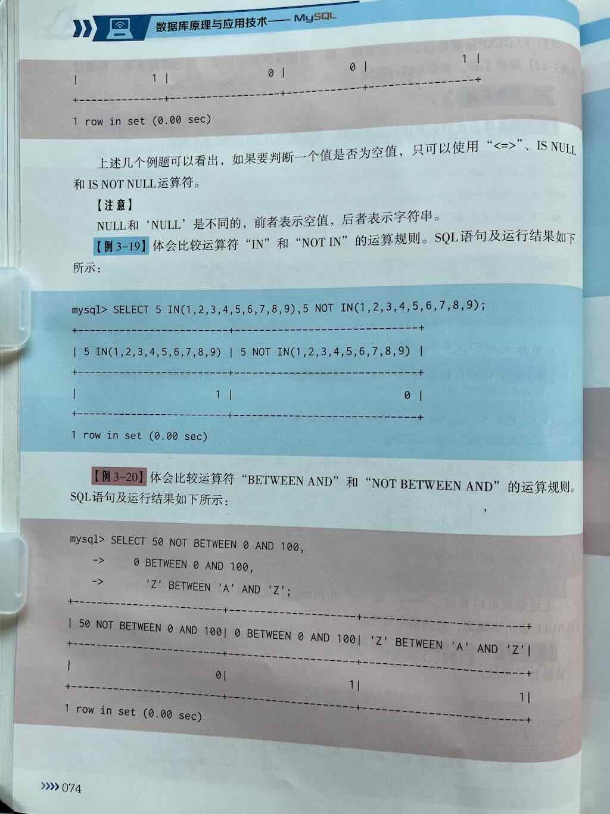
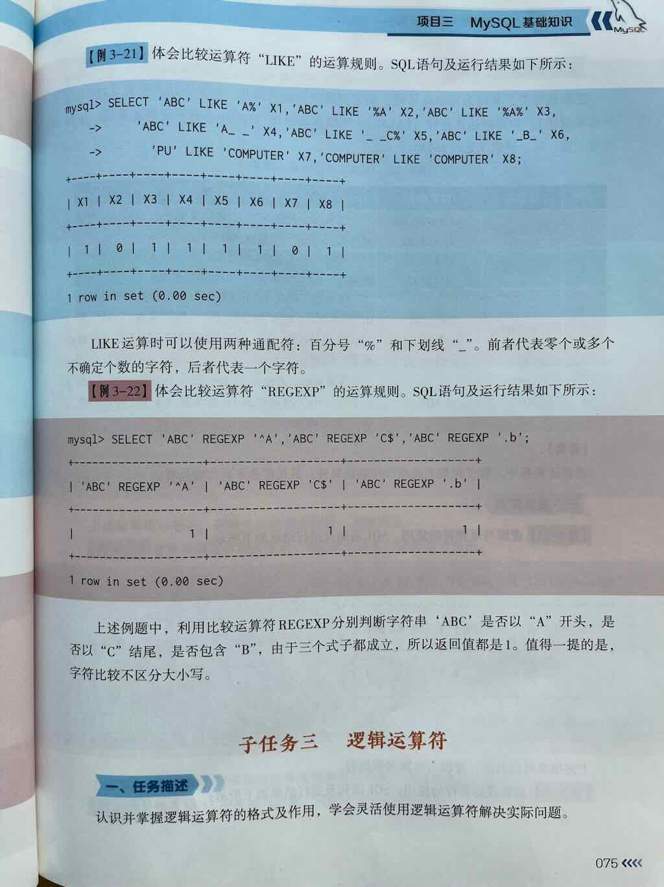

 
 
 


# MySQL 中关系运算符的用法详解

在 MySQL 中，**关系运算符（Relational Operators，也称为比较运算符）** 是用于**比较两个值之间关系**的操作符。它们在 SQL 查询中至关重要，常用于：

- **WHERE 子句** 中进行条件筛选
- **JOIN 条件** 中匹配关联数据
- 构建复杂的逻辑表达式
- 对字段或值进行大小、相等、范围等判断

掌握关系运算符是编写高效、准确 SQL 查询的基础。

---

## 一、MySQL 支持的主要关系运算符一览

| 运算符 | 名称         | 描述                             | 示例                     | 结果（假设 a=10, b=20） |
|--------|--------------|----------------------------------|--------------------------|-------------------------|
| `=`    | 等于         | 判断两个值是否相等               | `a = b`                  | `FALSE` (10 ≠ 20)       |
| `<>` 或 `!=` | 不等于     | 判断两个值是否**不相等**         | `a <> b` 或 `a != b`     | `TRUE` (10 ≠ 20)        |
| `>`    | 大于         | 左值是否大于右值                 | `a > b`                  | `FALSE` (10 ≯ 20)       |
| `<`    | 小于         | 左值是否小于右值                 | `a < b`                  | `TRUE` (10 < 20)        |
| `>=`   | 大于或等于   | 左值是否大于或等于右值           | `a >= b`                 | `FALSE` (10 ≯ 20)       |
| `<=`   | 小于或等于   | 左值是否小于或等于右值           | `a <= b`                 | `TRUE` (10 ≤ 20)        |
| `BETWEEN ... AND ...` | 在范围内 | 判断值是否在两个值之间（含边界） | `a BETWEEN 5 AND 15`     | `TRUE` (10 ∈ [5,15])    |
| `IN (值1, 值2, ...)` | 在集合中 | 判断值是否等于指定集合中的某个值 | `a IN (5, 10, 15)`       | `TRUE` (10 在集合中)    |
| `IS NULL` | 是 NULL | 判断值是否为 NULL                | `a IS NULL`              | `FALSE` (假设 a=10)     |
| `IS NOT NULL` | 非 NULL | 判断值是否不为 NULL             | `a IS NOT NULL`          | `TRUE` (假设 a=10)      |
| `LIKE`  | 模糊匹配     | 用于字符串模式匹配（支持 `%` 和 `_` 通配符） | `name LIKE 'J%'`         | 匹配以 J 开头的名字     |

> ✅ 其中 `=`、`<>`/`!=`、`>`、`<`、`>=`、`<=` 是**最基础、最常用的关系运算符**，用于数值、日期和字符串的比较。

---

## 二、常用关系运算符详解与示例

---

### 1️⃣ 等于 `=`

判断两个值是否**完全相等**。

#### 示例：
```sql
SELECT * FROM users WHERE id = 1;
```
👉 查询 `id` 等于 1 的用户

> ⚠️ 注意：`=` 不能用于判断 NULL，要用 `IS NULL`

---

### 2️⃣ 不等于 `<>` 或 `!=`

判断两个值是否**不相等**，两者完全等价。

#### 示例：
```sql
SELECT * FROM products WHERE price <> 100;
-- 或
SELECT * FROM products WHERE price != 100;
```
👉 查询价格不等于 100 的商品

---

### 3️⃣ 大于 `>`、小于 `<`、大于等于 `>=`、小于等于 `<=`

用于数值、日期等的大小比较。

#### 示例：
```sql
-- 找出年龄大于 18 的用户
SELECT * FROM users WHERE age > 18;

-- 找出注册时间早于 '2023-01-01' 的用户
SELECT * FROM users WHERE register_date < '2023-01-01';

-- 找出成绩大于等于 60 分的学生
SELECT * FROM students WHERE score >= 60;
```

---

### 4️⃣ BETWEEN ... AND ...（在某个范围内）

判断某个值是否**在两个值之间（含边界值）**，常用于数值或日期范围查询。

#### 示例：
```sql
-- 查询年龄在 18 到 30 岁之间的用户
SELECT * FROM users WHERE age BETWEEN 18 AND 30;

-- 查询 2023 年上半年的订单（日期在 '2023-01-01' 到 '2023-06-30'）
SELECT * FROM orders WHERE order_date BETWEEN '2023-01-01' AND '2023-06-30';
```

> ✅ 等价于：`age >= 18 AND age <= 30`

---

### 5️⃣ IN (值1, 值2, ...)（在某个集合中）

判断某个字段的值是否等于指定的一组值中的**任意一个**。

#### 示例：
```sql
-- 查询部门为 'IT'、'HR' 或 'Finance' 的员工
SELECT * FROM employees WHERE department IN ('IT', 'HR', 'Finance');

-- 查询状态为 1, 2, 3 的订单
SELECT * FROM orders WHERE status IN (1, 2, 3);
```

> ✅ 等价于：`(department = 'IT') OR (department = 'HR') OR ...`

---

### 6️⃣ IS NULL 和 IS NOT NULL（判断是否为 NULL）

> ⚠️ **注意：NULL 不能使用 = 或 != 来比较！必须用 IS NULL 或 IS NOT NULL**

#### 示例：
```sql
-- 查找没有填写邮箱的用户
SELECT * FROM users WHERE email IS NULL;

-- 查找已填写手机号的用户
SELECT * FROM users WHERE phone IS NOT NULL;
```

---

### 7️⃣ LIKE（模糊匹配）

用于对字符串进行**模式匹配**，常与两个通配符一起使用：

| 通配符 | 含义             | 示例                     |
|--------|------------------|--------------------------|
| `%`    | 匹配任意多个字符（包括零个） | `name LIKE 'J%'` → J开头 |
| `_`    | 匹配任意单个字符            | `name LIKE 'J_n'` → J + 任意1字符 + n |

#### 示例：
```sql
-- 查找名字以 'A' 开头的用户
SELECT * FROM users WHERE name LIKE 'A%';

-- 查找名字为 3 个字符，第二个字符是 'a' 的用户
SELECT * FROM users WHERE name LIKE '_a_';

-- 查找邮箱包含 '@gmail.com' 的用户
SELECT * FROM users WHERE email LIKE '%@gmail.com';
```

---

## 三、关系运算符在 WHERE 子句中的组合使用

可以使用 `AND`、`OR`、`NOT` 将多个关系表达式组合起来，构建复杂的查询条件。

### ✅ 示例：组合多个条件

```sql
-- 查询年龄在 18~30 之间，且状态为 1（激活）的用户
SELECT * FROM users 
WHERE age BETWEEN 18 AND 30 
  AND status = 1;

-- 查询部门是 IT 或 HR，且工资大于 5000 的员工
SELECT * FROM employees
WHERE department IN ('IT', 'HR')
  AND salary > 5000;

-- 查询不是 NULL 且名字以 '张' 开头的用户
SELECT * FROM users
WHERE name IS NOT NULL AND name LIKE '张%';
```

---

## 四、关系运算符的注意事项

| 注意事项 | 说明 |
|---------|------|
| **NULL 值特殊** | 不能用 `=` 或 `!=` 判断 NULL，必须用 `IS NULL` / `IS NOT NULL` |
| **字符串比较** | 默认区分大小写（取决于排序规则 collation），如 'A' 和 'a' 可能不等 |
| **日期比较** | 用字符串或 DATE 类型都可以，但建议用标准格式如 `'YYYY-MM-DD'` |
| **BETWEEN 是闭区间** | `BETWEEN A AND B` 包括 A 和 B |
| **IN 列表可读性更强** | 比多个 OR 更简洁，尤其判断多个固定值时 |
| **LIKE 性能较低** | 特别是前导 `%`（如 `%abc`）会导致索引失效，慎用于大数据表 |

---

## 五、综合示例

### 示例 1：查询指定年龄范围、状态激活的用户
```sql
SELECT * FROM users
WHERE age BETWEEN 20 AND 40
  AND status = 1
  AND email IS NOT NULL;
```

### 示例 2：查询部门在 IT、Finance，且工资大于 8000 的员工
```sql
SELECT * FROM employees
WHERE department IN ('IT', 'Finance')
  AND salary > 8000;
```

### 示例 3：查询名字以 "李" 开头，且注册日期在 2023 年之后的用户
```sql
SELECT * FROM users
WHERE name LIKE '李%'
  AND register_date > '2023-01-01';
```

---

## ✅ 总结表：MySQL 常用关系运算符

| 运算符 | 名称         | 用途                     | 示例                     |
|--------|--------------|--------------------------|--------------------------|
| `=`    | 等于         | 判断相等                 | `a = 10`                 |
| `<>`<br>`!=` | 不等于     | 判断不相等               | `a <> 10` 或 `a != 10`   |
| `>`    | 大于         | 判断大于                 | `a > 5`                  |
| `<`    | 小于         | 判断小于                 | `a < 5`                  |
| `>=`   | 大于等于     | 判断大于或等于           | `a >= 10`                |
| `<=`   | 小于等于     | 判断小于或等于           | `a <= 10`                |
| `BETWEEN ... AND ...` | 在范围内 | 判断值是否在区间内       | `a BETWEEN 1 AND 10`     |
| `IN (值1, 值2, ...)` | 在集合中 | 判断是否等于多个值之一   | `a IN (1, 2, 3)`         |
| `IS NULL` | 是空值     | 判断字段是否为 NULL      | `email IS NULL`          |
| `IS NOT NULL` | 非空值   | 判断字段是否非 NULL      | `phone IS NOT NULL`      |
| `LIKE` | 模糊匹配     | 字符串模式匹配（支持通配符） | `name LIKE 'A%'`         |

---

## 📌 下一步建议

你可以尝试以下练习来巩固关系运算符的使用：

1. ✅ 编写查询筛选某个日期范围内的订单
2. ✅ 使用 `IN` 查询多个状态的记录
3. ✅ 用 `BETWEEN` 查找年龄或分数区间
4. ✅ 用 `LIKE` 模糊搜索用户名或邮箱
5. ✅ 组合多个条件（AND / OR）实现复杂查询

---

如你希望获取：
- ✅ 这些关系运算符的 **建表 + 插入数据 + 查询示例**
- ✅ 如何与 **聚合函数（如 COUNT、SUM）结合使用**
- ✅ 或者 **关系运算符在 JOIN 中的应用**