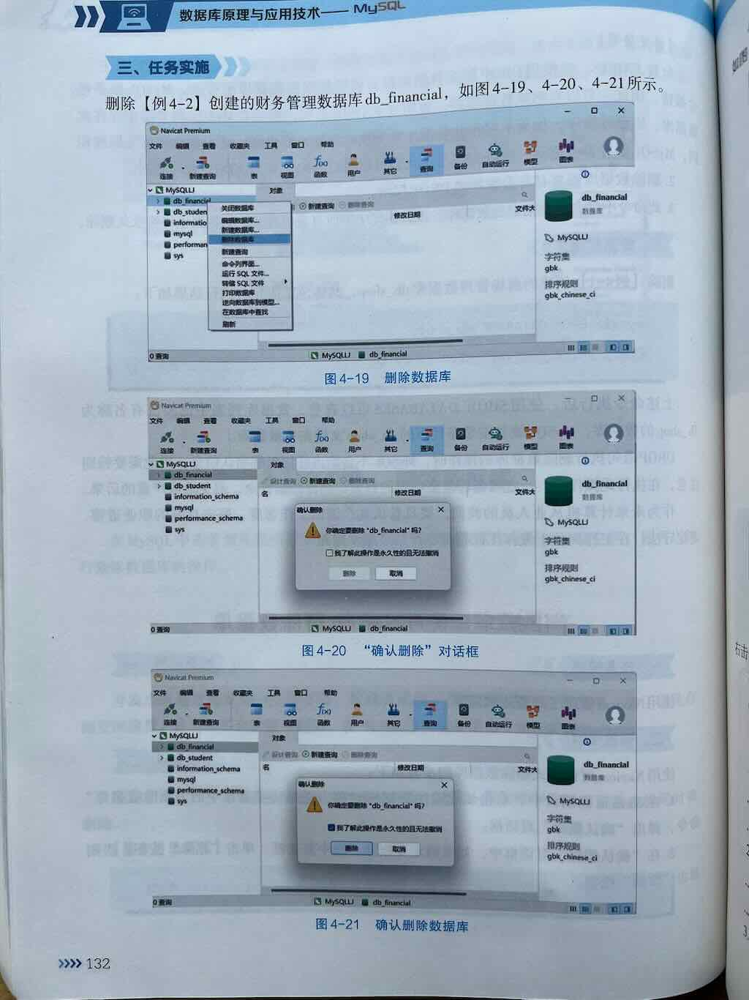

 
 
 
 
 
 


`DROP DATABASE 数据库名;` 是MySQL中用于删除整个数据库的SQL语句。这个命令会永久删除指定的数据库及其所有包含的对象（如表、视图、存储过程等），操作不可逆，请谨慎使用。

## 基本语法

```sql
DROP DATABASE [IF EXISTS] 数据库名;
```

## 参数说明

- **数据库名**：要删除的数据库的名称
- **IF EXISTS**（可选）：如果指定了这个选项，当数据库不存在时不会报错，只会产生一个警告

## 使用示例

1. **基本用法**（删除名为"test_db"的数据库）：
   ```sql
   DROP DATABASE test_db;
   ```

2. **安全用法**（先检查数据库是否存在）：
   ```sql
   DROP DATABASE IF EXISTS test_db;
   ```

## 注意事项

1. **不可逆操作**：删除数据库后，所有数据将永久丢失，无法恢复（除非有备份）
2. **权限要求**：执行此命令的用户需要有DROP权限
3. **影响范围**：会删除数据库中的所有表、视图、存储过程、触发器等所有对象
4. **生产环境慎用**：在生产环境中使用前应确保已备份重要数据

## 替代方案

如果只是想清空数据库中的数据但保留数据库结构，可以考虑：

- 使用`DROP TABLE`逐个删除表
- 使用`TRUNCATE TABLE`清空表数据但保留表结构
- 先导出备份再删除

## 最佳实践

1. 删除前先确认数据库名是否正确
2. 重要操作前先备份数据库
3. 在非生产环境先测试
4. 考虑使用`IF EXISTS`避免因数据库不存在而导致的错误

## 查看现有数据库

在执行删除前，可以先查看当前有哪些数据库：
```sql
SHOW DATABASES;
```

这样可以确保你要删除的是正确的数据库。


