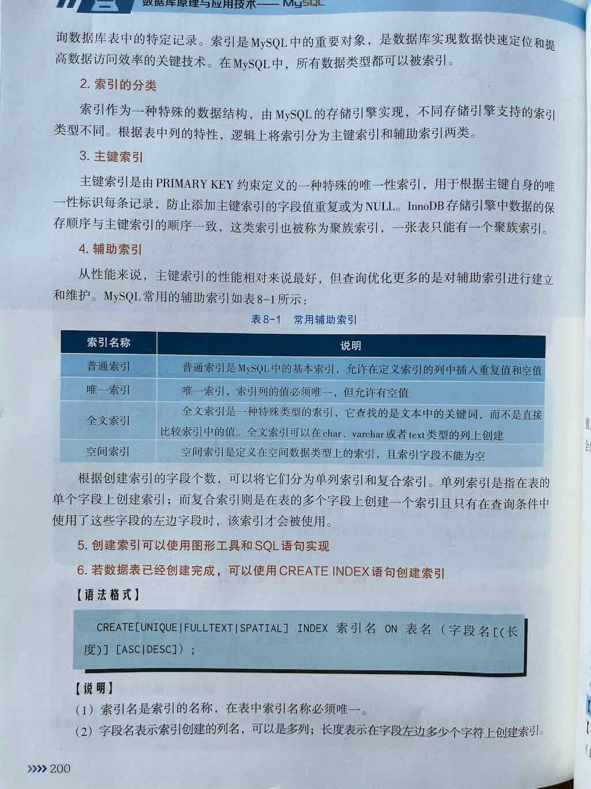

 
 
 

MySQL 索引用法典型案例讲解

索引是 MySQL 中**提升查询效率的关键工具**，就好比是一本书的**目录**，能帮助数据库**快速定位到数据，而不必逐行扫描整张表**。

---

## 一、什么是索引？

> ✅ **索引（Index）是数据库表中一种特殊的数据结构，它可以显著加快数据的检索速度，但会略微降低插入、更新和删除操作的性能。**

你可以把索引理解为：

🔍 **“数据的快速查找地图”**  
📚 类似于书的目录，让你不用翻完整本书就能快速找到某一章

---

## 二、示例:为什么要用索引？

假设你有一张 **用户表 users**，里面有 **100万条记录**：

| id | name   | age | email             | created_at          |
|----|--------|-----|-------------------|---------------------|
| 1  | 张三   | 23  | zhangsan@test.com | 2023-01-01 10:00:00 |
| 2  | 李四   | 29  | lisi@test.com     | 2023-01-02 11:00:00 |
| ... | ...    | ... | ...               | ...                 |
| 1000000 | 王五 | 35 | wangwu@test.com   | 2024-06-01 09:00:00 |

---

### 建表

```sql
-- 1. 建表
CREATE TABLE users (
    id INT AUTO_INCREMENT PRIMARY KEY,
    name VARCHAR(50) NOT NULL,
    age INT,
    email VARCHAR(100),
    created_at DATETIME
);
```

### 插入数据

```sql
-- 2. 创建存储过程，插入1000条数据
DELIMITER $$

CREATE PROCEDURE insert_1000_users()
BEGIN
    DECLARE i INT DEFAULT 1;
    WHILE i <= 1000 DO
        INSERT INTO users (name, age, email, created_at)
        VALUES (
            CONCAT('用户', i),
            FLOOR(20 + RAND() * 41),
            CONCAT('user', i, '@test.com'),
            DATE_ADD('2023-01-01 00:00:00', INTERVAL FLOOR(RAND() * 365) DAY)
        );
        SET i = i + 1;
    END WHILE;
END
$$

DELIMITER ;

-- 3. 执行存储过程，插入数据
CALL insert_1000_users();

-- 4. 查看数据量
SELECT COUNT(*) AS total FROM users;
```

### 如果没有索引

当你执行如下查询时：

```sql
SELECT * FROM users WHERE email = 'wangwu@test.com';
```

MySQL **会逐行扫描整张表（全表扫描）**，从第 1 行一直查到第 100 万行，直到找到 `email = 'wangwu@test.com'` 的那一行。  
➡️ **速度非常慢，尤其是数据量大时！**

---

### 如果有索引

如果你在 `email` 字段上**创建了索引**，MySQL 就会使用类似“字典查找”的方式，**快速定位到那条记录**，无需扫描全表。

➡️ **查询速度可能从几秒降到几毫秒！**

---

## 三、通过索引优化查询

---

### 场景描述

我们有一张用户表 `users`，经常需要根据 **邮箱（email）查找用户信息**，比如：

```sql
SELECT * FROM users WHERE email = 'zhangsan@example.com';
```

但该查询在数据量大时非常慢，因为没有索引，MySQL 只能**全表扫描**。

---

### 方案：在 `email` 字段上创建索引

第一步：建表 SQL（模拟场景）

```sql
CREATE TABLE users (
    id INT AUTO_INCREMENT PRIMARY KEY,
    name VARCHAR(50),
    age INT,
    email VARCHAR(100),
    created_at DATETIME
);
```

> ⚠️ 注意：`id` 是主键，默认会自动创建**唯一索引**，但 `email` 没有索引

---

第二步：创建索引：为 email 字段添加索引

```sql
CREATE INDEX idx_users_email ON users(email);
```

> ✅ 这句话的意思是：在 `users` 表的 `email` 列上创建一个普通索引，索引名称叫 `idx_users_email`

🔒 你也可以创建**唯一索引**（如果 email 是唯一的）：

```sql
CREATE UNIQUE INDEX idx_users_email_unique ON users(email);
```

或者在建表时直接定义索引：

```sql
CREATE TABLE users (
    id INT AUTO_INCREMENT PRIMARY KEY,
    name VARCHAR(50),
    email VARCHAR(100),
    INDEX idx_email (email)  -- 建表时直接定义索引
);
```

---

第三步：插入模拟数据（可选，用于测试）

```sql
INSERT INTO users (name, age, email, created_at) VALUES
('张三', 24, 'zhangsan@example.com', '2024-01-01 10:00:00'),
('李四', 29, 'lisi@example.com', '2024-01-02 11:00:00'),
('王五', 32, 'wangwu@example.com', '2024-01-03 09:00:00');
-- 可继续插入更多数据...
```

---

第四步：查询对比：使用索引 vs 不使用索引

❌ 没有索引时的查询（慢，全表扫描）

```sql
SELECT * FROM users WHERE email = 'zhangsan@example.com';
```

MySQL 执行计划可能显示：`type: ALL`（全表扫描）

✅ 创建索引后，再执行相同查询（快，索引查找）

```sql
SELECT * FROM users WHERE email = 'zhangsan@example.com';
```

通过 `EXPLAIN` 查看执行计划：

```sql
EXPLAIN SELECT * FROM users WHERE email = 'zhangsan@example.com';
```

🔍 你会看到类似如下关键信息：

| 字段 | 值 | 说明 |
|------|----|------|
| `type` | `ref` 或 `eq_ref` | 表示使用了索引查找 |
| `key` | `idx_users_email` | 表示使用了我们创建的索引 |
| `rows` | 很小的数字（如 1 或 2）| 表示只扫描了少数几行，而不是全表 |

✅ **说明：MySQL 使用了 email 上的索引，快速定位到数据，无需扫描全表**

---

## 四、索引的常见类型（拓展知识）

| 索引类型 | 关键字 | 说明 | 适用场景 |
|---------|--------|------|----------|
| **普通索引** | `INDEX` 或 `KEY` | 最基本的索引，加速查询 | 适合频繁查询的字段，如 email、phone |
| **唯一索引** | `UNIQUE INDEX` | 字段值必须唯一，允许 NULL | 如用户邮箱、身份证号 |
| **主键索引** | `PRIMARY KEY` | 唯一且不允许 NULL，每个表只能有一个 | 如 id 字段 |
| **组合索引（联合索引）** | `INDEX(col1, col2)` | 多个字段组合索引 | 适合多条件查询，如 `WHERE a=xx AND b=xx` |
| **全文索引** | `FULLTEXT` | 用于文本内容的全文搜索 | 适合文章、评论等大文本检索（如 MATCH...AGAINST） |

---

## 五、索引的创建与管理

### 1. 创建索引
```sql
-- 创建普通索引
CREATE INDEX idx_name ON table_name(column_name);

-- 创建唯一索引
CREATE UNIQUE INDEX idx_name ON table_name(column_name);

-- 创建复合索引
CREATE INDEX idx_name ON table_name(col1, col2, col3);

-- 创建表时指定索引
CREATE TABLE table_name (
    id INT NOT NULL,
    name VARCHAR(30) NOT NULL,
    INDEX idx_name (name)
);
```

### 2. 删除索引
```sql
DROP INDEX idx_name ON table_name;
```

### 3. 查看索引
```sql
SHOW INDEX FROM table_name;
```

## 六、索引使用的注意事项 ⚠️

| 注意事项 | 说明 |
|---------|------|
| ✅ **索引能加速 SELECT 查询** | 特别是 WHERE、JOIN、ORDER BY 等操作 |
| ❌ **索引会降低 INSERT / UPDATE / DELETE 速度** | 因为每次写操作都要同步更新索引 |
| ❌ **索引不是越多越好** | 每个索引占用磁盘空间，且影响写入性能，只给**高频查询字段**加索引 |
| ✅ **索引字段应尽量选择区分度高（基数高）的列** | 如 `email` 比 `gender`（只有男/女）更适合建索引 |
| ✅ **使用 EXPLAIN 分析查询是否命中索引** | 执行 `EXPLAIN SELECT ...` 查看是否使用了索引 |
| ❌ **避免在索引列上使用函数或计算** | 如 `WHERE YEAR(created_at) = 2024` 会导致索引失效 |
| ✅ **组合索引遵循“最左前缀原则”** | 比如索引是 (a,b,c)，那么 WHERE a=1 AND b=2 能命中，但 WHERE b=2 就不行 |

---

## 七、索引的使用策略

### 1. 选择合适的列建立索引
- 高选择性的列（不同值多的列）
- 常用于WHERE、JOIN、ORDER BY、GROUP BY的列
- 避免对经常更新的列建过多索引

### 2. 复合索引的最左前缀原则
对于复合索引(col1, col2, col3)，只有以下查询能使用索引：
- WHERE col1 = val1
- WHERE col1 = val1 AND col2 = val2
- WHERE col1 = val1 AND col2 = val2 AND col3 = val3

### 3. 索引失效的常见情况
- 使用不等于操作（!= 或 <>）
- 使用LIKE以通配符开头（'%abc'）
- 对索引列进行运算或函数操作
- 类型转换（如字符串列用数字查询）
- OR条件中部分列没有索引
- 不符合最左前缀原则

## 八、总结：索引的核心价值

| 价值 | 说明 |
|------|------|
| 🔍 **加速查询** | 特别是针对大表的 WHERE 条件查询，能从“全表扫描”变为“精准定位” |
| 🚀 **提升性能** | 毫秒级响应复杂查询，优化用户体验 |
| ⚠️ **权衡利弊** | 索引提升查询速度，但会降低写入性能并占用额外存储空间 |
| ✅ **合理使用是关键** | 只为**高频查询、高区分度字段**创建索引，避免滥用 |

---

## 九、索引的局限性
- 索引会占用额外的存储空间
- 索引会降低写操作（INSERT/UPDATE/DELETE）的性能
- 过多的索引会增加优化器的选择时间

---

## 十、下一步建议

你可以尝试以下练习来巩固索引的使用：

1. ✅ 在你的表中为常用查询字段（如 email、phone、status）创建索引
2. ✅ 使用 `EXPLAIN` 分析你的查询是否命中了索引
3. ✅ 构造一个有 10 万条数据的表，对比有索引 vs 无索引的查询速度
4. ✅ 尝试创建组合索引，并测试多条件查询是否生效
5. ✅ 了解并避免常见的索引失效场景（如使用函数、类型不匹配等）

---

如你希望获取：

- ✅ 一个包含 **百万级数据测试 + 索引优化对比** 的完整案例
- ✅ 如何为 **多条件查询、排序、分组** 设计高效索引
- ✅ 或者 **组合索引（联合索引）的最佳实践与最左前缀原则详解**

