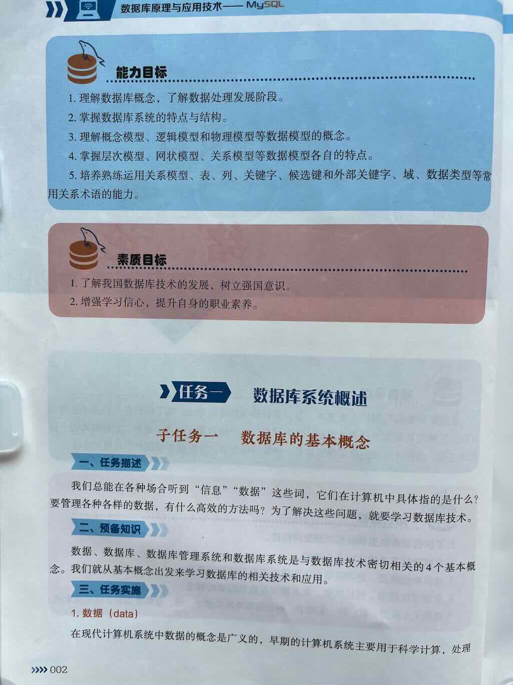

## 第一章:数据库系统概述





## 简答题

1. 与数据技术密切相关的4个基本概念是什么
2. 数据是什么
3. 数据库是什么
4. 数据库管理系统是什么
5. 数据库系统是什么
6. 数据库系统由哪四个部分组成
7. DATA、DB、DBMS、DBS分别表示什么
8. 数据管理指什么
9. 数据处理指什么
10. 数据管理技术经历了哪三个阶段
11. 数据管理技术每个阶段的特征是什么
12. 使用数据库的方式进行数据管理强调什么？
13. 使用数据库管理数据优点是什么
14. 数据库系统的主要特性是什么

## 单选题

1. 数据库系统的核心是（ ）。  
   A. 数据库    B. 操作系统  
   C. 数据库管理系统    D. 数据库管理员  

2. 用二维表来表示实体与实体之间联系的数据库模型称为（ ）。  
   A. 树状模型    B. 关系模型  
   C. 网状模型    D. 层次模型  

3. 数据库管理系统是（ ）。  
   A. 教学软件    B. 应用软件  
   C. 计算机辅助设计软件    D. 系统软件  

4. 按一定的组织形式存储在一起的相互关联的数据库集合称为（ ）。  
   A. 数据库管理系统    B. 数据库  
   C. 数据库应用系统    D. 数据库系统  

5. 在数据管理技术的发展过程中，经历了人工管理阶段、文件系统阶段和数据库系统阶段，在这几个阶段中，数据独立性最高的是（ ）阶段。  
   A. 数据库系统    B. 文件系统  
   C. 人工智能    D. 数据库管理  

6. 数据库DB、数据库系统DBS、数据库管理系统DBMS三者之间的关系是（ ）。  
   A. DBS包括DB和DBMS  
   B. DBMS包括DB和DBS  
   C. DB包括DBS和DBMS  
   D. DBS就是DB，也就是DBMS  

7. 数据库系统是由若干部分组成，以下不属于数据库系统组成部分的是（ ）。  
   A. 数据库    B. 应用程序  
   C. 操作系统    D. 数据库管理系统  

8. 数据库系统的特点不包括（ ）。  
   A. 数据共享  
   B. 加强对数据安全性和完整性保护  
   C. 完全没有数据冗余  
   D. 具有较高的数据独立性  
--- 

答案: 
```
CBDBAACC
```