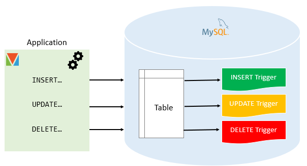

---
# 这部分是关键！侧边栏显示名由这里决定
title: 任务一 触发器  # 文档标题，若无 sidebar_label 则作为侧边栏名
sidebar_label: 任务一 触发器  # 显式指定侧边栏显示名（优先级最高）
sidebar_position: 1  # 侧边栏中排在第1位
---

## 一、触发器是什么

触发器是一个可以触发代码执行的容器。

- 触发器内存储了一段 SQL 代码。
- 当事件(INSERT、UPDATE、DELETE)发生时，会触发内部代码的执行。



## 二、触发的机制

- BEFORE INSERT：在插入前
- AFTER INSERT：在插入后
- BEFORE UPDATE：在修改前
- AFTER UPDATE：在修改后
- BEFORE DELETE：在删除前
- AFTER DELETE：在删除后

## 三、基础语法

### 1.单条触发语句

```sql
CREATE TRIGGER 触发器名 -- 触发器名
BEFORE|AFTER  -- 触发时机 
INSERT｜UPDATE|DELETE -- 触发事件 
ON 表名 -- 事件对象
FOR EACH ROW -- 事件作用范围（行级触发器：每满足条件的行都会触发）
触发器语句; -- 要执行的 SQL 语句（单条）
```

### 2.多条触发语句

```sql
DELIMITER //  -- 临时修改 SQL 分隔符为 //
CREATE TRIGGER 触发器名 -- 触发器名
BEFORE | AFTER  -- 触发时机 
INSERT | UPDATE | DELETE  -- 触发事件 
ON 作用表名 -- 事件对象
FOR EACH ROW -- 事件作用范围（行级触发器：每满足条件的行都会触发）
BEGIN
  -- 要执行的 SQL 语句(多条)，每条语句末尾用 ; 
  触发语句1;
  触发语句2;
  ...
END //
DELIMITER ;  -- 恢复默认分隔符为 ;
```

1. 触发器名：
    - 遵循 MySQL 标识符规则
    - 建议命名规范：`tr_表名_触发时机_触发事件`，如 `tr_teacher_after_update`。
2.  触发时机：
    - `BEFORE`：在事件执行前触发。适合：数据校验、数据预处理。
    - `AFTER`：在事件执行后触发。适合：日志记录、数据同步，比如删除教师后记录删除日志、插入成绩后同步更新学生总分。
3.  触发事件：
    - `INSERT`：向表中插入数据时触发（如 `INSERT INTO` 执行时）。
    - `UPDATE`：修改表中已有数据时触发（如 `UPDATE ... SET ...` 执行时）。
    - `DELETE`：从表中删除数据时触发（如 `DELETE FROM ...` 执行时）。
4.  作用表名：触发器必须绑定到一张永久表（不能绑定到视图、临时表），触发器的逻辑围绕这张表展开。
5.  `FOR EACH ROW`：表示「行级触发器」，即操作表时，每满足条件的一行数据都会触发一次触发器（MySQL 不支持表级触发器，该语句必须写，不可省略）。
6.  触发体：触发器要执行的核心逻辑
    - 单条 SQL 语句：直接写语句，无需 `BEGIN...END` 包裹。
    - 多条 SQL 语句：必须用 `BEGIN...END` 包裹，且需要先临时修改 SQL 分隔符（避免触发体内的 `;` 被 MySQL 当作整个触发器语句的结尾）。

## 四、特殊变量

**特殊行变量**：触发器中可以使用 `NEW` 和 `OLD` 两个特殊变量，获取操作前后的数据，仅在对应触发事件中可用：
| 变量  | 适用触发事件 | 含义                                  |
|-------|--------------|---------------------------------------|
| `NEW` | `INSERT`| 代表新行（无论 BEFORE 还是 AFTER 都存在） |
| `NEW` | `UPDATE` | 代表修改后的行 |
| `OLD` | `UPDATE`| 代表修改前的旧行 |
| `OLD` | `DELETE` |代表删除的行（无论 BEFORE 还是 AFTER 都存在 ）|

| 要素 | 选项 | 说明 |
|------|------|------|
| **触发时机** | `BEFORE` 或 `AFTER` | 在事件之前或之后执行 |
| **触发事件** | `INSERT`, `UPDATE`, `DELETE` | 哪种操作触发 |
| **访问行数据** | `NEW` 或 `OLD` | 新行/旧行的数据 |

## 五、实用示例
### 示例1：插入后自动记录时间戳
```sql
-- 创建测试表
CREATE TABLE users (
    id INT AUTO_INCREMENT PRIMARY KEY,
    username VARCHAR(50),
    created_at DATETIME
);

-- 创建最简单的触发器（AFTER INSERT）
DELIMITER //
CREATE TRIGGER set_create_time
AFTER INSERT ON users
FOR EACH ROW
BEGIN
    UPDATE users SET created_at = NOW() WHERE id = NEW.id;
END //
DELIMITER ;

-- 测试
INSERT INTO users (username) VALUES ('张三');
SELECT * FROM users; -- created_at 自动填充当前时间
```

### 示例2：更简洁的 BEFORE INSERT 触发器
```sql
-- 创建新表
CREATE TABLE orders (
    id INT AUTO_INCREMENT PRIMARY KEY,
    order_no VARCHAR(20),
    order_date DATE,
    total_amount DECIMAL(10,2)
);

-- 最简单的BEFORE INSERT触发器
DELIMITER //
CREATE TRIGGER before_order_insert
BEFORE INSERT ON orders
FOR EACH ROW
BEGIN
    SET NEW.order_date = CURDATE(); -- 直接设置新行的值
END //
DELIMITER ;

-- 测试
INSERT INTO orders (order_no, total_amount) VALUES ('ORD001', 100.50);
SELECT * FROM orders; -- order_date 自动设为当天日期
```
### 示例3: 时间更新
```sql
-- 商品表
CREATE TABLE products (
    id INT PRIMARY KEY,
    name VARCHAR(100),
    price DECIMAL(10,2),
    last_updated DATETIME
);

-- 插入三条测试数据
INSERT INTO products (id, name, price, last_updated) VALUES
(1, 'iPhone 15 Pro', 8999.00, '2024-01-01 10:00:00'),
(2, '小米电视 75寸', 4999.00, '2024-01-15 14:30:00'),
(3, '华为笔记本 MateBook', 6999.00, '2024-02-01 09:15:00');

-- 最简单实用的更新触发器
DELIMITER //
CREATE TRIGGER update_timestamp
BEFORE UPDATE ON products
FOR EACH ROW
    SET NEW.last_updated = NOW();
//
DELIMITER ;

-- 使用：last_updated 会自动更新为当前时间
UPDATE products SET price = 99.99 WHERE id = 1;


-- 查看更新后的的数据
SELECT * FROM products;

```


## 六、查看和管理触发器
```sql
-- 查看所有触发器
SHOW TRIGGERS;

-- 查看特定触发器
SHOW CREATE TRIGGER trigger_name;

-- 删除触发器
DROP TRIGGER IF EXISTS trigger_name;
```

1.  查看已创建的触发器：
```sql
-- 查看所有触发器
SHOW TRIGGERS;

-- 查看指定数据库的触发器（精准查找，替换为你的数据库名）
SHOW TRIGGERS FROM your_database_name;

-- 查看触发器创建语句（替换为触发器名）
SHOW CREATE TRIGGER tr_teacher_after_update;
```

2.  删除无用的触发器：
```sql
-- 删除触发器（替换为触发器名）
DROP TRIGGER IF EXISTS tr_teacher_before_insert;
```

## 七、注意事项
1.  触发器不能嵌套：一个触发器执行的操作，不能触发另一个触发器（避免死循环）。
2.  触发体中尽量避免操作触发它的那张表（比如 `teacher` 表的触发器，不要在触发体中再次 `UPDATE teacher`），否则会引发死循环。
3.  触发器仅支持永久表（`ENGINE=InnoDB` 等），不支持临时表（`CREATE TEMPORARY TABLE`）和视图。
4.  触发器的逻辑要简洁高效：触发器自动执行，若逻辑复杂（如大量查询、循环），会严重影响 `INSERT/UPDATE/DELETE` 操作的执行效率。
5.  `SIGNAL` 语句仅用于抛出错误/提示，`SQLSTATE '45000'` 是自定义错误码，`'00000'` 是成功提示码（不终止操作）。

## 八、总结
1.  核心语法：`CREATE TRIGGER` + 「触发时机+触发事件」 + 「作用表」 + 「触发体」，多条语句需修改分隔符。
2.  关键工具：`NEW`/`OLD` 变量获取操作前后数据，`BEFORE` 用于校验，`AFTER` 用于日志。
3.  常用操作：`SHOW TRIGGERS` 查看，`DROP TRIGGER` 删除，命名规范便于后续维护。
4.  避坑核心：不嵌套、不操作原表、逻辑简洁，避免影响数据操作效率。


如果你有 MySQL 基础但没学过触发器，这里为你整理一份 **10分钟快速掌握触发器** 的指南，包含所有基础知识、语法和实操示例。

---

## ✅ 一、触发器是什么？（一句话理解）

**触发器（Trigger）** 是 MySQL 中的一种**自动执行的存储程序**，它在表发生特定操作（`INSERT`、`UPDATE`、`DELETE`）时自动触发执行。触发器自动执行的是你**在触发器体中编写的 SQL 代码块**。

### 简单说：

触发器 = **当...时，自动做...**

- **当...时**：表的 INSERT/UPDATE/DELETE 操作
- **自动做...**：你写在 `BEGIN ... END` 里面的 SQL 语句

非常好的问题！这是理解触发器本质的关键。我来详细解释：

---

## ✅ 一、触发器自动触发执行什么？

触发器自动执行的是你**在触发器体中编写的 SQL 代码块**。

### 简单说：

触发器 = **当...时，自动做...**

- **当...时**：表的 INSERT/UPDATE/DELETE 操作
- **自动做...**：你写在 `BEGIN ... END` 里面的 SQL 语句

---

## ✅ 二、触发器的基本执行流程

```
用户执行：INSERT/UPDATE/DELETE 操作
    ↓
MySQL 检查：这个表有触发器吗？
    ↓
有触发器 → 执行触发器的代码
    ↓
执行用户原来的操作（或根据触发器结果决定是否执行）
```

---

## ✅ 二、触发器的创建语法（必须掌握）

```sql
DELIMITER $$
CREATE TRIGGER 触发器名称
触发时机 触发事件
ON 表名
FOR EACH ROW
BEGIN
    -- 触发器逻辑（要执行的SQL语句）
END;
```

**DELIMITER $$ 不是必须写的，但当触发器体中有多条SQL语句时，必须使用它来改变语句分隔符。**

记住这个**黄金法则**：

- **1条语句** → 可写可不写
- **≥2条语句** → 必须写

好的，我来逐行详细解释创建触发器的完整语法：

```sql
CREATE TRIGGER 触发器名称
```

**解释**：创建一个新的触发器。`触发器名称` 是你给这个触发器起的名字，要符合命名规则，通常以 `trg_` 开头表示是触发器，如 `trg_after_insert_user`。

---

```sql
触发时机 触发事件
```

**解释**：这是触发器的**核心部分**，定义了**何时**以及**什么操作**会触发它。

**触发时机**（二选一）：

- `BEFORE`：在操作**执行前**触发
- `AFTER`：在操作**执行后**触发

**触发事件**（三选一）：

- `INSERT`：插入数据时触发
- `UPDATE`：更新数据时触发
- `DELETE`：删除数据时触发

**组合示例**：

```sql
BEFORE INSERT    -- 插入前触发
AFTER UPDATE     -- 更新后触发
BEFORE DELETE    -- 删除前触发
```

---

```sql
ON 表名
```

**解释**：指定这个触发器**绑定到哪个表**。触发器只对该表的数据变更有效。

**示例**：

```sql
ON users         -- 绑定到users表
ON orders        -- 绑定到orders表
ON products      -- 绑定到products表
```

---

```sql
FOR EACH ROW
```

**解释**：**固定写法**，表示这个触发器对**每一行受影响的数据**都会执行一次。

**重要理解**：

- 如果 `UPDATE` 语句影响了 10 行，触发器会执行 10 次
- 如果 `INSERT` 插入 5 条数据，触发器会执行 5 次
- 这是 MySQL 触发器的标准语法，必须写

---

```sql
BEGIN
```

**解释**：**代码块开始**，表示触发器要执行的逻辑从这里开始。

**注意**：

- 如果触发器只有一条语句，可以省略 `BEGIN` 和 `END`
- 如果有多条语句，必须用 `BEGIN...END` 包裹

---

```sql
    -- 触发器逻辑（要执行的SQL语句）
```

**解释**：这是触发器**真正要执行的代码**。可以写一条或多条 SQL 语句。

**关键特性**：

1. **可以访问新旧数据**：

   ```sql
   -- UPDATE触发器中
   OLD.column_name  -- 更新前的值
   NEW.column_name  -- 更新后的值
   
   -- INSERT触发器中（只有NEW）
   NEW.column_name  -- 新插入的值
   
   -- DELETE触发器中（只有OLD）
   OLD.column_name  -- 被删除的值
   ```

2. **可以修改数据**（仅在 `BEFORE` 触发器中）：

   ```sql
   SET NEW.email = LOWER(NEW.email);  -- 修改即将插入的数据
   ```

3. **可以阻止操作**（仅在 `BEFORE` 触发器中）：

   ```sql
   SIGNAL SQLSTATE '45000' SET MESSAGE_TEXT = '错误信息';
   ```

**示例逻辑**：

```sql
-- 数据验证
IF NEW.age < 0 THEN
    SIGNAL SQLSTATE '45000' SET MESSAGE_TEXT = '年龄不能为负数';
END IF;

-- 自动填充
SET NEW.created_at = NOW();

-- 记录日志
INSERT INTO log_table VALUES (OLD.id, NEW.id, NOW());
```

---

```sql
END;
```

**解释**：**代码块结束**，表示触发器逻辑到此为止。

**重要**：这个 `END` 后面的分号是**语句结束符**，但在实际创建时，如果有多条语句，需要用 `DELIMITER` 处理。

---

## ✅ 完整示例解析

```sql
-- 创建一个在用户表插入数据后触发的触发器
CREATE TRIGGER trg_after_insert_user  -- 1. 创建名为trg_after_insert_user的触发器
AFTER INSERT ON users                 -- 2. 在users表插入数据后触发
FOR EACH ROW                          -- 3. 对每一行插入的数据都执行
BEGIN                                 -- 4. 代码块开始
    -- 将新用户信息记录到日志表
    INSERT INTO user_log (user_id, action, log_time) 
    VALUES (NEW.id, '用户注册', NOW());  -- 5. 触发器逻辑
END;                                  -- 6. 代码块结束
```

---

## ✅ 执行顺序理解

```
用户执行：INSERT INTO users (name, email) VALUES ('张三', 'zhangsan@xx.com')
    ↓
MySQL：哦，这是向users表插入数据
    ↓
MySQL：检查users表有没有AFTER INSERT触发器？有！
    ↓
执行：BEGIN ... END 里的代码
    ↓
继续执行用户的INSERT操作（因为这是AFTER触发器）
    ↓
完成
```

如果是 `BEFORE INSERT` 触发器：

```
用户执行INSERT
    ↓
先执行BEFORE触发器的代码
    ↓
可能修改NEW.xxx的值
    ↓
可能用SIGNAL阻止操作
    ↓
如果没被阻止，执行INSERT
```

---

## ✅ 实际考试中的应用

### 考题模式1：补全代码

```sql
-- 补全以下触发器，实现插入前自动设置创建时间
CREATE TRIGGER trg_before_insert_order
______ INSERT ______ orders  -- 填空1：触发时机和事件
FOR EACH ROW
BEGIN
    SET ______.created_at = ______();  -- 填空2：设置字段值
END;
```

**答案**：

- 填空1：`BEFORE ON`
- 填空2：`NEW NOW`

### 考题模式2：判断正误

```sql
-- 判断这个触发器是否能创建成功
CREATE TRIGGER test_trigger
AFTER UPDATE ON products
FOR EACH ROW
BEGIN
    UPDATE stats SET count = count + 1;
    INSERT INTO logs VALUES ('产品更新', NOW());
END;
```

**答案**：❌ 不能！因为有多条语句但没有改分隔符。

---

现在你理解每一行的含义了吗？**简单记忆**：

1. 创建什么触发器
2. 什么时候触发
3. 对哪个表生效
4. 每行都触发（固定写法）
5. 开始写逻辑
6. 具体做什么
7. 逻辑结束

## ✅ 示例1：数据审计触发器（记录数据变更）

### 场景：

当 `employees` 表的工资字段被更新时，自动记录变更历史到 `salary_audit` 表。

### 表结构：

```sql
-- 主表
CREATE TABLE employees (
    emp_id INT PRIMARY KEY,
    name VARCHAR(50),
    salary DECIMAL(10,2),
    department VARCHAR(50)
);

-- 审计日志表
CREATE TABLE salary_audit (
    audit_id INT AUTO_INCREMENT PRIMARY KEY,
    emp_id INT,
    old_salary DECIMAL(10,2),
    new_salary DECIMAL(10,2),
    change_time DATETIME,
    changed_by VARCHAR(50)
);
```

### 触发器代码：

```sql
DELIMITER $$  -- 改变分隔符，因为触发器体中有分号

CREATE TRIGGER trg_after_salary_update
AFTER UPDATE ON employees  -- 触发时机：更新操作之后  触发时机 触发事件
FOR EACH ROW              -- 对每一行数据都执行
BEGIN
    -- 只有当工资实际发生变化时才记录
    IF OLD.salary != NEW.salary THEN
        INSERT INTO salary_audit 
            (emp_id, old_salary, new_salary, change_time, changed_by)
        VALUES 
            (OLD.emp_id, 
             OLD.salary, 
             NEW.salary, 
             NOW(),           -- 当前时间
             USER()           -- 当前登录用户
            );
    END IF;
END $$

DELIMITER ;  -- 恢复分隔符
```

### 测试效果：

```sql
-- 更新前
SELECT * FROM employees WHERE emp_id = 1;
-- 结果：emp_id=1, salary=5000

-- 执行更新
UPDATE employees SET salary = 5500 WHERE emp_id = 1;

-- 自动触发，查看审计表
SELECT * FROM salary_audit;
-- 结果：记录了一条变更历史
```

---

## ✅ 示例2：数据验证触发器（插入前检查）

### 场景：

向 `orders` 表插入订单时，自动检查订单金额是否合理，并设置默认状态。

### 表结构：

```sql
CREATE TABLE orders (
    order_id INT AUTO_INCREMENT PRIMARY KEY,
    customer_id INT,
    order_amount DECIMAL(10,2),
    order_date DATE,
    status VARCHAR(20)  -- 状态：'待处理','已确认','已取消'
);
```

### 触发器代码：

```sql
DELIMITER $$

CREATE TRIGGER trg_before_order_insert
BEFORE INSERT ON orders  -- 触发时机：插入操作之前
FOR EACH ROW
BEGIN
    -- 1. 数据验证：金额必须大于0
    IF NEW.order_amount <= 0 THEN
        SIGNAL SQLSTATE '45000'  -- 自定义错误状态
        SET MESSAGE_TEXT = '订单金额必须大于0';
    END IF;
    
    -- 2. 设置默认值：如果status为空，设为'待处理'
    IF NEW.status IS NULL THEN
        SET NEW.status = '待处理';
    END IF;
    
    -- 3. 自动填充日期：如果order_date为空，设为今天
    IF NEW.order_date IS NULL THEN
        SET NEW.order_date = CURDATE();
    END IF;
    
    -- 4. 业务规则：大额订单自动标记
    IF NEW.order_amount > 10000 THEN
        SET NEW.status = '待审核';  -- 修改即将插入的数据
    END IF;
END $$

DELIMITER ;
```

### 测试效果：

```sql
-- 测试1：正常插入
INSERT INTO orders (customer_id, order_amount) 
VALUES (101, 5000);
-- 结果：status自动设为'待处理'，order_date自动设为今天

-- 测试2：触发验证错误
INSERT INTO orders (customer_id, order_amount) 
VALUES (102, -100);
-- 结果：报错 "订单金额必须大于0"，插入失败

-- 测试3：大额订单
INSERT INTO orders (customer_id, order_amount) 
VALUES (103, 15000);
-- 结果：status自动设为'待审核'
```

---

## ✅ 两个示例的关键点对比：

| 特性             | 示例1（审计触发器） | 示例2（验证触发器）  |
| ---------------- | ------------------- | -------------------- |
| **触发时机**     | `AFTER UPDATE`      | `BEFORE INSERT`      |
| **主要目的**     | 记录变更历史        | 验证数据并设置默认值 |
| **数据访问**     | 使用`OLD`和`NEW`    | 主要使用`NEW`        |
| **能否修改数据** | 不能（已提交）      | 能（`SET NEW.字段`） |
| **能否阻止操作** | 不能                | 能（使用`SIGNAL`）   |
| **典型应用**     | 审计、日志、统计    | 数据验证、自动填充   |

---

## ✅ 快速记忆口诀：

```sql
CREATE TRIGGER 名字         -- 创建触发器
BEFORE/AFTER 操作          -- 时机 + 事件（INSERT/UPDATE/DELETE）
ON 表名                    -- 绑定到哪个表
FOR EACH ROW              -- 固定写法（每行触发）
BEGIN
    -- 这里写逻辑
    -- 可以用 OLD.字段 和 NEW.字段
    -- BEFORE触发器中可以 SET NEW.字段 = 值
    -- 可以用 SIGNAL 报错阻止操作
END;
```

---

## ✅ 常见错误写法示例：

```sql
-- 错误1：忘记 FOR EACH ROW
CREATE TRIGGER wrong1
AFTER UPDATE ON employees
BEGIN ... END;  -- 缺少 FOR EACH ROW

-- 错误2：在INSERT中使用OLD
CREATE TRIGGER wrong2
BEFORE INSERT ON orders
FOR EACH ROW
BEGIN
    SET NEW.value = OLD.value + 1;  -- INSERT没有OLD！
END;

-- 错误3：在AFTER触发器中修改数据
CREATE TRIGGER wrong3
AFTER UPDATE ON products
FOR EACH ROW
BEGIN
    SET NEW.price = NEW.price * 0.9;  -- AFTER中不能修改！
END;
```

---

现在你可以尝试自己写一个触发器：

> **练习题**：为`products`表创建一个`BEFORE UPDATE`触发器，当更新`stock`（库存）字段时，如果新库存小于5，自动将`status`改为'缺货'。

需要我提供参考答案吗？

`DELIMITER $$` 的意思是：**从现在开始，使用 `$$` 作为语句的结束标志**，而不是用 `;` 作为结束标志。


## ✅ 三、常见的触发器执行场景（按用途分类）

### 1. **数据验证与约束**

```sql
-- 场景：插入订单前检查金额
CREATE TRIGGER before_order_insert
BEFORE INSERT ON orders
FOR EACH ROW
BEGIN
    IF NEW.amount <= 0 THEN
        SIGNAL SQLSTATE '45000' SET MESSAGE_TEXT = '金额必须大于0';
    END IF;
END;
```

**执行内容**：验证数据，不合法则报错阻止操作。

### 2. **自动填充字段**

```sql
-- 场景：插入用户时自动设置创建时间
CREATE TRIGGER before_user_insert
BEFORE INSERT ON users
FOR EACH ROW
BEGIN
    SET NEW.created_at = NOW();
    SET NEW.updated_at = NOW();
END;
```

**执行内容**：给字段设置默认值。

### 3. **审计与日志记录**

```sql
-- 场景：工资更新后记录变更
CREATE TRIGGER after_salary_update
AFTER UPDATE ON employees
FOR EACH ROW
BEGIN
    INSERT INTO salary_log 
    VALUES (OLD.emp_id, OLD.salary, NEW.salary, NOW(), USER());
END;
```

**执行内容**：向日志表插入一条记录。

### 4. **数据同步与级联更新**

```sql
-- 场景：商品售出后更新库存
CREATE TRIGGER after_order_insert
AFTER INSERT ON orders
FOR EACH ROW
BEGIN
    UPDATE products 
    SET stock = stock - NEW.quantity
    WHERE product_id = NEW.product_id;
END;
```

**执行内容**：更新另一个表的数据。

### 5. **业务规则执行**

```sql
-- 场景：库存低于阈值时自动预警
CREATE TRIGGER after_inventory_update
AFTER UPDATE ON products
FOR EACH ROW
BEGIN
    IF NEW.stock < 10 AND OLD.stock >= 10 THEN
        INSERT INTO alerts (product_id, message)
        VALUES (NEW.product_id, '库存低于安全阈值！');
    END IF;
END;
```

**执行内容**：根据业务规则插入预警信息。

---

## ✅ 四、按触发时机分类的执行内容

### 1. **BEFORE 触发器执行内容**：

- **数据验证**（检查是否符合规则）
- **数据转换**（格式化、计算衍生值）
- **设置默认值**
- **修改要插入/更新的数据**
- **决定是否允许操作继续**（用 SIGNAL 阻止）

### 2. **AFTER 触发器执行内容**：

- **记录日志**（操作已发生，记录历史）
- **发送通知**（如插入消息队列）
- **更新统计信息**
- **级联更新其他表**
- **清理临时数据**

---

## ✅ 五、实际案例演示

### 案例：电商系统订单处理

```sql
-- 表结构
orders (order_id, customer_id, amount, status)
order_items (item_id, order_id, product_id, quantity, price)
products (product_id, name, stock, sales_count)
```

**触发器1：下订单时检查库存**

```sql
CREATE TRIGGER before_order_item_insert
BEFORE INSERT ON order_items
FOR EACH ROW
BEGIN
    DECLARE v_stock INT;
    SELECT stock INTO v_stock FROM products WHERE product_id = NEW.product_id;
    
    IF v_stock < NEW.quantity THEN
        SIGNAL SQLSTATE '45000' SET MESSAGE_TEXT = '库存不足';
    END IF;
END;
```

**执行内容**：查询库存，不足则阻止插入。

**触发器2：订单支付成功后更新统计**

```sql
CREATE TRIGGER after_order_update
AFTER UPDATE ON orders
FOR EACH ROW
BEGIN
    -- 状态从未支付变为已支付
    IF OLD.status = '未支付' AND NEW.status = '已支付' THEN
        -- 更新商品销量
        UPDATE products p
        JOIN order_items oi ON p.product_id = oi.product_id
        SET p.sales_count = p.sales_count + oi.quantity,
            p.stock = p.stock - oi.quantity
        WHERE oi.order_id = NEW.order_id;
        
        -- 记录支付日志
        INSERT INTO payment_logs VALUES (NEW.order_id, NEW.amount, NOW());
    END IF;
END;
```

**执行内容**：

1. 更新商品销量和库存
2. 插入支付日志

---

## ✅ 六、触发器执行的限制

### 可以执行的操作：

- ✅ 大多数 SQL 语句：`SELECT`, `INSERT`, `UPDATE`, `DELETE`
- ✅ 流程控制：`IF`, `CASE`, `LOOP`, `WHILE`
- ✅ 变量操作：`DECLARE`, `SET`

### 不能执行的操作：

- ❌ `CREATE`, `DROP`, `ALTER`（DDL语句）
- ❌ 事务控制：`COMMIT`, `ROLLBACK`（隐式提交）
- ❌ 返回结果集给客户端（但可以用 SELECT 查询）
- ❌ 递归调用自身（会导致死循环）

---

## ✅ 七、考试常见考点

### 考点1：BEFORE vs AFTER 的执行差异

```sql
-- 问题：以下哪个能修改插入的数据？
-- 答案：BEFORE可以，AFTER不行
```

### 考点2：触发器的执行顺序

```sql
-- 如果有多个BEFORE/AFTER触发器，执行顺序不确定
-- 不要依赖执行顺序设计业务逻辑
```

### 考点3：触发器能做什么

- 常考：数据验证、自动填充、日志记录、级联更新
- 不考：创建表、事务控制、复杂业务逻辑

---

## ✅ 八、一句话总结

**触发器自动执行的是你写在 `BEGIN ... END` 里的 SQL 代码，常见的有：数据验证、自动填充字段、记录日志、级联更新其他表、执行业务规则等。**

---

现在你明白触发器执行什么了吗？如果需要，我可以给你几个**考试常见的触发器执行场景练习题**。

### 触发器的核心特性：

1. **自动触发**：不需要手动调用
2. **与表绑定**：每个触发器只属于一个表
3. **响应数据变更**：只有增、删、改操作能触发
4. **没有参数**：不能像存储过程那样传递参数
5. **可访问新旧数据**：在触发器中可以引用变更前后的数据

---

### 1. **触发时机**（二选一）：

- `BEFORE`：在操作执行**前**触发
- `AFTER`：在操作执行**后**触发

### 2. **触发事件**（三选一）：

- `INSERT`：插入数据时触发
- `UPDATE`：更新数据时触发
- `DELETE`：删除数据时触发

### 3. **FOR EACH ROW**：

- 表示“对每一行数据变更都触发一次”
- 这是固定写法，必须写

---

## ✅ 三、访问新旧数据（关键点）

在触发器中，你可以访问到数据变更前后的值：

| 变量       | 含义             | 可用时机           |
| ---------- | ---------------- | ------------------ |
| `OLD.列名` | **变更前**的数据 | `UPDATE`、`DELETE` |
| `NEW.列名` | **变更后**的数据 | `INSERT`、`UPDATE` |

### 示例说明：

```sql
-- 在UPDATE触发器中：
OLD.salary  -- 更新前的工资
NEW.salary  -- 更新后的工资

-- 在INSERT触发器中：
NEW.id      -- 新插入的ID值（OLD不存在）

-- 在DELETE触发器中：
OLD.name    -- 被删除的姓名（NEW不存在）
```

---

## ✅ 四、创建触发器的完整示例

### 示例1：插入前自动生成时间戳

```sql
CREATE TRIGGER before_insert_user
BEFORE INSERT ON users
FOR EACH ROW
BEGIN
    SET NEW.created_at = NOW();  -- 自动设置创建时间
END;
```

### 示例2：更新时记录日志

```sql
CREATE TRIGGER after_update_salary
AFTER UPDATE ON employees
FOR EACH ROW
BEGIN
    -- 将变更记录插入日志表
    INSERT INTO salary_log (emp_id, old_salary, new_salary, change_time)
    VALUES (OLD.emp_id, OLD.salary, NEW.salary, NOW());
END;
```

### 示例3：删除前检查约束

```sql
CREATE TRIGGER before_delete_order
BEFORE DELETE ON orders
FOR EACH ROW
BEGIN
    IF OLD.status != '已完成' THEN
        SIGNAL SQLSTATE '45000' 
        SET MESSAGE_TEXT = '只能删除已完成订单！';
    END IF;
END;
```

---

## ✅ 五、查看触发器

### 1. **查看所有触发器**：

```sql
SHOW TRIGGERS;
```

### 2. **查看指定数据库的触发器**：

```sql
SHOW TRIGGERS FROM 数据库名;
```

### 3. **查看触发器的创建语句**：

```sql
SHOW CREATE TRIGGER 触发器名;
```

### 4. **从系统表查看**：

```sql
SELECT * FROM information_schema.triggers 
WHERE trigger_name = '触发器名';
```

---

## ✅ 六、删除触发器

```sql
DROP TRIGGER [IF EXISTS] 触发器名;
```

### 示例：

```sql
DROP TRIGGER before_insert_user;
DROP TRIGGER IF EXISTS after_update_salary;  -- 安全删除
```

---

## ✅ 七、触发器使用原则（考试重点）

1. **避免递归触发**：A触发B，B又触发A → 死循环
2. **尽量简单**：触发器逻辑复杂会影响性能
3. **注意执行顺序**：如果有多个`BEFORE/AFTER`触发器，执行顺序不确定
4. **不能用在视图上**：只能基于表创建
5. **不支持事务控制**：触发器内不能使用`COMMIT`/`ROLLBACK`

---

## ✅ 八、快速自测（检验掌握程度）

### 题目：

创建一个触发器，当`products`表的库存`stock`被更新时，如果新库存小于10，自动将`status`改为“缺货”。

### 参考答案：

```sql
CREATE TRIGGER after_update_stock
AFTER UPDATE ON products
FOR EACH ROW
BEGIN
    IF NEW.stock < 10 THEN
        UPDATE products 
        SET status = '缺货'
        WHERE id = NEW.id;
    END IF;
END;
```

> 注意：这个触发器可能会引发递归更新，实际应用中需谨慎设计。考试中可能考的是这种逻辑理解。

---

## ✅ 九、常见考点总结

| 考点         | 说明                                                      |
| ------------ | --------------------------------------------------------- |
| **创建语法** | `CREATE TRIGGER ... BEFORE/AFTER ... ON ... FOR EACH ROW` |
| **触发时机** | BEFORE 和 AFTER 的区别                                    |
| **新旧数据** | OLD 和 NEW 的可用场景                                     |
| **错误处理** | 使用 `SIGNAL` 阻止操作                                    |
| **删除语法** | `DROP TRIGGER`                                            |
| **查看方法** | `SHOW TRIGGERS`                                           |

---

## ✅ 十、下一步学习建议

如果你掌握了以上内容，接下来可以：

1. **练习真题**：做几道触发器相关的考题
2. **对比学习**：理解触发器 vs 存储过程 vs 事件的区别
3. **深入异常处理**：学习 `SIGNAL` 的完整用法
4. **理解限制**：了解触发器的性能影响和使用场景

---

需要我为你提供**触发器专项练习题**或**典型考题解析**吗？


当然！以下是两个**完整且实用**的触发器创建示例，包含详细注释和实际应用场景。

---


