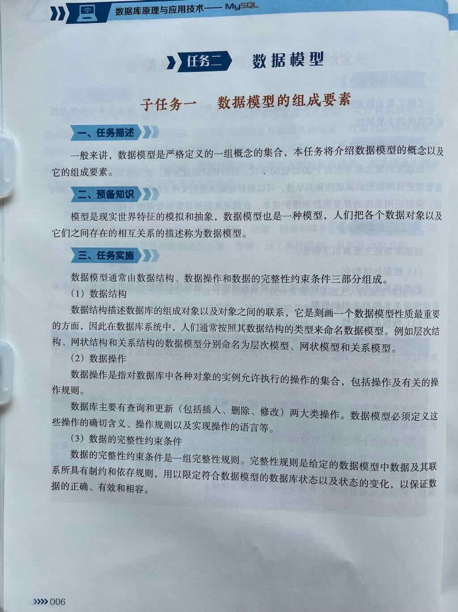
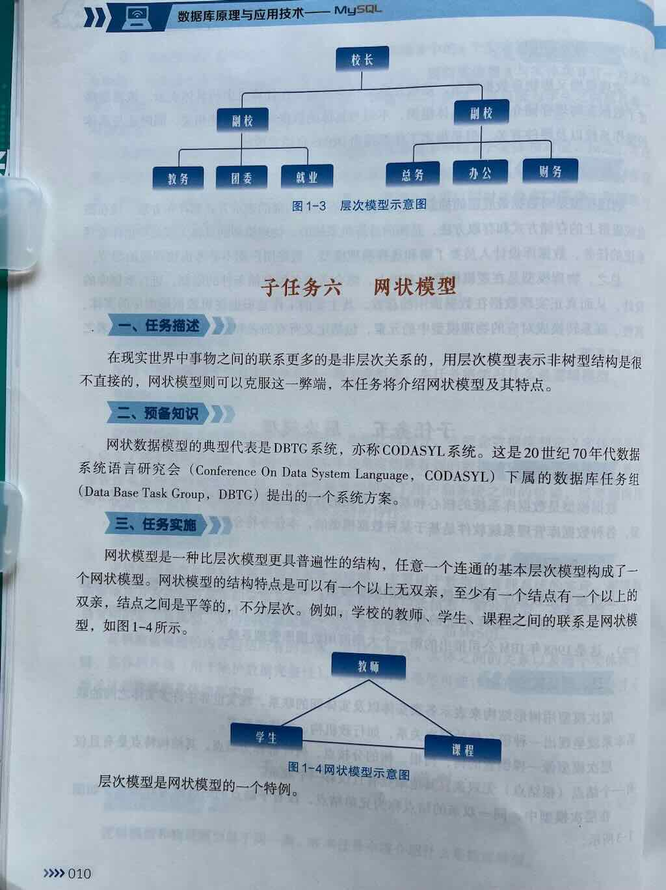
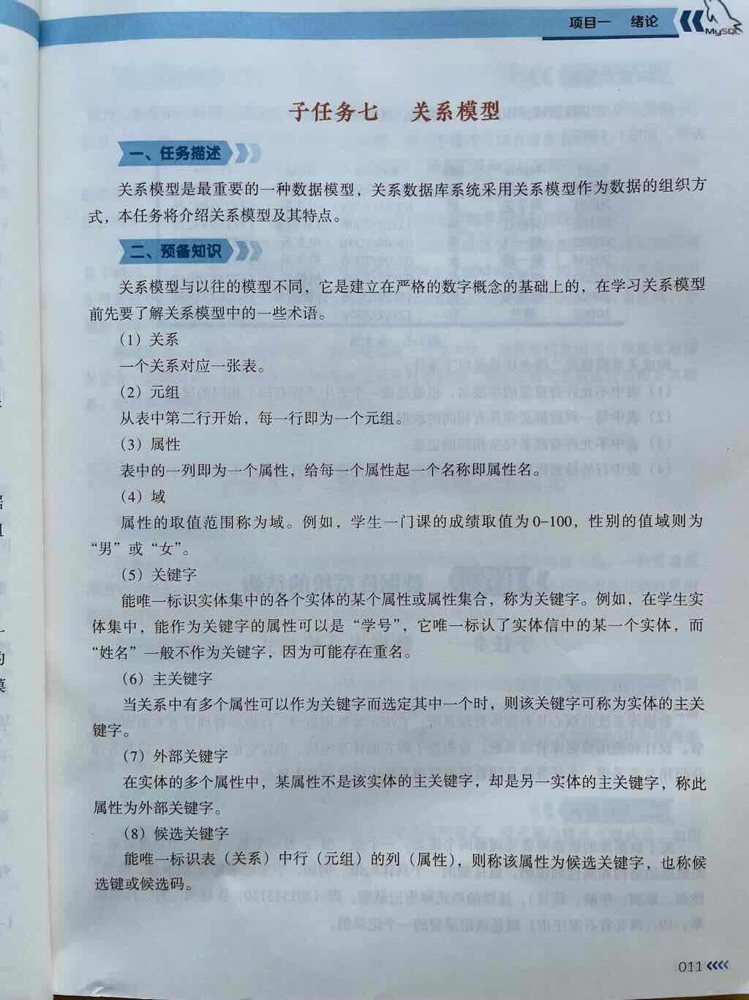
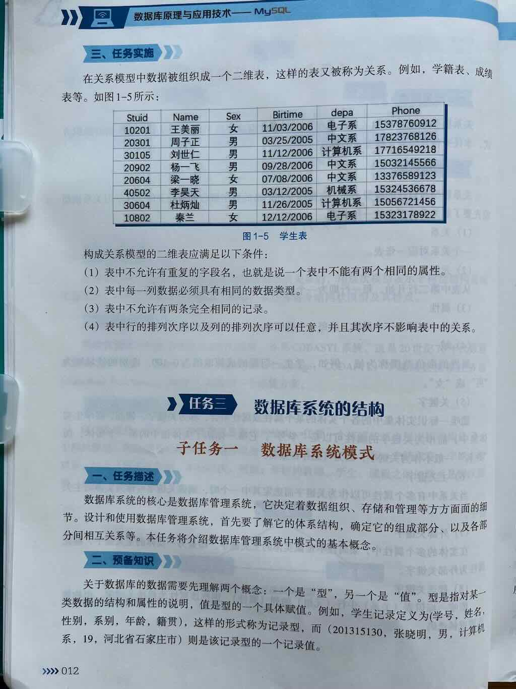

## 内容大纲
### 数据模型的组成要素
1. 数据模型是什么
2. 数据模型的组成要素是什么
3. 数据结构是什么
4. 数据操作是什么
5. 数据的完整性约束条件是什么
### 概念模型
6. 数据模型分为哪两类
7. 概念模型是什么
8. 实体是什么
9.  属性是什么
10. 码是什么
11. 实体型是什么
12. 实体集是什么
13. 联系反映在信息世界表示为什么
14. 实体之间的联系分为哪几种
### 逻辑模型
15. 逻辑模型是什么
16. 逻辑模型的用途是什么
17. 逻辑模型的分类是什么
18. 逻辑模型的内容是什么
### 物理模型
19. 物理模型是什么
20. 物理模型的用途是什么
### 层次模型
21. 常见的数据模型有哪几种
22. 层次模型是什么
23. 层次数据库系统的典型代表是谁
24. 层次模型的结构是什么
### 网状模型
25. 网状模型是什么
26. 网状数据模型的典型代表是谁
27. 网状模型的结构是什么
### 关系模型
28. 关系模型是什么
29. 术语“关系”是什么
30. 术语“元组”是什么
31. 术语“属性”是什么
32. 术语“域”是什么
33. 术语“关键字”是什么
34. 术语“主关键字”是什么
35. 术语“外部关键字”是什么
36. 术语“候选关键字”是什么
37. 构成关系模型二维表的条件是什么

## 常见数据库的种类
按照数据模型，数据库通常分为两大类：

- 关系型数据库
    - 特点：使用表格结构存储数据、支持SQL语言
    - 代表产品：MySQL、Oracle、SQL Server、MariaDB
- 非关系型数据库(NoSQL)
    - 键值数据库：通过键值对存储数据。如：Redis、DynamoDB
    - 文档数据库：通过半结构化文档存储数据。如：MongoDB
    - 列族数据库：通过列存储数据。如：Hbase

## 关系型数据库是什么

定义：

> 关系型数据库是一种基于关系模型（Relational Model）的数据库，它使用表（Table）来存储数据，并通过行（Row）和列（Column）的结构来组织信息。不同的表之间可以通过主键（Primary Key）和外键（Foreign Key）建立关联，从而实现数据的结构化存储和高效查询。

理解

- 关系数据库是一种基于关系模型的数据库。
- 就是基于“表”建立的数据库。
- 通过行（Row）和列（Column）的结构来组织信息。
- 表和表之间可以建立“关系”。
- 核心思想是用`表(Table)`存储和管理数据，并通过表之间的关系组织数据。

## 练习
### 单选题
9. 关系是一种规范化的二维表，以下不是它的特性的是（ ）。  
   A. 关系中不允许出现相同的行  
   B. 关系中不允许出现相同的列  
   C. 关系中每一列必须是不可分的数据项  
   D. 同一列下的各个属性值不一定是同类型的数据  

10. 在数据库中，下列说法（ ）是不正确的。  
   A. 数据库避免了一切数据的重复  
   B. 若系统是完全可以控制的，则系统可确保数据更新时的一致性  
   C. 数据库中的数据可以共享  
   D. 数据库减少了数据冗余  

11. 下面对关系属性的描述，错误的是（ ）。  
   A. 属性的次序可以任意交换  
   B. 允许多值属性  
   C. 属性名唯一  
   D. 每个属性中所有数据来自同一属性域  

12. 关于层次模型，描述正确的是（ ）。  
   A. 层次模型中，所有结点都有且仅有一个双亲  
   B. 层次模型中，除根结点外所有结点都有且仅有一个双亲  
   C. 层次模型中，有且仅有一个结点，有一个双亲  
   D. 层次模型中，有两个结点，有且仅有一个双亲  

13. 下面关于数据库模式的说法中，错误的是（ ）。  
   A. 数据库只有一个模式  
   B. 一个数据库系统可以有多个外模式  
   C. 一个数据库系统可以有多个内模式  