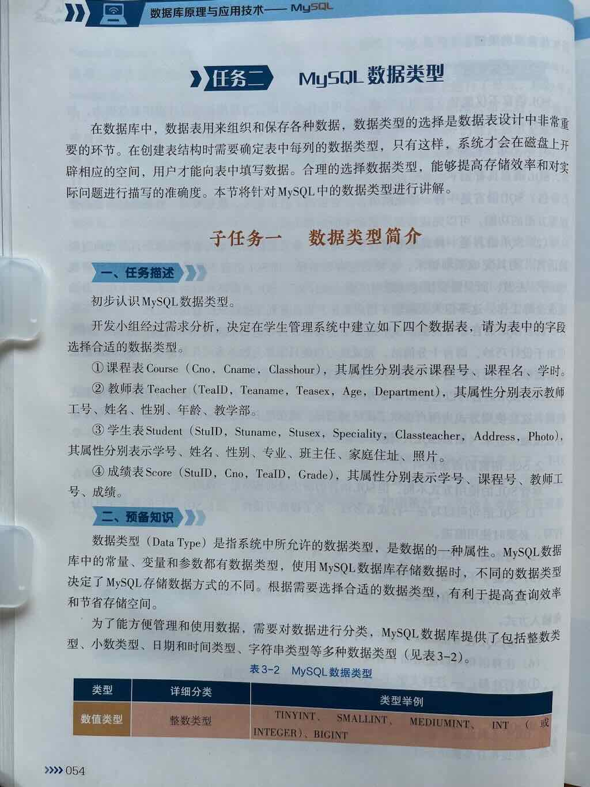
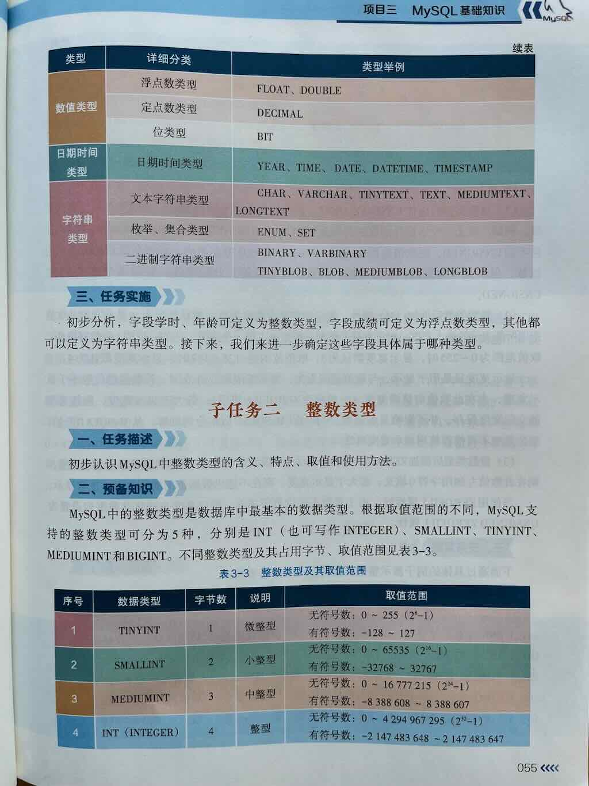

## 数据类型简介
 
 

MySQL 的数据类型是数据库设计的核心基础，合理选择类型直接影响存储效率、查询性能和数据的准确性。以下是 **系统化分类详解**，结合底层原理和实际应用场景：

## 1.数据是什么

- 数据的本质是信息。

- 数据是程序运行过程中操作的对象（信息）。

- 程序的运行是离不开数据的。

数据到底是什么？具象的说：

- 兰州拉面：用于描述说明传递信息的文本就是数据。
- 9.90：用来计算的数字也是数据
- 2024-09-01: 用固定格式表示的日期是数据。

结论：数据自身具有不同的特点，也就是说数据是有类型之分。

## 2.数据类型是什么

**数据类型就是数据的分类。**

- 数据自身具有不同特点，根据这些特点对数据进行分类。
- 数据类型不同，处理方式不同，以便提升程序运行效率。

常见的数据类型：

- 字符串类型：用来表示文本。字符串必须要使用单引号或双引号包裹。
- 整数类型：用来表示可以计算的整数数字。如果一个数字不能用来计算，就不能用整数类型表示，比如手机号
- 日期类型：用来存储日期。


## 10.数据类型速查表

```
是否需要存数字？
├─ 是 → 是否需要小数？
│  ├─ 是 → 是否需要精确计算？（如金额）
│  │  ├─ 是 → DECIMAL
│  │  └─ 否 → FLOAT/DOUBLE
│  └─ 否 → 选择合适范围的整数类型
├─ 否 → 是否是日期/时间？
│  ├─ 是 → 是否需要时区转换？ → TIMESTAMP/DATETIME
│  └─ 否 → 是否是固定选项？
│      ├─ 是 → ENUM/SET
│      └─ 否 → 字符串长度是否固定？
│          ├─ 是 → CHAR
│          └─ 否 → VARCHAR + 合理长度限制
└─ 特殊需求 → JSON/BLOB等
```

## 11.数据类型法则

1. **最小够用原则**：用能满足需求的最小类型（如年龄用`TINYINT UNSIGNED`）
2. **精确性优先**：金额用`DECIMAL`，避免浮点误差
3. **时间类型专用化**：不要用字符串存时间
4. **UTF-8编码**：默认使用`utf8mb4`字符集（支持Emoji）
5. **NULL谨慎使用**：非必要字段用`NOT NULL DEFAULT`


MySQL 提供了丰富的数据类型，主要分为以下几大类：

## 一、数值类型

### 1. 整数类型

| 类型        | 字节 | 有符号范围                          | 无符号范围              |
|------------|-----|-----------------------------------|-----------------------|
| TINYINT    | 1   | -128 ~ 127                        | 0 ~ 255               |
| SMALLINT   | 2   | -32,768 ~ 32,767                  | 0 ~ 65,535            |
| MEDIUMINT  | 3   | -8,388,608 ~ 8,388,607            | 0 ~ 16,777,215        |
| INT/INTEGER| 4   | -2,147,483,648 ~ 2,147,483,647    | 0 ~ 4,294,967,295     |
| BIGINT     | 8   | -2^63 ~ 2^63-1                    | 0 ~ 2^64-1            |

**示例**：
```sql
CREATE TABLE users (
    id INT UNSIGNED AUTO_INCREMENT PRIMARY KEY,
    age TINYINT UNSIGNED
);
```

### 2. 浮点数类型

| 类型       | 字节 | 说明                     |
|-----------|-----|-------------------------|
| FLOAT     | 4   | 单精度浮点数，约7位有效数字  |
| DOUBLE    | 8   | 双精度浮点数，约15位有效数字 |

**示例**：
```sql
CREATE TABLE products (
    price FLOAT(10,2),
    weight DOUBLE(15,5)
);
```

### 3. 定点数类型

| 类型       | 说明                     |
|-----------|-------------------------|
| DECIMAL   | 精确小数，适合财务计算       |

**示例**：
```sql
CREATE TABLE financial (
    amount DECIMAL(15,2)  -- 共15位，小数点后2位
);
```

## 二、字符串类型

### 1. 短文本类型

| 类型        | 最大长度 | 特点                     |
|------------|---------|-------------------------|
| CHAR(n)    | 255字符  | 固定长度，适合短且长度固定的数据 |
| VARCHAR(n) | 65,535字节 | 可变长度，节省空间          |

**示例**：
```sql
CREATE TABLE contacts (
    country CHAR(2),        -- 国家代码，如'CN'
    address VARCHAR(255)    -- 地址，长度可变
);
```

### 2. 长文本类型

| 类型       | 最大长度       | 特点                     |
|-----------|--------------|-------------------------|
| TEXT      | 65,535字节    | 长文本                   |
| MEDIUMTEXT| 16,777,215字节| 中等长度文本               |
| LONGTEXT  | 4GB           | 超长文本                 |

**示例**：
```sql
CREATE TABLE articles (
    content TEXT,
    full_text LONGTEXT
);
```

### 3. 二进制类型

| 类型        | 说明                     |
|------------|-------------------------|
| BINARY(n)  | 固定长度二进制数据          |
| VARBINARY(n)| 可变长度二进制数据          |
| BLOB       | 二进制大对象，存储文件等      |

## 三、日期时间类型

| 类型        | 格式                | 范围                     | 说明                     |
|------------|--------------------|-------------------------|-------------------------|
| DATE       | YYYY-MM-DD         | 1000-01-01 ~ 9999-12-31 | 日期值                   |
| TIME       | HH:MM:SS           | -838:59:59 ~ 838:59:59  | 时间值                   |
| DATETIME   | YYYY-MM-DD HH:MM:SS| 1000-01-01 00:00:00 ~ 9999-12-31 23:59:59 | 日期时间                 |
| TIMESTAMP  | YYYY-MM-DD HH:MM:SS| 1970-01-01 00:00:01 ~ 2038-01-19 03:14:07 UTC | 时间戳，自动转换时区       |
| YEAR       | YYYY               | 1901 ~ 2155             | 年份值                   |

**示例**：
```sql
CREATE TABLE events (
    event_date DATE,
    start_time TIME,
    created_at TIMESTAMP DEFAULT CURRENT_TIMESTAMP,
    event_year YEAR
);
```

## 四、JSON类型

MySQL 5.7+ 支持原生JSON数据类型：

**特点**：
- 自动验证JSON格式
- 优化存储格式
- 提供JSON相关函数

**示例**：
```sql
CREATE TABLE products (
    id INT PRIMARY KEY,
    details JSON,
    attributes JSON
);

-- 插入JSON数据
INSERT INTO products VALUES (1, '{"name": "Laptop", "price": 999.99}', '{"color": "silver", "weight": "1.5kg"}');

-- 查询JSON字段
SELECT details->"$.name" AS product_name FROM products;
```

## 五、空间数据类型

MySQL支持地理空间数据：

| 类型        | 说明                     |
|------------|-------------------------|
| GEOMETRY   | 任何类型的几何值            |
| POINT      | 点                      |
| LINESTRING | 线                      |
| POLYGON    | 多边形                   |

**示例**：
```sql
CREATE TABLE locations (
    id INT PRIMARY KEY,
    name VARCHAR(100),
    position POINT SRID 4326  -- WGS84坐标系
);

-- 插入空间数据
INSERT INTO locations VALUES (1, 'Eiffel Tower', ST_GeomFromText('POINT(2.2945 48.8584)'));
```

## 六、枚举和集合类型

### 1. ENUM类型
预定义的字符串值列表，只能选择其中一个值

```sql
CREATE TABLE shirts (
    size ENUM('x-small', 'small', 'medium', 'large', 'x-large')
);
```

### 2. SET类型
预定义的字符串值集合，可选择多个值

```sql
CREATE TABLE surveys (
    colors SET('red', 'green', 'blue', 'yellow')
);
```

## 数据类型选择建议

1. **精确性原则**：
   - 财务数据使用DECIMAL
   - 整数根据范围选择合适类型

2. **空间效率**：
   - 短字符串用CHAR/VARCHAR
   - 大文本用TEXT系列

3. **性能考虑**：
   - 整数运算比字符串快
   - 固定长度类型(CHAR)比可变长度快

4. **未来扩展性**：
   - 考虑数据可能增长的范围

正确选择数据类型可以显著提高数据库性能和存储效率。

