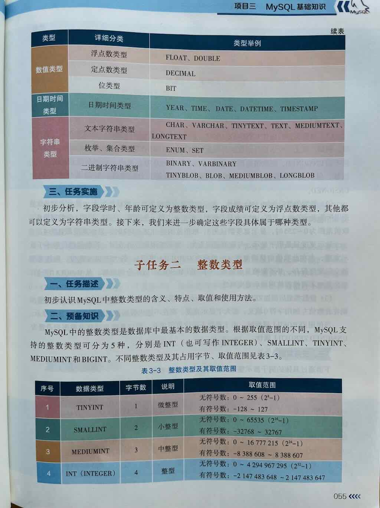
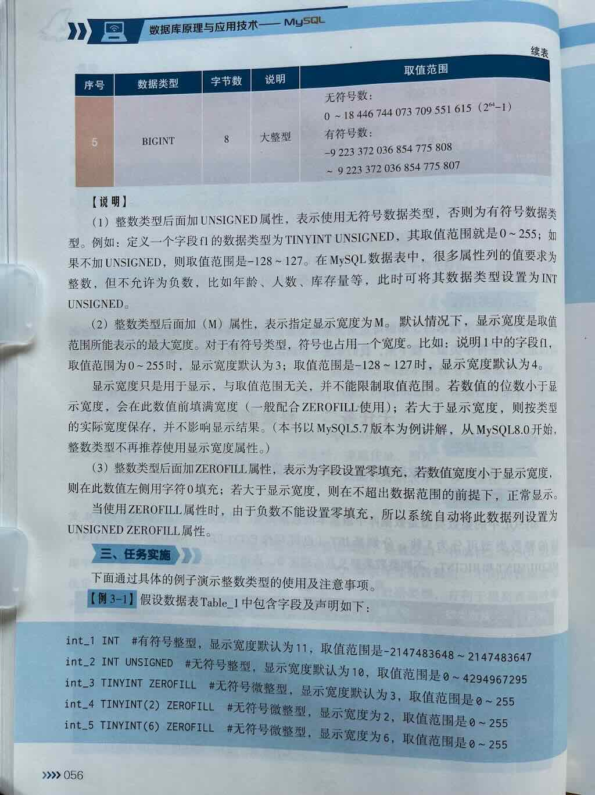
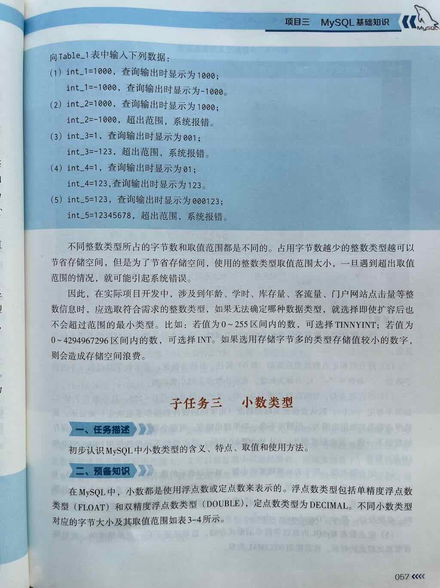

在 MySQL 中，**整数类型（Integer Types）** 是用于存储整数值（不带小数部分的数字）的数据类型。它们是数据库设计中最基础、最常用的数据类型之一，广泛应用于主键、计数器、状态码、ID 字段等场景。

---


 
 
 


## 一、MySQL支持的整数类型

MySQL支持五种整数类型，主要分为两类：

1. **有符号整数（Signed）**：可以存储**正数、负数和零**
2. **无符号整数（Unsigned）**：只能存储**零和正数**，但范围更大

| 数据类型 | 字节大小 | 有符号范围 (Signed) | 无符号范围 (Unsigned) | 说明 |
|----------|----------|---------------------|------------------------|------|
| **TINYINT** | 1 字节 | -128 ~ 127 | 0 ~ 255 | 最小的整数类型，常用于布尔值、状态标志 |
| **SMALLINT** | 2 字节 | -32,768 ~ 32,767 | 0 ~ 65,535 | 较小的整数，如年龄、小范围数量 |
| **MEDIUMINT** | 3 字节 | -8,388,608 ~ 8,388,607 | 0 ~ 16,777,215 | 中等大小的整数 |
| **INT** 或 **INTEGER** | 4 字节 | -2,147,483,648 ~ 2,147,483,647 | 0 ~ 4,294,967,295 | **最常用的整数类型**，如 ID、计数器 |
| **BIGINT** | 8 字节 | -9,223,372,036,854,775,808 ~ 9,223,372,036,854,775,807 | 0 ~ 18,446,744,073,709,551,615 | 用于非常大的数字，如雪花ID、大数据量计数 |

> ✅ 注意：`INT` 和 `INTEGER` 是**完全相同的类型**，可以互换使用。

---

## 二、基本语法

在创建表时定义整数字段的语法：

```sql
列名 数据类型 [UNSIGNED] [ZEROFILL] [约束条件...]
```

可选关键字说明：

- **UNSIGNED**：指定该整数类型为**无符号**，即不能存储负数，但正数范围扩大一倍
- **ZEROFILL**：用零填充显示（如 `INT(5) ZEROFILL` 显示为 `00001`），**只是显示效果**，不影响实际存储
- **约束条件**：如 `NOT NULL`, `DEFAULT 值`, `AUTO_INCREMENT` 等

---

示例：创建包含各种整数类型的表

```sql
CREATE TABLE example_integers (
    id INT PRIMARY KEY AUTO_INCREMENT,           -- 自增主键，有符号整型
    tiny_col TINYINT,                            -- 有符号 TINYINT
    small_col SMALLINT UNSIGNED,                 -- 无符号 SMALLINT
    medium_col MEDIUMINT,                        -- 有符号 MEDIUMINT
    int_col INT,                                 -- 有符号 INT（常用）
    bigint_col BIGINT UNSIGNED                   -- 无符号 BIGINT，用于非常大的数
);
```

---

## 三、整数类型用法详解

### **TINYINT**

- **大小**：1 字节（8位）
- **范围**：
  - 有符号：**-128 ~ 127**
  - 无符号：**0 ~ 255**
- **用途**：
  - 非常适合存储**小范围整数**或**状态值/标志位**
  - 常用于：布尔类型（0/1）、性别（0/1/2）、开关状态、小类型分类编码等

✅ **推荐使用场景：**
```sql
status TINYINT DEFAULT 0  -- 0表示未激活，1表示激活
is_deleted TINYINT(1) DEFAULT 0  -- 0/1 表示是否删除
```

> ⚠️ 注意：虽然经常用 `TINYINT(1)` 来表示布尔值，但 MySQL 没有真正的布尔类型，`TINYINT(1)` 只是约定俗成

---

### **SMALLINT**

- **大小**：2 字节（16位）
- **范围**：
  - 有符号：**-32,768 ~ 32,767**
  - 无符号：**0 ~ 65,535**
- **用途**：
  - 适合存储**中小范围的数值**，如年龄、数量、年份差值等
  - 比 TINYINT 范围大，但比 INT 更节省空间

✅ **推荐使用场景：**
```sql
age SMALLINT UNSIGNED  -- 年龄范围 0~150 足够
quantity SMALLINT      -- 商品数量
```

---

### **MEDIUMINT**

- **大小**：3 字节（24位）
- **范围**：
  - 有符号：**-8,388,608 ~ 8,388,607**
  - 无符号：**0 ~ 16,777,215**
- **用途**：
  - 适合存储**中等范围整数**，比 SMALLINT 范围大，但比 INT 小
  - 使用频率相对较低，但在特定场景下可以节省空间

✅ **推荐使用场景：**
```sql
medium_quantity MEDIUMINT  -- 某些中等规模计数场景
```

---

### **INT / INTEGER（最常用）**

- **大小**：4 字节（32位）
- **范围**：
  - 有符号：**-2,147,483,648 ~ 2,147,483,647**
  - 无符号：**0 ~ 4,294,967,295**
- **用途**：
  - **最常用的整数类型**，适合绝大多数业务场景
  - 常用于：主键 ID、计数器、状态码、时间戳（秒级）、金额倍数等

✅ **推荐使用场景：**
```sql
id INT PRIMARY KEY AUTO_INCREMENT  -- 自增主键
user_id INT NOT NULL
view_count INT UNSIGNED DEFAULT 0  -- 浏览量
```

> ⚠️ 对于主键或自增字段，通常使用 `INT` 或 `BIGINT`，不建议使用 TINYINT/SUMINT，除非数据量极小

---

### **BIGINT**

- **大小**：8 字节（64位）
- **范围**：
  - 有符号：**-9,223,372,036,854,775,808 ~ 9,223,372,036,854,775,807**
  - 无符号：**0 ~ 18,446,744,073,709,551,615**
- **用途**：
  - 适合存储**非常大的整数**，如：
    - 分布式 ID（雪花算法 ID）
    - 大数据量统计
    - 时间戳（毫秒/微秒级）
    - 金融领域大数字计算

✅ **推荐使用场景：**
```sql
snowflake_id BIGINT PRIMARY KEY  -- 分布式唯一ID
file_size BIGINT  -- 文件大小（字节），可能超过 4GB
high_precision_counter BIGINT UNSIGNED
```

> ⚠️ 如果你的表数据量可能超过几亿条，或者使用分布式架构生成主键，建议使用 `BIGINT` 而非 `INT`

---

## 四、整数类型的常见属性

### **UNSIGNED（无符号）**

- 只能用于整数类型
- 表示该字段**只能存储零和正数**
- 相比有符号类型，**正数范围扩大一倍**
- **不能存储负数！**

✅ 示例：
```sql
age INT UNSIGNED  -- 只能存 0 ~ 4,294,967,295
```

---

### **ZEROFILL（零填充）**

- 是一种**显示格式**，不是存储格式
- 用于让数字在显示时**用零填充到指定宽度**
- 例如：`INT(5) ZEROFILL` 存储 `42`，显示为 `00042`
- 实际存储的还是普通整数，只是客户端显示时填充零

✅ 示例：
```sql
code INT(5) ZEROFILL  -- 存 7 显示为 00007
```

> ⚠️ 注意：`INT(5)` 中的 `5` 只是**显示宽度提示**，并不限制存储范围，且只有在配合 `ZEROFILL` 时才有显示效果

---

### **AUTO_INCREMENT（自增）**

- 通常与 `INT` 或 `BIGINT` 一起使用
- 用于**主键自动递增**
- 每插入一行记录，该字段的值会**自动加1**
- 常用于唯一标识符，如用户ID、订单ID等

✅ 示例：
```sql
id INT PRIMARY KEY AUTO_INCREMENT
```

---

## 五、如何选择合适的整数类型？

| 应用场景 | 推荐类型 | 是否有符号 | 说明 |
|----------|----------|-------------|------|
| 状态值 / 开关 / 布尔 | TINYINT(1) | 有符号 | 通常只存 0 或 1 |
| 年龄 / 数量 / 小范围数值 | TINYINT / SMALLINT | 有符号或无符号 | 根据范围选择 |
| 一般主键 / 计数器 / ID | INT | 有符号或无符号 | 最常用，范围足够大多数场景 |
| 大数据量主键 / 分布式ID | BIGINT | 通常无符号 | 支持超大数据范围 |
| 中等范围数值 | MEDIUMINT | 有符号 | 比 INT 稍小，但节省空间 |
| 非常大的数字（如文件大小、超大计数） | BIGINT | 无符号 | 范围极大 |

---

## 六、MySQL 整数类型总览表


| 类型名称 | 字节 | 有符号范围 | 无符号范围 | 是否常用 | 推荐用途 |
|----------|------|-------------|-------------|-----------|----------|
| **TINYINT** | 1 | -128 ~ 127 | 0 ~ 255 | ✅ 常用 | 状态、布尔、小数字 |
| **SMALLINT** | 2 | -32,768 ~ 32,767 | 0 ~ 65,535 | ✅ | 年龄、小计数 |
| **MEDIUMINT** | 3 | -8M ~ 8M | 0 ~ 16M | ⚠️ 较少 | 中等范围整数 |
| **INT / INTEGER** | 4 | -21亿 ~ 21亿 | 0 ~ 42亿 | ✅✅ 最常用 | 主键、计数器、ID |
| **BIGINT** | 8 | 超大负数范围 | 0 ~ 18百亿亿 | ✅ 大数据场景 | 分布式ID、大计数 |


一句话：

> **MySQL 提供了多种整数类型（TINYINT、SMALLINT、INT、BIGINT等），选择合适的类型可以在保证功能的同时优化存储空间与性能。最常用的是 INT（主键/计数器）和 TINYINT（状态值），大数据场景推荐使用 BIGINT。**

---