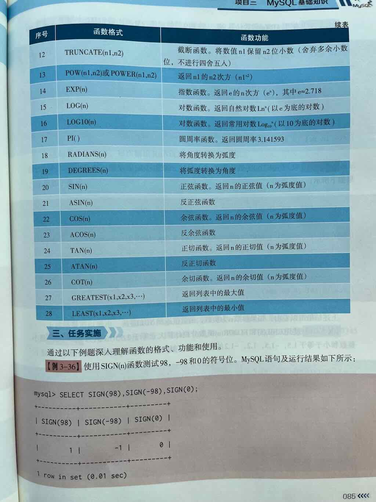
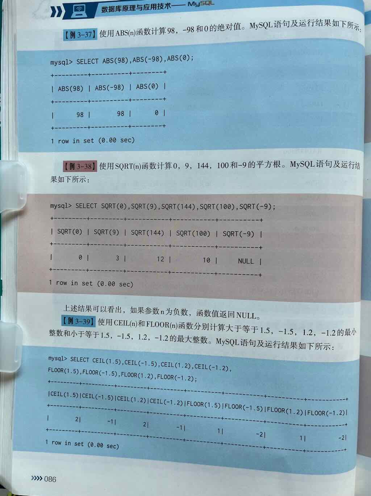
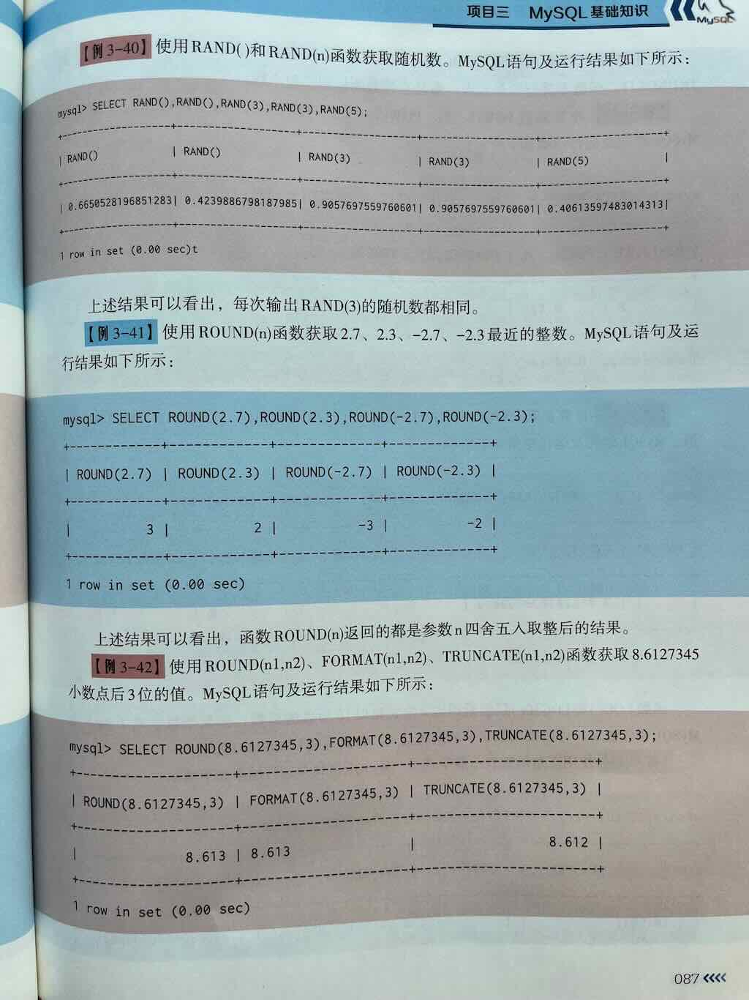
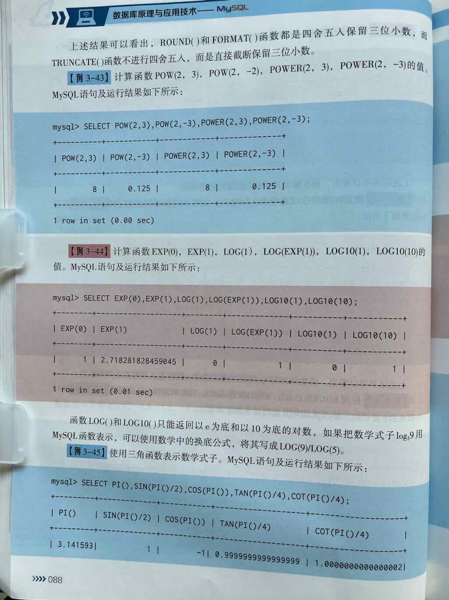
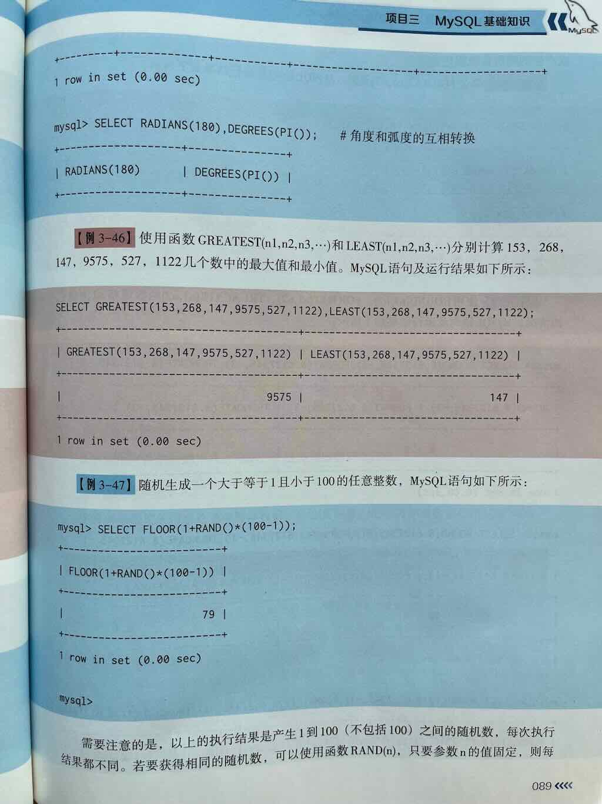
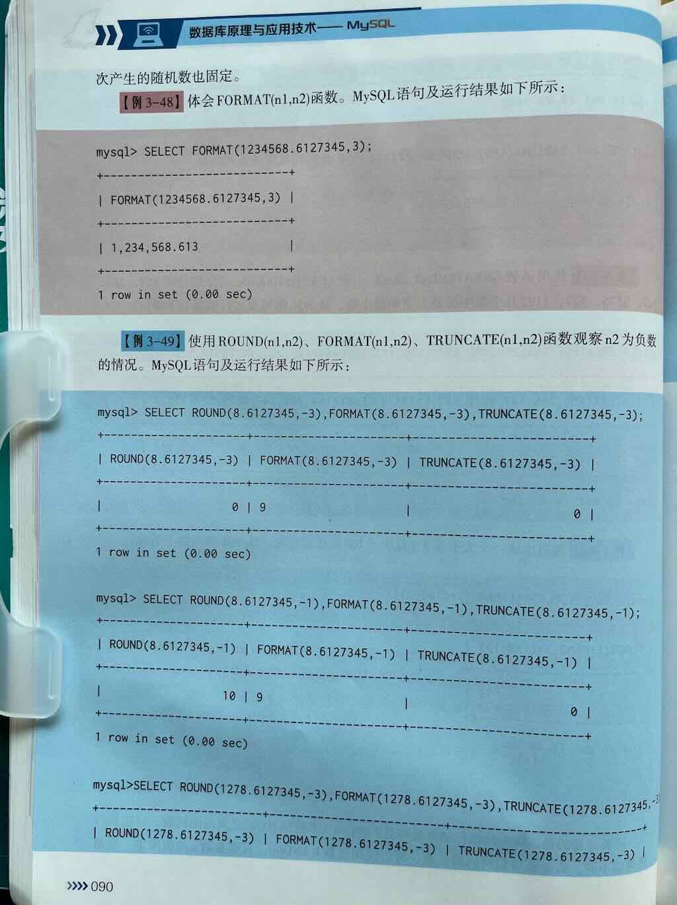
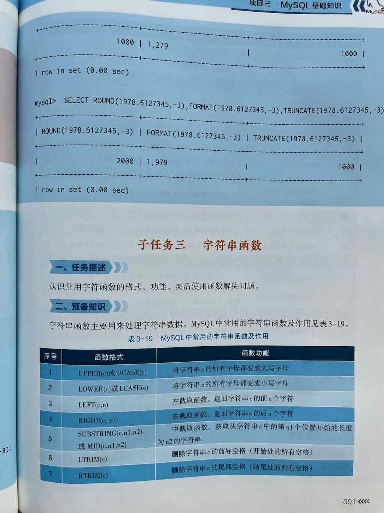

# MySQL 中常见数学函数的用法详解

在 MySQL 中，**数学函数（Mathematical Functions）** 是用于对**数值进行数学计算与处理**的内置函数，它们在数据计算、统计分析、业务逻辑处理等场景中非常常用。

掌握这些函数可以让你在 SQL 查询中轻松实现：

- 基本运算（绝对值、取整、四舍五入等）
- 数学计算（幂、平方根、对数等）
- 随机数生成
- 数值比较与处理

---


 
 
 
 
 
 
 
 


# 一、MySQL 常见数学函数分类与详解

下面为你分类介绍 **MySQL 中最常用的数学函数**，包括语法、作用、示例及结果说明。

---

## 🔢 一、基本数学运算函数

### 1. `ABS(x)` —— 求绝对值

**作用：** 返回数值 `x` 的绝对值（非负数）

```sql
SELECT ABS(-10);    -- 结果：10
SELECT ABS(5 - 20); -- 结果：15 （表达式也可以）
```

---

### 2. `CEIL(x)` 或 `CEILING(x)` —— 向上取整

**作用：** 返回大于或等于 x 的最小整数（向上取整）

```sql
SELECT CEIL(3.14);    -- 结果：4
SELECT CEILING(9.001); -- 结果：10
```

---

### 3. `FLOOR(x)` —— 向下取整

**作用：** 返回小于或等于 x 的最大整数（向下取整）

```sql
SELECT FLOOR(3.99);   -- 结果：3
SELECT FLOOR(5.999);  -- 结果：5
```

---

### 4. `ROUND(x)` / `ROUND(x, d)` —— 四舍五入

**作用：** 对数值 x 进行四舍五入  
- `ROUND(x)`：四舍五入到整数  
- `ROUND(x, d)`：四舍五入到小数点后 d 位

```sql
SELECT ROUND(3.14159);        -- 结果：3
SELECT ROUND(3.14159, 2);     -- 结果：3.14
SELECT ROUND(3.678, 1);       -- 结果：3.7
```

---

### 5. `TRUNCATE(x, d)` 或 `TRUNC(x, d)` —— 截断小数位（不四舍五入）

**作用：** 保留 x 的 d 位小数，直接截断，不四舍五入

```sql
SELECT TRUNCATE(3.6789, 2);   -- 结果：3.67
SELECT TRUNCATE(9.999, 0);    -- 结果：9
```

> ✅ 与 ROUND 不同，TRUNCATE **不会进行四舍五入**

---

## 🧮 二、数学计算函数

### 6. `POW(x, y)` 或 `POWER(x, y)` —— 求 x 的 y 次幂

```sql
SELECT POW(2, 3);     -- 结果：8 （2的3次方）
SELECT POWER(3, 2);   -- 结果：9 （3的平方）
```

---

### 7. `SQRT(x)` —— 求平方根

```sql
SELECT SQRT(16);      -- 结果：4
SELECT SQRT(25);      -- 结果：5
```

> ⚠️ 注意：x 必须为非负数，否则返回 NULL

---

### 8. `MOD(x, y)` 或 `x % y` —— 求余数（取模）

```sql
SELECT MOD(10, 3);    -- 结果：1
SELECT 10 % 3;        -- 结果：1 （与 MOD() 等价）
```

> ✅ 常用于判断奇偶性：`x % 2 = 0` 表示偶数

---

### 9. `RAND()` —— 生成 0 到 1 之间的随机浮点数

```sql
SELECT RAND();        -- 结果如：0.123456789（每次不同）
```

**应用场景：**
- 随机排序：`ORDER BY RAND()`
- 抽奖、随机推荐等

---

### 10. `LEAST(value1, value2, ...)` —— 返回一组值中的最小值

```sql
SELECT LEAST(10, 5, 8, 3);   -- 结果：3
```

---

### 11. `GREATEST(value1, value2, ...)` —— 返回一组值中的最大值

```sql
SELECT GREATEST(10, 5, 8, 3);   -- 结果：10
```

---

## 🔢 三、数学常量（部分版本支持）

> ⚠️ 注意：部分数学常量如 PI() 是支持的，但像 E（自然常数）在 MySQL 中没有直接函数，但可以手动定义或计算

### 12. `PI()` —— 返回圆周率 π 的近似值

```sql
SELECT PI();   -- 结果：3.141593（近似）
```

---

## 四、数学函数使用场景举例

---

### ✅ 示例 1：商品价格计算（四舍五入、取整）

假设有商品价格 `price = 19.888`，需要：

- 四舍五入到两位小数
- 向上取整到应付金额
- 向下取整为优惠价

```sql
SELECT 
    price,
    ROUND(price, 2) AS rounded_price,
    CEIL(price) AS ceil_price,
    FLOOR(price) AS floor_price
FROM products
WHERE id = 1;
```

---

### ✅ 示例 2：计算平方与开方（几何或物理相关业务）

```sql
SELECT 
    5 AS number,
    POW(5, 2) AS square,     -- 5的平方
    SQRT(25) AS square_root; -- 25的平方根
```

---

### ✅ 示例 3：计算余数（如判断奇偶）

```sql
SELECT 
    user_id,
    user_id % 2 AS remainder,
    CASE WHEN user_id % 2 = 0 THEN '偶数' ELSE '奇数' END AS parity
FROM users;
```

---

### ✅ 示例 4：随机推荐（如抽奖、随机排序）

```sql
-- 随机排序查询用户
SELECT * FROM users ORDER BY RAND() LIMIT 5;

-- 生成一个 0~1 的随机小数
SELECT RAND();
```

---

### ✅ 示例 5：取最大值和最小值

```sql
SELECT 
    LEAST(100, 200, 150) AS min_value,
    GREATEST(10, 30, 20) AS max_value;
```

---

# ✅ 常用数学函数速查表

| 函数 | 说明 | 示例 | 结果 |
|------|------|------|------|
| `ABS(x)` | 绝对值 | `ABS(-10)` | 10 |
| `CEIL(x)` / `CEILING(x)` | 向上取整 | `CEIL(3.1)` | 4 |
| `FLOOR(x)` | 向下取整 | `FLOOR(3.9)` | 3 |
| `ROUND(x, d)` | 四舍五入到 d 位小数 | `ROUND(3.14159, 2)` | 3.14 |
| `TRUNCATE(x, d)` | 截断到 d 位小数（不四舍五入） | `TRUNCATE(3.678, 2)` | 3.67 |
| `POW(x,y)` / `POWER(x,y)` | x 的 y 次幂 | `POW(2,3)` | 8 |
| `SQRT(x)` | 平方根 | `SQRT(16)` | 4 |
| `MOD(x,y)` 或 `x % y` | 取余数 | `MOD(10,3)` | 1 |
| `RAND()` | 0~1 随机浮点数 | `RAND()` | 如 0.123456 |
| `LEAST(a,b,...)` | 返回最小值 | `LEAST(5,3,8)` | 3 |
| `GREATEST(a,b,...)` | 返回最大值 | `GREATEST(5,3,8)` | 8 |
| `PI()` | 圆周率 π | `PI()` | 3.141593 |

---

# 📌 总结

| 类别 | 常用函数 | 用途 |
|------|----------|------|
| **基本运算** | `ABS()`, `CEIL()`, `FLOOR()`, `ROUND()`, `TRUNCATE()` | 取绝对值、取整、四舍五入等 |
| **数学计算** | `POW()`, `SQRT()`, `MOD()` | 幂运算、开方、取余 |
| **随机数** | `RAND()` | 生成随机数，用于随机排序、抽奖等 |
| **极值函数** | `LEAST()`, `GREATEST()` | 求一组值中的最小或最大值 |
| **常量** | `PI()` | 返回圆周率 π |

---

## ✅ 下一步建议

你可以尝试以下练习来巩固数学函数的使用：

1. ✅ 对商品价格进行**四舍五入到两位小数**
2. ✅ 使用 `CEIL` 或 `FLOOR` 模拟**支付金额向上取整**
3. ✅ 用 `MOD()` 判断用户 ID 是否为**偶数/奇数**
4. ✅ 用 `RAND()` 实现**随机排序或抽取**
5. ✅ 使用 `POW()` 和 `SQRT()` 处理**几何相关计算**

---

如你希望获取这些函数的：

- ✅ **实际建表 + 数据 + 查询示例**
- ✅ **与聚合函数（如 SUM、AVG）结合使用**
- ✅ **在存储过程或触发器中的应用**
- 完整的 SQL 实战案例。

# 9月29日 数学函数

考试大纲中的数学函数包括6个：**ABS()、FLOOR()、RAND()、TRUNCATE()、SQRT() 、ROUND()**、CEIL()、MOD() 、POW() 、FORMAT()
## 函数总结

| 函数             | 用途              | 示例                          |
| ---------------- | ----------------- | ----------------------------- |
| `ABS(x)`         | 绝对值            | `ABS(-5) = 5`                 |
| `RAND()`         | 随机小数 [0,1)    | `RAND()`                      |
| `CEIL(x)`        | 向上取整          | `CEIL(4.2) = 5`               |
| `FLOOR(x)`       | 向下取整          | `FLOOR(4.9) = 4`              |
| `ROUND(x, d)`    | 四舍五入到d位小数 | `ROUND(3.14159, 2) = 3.14`    |
| `TRUNCATE(x, d)` | 截断到d位小数     | `TRUNCATE(3.14159, 2) = 3.14` |
| `POW(x, y)`      | x的y次方          | `POW(2, 5) = 32`              |
| `SQRT(x)`        | 平方根            | `SQRT(81) = 9`                |
| `MOD(x, y)`      | 求余数            | `MOD(17, 5) = 2`              |
| `PI()`           | 圆周率            | `PI() = 3.141593`             |

## ABS()  

用途：取绝对值

语法：

```sql  
ABS(n)
```

示例

```sql
SELECT ABS(-12.5);  -- 输出 12.5  
```

## MOD()

用途：取余数  

语法

```sql
MOD(n, m)
```

示例

```sql
SELECT MOD(15, 4);  -- 输出 3
SELECT MOD(-15, 4);  -- 输出 -3  
```

## POW()

用途：计算 x 的 y 次幂

语法

```sql
POW(x, y)
```

示例

```sql
SELECT POW(2, 3);  -- 输出 8
```

## SQRT()

用途：求平方根

语法

```sql
SQRT(x)
```

注意：x 必须为非负数

示例

```sql
SELECT SQRT(9);  -- 输出 3  
```

## CEIL()

 用途：向上取整  

```sql
CEIL(x) / CEILING(x) 
```

示例

```sql
SELECT CEIL(3.1);  -- 返回 4 
SELECT CEIL(-3.1) -- 返回 -3
```

## FLOOR()  

用途：向下取整  

语法

```sql
CEIL(x)
```

示例

```sql
SELECT FLOOR(3.9);  -- 输出 3  
```

## ROUND()  

用途：四舍五入到指定小数位  

语法

```sql
ROUND(x, d)
```

示例  

```sql
SELECT ROUND(3.1415, 2);  -- 输出 3.14  
SELECT ROUND(123.456, -1); -- 输出 120（十位取整）
```

ROUND() 函数使用要点

1. **基本语法**：`ROUND(number, decimals)`
   - `number`：要四舍五入的数字
   - `decimals`：要保留的小数位数

2. **小数位数参数**：
   - `0`：四舍五入到整数
   - `1`：保留一位小数
   - `2`：保留两位小数
   - 以此类推...

3. **与 RAND() 结合的优势**：
   - 可以精确控制随机数的精度
   - 适合需要特定小数位数的场景（如金额、评分、坐标等）
   - 比 FLOOR/TRUNCATE 更符合日常四舍五入的习惯

4. **注意事项**：
   - ROUND() 是四舍五入，不是截断
   - 对于边界值要特别注意（如 0.5 会向上舍入）
   - 负数也是按四舍五入规则处理

## TRUNCATE()

用途：直接截断小数位。（与 ROUND 不同，不会四舍五入）

语法

```sql
TRUNCATE(x, d) 
```

示例

```sql
SELECT TRUNCATE(3.1415, 2);  -- 输出 3.14  
```

## FORMAT()

用途：数字格式化（千分位）  

语法

```sql
FORMAT(x, d) 
```

示例  

```sql
-- 输出 '1,234,567.46'（会四舍五入）
SELECT FORMAT(1234567.456, 2);  
```

## RAND()

用途: 生成 [0~1)之间的随机浮点数。

语法

```sql
RAND()
```

示例：

```sql
RAND();
```

示例:生成一个0 ~ 1之间(不含1）的随机小数

```sql
SELECT RAND();
```


运行结果

```sql
+--------------------+
| rand()             |
+--------------------+
| 0.5100285648461698 |
+--------------------+
1 row in set (0.001 sec)
```

## 练习1:基础函数  

1. 计算-25的绝对值  
1. 生成一个 0 到 1 之间的随机小数  
1. 将数字 4.2 向上取整  
1. 将数字 4.9 向下取整  
1. 将数字 3.14159 保留两位小数并四舍五入  
1. 将数字 3.14159 截断为两位小数  
1. 计算 2 的 5 次方  
1. 计算 81 的平方根  
1. 求 17 除以 5 的余数  
1. 查询圆周率 PI 的值  :  select PI()
1. 随机生成一个 1 到 100 之间的整数  
1. 将 -8.7 四舍五入为整数

---

## 练习2：随机数
 1. 基础随机数生成
```sql
-- 生成一个 0 到 1 之间的随机小数（不包含1）
SELECT ______();
```

 2. 指定范围的随机整数
```sql
-- 生成 1 到 10 之间的随机整数（包含1和10）
SELECT FLOOR(______ + ______ * ______);
```

 3. 随机布尔值
```sql
-- 生成随机布尔值（0 或 1），不使用 ROUND 函数
SELECT ______(RAND() + 0.5);
```

 4. 随机小数范围
```sql
-- 生成 5.0 到 15.0 之间的随机小数（包含5.0，不包含15.0）
SELECT ______ + ______ * ______;
```

 5. 随机抽奖号码
```sql
-- 生成一个 1000 到 9999 之间的随机整数（4位抽奖号码）
SELECT ______(1000 + ______ * ______);
```

 6. 保留指定位数的随机小数
```sql
-- 生成两位小数的随机数（0.00 到 1.00 之间，包含1.00）
SELECT ______(RAND() * 101) / ______;
```

 7. 使用种子的随机数
```sql
-- 使用种子值 42 生成可重复的随机数
SELECT ______(42);
```

 8. 随机排序查询结果
```sql
-- 从 users 表中随机选择 5 条记录
SELECT * FROM users ______ BY ______() LIMIT 5;
```

 9. 随机百分比
```sql
-- 生成 0% 到 100% 的随机百分比（包含0%和100%）
SELECT ______(RAND() * 100) AS random_percent;
```

 10. 随机日期范围
```sql
-- 生成 2023-01-01 到 2023-12-31 之间的随机日期
SELECT DATE_ADD('2023-01-01', INTERVAL ______(RAND() * ______) DAY);
```

## 练习3：随机数round

 1. 基础随机数四舍五入
```sql
-- 生成 0 到 1 之间的随机小数，并四舍五入为整数（0 或 1）
SELECT ______(RAND());
```

 2. 指定范围的随机整数
```sql
-- 生成 1 到 10 之间的随机整数（包含1和10），使用 ROUND
SELECT ______(1 + RAND() * 9);
```

 3. 保留指定位数的随机小数
```sql
-- 生成 0 到 1 之间的随机小数，保留两位小数
SELECT ______(RAND(), 2);
```

 4. 范围随机小数四舍五入
```sql
-- 生成 5.0 到 15.0 之间的随机小数，保留一位小数
SELECT ______(5.0 + RAND() * 10.0, 1);
```

 5. 随机百分比
```sql
-- 生成 0% 到 100% 的随机百分比，保留整数百分比
SELECT ______(RAND() * 100, 0);
```

 6. 随机金额
```sql
-- 生成 0.00 到 100.00 之间的随机金额，保留两位小数
SELECT ______(RAND() * 100, 2);
```

 7. 随机评分
```sql
-- 生成 1.0 到 5.0 之间的随机评分，保留一位小数
SELECT ______(1.0 + RAND() * 4.0, 1);
```

 8. 随机温度
```sql
-- 生成 -10.0 到 35.0 之间的随机温度，保留一位小数
SELECT ______(-10.0 + RAND() * 45.0, 1);
```

 9. 随机坐标
```sql
-- 生成经度范围（-180.0 到 180.0）的随机坐标，保留四位小数
SELECT ______(-180.0 + RAND() * 360.0, 4);
```

 10. 随机权重
```sql
-- 生成 0.000 到 1.000 之间的随机权重，保留三位小数
SELECT ______(RAND(), 3);
```

## 练习1答案

 1. 计算-25的绝对值

```sql
SELECT ABS(-25);
-- 结果: 25
```

 2. 生成一个 0 到 1 之间的随机小数

```sql
SELECT RAND();
-- 结果: [0, 1) 之间的随机小数，如 0.123456789
```

 3. 将数字 4.2 向上取整

```sql
SELECT CEIL(4.2);
-- 结果: 5
```

 4. 将数字 4.9 向下取整

```sql
SELECT FLOOR(4.9);
-- 结果: 4
```

 5. 将数字 3.14159 保留两位小数并四舍五入

```sql
SELECT ROUND(3.14159, 2);
-- 结果: 3.14
```

 6. 将数字 3.14159 截断为两位小数

```sql
SELECT TRUNCATE(3.14159, 2);
-- 结果: 3.14
```

 7. 计算 2 的 5 次方

```sql
SELECT POW(2, 5);
-- 结果: 32
```

 8. 计算 81 的平方根

```sql
SELECT SQRT(81);
-- 结果: 9
```

 9. 求 17 除以 5 的余数

```sql
SELECT MOD(17, 5);
-- 或者
SELECT 17 % 5;
-- 结果: 2
```

 10. 查询圆周率 PI 的值

```sql
SELECT PI();
-- 结果: 3.141593
```

 11. 随机生成一个 1 到 100 之间的整数

```sql
SELECT FLOOR(1 + RAND() * 100);
-- 结果: [1, 100] 之间的随机整数
```

12. 将 -8.7 四舍五入为整数

```sql
SELECT ROUND(-8.7);
-- 结果: -9
```

## 练习2答案

 1. 基础随机数生成
```sql
SELECT RAND();
```

 2. 指定范围的随机整数
```sql
SELECT FLOOR(1 + RAND() * 10);
```

 3. 随机布尔值
```sql
SELECT FLOOR(RAND() + 0.5);
```

 4. 随机小数范围
```sql
SELECT 5.0 + RAND() * 10.0;
```

 5. 随机抽奖号码
```sql
SELECT FLOOR(1000 + RAND() * 9000);
```

 6. 保留指定位数的随机小数
```sql
SELECT FLOOR(RAND() * 101) / 100;
```

 7. 使用种子的随机数
```sql
SELECT RAND(42);
```

 8. 随机排序查询结果
```sql
SELECT * FROM users ORDER BY RAND() LIMIT 5;
```

 9. 随机百分比
```sql
SELECT FLOOR(RAND() * 100) AS random_percent;
```

 10. 随机日期范围
```sql
SELECT DATE_ADD('2023-01-01', INTERVAL FLOOR(RAND() * 365) DAY);
```

## 练习3答案

1. 基础随机数四舍五入
```sql
SELECT ROUND(RAND());
```

2. 指定范围的随机整数
```sql
SELECT ROUND(1 + RAND() * 9);
```

3. 保留指定位数的随机小数
```sql
SELECT ROUND(RAND(), 2);
```

4. 范围随机小数四舍五入
```sql
SELECT ROUND(5.0 + RAND() * 10.0, 1);
```

5. 随机百分比
```sql
SELECT ROUND(RAND() * 100, 0);
```

6. 随机金额
```sql
SELECT ROUND(RAND() * 100, 2);
```

7. 随机评分
```sql
SELECT ROUND(1.0 + RAND() * 4.0, 1);
```

8. 随机温度
```sql
SELECT ROUND(-10.0 + RAND() * 45.0, 1);
```

9. 随机坐标
```sql
SELECT ROUND(-180.0 + RAND() * 360.0, 4);
```

10. 随机权重
```sql
SELECT ROUND(RAND(), 3);
```