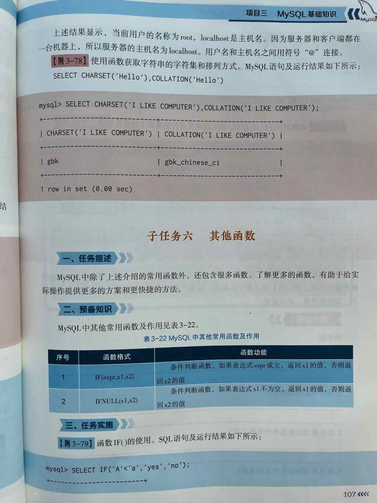
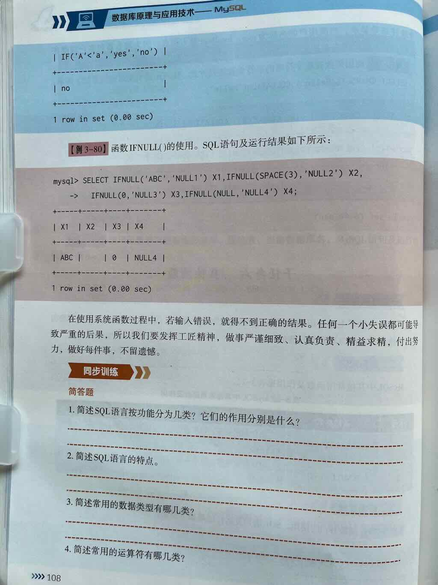

 
 
 


## if函数

MySQL 中的 `IF` 函数是一个逻辑控制函数，用于根据条件判断返回不同的结果。它类似于编程语言中的三元运算符（`条件 ? 结果1 : 结果2`），语法简洁，适用于简单的条件分支逻辑。

---

## 语法

```sql
IF(condition, value_if_true, value_if_false)
```

- **`condition`**：需要判断的条件表达式（必须返回布尔值 `TRUE`/`FALSE`）。
- **`value_if_true`**：当条件为真时返回的值。
- **`value_if_false`**：当条件为假时返回的值。

---

## 用法1:数值判断(双分支)

```sql
SELECT IF(10 > 5, 'Yes', 'No');  -- 输出: 'Yes'
SELECT IF(10 < 5, 'Yes', 'No');  -- 输出: 'No'
```


## 用法2.IF函数嵌套(多分支)

处理多重条件分支：

```sql
SELECT 
    name,
    score,
    IF(score >= 90, 'A',
        IF(score >= 80, 'B',
            IF(score >= 70, 'C',
                IF(score >= 60, 'D', 'F')
            )
        )
    ) AS grade
FROM students;
```

输出结果：

```
+---------+-------+-------+
| name    | score | grade |
+---------+-------+-------+
| Alice   | 85    | B     |
| Bob     | 72    | C     |
| Charlie | 60    | D     |
| David   | 45    | F     |
+---------+-------+-------+
```

## 用法3:结合聚合函数

动态统计符合条件的数据：

```sql
SELECT 
    COUNT(*) AS total_students,
    SUM(IF(score >= 60, 1, 0)) AS passed_count,
    SUM(IF(score < 60, 1, 0)) AS failed_count
FROM students;
```

输出结果：

```
+----------------+--------------+--------------+
| total_students | passed_count | failed_count |
+----------------+--------------+--------------+
| 4              | 3            | 1            |
+----------------+--------------+--------------+
```

---

## **注意事项**

1. **返回值类型兼容性**  
   `IF` 函数返回的 `value_if_true` 和 `value_if_false` 需为同一数据类型，否则 MySQL 会隐式转换类型：

   ```sql
   SELECT IF(TRUE, 100, 'Fail');  -- 输出: 100（字符串 'Fail' 被转为数值 0）
   ```

2. **处理 NULL 值**  
   如果条件中涉及 `NULL`，需用 `IS NULL` 或 `IS NOT NULL` 判断：

   ```sql
   SELECT IF(NULL, 'True', 'False');  -- 输出: 'False'（NULL 视为假）
   SELECT IF(column IS NULL, 'Unknown', column) FROM table;
   ```

3. **替代方案：CASE 语句**  
   对于复杂多条件分支，推荐使用 `CASE` 语句（更易读）：

   ```sql
   SELECT 
       name,
       CASE 
           WHEN score >= 90 THEN 'A'
           WHEN score >= 80 THEN 'B'
           WHEN score >= 70 THEN 'C'
           ELSE 'F'
       END AS grade
   FROM students;
   ```

---

## **典型应用场景**

1. **动态列生成**  
   根据条件生成标记列（如是否达标、状态分类）。
2. **数据清洗**  
   替换无效值或格式化字段。
3. **聚合统计**  
   按条件分组计数或求和。
4. **查询结果优化**  
   简化复杂逻辑的查询结果展示。

---

### 总结

`IF` 函数是 MySQL 中处理简单条件分支的高效工具，适合快速实现二元逻辑。但在多层嵌套或复杂条件时，建议改用 `CASE` 语句以提高代码可读性。

### 练习1：判断是否及格

假设有一张 `students` 表：

```sql
CREATE TABLE students (
    id INT,
    name VARCHAR(50),
    score INT
);
```

插入示例数据：

```sql
INSERT INTO students VALUES
(1, 'Alice', 85),
(2, 'Bob', 72),
(3, 'Charlie', 60),
(4, 'David', 45);
```

**示例：标记成绩是否及格**

```sql
SELECT 
    name, 
    score,
    IF(score >= 60, 'Pass', 'Fail') AS result
FROM students;
```

输出结果：

```
+---------+-------+--------+
| name    | score | result |
+---------+-------+--------+
| Alice   | 85    | Pass   |
| Bob     | 72    | Pass   |
| Charlie | 60    | Pass   |
| David   | 45    | Fail   |
+---------+-------+--------+
```


## ifnull()函数


## 外键

以下是 5 道 MySQL 外键操作的综合练习题，涵盖外键的创建、删除和增删改查操作：

---

### **题目 1：基础外键创建**

**场景**  
创建两张表 `departments` 和 `employees`，满足以下要求：  

1. `departments` 表字段：`dept_id`(主键)、`dept_name`  
2. `employees` 表字段：`emp_id`(主键)、`emp_name`, `dept_id`（外键关联 departments 表的 dept_id）  
3. 当部门被删除时，自动将员工表中对应部门的 `dept_id` 设为 `NULL`。

**参考答案**

```sql
-- 创建 departments 表
CREATE TABLE departments (
    dept_id INT PRIMARY KEY,
    dept_name VARCHAR(50)
ENGINE=InnoDB;

-- 创建 employees 表（带外键）
CREATE TABLE employees (
    emp_id INT PRIMARY KEY,
    emp_name VARCHAR(50),
    dept_id INT,
    FOREIGN KEY (dept_id)
        REFERENCES departments(dept_id)
        ON DELETE SET NULL
) ENGINE=InnoDB;
```

---

### **题目 2：级联删除操作**

**场景**  
在 `orders` 和 `order_items` 表中：  

1. 删除订单时，自动删除关联的所有订单项  
2. 更新订单号时，自动同步更新订单项中的订单号  
3. 写出创建表的 SQL 语句。

**参考答案**

```sql
CREATE TABLE orders (
    order_id INT PRIMARY KEY,
    customer_name VARCHAR(50)
) ENGINE=InnoDB;

CREATE TABLE order_items (
    item_id INT PRIMARY KEY,
    order_id INT,
    product_name VARCHAR(50),
    FOREIGN KEY (order_id)
        REFERENCES orders(order_id)
        ON DELETE CASCADE
        ON UPDATE CASCADE
) ENGINE=InnoDB;
```

---

### **题目 3：外键冲突处理**

**场景**  
向 `employees` 表插入以下数据，观察结果并解释原因：  

```sql
INSERT INTO departments (dept_id, dept_name) VALUES (1, 'IT');

-- 尝试插入员工数据：
INSERT INTO employees (emp_id, emp_name, dept_id)
VALUES (101, 'Alice', 2);  -- dept_id=2 不存在于 departments 表
```

**参考答案**  
插入失败，报错 `ERROR 1452 (23000): Cannot add or update a child row: a foreign key constraint fails`。  
**原因**：外键约束要求 `employees.dept_id` 必须存在于 `departments.dept_id` 中。

---

### **题目 4：联表查询与删除**

**场景**  
查询 `IT` 部门的所有员工，并删除 `IT` 部门（观察员工表的变化）。

**参考答案**

```sql
-- 联表查询
SELECT e.emp_id, e.emp_name
FROM employees e
JOIN departments d ON e.dept_id = d.dept_id
WHERE d.dept_name = 'IT';

-- 删除部门（级联设为 SET NULL 时的行为）
DELETE FROM departments WHERE dept_name = 'IT';

-- 验证员工表
SELECT * FROM employees;  -- IT 部门员工的 dept_id 变为 NULL
```

---

### **题目 5：修改外键约束**

**场景**  
将 `employees` 表的外键约束从 `ON DELETE SET NULL` 改为 `ON DELETE RESTRICT`，并验证效果。

**参考答案**

```sql
-- 1. 删除原有外键
ALTER TABLE employees
DROP FOREIGN KEY employees_ibfk_1;  -- 外键名称通过 SHOW CREATE TABLE 查询

-- 2. 添加新约束
ALTER TABLE employees
ADD FOREIGN KEY (dept_id)
    REFERENCES departments(dept_id)
    ON DELETE RESTRICT;

-- 3. 验证约束
-- 尝试删除有员工的部门
DELETE FROM departments WHERE dept_id = 1;  -- 报错：无法删除被引用的父表记录
```

---

### **总结**

通过以上练习可掌握：  

1. 外键的创建与级联行为配置  
2. 外键约束对增删改操作的影响  
3. 联表查询与约束冲突处理  
4. 动态修改外键约束的方法


MySQL 中的 `IF` 函数是一个逻辑控制函数，用于根据条件判断返回不同的结果。它类似于编程语言中的三元运算符（`条件 ? 结果1 : 结果2`），语法简洁，适用于简单的条件分支逻辑。

---

### **基本语法**
```sql
IF(condition, value_if_true, value_if_false)
```
- **`condition`**：需要判断的条件表达式（必须返回布尔值 `TRUE`/`FALSE`）。
- **`value_if_true`**：当条件为真时返回的值。
- **`value_if_false`**：当条件为假时返回的值。

---

### **核心用法示例**

#### 1. **简单数值判断**
```sql
SELECT IF(10 > 5, 'Yes', 'No');  -- 输出: 'Yes'
SELECT IF(10 < 5, 'Yes', 'No');  -- 输出: 'No'
```

#### 2. **字段值的条件处理**
假设有一张 `students` 表：
```sql
CREATE TABLE students (
    id INT,
    name VARCHAR(50),
    score INT
);
```
插入示例数据：
```sql
INSERT INTO students VALUES
(1, 'Alice', 85),
(2, 'Bob', 72),
(3, 'Charlie', 60),
(4, 'David', 45);
```

**示例：标记成绩是否及格**
```sql
SELECT 
    name, 
    score,
    IF(score >= 60, 'Pass', 'Fail') AS result
FROM students;
```
输出结果：
```
+---------+-------+--------+
| name    | score | result |
+---------+-------+--------+
| Alice   | 85    | Pass   |
| Bob     | 72    | Pass   |
| Charlie | 60    | Pass   |
| David   | 45    | Fail   |
+---------+-------+--------+
```

---

### **进阶用法**

#### 1. **嵌套 IF 函数**
处理多重条件分支：
```sql
SELECT 
    name,
    score,
    IF(score >= 90, 'A',
        IF(score >= 80, 'B',
            IF(score >= 70, 'C',
                IF(score >= 60, 'D', 'F')
            )
        )
    ) AS grade
FROM students;
```
输出结果：
```
+---------+-------+-------+
| name    | score | grade |
+---------+-------+-------+
| Alice   | 85    | B     |
| Bob     | 72    | C     |
| Charlie | 60    | D     |
| David   | 45    | F     |
+---------+-------+-------+
```

#### 2. **结合聚合函数**
动态统计符合条件的数据：
```sql
SELECT 
    COUNT(*) AS total_students,
    SUM(IF(score >= 60, 1, 0)) AS passed_count,
    SUM(IF(score < 60, 1, 0)) AS failed_count
FROM students;
```
输出结果：
```
+----------------+--------------+--------------+
| total_students | passed_count | failed_count |
+----------------+--------------+--------------+
| 4              | 3            | 1            |
+----------------+--------------+--------------+
```

---

### **注意事项**
1. **返回值类型兼容性**  
   `IF` 函数返回的 `value_if_true` 和 `value_if_false` 需为同一数据类型，否则 MySQL 会隐式转换类型：
   ```sql
   SELECT IF(TRUE, 100, 'Fail');  -- 输出: 100（字符串 'Fail' 被转为数值 0）
   ```

2. **处理 NULL 值**  
   如果条件中涉及 `NULL`，需用 `IS NULL` 或 `IS NOT NULL` 判断：
   ```sql
   SELECT IF(NULL, 'True', 'False');  -- 输出: 'False'（NULL 视为假）
   SELECT IF(column IS NULL, 'Unknown', column) FROM table;
   ```

3. **替代方案：CASE 语句**  
   对于复杂多条件分支，推荐使用 `CASE` 语句（更易读）：
   ```sql
   SELECT 
       name,
       CASE 
           WHEN score >= 90 THEN 'A'
           WHEN score >= 80 THEN 'B'
           WHEN score >= 70 THEN 'C'
           ELSE 'F'
       END AS grade
   FROM students;
   ```

---

### **典型应用场景**
1. **动态列生成**  
   根据条件生成标记列（如是否达标、状态分类）。
2. **数据清洗**  
   替换无效值或格式化字段。
3. **聚合统计**  
   按条件分组计数或求和。
4. **查询结果优化**  
   简化复杂逻辑的查询结果展示。

---

### **总结**
`IF` 函数是 MySQL 中处理简单条件分支的高效工具，适合快速实现二元逻辑。但在多层嵌套或复杂条件时，建议改用 `CASE` 语句以提高代码可读性。

### **MySQL 中 `FIELD()` 函数详解**

`FIELD()` 是 MySQL 中用于 **返回指定值在值列表中的位置** 的函数，常用于自定义排序或条件判断。以下是其详细说明及用法示例。

---

### **一、语法与参数**
```sql
FIELD(value, val1, val2, val3, ...)
```
- **参数说明**：
  - `value`：要查找的值。
  - `val1, val2, ...`：值列表（至少1个，最多255个参数）。
- **返回值**：
  - `value` 在列表中的首次出现位置（从 `1` 开始计数）。
  - 如果未找到，返回 `0`。
  - 如果 `value` 为 `NULL`，且列表中存在 `NULL`，则返回对应位置。

---

### **二、核心功能与示例**

#### **1. 基础用法**
| **场景**                   | **示例**                          | **输出结果** | **说明**                     |
|---------------------------|----------------------------------|--------------|-----------------------------|
| 查找值在列表中的位置       | `FIELD('b', 'a', 'b', 'c')`     | `2`          | 返回第一个匹配项的位置      |
| 值不在列表中               | `FIELD('x', 'a', 'b', 'c')`     | `0`          | 未找到返回 `0`              |
| 处理重复值                 | `FIELD('b', 'a', 'b', 'c', 'b')`| `2`          | 仅返回首次出现的位置        |
| 空值处理                   | `FIELD(NULL, 'a', NULL, 'b')`   | `2`          | `NULL` 匹配列表中的 `NULL`  |

#### **2. 数据类型处理**
- **隐式转换**：若 `value` 与列表值类型不同，MySQL 会尝试隐式转换。
  ```sql
  SELECT FIELD(5, '5', 5, 3);  -- 输出 2（字符串 '5' 与整数 5 不匹配）
  ```

---

### **三、实际应用场景**

#### **场景 1：自定义排序**
```sql
-- 按优先级排序：'紧急' > '高' > '中' > '低'
SELECT task_name, priority 
FROM tasks 
ORDER BY FIELD(priority, '紧急', '高', '中', '低');
```
**输出示例**：
```
+------------+----------+
| task_name  | priority |
+------------+----------+
| 修复漏洞   | 紧急     |
| 系统优化   | 高       |
| 文档编写   | 中       |
| 会议安排   | 低       |
+------------+----------+
```

#### **场景 2：条件标记**
```sql
-- 标记用户等级：VIP > 高级 > 普通
SELECT 
    user_id,
    CASE FIELD(user_level, 'VIP', '高级', '普通')
        WHEN 1 THEN '顶级客户'
        WHEN 2 THEN '重点客户'
        ELSE '一般客户'
    END AS level_label
FROM users;
```

#### **场景 3：动态过滤**
```sql
-- 仅处理特定状态的任务
SELECT * FROM tasks 
WHERE FIELD(status, '待处理', '进行中') > 0;
```

---

### **四、注意事项**
1. **性能问题**：
   - **索引失效**：在 `WHERE` 或 `ORDER BY` 中使用 `FIELD()` 可能导致全表扫描。
   - **优化方案**：  
     - 预存优先级数值到表中，直接按数值排序。
     - 使用 `CASE WHEN` 替代 `FIELD()`：
       ```sql
       ORDER BY 
           CASE priority
               WHEN '紧急' THEN 1
               WHEN '高' THEN 2
               WHEN '中' THEN 3
               ELSE 4
           END;
       ```

2. **NULL 值处理**：
   - `FIELD(NULL, 'a', NULL)` 返回 `2`，但需注意 `NULL` 比较的特殊性：
     ```sql
     SELECT FIELD(NULL, NULL, 'a');  -- 输出 1（匹配列表中的第一个 NULL）
     ```

3. **参数限制**：
   - 最多支持 **255 个参数**（含 `value`）。

---

### **五、与相似函数的对比**
| **函数**       | **语法**                     | **特点**                          | **适用场景**               |
|----------------|------------------------------|-----------------------------------|----------------------------|
| `FIELD()`      | `FIELD(value, val1, val2,...)` | 返回值的自定义位置索引            | 自定义排序、条件标记       |
| `FIND_IN_SET()`| `FIND_IN_SET(str, strlist)`  | 在逗号分隔的字符串中查找位置      | 处理逗号分隔的列表数据     |
| `INSTR()`      | `INSTR(str, substr)`         | 查找子字符串的位置                | 字符串内容搜索             |

---

### **六、总结**
- **核心作用**：根据自定义顺序映射值的位置，简化复杂排序逻辑。
- **适用场景**：
  - 按业务规则排序（如状态优先级）。
  - 动态标记数据类别。
  - 快速过滤特定值列表中的数据。
- **避坑指南**：
  - 避免在大型数据集直接使用 `FIELD()` 排序。
  - 注意隐式类型转换可能导致的匹配错误。
  - 明确 `NULL` 值的处理逻辑。


MySQL中的`FORMAT()`函数主要用于格式化数字，使其更易读（如添加千位分隔符、控制小数位数）。以下是详细解析：

---

一、语法与参数
```sql
FORMAT(number, decimal_places [, locale])
```

• `number`：必需，要格式化的数字（整数或浮点数）。

• `decimal_places`：必需，指定保留的小数位数（若为0则省略小数部分，自动四舍五入）。

• `locale`：可选，指定千位分隔符和小数点的符号（如`'de_DE'`用`.`作千位分隔符，默认为`'en_US'`）。


---

二、核心功能

1. 千位分隔符  
   自动添加逗号（如`1234567` → `1,234,567`）。
2. 小数位控制  
   指定保留位数并四舍五入（如`1234.567`保留2位 → `1,234.57`）。
3. 负数处理  
   保留负号（如`-1234.567` → `-1,234.57`）。

---

三、示例代码
1. 基本格式化  

```sql
SELECT FORMAT(1234567.891, 2);  -- 输出 '1,234,567.89'
SELECT FORMAT(-987654.321, 0); -- 输出 '-987,654'
```


2. 指定语言环境  

```sql
SELECT FORMAT(1234567.891, 2, 'de_DE'); -- 输出 '1.234.567,89'（逗号作小数点）
```


3. 财务数据应用  

```sql
SELECT product_name, CONCAT('￥', FORMAT(price * quantity, 2)) 
FROM sales;  -- 输出如 '￥12,345.67'
```


---

四、注意事项
1. 返回类型  
   结果为字符串，需转换回数值才能进一步计算。
2. 性能影响  
   大数据量时建议在应用层格式化，避免查询性能下降。
3. 精度问题  
   极大/极小数字可能因`DOUBLE`类型限制导致科学计数法显示。

---

五、对比其他函数

| 函数          | 用途                     | 示例                     |
|---------------|--------------------------|--------------------------|
| `FORMAT()`    | 数字格式化（带分隔符）   | `1,234.56`               |
| `ROUND()`     | 单纯四舍五入             | `1234.57`（无分隔符）    |
| `TRUNCATE()`  | 截断小数（不四舍五入）   | `1234.56` → `1234.56`    |

---

六、常见问题
• Q：如何去除千位分隔符？  

  A：结合`REPLACE()`函数：  

  ```sql
  SELECT REPLACE(FORMAT(1234567, 2), ',', '');  -- 输出 '1234567.00'
  ```
• Q：日期能否用`FORMAT()`？  

  A：建议用`DATE_FORMAT()`，语法不同（如`%Y-%m-%d`）。

通过合理使用`FORMAT()`，可显著提升数据可读性，尤其在财务报表或用户界面中。


### **MySQL中VERSION()函数详解**

`VERSION()`函数用于获取当前MySQL服务器的版本信息，常用于数据库管理、版本兼容性检查及动态SQL脚本编写。

---

### **一、基本语法与返回值**
#### **语法**
```sql
SELECT VERSION();
```
- **参数**：无需参数。
- **返回值**：字符串格式的MySQL服务器版本号（如 `8.0.33` 或 `5.7.42-log`）。

#### **示例**
```sql
SELECT VERSION() AS mysql_version;
```
**输出结果：**
```
+---------------+
| mysql_version |
+---------------+
| 8.0.33        |
+---------------+
```

---

### **二、版本号格式解析**
MySQL版本号通常包含以下部分：
```
主版本号.次版本号.修订号[后缀]
```
- **主版本号**：重大功能更新（如 `8`）。
- **次版本号**：新增功能或改进（如 `0`）。
- **修订号**：Bug修复或小优化（如 `33`）。
- **后缀**：特殊标识（如 `-log`、`-community`）。

#### **常见后缀说明**
| 后缀         | 含义                          |
|--------------|-------------------------------|
| `-log`       | 启用日志功能的构建版本        |
| `-community` | 社区版（免费）                |
| `-enterprise`| 企业版（需付费）              |
| `-debug`     | 调试版本（含调试信息）        |

---

### **三、核心使用场景**

#### **1. 检查数据库版本兼容性**
在迁移或执行版本相关操作前验证MySQL版本：
```sql
-- 检查是否为MySQL 8.0及以上版本
SELECT 
    IF(SUBSTRING_INDEX(VERSION(), '.', 1) >= 8, 
    '支持窗口函数', 
    '需升级到MySQL 8.0+'
) AS compatibility_check;
```

#### **2. 动态调整SQL语句**
根据版本执行不同的逻辑（如语法兼容）：
```sql
-- 在存储过程中处理JSON函数兼容性
CREATE PROCEDURE dynamic_query()
BEGIN
    SET @version = SUBSTRING_INDEX(VERSION(), '.', 1);
    IF @version >= 8 THEN
        SELECT JSON_EXTRACT('{"key": "value"}', '$.key');
    ELSE
        SELECT 'JSON函数需MySQL 5.7+';
    END IF;
END;
```

#### **3. 日志与监控**
记录当前数据库版本到审计表：
```sql
INSERT INTO audit_log (event_type, metadata)
VALUES ('startup', CONCAT('MySQL版本: ', VERSION()));
```

---

### **四、版本信息提取技巧**
#### **1. 提取主版本号**
```sql
SELECT SUBSTRING_INDEX(VERSION(), '.', 1) AS major_version;
-- 示例输入：8.0.33 → 输出：8
```

#### **2. 提取次版本号**
```sql
SELECT SUBSTRING_INDEX(SUBSTRING_INDEX(VERSION(), '.', 2), '.', -1) AS minor_version;
-- 示例输入：8.0.33 → 输出：0
```

#### **3. 提取修订号**
```sql
SELECT SUBSTRING_INDEX(VERSION(), '.', -1) AS patch_version;
-- 示例输入：8.0.33 → 输出：33
```

#### **4. 判断是否为特定版本**
```sql
SELECT 
    CASE 
        WHEN VERSION() LIKE '8.%' THEN 'MySQL 8.x'
        WHEN VERSION() LIKE '5.7%' THEN 'MySQL 5.7'
        ELSE '其他版本'
    END AS version_group;
```

---

### **五、注意事项**
1. **权限要求**  
   所有用户均可执行`SELECT VERSION();`，无需特殊权限。

2. **返回值差异**  
   不同发行版（如MariaDB）可能返回格式不同的版本号。例如：
   ```sql
   -- MariaDB示例
   SELECT VERSION(); -- 输出：10.11.4-MariaDB
   ```

3. **性能影响**  
   `VERSION()`函数执行效率极高，几乎不消耗资源。

4. **客户端版本无关**  
   该函数仅返回服务器版本，客户端版本需通过命令行查看：
   ```bash
   mysql --version
   ```

---

### **六、与其他系统函数对比**
| 函数            | 用途                            | 示例返回值              |
|-----------------|---------------------------------|-------------------------|
| `VERSION()`     | MySQL服务器版本                 | `8.0.33`                |
| `@@VERSION`     | 同`VERSION()`                   | `8.0.33`                |
| `@@GLOBAL.VERSION` | 全局系统变量版本（部分环境适用）| 依赖配置                |
| `DATABASE()`    | 当前数据库名称                  | `mydb`                  |
| `USER()`        | 当前连接用户                    | `root@localhost`        |

---

### **七、实际案例**
#### **场景：按版本选择加密函数**
```sql
-- 根据MySQL版本使用不同的密码加密方式
SET @version = SUBSTRING_INDEX(VERSION(), '.', 1);
SET @password = 'mysecret';

PREPARE stmt FROM 
    IF(@version >= 8, 
        'SELECT SHA2(?, 256) AS hash', 
        'SELECT SHA1(?) AS hash'
    );
EXECUTE stmt USING @password;
DEALLOCATE PREPARE stmt;
```

---

### **总结**
`VERSION()`函数是MySQL版本管理的核心工具，适用于动态SQL、兼容性检查及系统监控。结合字符串处理函数（如`SUBSTRING_INDEX()`），可灵活提取版本细节，优化跨版本数据库操作。