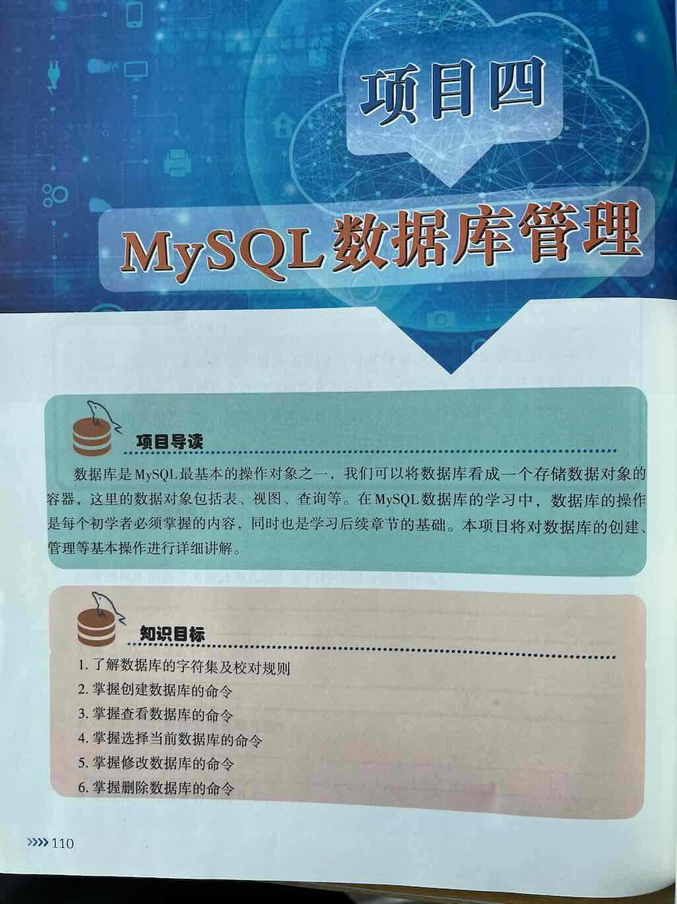

## 创建数据库



# MySQL 中的 DDL（数据定义语言）详解

DDL（Data Definition Language，数据定义语言）是 SQL 的一个子集，用于定义和管理数据库对象（如表、索引、视图等）的结构。以下是 MySQL 中 DDL 的全面介绍：

## 一、DDL 主要语句分类

| 语句类型   | 主要命令                          | 功能描述                     |
|------------|----------------------------------|----------------------------|
| 数据库操作 | `CREATE DATABASE`/`DROP DATABASE` | 创建/删除数据库             |
|            | `ALTER DATABASE`                 | 修改数据库属性              |
| 表操作     | `CREATE TABLE`/`DROP TABLE`      | 创建/删除表                 |
|            | `ALTER TABLE`                    | 修改表结构                  |
|            | `TRUNCATE TABLE`                 | 清空表数据                  |
|            | `RENAME TABLE`                   | 重命名表                    |
| 索引操作   | `CREATE INDEX`/`DROP INDEX`      | 创建/删除索引               |
| 视图操作   | `CREATE VIEW`/`DROP VIEW`        | 创建/删除视图               |
| 存储过程   | `CREATE PROCEDURE`/`DROP PROCEDURE` | 创建/删除存储过程          |
| 触发器     | `CREATE TRIGGER`/`DROP TRIGGER`  | 创建/删除触发器             |

## 二、数据库操作

### 1. 创建数据库

```sql
CREATE DATABASE db_name
[CHARACTER SET charset_name]
[COLLATE collation_name]
[ENCRYPTION {'Y' | 'N'}];

-- 示例
CREATE DATABASE ecommerce 
CHARACTER SET utf8mb4 
COLLATE utf8mb4_unicode_ci;
```

### 2. 修改数据库

```sql
ALTER DATABASE db_name
[CHARACTER SET charset_name]
[COLLATE collation_name];

-- 示例
ALTER DATABASE ecommerce 
CHARACTER SET utf8mb4 
COLLATE utf8mb4_0900_ai_ci;
```

### 3. 删除数据库

```sql
DROP DATABASE [IF EXISTS] db_name;

-- 示例
DROP DATABASE IF EXISTS old_db;
```

## 三、表操作

### 1. 创建表

```sql
CREATE TABLE [IF NOT EXISTS] tbl_name (
    column_name data_type [column_constraint],
    [table_constraint]
) [ENGINE=storage_engine] [CHARACTER SET charset] [COLLATE collation];

-- 示例
CREATE TABLE users (
    id INT AUTO_INCREMENT PRIMARY KEY,
    username VARCHAR(50) NOT NULL UNIQUE,
    email VARCHAR(100) NOT NULL,
    created_at TIMESTAMP DEFAULT CURRENT_TIMESTAMP,
    INDEX idx_email (email)
) ENGINE=InnoDB DEFAULT CHARSET=utf8mb4;
```

### 2. 修改表结构

```sql
-- 添加列
ALTER TABLE users ADD COLUMN phone VARCHAR(20) AFTER email;

-- 修改列
ALTER TABLE users MODIFY COLUMN email VARCHAR(150) NOT NULL;

-- 重命名列
ALTER TABLE users CHANGE COLUMN phone mobile VARCHAR(20);

-- 删除列
ALTER TABLE users DROP COLUMN mobile;

-- 添加主键
ALTER TABLE orders ADD PRIMARY KEY (order_id);

-- 添加外键
ALTER TABLE orders 
ADD CONSTRAINT fk_customer 
FOREIGN KEY (customer_id) REFERENCES customers(id);

-- 修改存储引擎
ALTER TABLE logs ENGINE = MyISAM;
```

### 3. 删除表

```sql
DROP TABLE [IF EXISTS] tbl_name [, tbl_name] ... [RESTRICT | CASCADE];

-- 示例
DROP TABLE IF EXISTS temp_users;
```

### 4. 清空表

```sql
TRUNCATE [TABLE] tbl_name;

-- 示例
TRUNCATE TABLE session_logs;
```

### 5. 重命名表

```sql
RENAME TABLE old_name TO new_name;

-- 多表重命名
RENAME TABLE t1 TO new_t1, t2 TO new_t2;
```

## 四、索引操作

### 1. 创建索引

```sql
-- 普通索引
CREATE INDEX idx_name ON users(username);

-- 唯一索引
CREATE UNIQUE INDEX idx_email ON users(email);

-- 复合索引
CREATE INDEX idx_name_age ON employees(last_name, age);

-- 全文索引（仅适用于MyISAM和InnoDB）
CREATE FULLTEXT INDEX idx_content ON articles(content);
```

### 2. 删除索引

```sql
DROP INDEX index_name ON tbl_name;

-- 示例
DROP INDEX idx_email ON users;
```

## 五、视图操作

### 1. 创建视图

```sql
CREATE [OR REPLACE] VIEW view_name AS
select_statement;

-- 示例
CREATE VIEW active_users AS
SELECT id, username, email 
FROM users 
WHERE last_login > DATE_SUB(NOW(), INTERVAL 30 DAY);
```

### 2. 修改视图

```sql
ALTER VIEW view_name AS
select_statement;

-- 或使用CREATE OR REPLACE VIEW
```

### 3. 删除视图

```sql
DROP VIEW [IF EXISTS] view_name;

-- 示例
DROP VIEW IF EXISTS inactive_users;
```

## 六、存储过程和函数

### 1. 创建存储过程

```sql
DELIMITER //
CREATE PROCEDURE update_salary(IN emp_id INT, IN increase DECIMAL(10,2))
BEGIN
    UPDATE employees 
    SET salary = salary + increase 
    WHERE id = emp_id;
END //
DELIMITER ;
```

### 2. 创建函数

```sql
DELIMITER //
CREATE FUNCTION get_employee_age(emp_id INT) 
RETURNS INT
DETERMINISTIC
BEGIN
    DECLARE age INT;
    SELECT TIMESTAMPDIFF(YEAR, birth_date, CURDATE()) INTO age
    FROM employees WHERE id = emp_id;
    RETURN age;
END //
DELIMITER ;
```

## 七、触发器

```sql
DELIMITER //
CREATE TRIGGER before_employee_update
BEFORE UPDATE ON employees
FOR EACH ROW
BEGIN
    IF NEW.salary < OLD.salary THEN
        SIGNAL SQLSTATE '45000' 
        SET MESSAGE_TEXT = 'Salary cannot be decreased';
    END IF;
END //
DELIMITER ;
```

## 八、DDL 特性与注意事项

1. **自动提交**：DDL 语句执行后会自动提交当前事务
2. **元数据锁定**：DDL 操作会锁定元数据，可能影响并发
3. **InnoDB 在线 DDL**（MySQL 5.6+）：
   - 支持部分 ALTER TABLE 操作不阻塞 DML
   - 使用 `ALGORITHM=INPLACE` 和 `LOCK=NONE` 选项

4. **常用选项**：
   ```sql
   ALTER TABLE users 
   ADD COLUMN middle_name VARCHAR(50),
   ALGORITHM=INPLACE, 
   LOCK=NONE;
   ```

5. **数据字典**（MySQL 8.0+）：
   - 采用事务性数据字典存储元数据
   - 提高原子性和崩溃安全性

## 九、最佳实践

1. 生产环境执行 DDL 前先备份数据
2. 大表操作选择低峰期进行
3. 使用 `pt-online-schema-change` 等工具减少锁表影响
4. 测试环境验证 DDL 语句后再上生产
5. 考虑使用 `IF EXISTS`/`IF NOT EXISTS` 避免错误

DDL 是数据库设计的核心语言，合理使用这些语句可以高效地管理数据库结构，为应用提供良好的数据存储基础。