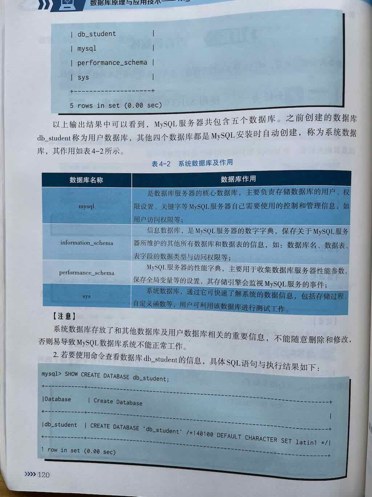
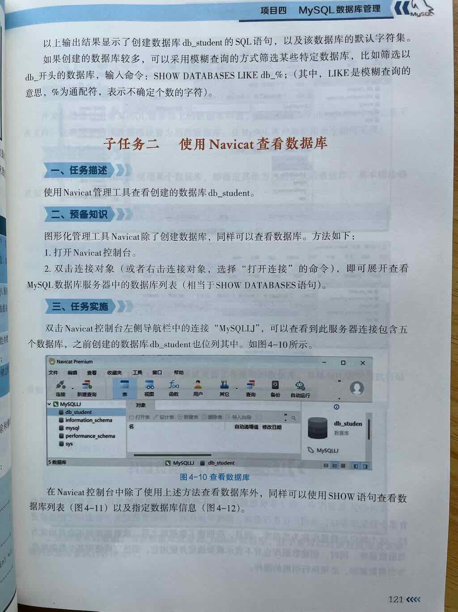

在 MySQL 中，`SHOW DATABASES;` 是一个非常基础但非常重要的 **管理类 SQL 语句**，它用于**查看当前 MySQL 数据库服务器上所有可用的数据库列表**。

---
 
 
 
 

## 一、一句话总结

> **`SHOW DATABASES;`用于查看数据库列表。 是 MySQL 提供的一个用于列出当前 MySQL 服务器中所有数据库名称的管理命令，它帮助用户快速了解有哪些数据库可供使用或管理，是数据库开发与管理的第一步常用操作。**

---

## 二、语法

```sql
SHOW DATABASES;
```

说明

- show:查看
- databases: 数据库

 ⚠️ 注意：

- 语句结尾的 **分号 `;` 是 SQL 语句的标准结束符**，在大多数客户端中必须加上（如 MySQL Command Line、MySQL Workbench 等）
- 在某些交互式工具中（比如某些教程环境），可能允许省略分号，但**为了规范与兼容性，建议始终加上**

---

## 三、使用场景与示例

场景 1：查看当前 MySQL 服务器上有多少个数据库

当你刚登录到 MySQL 服务器，或者想查看当前服务器上已创建了哪些数据库时，就可以使用这个命令。

```sql
SHOW DATABASES;
```

可能的输出结果（具体内容因服务器而异）：

```bash
| Database           |
|--------------------|
| information_schema |
| mysql              |
| performance_schema |
| sys                |
| school             |
| test               |
```
这些是 MySQL 服务器上当前存在的所有数据库，其中：

```bash
| 数据库名 | 说明 |
|----------|------|
| information_schema | 系统数据库，存储所有数据库的元数据（如表、列、权限等信息），只读 |
| mysql | 系统数据库，存储用户账户、权限等 MySQL 自身的配置信息，非常重要 ⚠️ 不要随意修改 |
| performance_schema | 系统数据库，用于性能监控相关的信息 |
| sys | 系统数据库（MySQL 5.7+），提供更友好的性能分析视图 |
| school | 可能是你或其他用户创建的业务数据库 |
| test | MySQL 默认可能会提供一个 test 数据库（用于测试，某些版本可能默认删除） |
```

---

场景 2：在创建数据库之前，查看是否已存在同名数据库

在创建新数据库前，你可能会想先查看当前服务器上是否已经存在同名的数据库，避免重复创建或冲突。

示例：

```sql
SHOW DATABASES;
```

然后你可以根据输出判断是否要执行：

```sql
CREATE DATABASE school;
```

或者使用更安全的写法：

```sql
CREATE DATABASE IF NOT EXISTS school;
```

---

## 四、常见用途

| 用途 | 说明 |
|------|------|
| 查看所有数据库 | 登录 MySQL 后，第一时间了解当前服务器上有多少数据库 |
| 创建数据库前检查 | 避免重复创建相同名字的数据库 |
| 数据库管理 | 作为数据库管理员，查看自己管理的服务上有多少业务库 |
| 选择数据库的前一步 | 通常先 `SHOW DATABASES;`，再 `USE 数据库名;` 进入操作 |
| 学习与测试 | 初学者登录 MySQL 后第一个常用命令，用来“看看有什么” |

---

## 五、总结

| 项目 | 说明 |
|------|------|
| **语句** | `SHOW DATABASES;` |
| **作用** | 列出当前 MySQL 服务器上的所有数据库名称 |
| **使用场景** | 查看已有数据库、选择数据库、管理数据库、学习/测试 |
| **是否需要分号** | 建议加上 `;`（标准 SQL 语法结束符） |
| **返回内容** | 一个结果集，包含一列名为 `Database`，列出所有库名 |
| **权限影响** | 普通用户可能只能看到部分数据库，root 用户可以看到全部 |
| **常见后续操作** | `USE 数据库名;` 进入某个库，然后建表、查询等 |

---

## 查询当前数据库名

```sql
SELECT DATABASE();
```

## 查看数据库的创建语句

包括字符集/排序规则

```sql
SHOW CREATE DATABASE 数据库名;
```

### 示例：

```sql
SHOW CREATE DATABASE school;
```

> 🎯 输出结果中会显示类似如下信息，包含字符集和排序规则：

```sql
| Database | Create Database                                                                 |
|----------|---------------------------------------------------------------------------------|
| school   | CREATE DATABASE `school` /*!40100 DEFAULT CHARACTER SET utf8mb4 COLLATE utf8mb4_unicode_ci */ |
```

---
