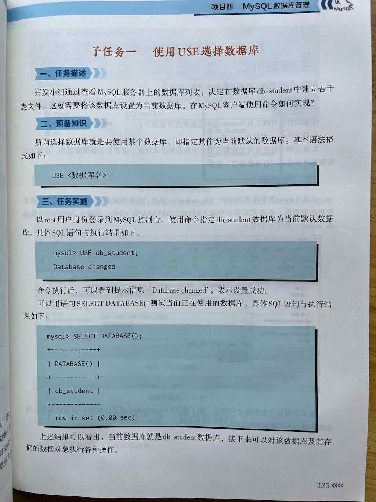
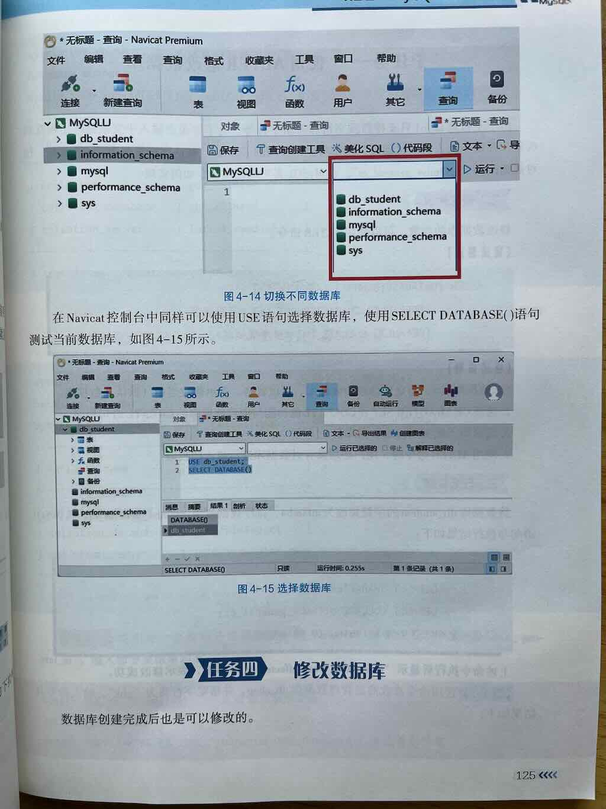

 
 
 
 


`USE 数据库名;` 是MySQL中用于选择当前工作数据库的SQL语句。在创建好数据库之后，我们需要指定使用哪个数据库。是数据库操作中非常基础但重要的命令。

## 基本语法

```sql
USE 数据库名;
```

## 功能说明

- 指定当前会话（连接）要操作的默认数据库
- 执行后，后续的SQL语句（如SELECT、INSERT、UPDATE等）如果没有明确指定数据库，将默认在这个选定的数据库上执行
- 不会影响其他已经建立的数据库连接

## 使用示例

1. **基本用法**（选择名为"customers"的数据库）：
   ```sql
   USE customers;
   ```

2. **典型工作流程**：
   ```sql
   -- 首先查看有哪些数据库
   SHOW DATABASES;
   
   -- 然后选择要使用的数据库
   USE sales_db;
   
   -- 之后可以不指定数据库名直接操作表
   SELECT * FROM orders;
   ```

## 注意事项

1. **数据库必须存在**：如果指定的数据库不存在，MySQL会返回错误
      - 错误信息类似：`ERROR 1049 (42000): Unknown database 'nonexistent_db'`

2. **仅影响当前会话**：每个数据库连接维护自己的当前数据库设置
      - 在一个连接中执行USE不会影响其他连接

3. **无返回结果**：成功执行USE语句通常不会返回数据，只返回类似这样的简单响应：
   ```sql
   Database changed
   ```

4. **与完全限定名的区别**：
      - 使用USE后可以简写表名：`SELECT * FROM customers`
      - 不使用USE时需要完全限定表名：`SELECT * FROM sales_db.customers`


## 创建数据库完整工作流

```sql
-- 1. 查看现有数据库
SHOW DATABASES;

-- 2. 创建新数据库（带完整选项）
CREATE DATABASE IF NOT EXISTS school_db
CHARACTER SET utf8mb4
COLLATE utf8mb4_unicode_ci;

-- 3. 使用新创建的数据库
USE school_db;

-- 4. 验证数据库信息
SHOW CREATE DATABASE school_db;
```

---

## 相关命令

- 查看当前使用的数据库：
  ```sql
  SELECT DATABASE();
  ```
  如果没有选择数据库或选择失败，将返回NULL

- 查看所有可用数据库：
  ```sql
  SHOW DATABASES;
  ```

## 总结

`USE 数据库名;`是MySQL会话管理的基础命令，它为后续操作建立了上下文环境。虽然简单，但在日常数据库操作中频繁使用，特别是在交互式命令行客户端中。理解其工作原理和限制有助于编写更可靠、清晰的SQL代码。


